# 02 docker为什么会出现


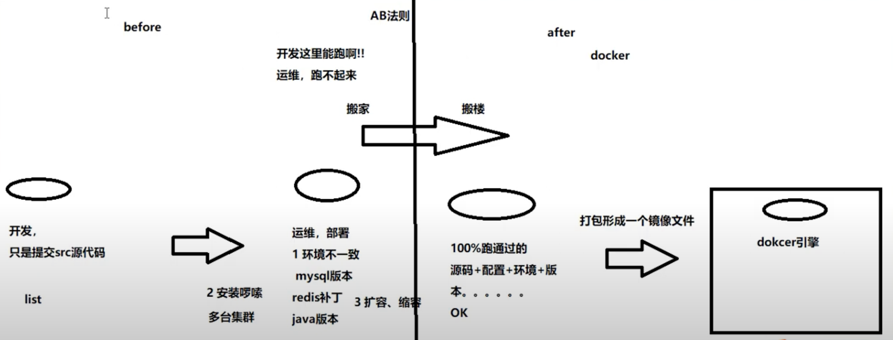

# 03 docker理念简介

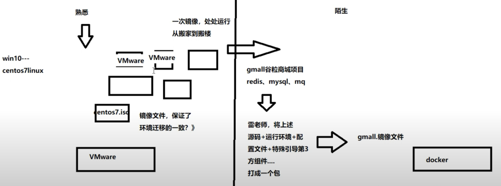

# 04 docker是什么

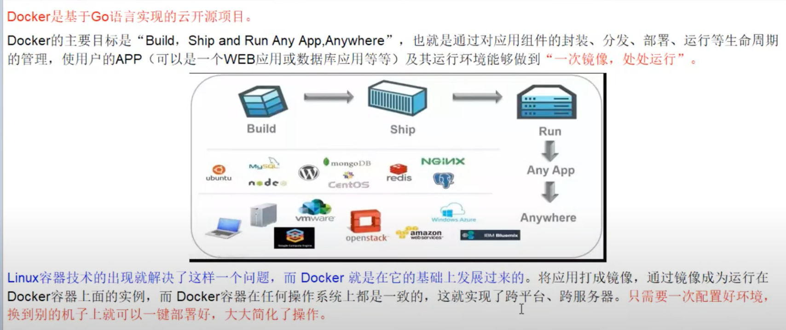

- 一句话: 解决了`运行环境和配置问题`的`软件容器`，方便做持续继承并有助于整体发布的容器虚拟化技术。

# 05 传统虚拟机和容器的对比

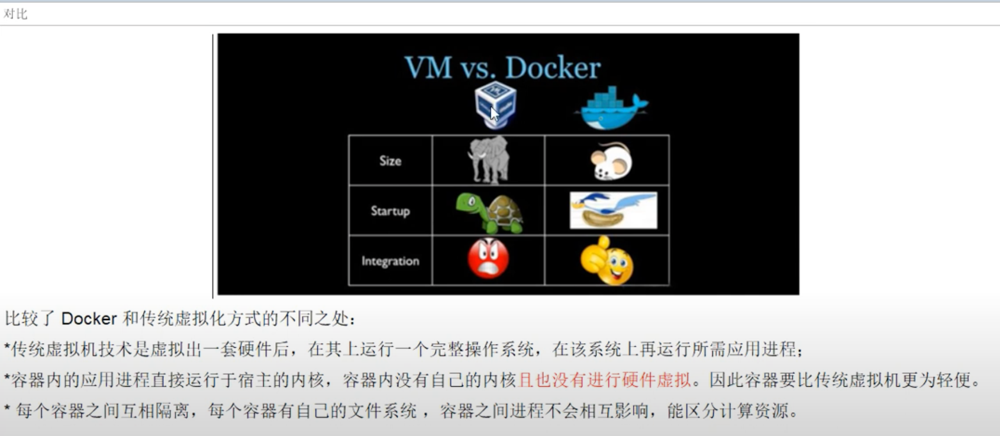

# 06 docker能干嘛解决什么问题

# 07 docker官网介绍


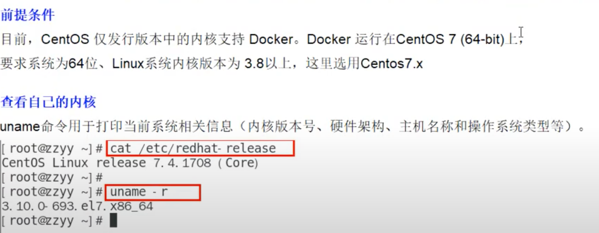

# 08 docker三要素

- 镜像、容器、仓库

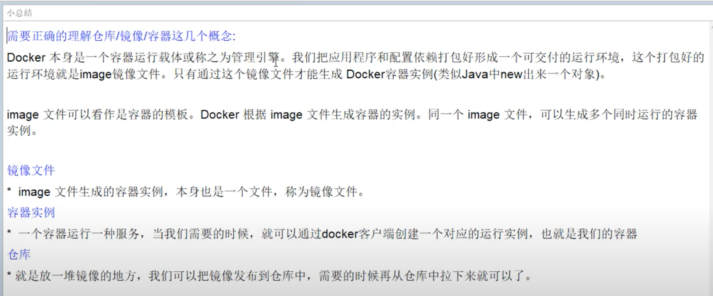

# 09 docker平台入门图解

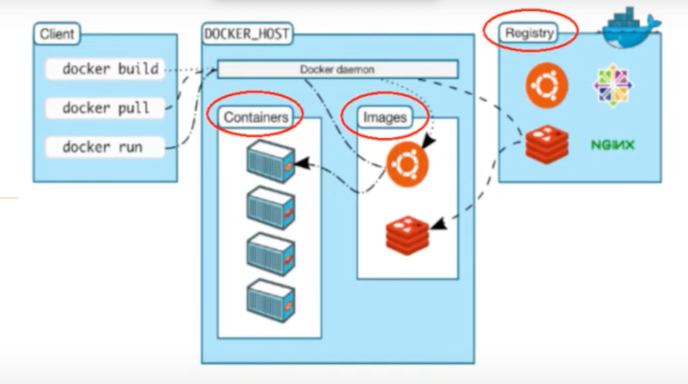

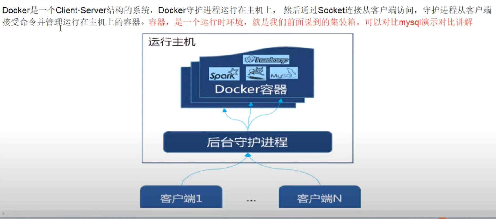

# 10 docker平台架构图解

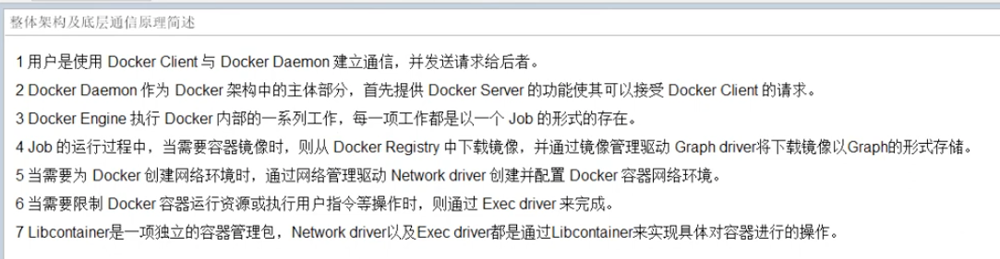

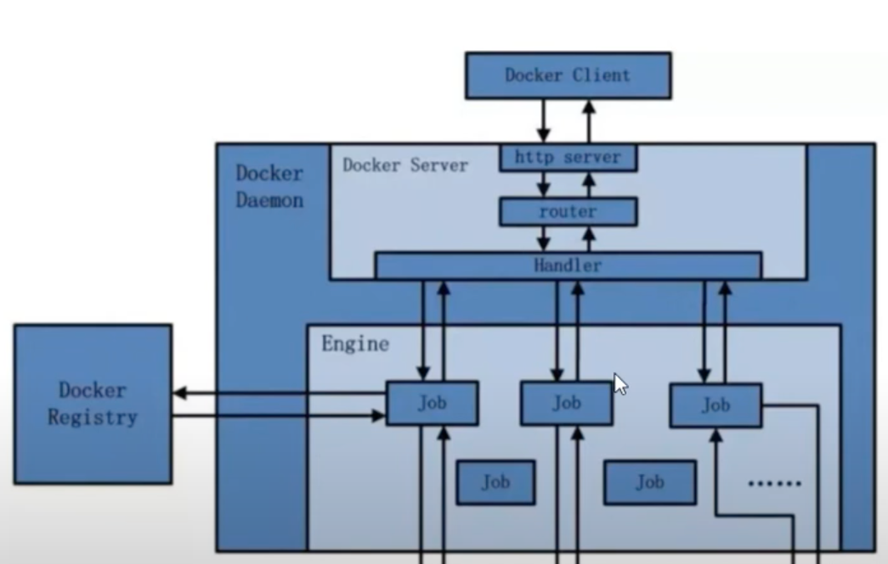


# 11 CentOS7上安装docker

```bash
# Remove old versions
sudo yum remove docker \
                docker-client \
                docker-client-latest \
                docker-common \
                docker-latest \
                docker-latest-logrotate \
                docker-logrotate \
                docker-engine
                
# Setup the Docker repository
# 使用阿里云替换 CentOS 7 源（推荐）

# 1. 备份原有配置
sudo mv /etc/yum.repos.d/CentOS-Base.repo /etc/yum.repos.d/CentOS-Base.repo.backup

# 2. 下载阿里云的 repo 文件
sudo curl -o /etc/yum.repos.d/CentOS-Base.repo https://mirrors.aliyun.com/repo/Centos-7.repo

# 3. 清理缓存并更新
sudo yum clean all
sudo yum makecache

sudo yum install -y yum-utils
sudo yum-config-manager --add-repo http://mirrors.aliyun.com/docker-ce/linux/centos/docker-ce.repo

sudo yum makecache fast

# Install Docker Engine
sudo yum install -y docker-ce docker-ce-cli containerd.io

# Start and enable Docker
sudo systemctl start docker
sudo systemctl enable docker

# Verify Docker installation
docker version
docker run hello-world
```

# 12 镜像加速器配置

- 略

# 13 Hello World分析介绍3要素配合

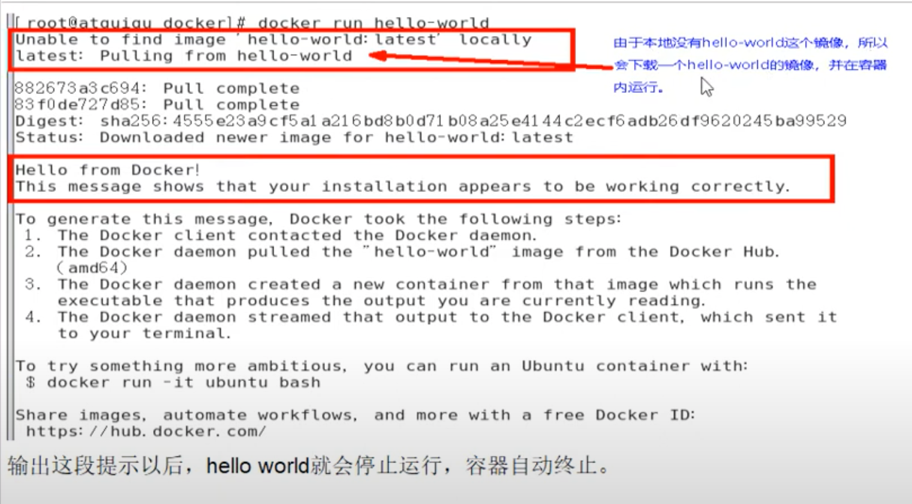
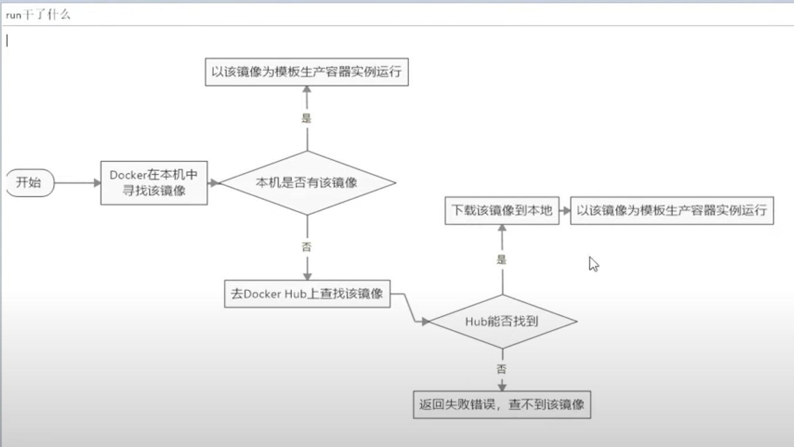

# 14 为什么Docker比VM虚拟机快


# 15 帮助启动类命令

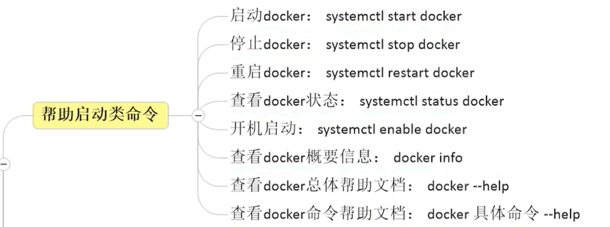

# 16 镜像命令

- `docker images`: 列出本地的镜像
    - `-a`: 列出本地所有的镜像(含历史映像层)
    - `-q`: 只显示镜像ID
      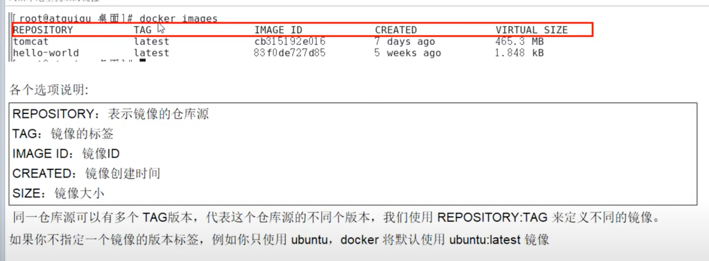
- `docker search 某个XXX镜像的名字`: 搜索指定镜像
    - `--limit n`: 只列出n个镜像，默认25个。 例: `docker search --limit 5 redis`
- `docker pull 某个XXX镜像的名字`: 下载指定镜像
    - `docker pull 镜像名字[:TAG]`: 指定特定版本的镜像，若不指定TAG，则默认下载最新版本。例: `docker pull redis:6.0.8`
- `docker system df`: 查看镜像/容器/数据卷所占的空间
- `docker rmi 某个XXX镜像的名字`: 删除指定镜像
    - 删除单个: `docker rmi -f 镜像ID`
    - 删除多个: `docker rmi -f 镜像名1:TAG 镜像名2:TAG`
    - 删除全部: `docker rmi -f $(docker images -qa)`

- 谈谈docker虚悬镜像是什么？
    - 仓库名、标签都是<none>的镜像，俗称虚悬镜像(dangling image)。
      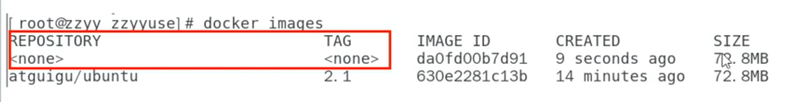

# 17 ubuntu容器说明

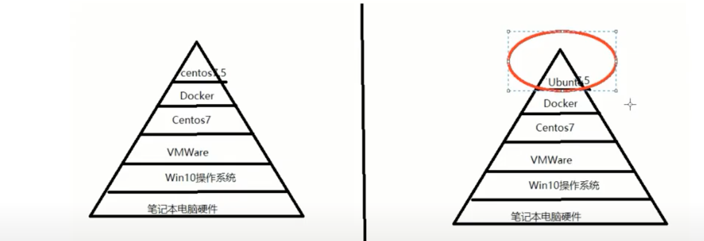

# 18 容器命令A

- docker run [OPTIONS] IMAGE [COMMAND] [ARG...]:
  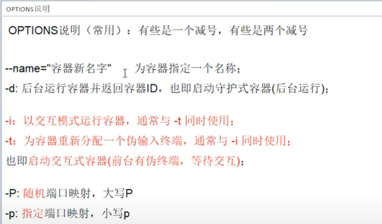

- 运行一个ubuntu的容器: `docker run -it ubuntu /bin/bash`

- 列出当前所有**正在运行**的容器: `docker ps [OPTIONS]`

# 19 容器命令B

`docker ps`的常用参数:
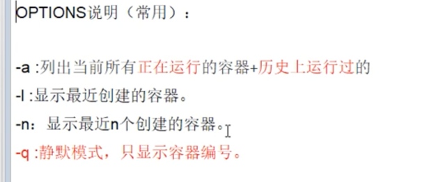

# 20 容器命令C

- 退出容器:
    - `exit`: run进去容器，exit退出，容器停止
    - `Ctrl+P Ctrl+Q`: run进去容器，Ctrl+P Ctrl+Q退出，容器不停止
- 启动已经停止运行的容器: `docker start 容器ID或者容器名`
- 重启容器: `docker restart 容器ID或者容器名`
- 停止容器: `docker stop 容器ID或者容器名`
- 强制停止容器: `docker kill 容器ID或者容器名`
- 删除停止的容器: `docker rm 容器ID或者容器名`
- 一次性删除多个容器实例:
    - `docker rm -f $(docker ps -qa)`
    - `docker ps -qa | xargs docker rm`

# 21 容器命令D

- 启动守护式容器: `docker run -d 容器ID`
- 查看容器的日志: `docker logs 容器ID`
- 查看容器内运行的进程: `docker top 容器ID`
- 查看容器内部细节: `docker inspect 容器ID`
- **进入正在运行的容器并以命令行交互**:
    - `docker exec -it 容器ID bashShell`
    - `docker attach 容器ID`
      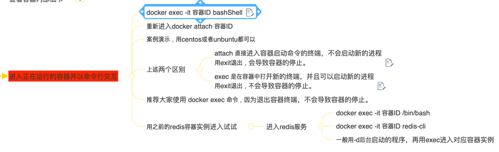
      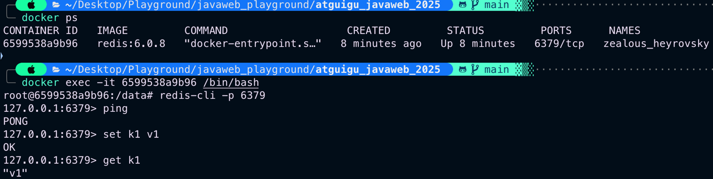
      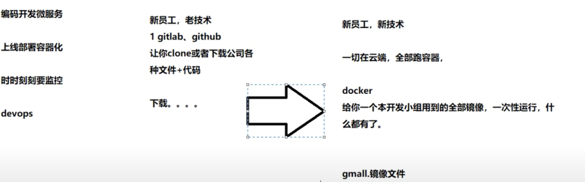

# 22 容器命令E

- 从容器拷贝文件到主机: `docker cp 容器ID:容器内路径 目的主机路径`
  
- 导入和导出容器
    - 导出: `docker export 容器ID > 文件名.tar`
      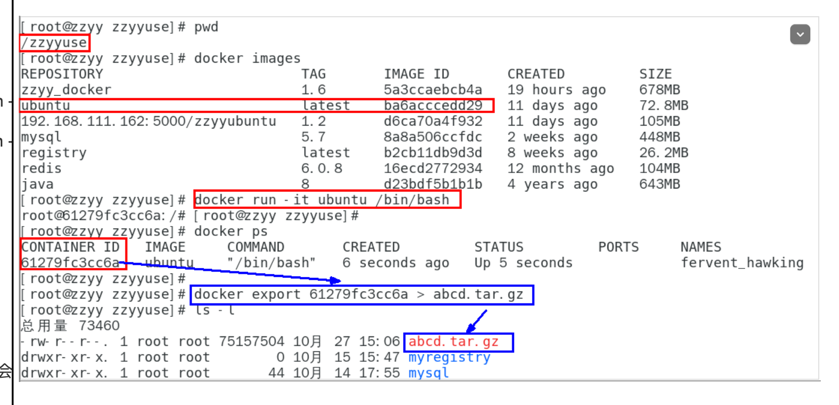
    - 导入: `cat 文件名.tar | docker import - 镜像用户/镜像名:镜像版本号`
      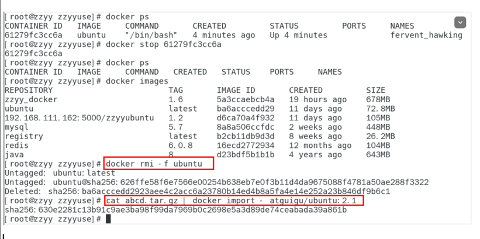

- 常用命令
  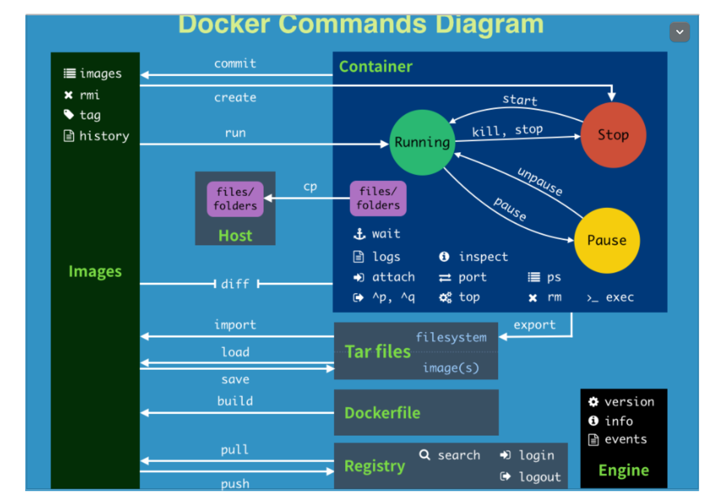

```
attach    Attach to a running container                 # 当前 shell 下 attach 连接指定运行镜像
build     Build an image from a Dockerfile              # 通过 Dockerfile 定制镜像
commit    Create a new image from a container changes   # 提交当前容器为新的镜像
cp        Copy files/folders from the containers filesystem to the host path   #从容器中拷贝指定文件或者目录到宿主机中
create    Create a new container                        # 创建一个新的容器，同 run，但不启动容器
diff      Inspect changes on a container's filesystem   # 查看 docker 容器变化
events    Get real time events from the server          # 从 docker 服务获取容器实时事件
exec      Run a command in an existing container        # 在已存在的容器上运行命令
export    Stream the contents of a container as a tar archive   # 导出容器的内容流作为一个 tar 归档文件[对应 import ]
history   Show the history of an image                  # 展示一个镜像形成历史
images    List images                                   # 列出系统当前镜像
import    Create a new filesystem image from the contents of a tarball # 从tar包中的内容创建一个新的文件系统映像[对应export]
info      Display system-wide information               # 显示系统相关信息
inspect   Return low-level information on a container   # 查看容器详细信息
kill      Kill a running container                      # kill 指定 docker 容器
load      Load an image from a tar archive              # 从一个 tar 包中加载一个镜像[对应 save]
login     Register or Login to the docker registry server    # 注册或者登陆一个 docker 源服务器
logout    Log out from a Docker registry server          # 从当前 Docker registry 退出
logs      Fetch the logs of a container             # 输出当前容器日志信息
port      Lookup the public-facing port which is NAT-ed to PRIVATE_PORT    # 查看映射端口对应的容器内部源端口
pause     Pause all processes within a container        # 暂停容器
ps        List containers                               # 列出容器列表
pull      Pull an image or a repository from the docker registry server   # 从docker镜像源服务器拉取指定镜像或者库镜像
push      Push an image or a repository to the docker registry server    # 推送指定镜像或者库镜像至docker源服务器
restart   Restart a running container                   # 重启运行的容器
rm        Remove one or more containers                 # 移除一个或者多个容器
rmi       Remove one or more images         # 移除一个或多个镜像[无容器使用该镜像才可删除，否则需删除相关容器才可继续或 -f 强制删除]
run       Run a command in a new container              # 创建一个新的容器并运行一个命令
save      Save an image to a tar archive                # 保存一个镜像为一个 tar 包[对应 load]
search    Search for an image on the Docker Hub         # 在 docker hub 中搜索镜像
start     Start a stopped containers              # 启动容器
stop      Stop a running containers                     # 停止容器
tag       Tag an image into a repository                # 给源中镜像打标签
top       Lookup the running processes of a container   # 查看容器中运行的进程信息
unpause   Unpause a paused container                    # 取消暂停容器
version   Show the docker version information           # 查看 docker 版本号
wait      Block until a container stops, then print its exit code   # 截取容器停止时的退出状态值
```

# 23 镜像的分层概念

- Docker镜像层都是只读的，容器层是可写的
- 当容器启动时，一个新的可写层被加载到镜像的顶部。
- 这一层通常被称作“容器层”，“容器层”之下的都叫“镜像层”。
  

# 24 commit命令上集

- `docker commit`: 提交容器的副本使之成为一个新的镜像。
- `docker commit -m="提交的描述信息" -a="作者" 容器ID 要创建的目标镜像名[:表签名]`
- `docker commit -m="vim added" -a="ljy" f4473ca2e614 atguigu/myvim:1.5`

# 25 commit命令下集

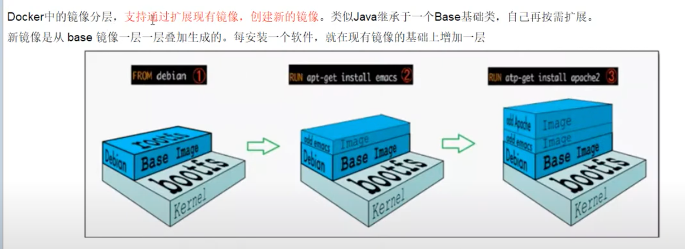

# 26 本地镜像发布到Docker Hub

```bash
# 登录 Docker Hub
docker login

# 打标签（将本地镜像改为 dockerhub 格式）
docker tag atguigu/myvim:1.5 mydocker881/myvim:1.5

# 推送
docker push mydocker881/myvim:1.5

# 下载镜像
docker pull mydocker881/myvim:1.5

# 运行下载的镜像
docker run -it [镜像ID] /bin/bash
```

# 27 Docker私有库简介

`docker pull registry`: registry镜像专门用于搭建私服版的仓库。

# 28 新镜像推送私服库案例

1. 运行私服仓库: `docker run -d -p 5678:5000 -v /Users/ljy/Desktop/myregistry/:/tmp/registry --privileged=true registry`
2. 运行原始的ubuntu容器后，安装`ifconfig`命令，`apt-get update && apt-get install net-tools`
3. commit新的镜像: `docker commit -m "ifconfig cmd added" -a="ljy" [容器ID]:1.2`
4. 确认私服仓库中有哪些镜像: `curl -XGET http://localhost:5678/v2/_catalog`
5. 将新的镜像修改为符合私服规范的Tag: `docker tag ubuntu-ipconfig:1.2 localhost:5678/ubuntu-ipconfig:1.2`
6. 推送到私服库: `docker push localhost:5678/ubuntu-ipconfig:1.2`
7. 再次确认私服仓库中有哪些镜像
8. 将私服库中的镜像pull到本地进行确认: `docker pull localhost:5678/ubuntu-ipconfig:1.2`

# 29 容器数据卷是什么

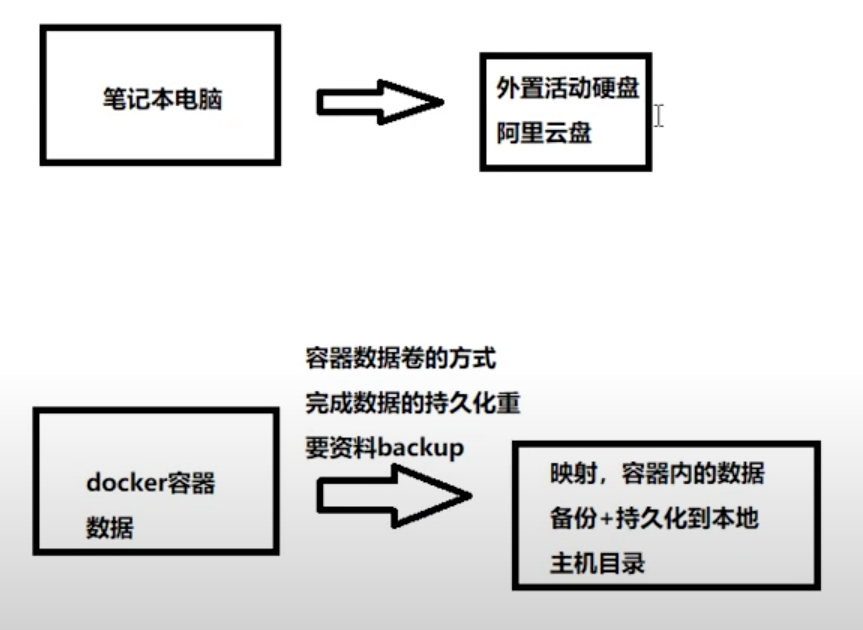

# 30 容器数据卷能干嘛

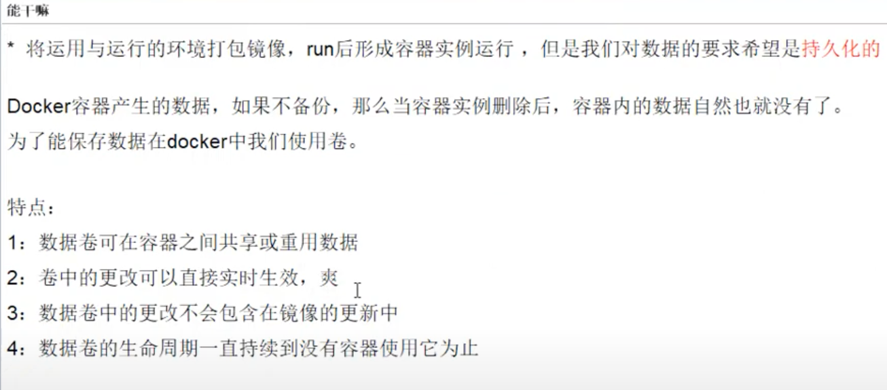

# 31 容器卷和主机互通互联

- 命令: `docker run -it --privileged=true -v /宿主机绝对路径目录:/容器内目录 镜像名`
- `docker run -it --privileged=true -v ~/Desktop/docker_volumn/:/tmp/docker_data --name=u1 ubuntu /bin/bash`
- 查看数据卷是否挂载成功: `docker inspect 容器ID`
  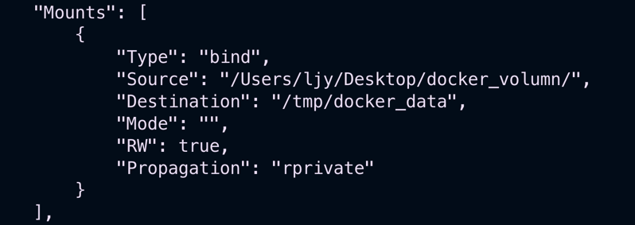

# 32 容器卷ro和rw读写规则

- 容器卷和主机挂载时默认是`rw`(可读可写)的，如果需要容器实例内部被限制，只能读取不能写，需要在挂载的命令中加上`:ro`。
- `docker run -it --privileged=true -v /宿主机绝对路径目录:/容器内目录:ro 镜像名`

# 33 容器卷之间的继承

- 继承其他容器映射的规则: `docker run -it --privileged=true --volumes-from 容器ID --name u2 ubuntu`
- 继承了其他容器的映射规则后，即使被继承的容器停止运行或者被删除，对现有的映射规则也没有任何影响。

# 34 Docker上安装常用软件说明

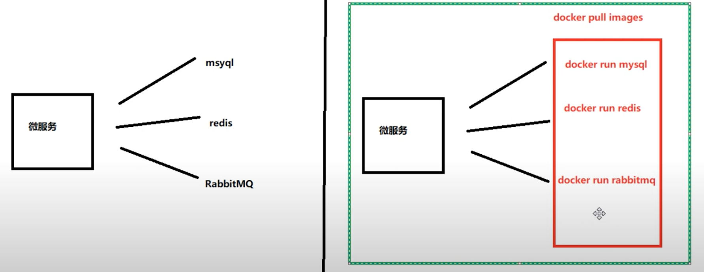
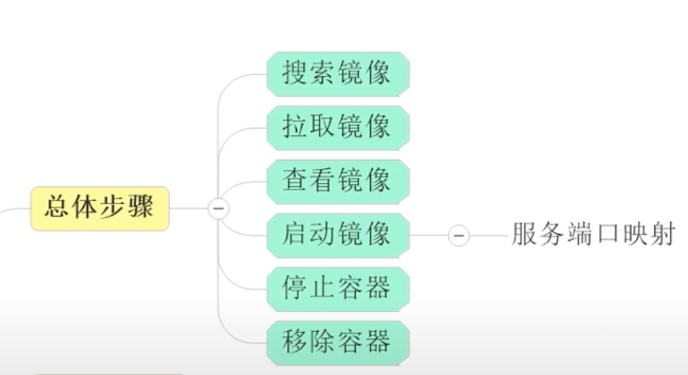

# 35 36 tomcat安装

- 搜索镜像: `docker search tomcat`
- 拉取镜像: `docker pull tomcat`
- 查看镜像: `docker images tomcat`
- 启动镜像: `docker run -d -p 8080:8080 --name t1 tomcat`
- 访问猫首页: `http://localhost:8080`，会返回404页面。
    - 进入容器: `docker exec -it t1 /bin/bash`
    - 删除webapp目录: `rmdir webapp`
    - 修改webapp.dist目录的名称: `mv webapp.dist webapp`
    - 此时即可访问猫首页
- 无需修改容器内文件的版本
  `docker run -d -p 8080:8080 --name mytomcat8 billygoo/tomcat8-jdk8`

# 37 38 mysql安装

- 拉取镜像: `docker pull mysql:5.7`
- 启动镜像:
  `docker run -d -p 3310:3306 --privileged=true -v ~/Desktop/mysql_volume/log:/var/log/mysql -v ~/Desktop/mysql_volume/data:/var/lib/mysql -v ~/Desktop/mysql_volume/conf:/etc/mysql/conf.d -e MYSQL_ROOT_PASSWORD=123456 --name mysql mysql:5.7`
- `MySQL5.7`有编码问题，在宿主机的`conf`目录中创建`my.cnf`配置文件，加入以下内容:

```
[client]
default_character_set=utf8
[mysqld]
collation_server = utf8_general_ci
character_set_server = utf8
```

- 重启容器: `docker restart mysql`
- 由于配置了数据卷，即使容器被删除也无所谓，因为数据已经在宿主机中有备份。

