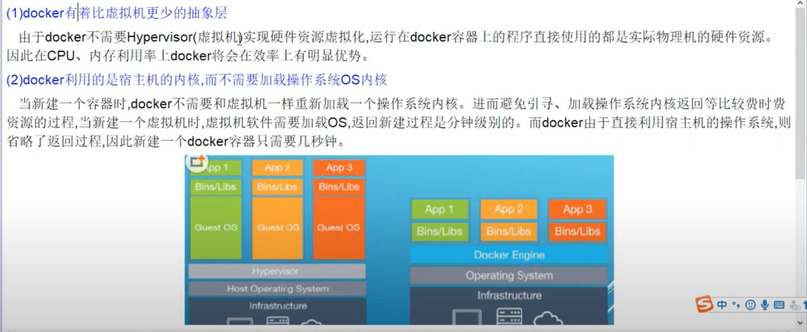

# 02 docker为什么会出现


# 03 docker理念简介


# 04 docker是什么


- 一句话: 解决了`运行环境和配置问题`的`软件容器`，方便做持续继承并有助于整体发布的容器虚拟化技术。

# 05 传统虚拟机和容器的对比


# 06 docker能干嘛解决什么问题

# 07 docker官网介绍


# 08 docker三要素

- 镜像、容器、仓库


# 09 docker平台入门图解


# 10 docker平台架构图解


# 11 CentOS7上安装docker

```bash
# Remove old versions
sudo yum remove docker \
                docker-client \
                docker-client-latest \
                docker-common \
                docker-latest \
                docker-latest-logrotate \
                docker-logrotate \
                docker-engine
                
# Setup the Docker repository
# 使用阿里云替换 CentOS 7 源（推荐）

# 1. 备份原有配置
sudo mv /etc/yum.repos.d/CentOS-Base.repo /etc/yum.repos.d/CentOS-Base.repo.backup

# 2. 下载阿里云的 repo 文件
sudo curl -o /etc/yum.repos.d/CentOS-Base.repo https://mirrors.aliyun.com/repo/Centos-7.repo

# 3. 清理缓存并更新
sudo yum clean all
sudo yum makecache

sudo yum install -y yum-utils
sudo yum-config-manager --add-repo http://mirrors.aliyun.com/docker-ce/linux/centos/docker-ce.repo

sudo yum makecache fast

# Install Docker Engine
sudo yum install -y docker-ce docker-ce-cli containerd.io

# Start and enable Docker
sudo systemctl start docker
sudo systemctl enable docker

# Verify Docker installation
docker version
docker run hello-world
```

# 12 镜像加速器配置

- 略

# 13 Hello World分析介绍3要素配合


# 14 为什么Docker比VM虚拟机快



# 15 帮助启动类命令


# 16 镜像命令

- `docker images`: 列出本地的镜像
    - `-a`: 列出本地所有的镜像(含历史映像层)
    - `-q`: 只显示镜像ID
      
- `docker search 某个XXX镜像的名字`: 搜索指定镜像
    - `--limit n`: 只列出n个镜像，默认25个。 例: `docker search --limit 5 redis`
- `docker pull 某个XXX镜像的名字`: 下载指定镜像
    - `docker pull 镜像名字[:TAG]`: 指定特定版本的镜像，若不指定TAG，则默认下载最新版本。例: `docker pull redis:6.0.8`
- `docker system df`: 查看镜像/容器/数据卷所占的空间
- `docker rmi 某个XXX镜像的名字`: 删除指定镜像
    - 删除单个: `docker rmi -f 镜像ID`
    - 删除多个: `docker rmi -f 镜像名1:TAG 镜像名2:TAG`
    - 删除全部: `docker rmi -f $(docker images -qa)`

- 谈谈docker虚悬镜像是什么？
    - 仓库名、标签都是<none>的镜像，俗称虚悬镜像(dangling image)。
      

# 17 ubuntu容器说明


# 18 容器命令A

- docker run [OPTIONS] IMAGE [COMMAND] [ARG...]:
  

- 运行一个ubuntu的容器: `docker run -it ubuntu /bin/bash`

- 列出当前所有**正在运行**的容器: `docker ps [OPTIONS]`

# 19 容器命令B

`docker ps`的常用参数:


# 20 容器命令C

- 退出容器:
    - `exit`: run进去容器，exit退出，容器停止
    - `Ctrl+P Ctrl+Q`: run进去容器，Ctrl+P Ctrl+Q退出，容器不停止
- 启动已经停止运行的容器: `docker start 容器ID或者容器名`
- 重启容器: `docker restart 容器ID或者容器名`
- 停止容器: `docker stop 容器ID或者容器名`
- 强制停止容器: `docker kill 容器ID或者容器名`
- 删除停止的容器: `docker rm 容器ID或者容器名`
- 一次性删除多个容器实例:
    - `docker rm -f $(docker ps -qa)`
    - `docker ps -qa | xargs docker rm`

# 21 容器命令D

- 启动守护式容器: `docker run -d 容器ID`
- 查看容器的日志: `docker logs 容器ID`
- 查看容器内运行的进程: `docker top 容器ID`
- 查看容器内部细节: `docker inspect 容器ID`
- **进入正在运行的容器并以命令行交互**:
    - `docker exec -it 容器ID bashShell`
    - `docker attach 容器ID`
      
      
      

