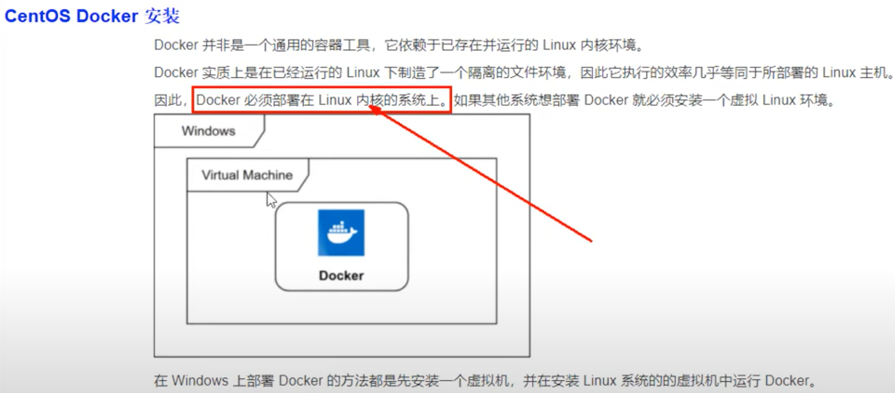

# 02 docker为什么会出现


# 03 docker理念简介


# 04 docker是什么


- 一句话: 解决了`运行环境和配置问题`的`软件容器`，方便做持续继承并有助于整体发布的容器虚拟化技术。

# 05 传统虚拟机和容器的对比


# 06 docker能干嘛解决什么问题

# 07 docker官网介绍




# 08 docker三要素

- 镜像、容器、仓库


# 09 docker平台入门图解


# 10 docker平台架构图解


# 11 CentOS7上安装docker

```bash
# Remove old versions
sudo yum remove docker \
                docker-client \
                docker-client-latest \
                docker-common \
                docker-latest \
                docker-latest-logrotate \
                docker-logrotate \
                docker-engine
                
# Setup the Docker repository
# 使用阿里云替换 CentOS 7 源（推荐）

# 1. 备份原有配置
sudo mv /etc/yum.repos.d/CentOS-Base.repo /etc/yum.repos.d/CentOS-Base.repo.backup

# 2. 下载阿里云的 repo 文件
sudo curl -o /etc/yum.repos.d/CentOS-Base.repo https://mirrors.aliyun.com/repo/Centos-7.repo

# 3. 清理缓存并更新
sudo yum clean all
sudo yum makecache

sudo yum install -y yum-utils
sudo yum-config-manager --add-repo http://mirrors.aliyun.com/docker-ce/linux/centos/docker-ce.repo

sudo yum makecache fast

# Install Docker Engine
sudo yum install -y docker-ce docker-ce-cli containerd.io

# Start and enable Docker
sudo systemctl start docker
sudo systemctl enable docker

# Verify Docker installation
docker version
docker run hello-world
```

# 12 镜像加速器配置

- 略

# 13 Hello World分析介绍3要素配合


# 14 为什么Docker比VM虚拟机快


# 15 帮助启动类命令


