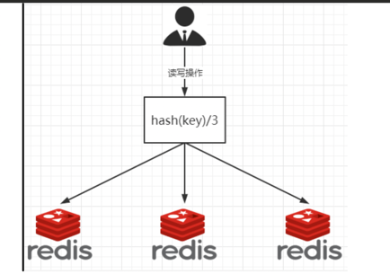

# 40 高级篇简介

# 41 mysql主从复制Docker版

1. 新建主服务器容器3307

```Bash
docker run -p 3307:3306 --name mysql-master --privileged=true \
-v ~/Desktop/mysql-volume/mysql-master/log:/var/log/mysql \
-v ~/Desktop/mysql-volume/mysql-master/data:/var/lib/mysql \
-v ~/Desktop/mysql-volume/mysql-master/conf:/etc/mysql/conf.d \
-e MYSQL_ROOT_PASSWORD=123456 \
-d mysql:5.7
```

2. 进入`~/Desktop/mysql-volume/mysql-master/conf`目录下新建`my.cnf`。

```properties
[mysqld]
## 设置server_id，同一局域网中需要唯一
server_id=101
## 指定不需要同步的数据库名称
binlog-ignore-db=mysql
## 开启二进制日志功能
log-bin=mall-mysql-bin
## 设置二进制日志使用内存大小（事务）
binlog_cache_size=1M
## 设置使用的二进制日志格式（mixed,statement,row）
binlog_format=mixed
## 二进制日志过期清理时间。默认值为0，表示不自动清理。
expire_logs_days=7
## 跳过主从复制中遇到的所有错误或指定类型的错误，避免slave端复制中断。
## 如：1062错误是指一些主键重复，1032错误是因为主从数据库数据不一致
slave_skip_errors=1062
```

3. 修改完配置文件后重启master实例。
4. 进入mysql-master容器后，进入mysql数据库。
5. master容器实例内创建数据同步用户。

```mysql
CREATE USER 'slave'@'%' IDENTIFIED BY '123456';
GRANT REPLICATION SLAVE, REPLICATION CLIENT ON *.* TO 'slave'@'%';
```

6. 新建从服务器容器实例3308

```Bash
docker run -p 3308:3306 --name mysql-slave --privileged=true \
-v ~/Desktop/mysql-volume/mysql-slave/log:/var/log/mysql \
-v ~/Desktop/mysql-volume/mysql-slave/data:/var/lib/mysql \
-v ~/Desktop/mysql-volume/mysql-slave/conf:/etc/mysql/conf.d \
-e MYSQL_ROOT_PASSWORD=123456 \
-d mysql:5.7
```

7. 进入`~/Desktop/mysql-volume/mysql-slave/conf`目录下新建`my.cnf`。

```properties
[mysqld]
## 设置server_id，同一局域网中需要唯一
server_id=102
## 指定不需要同步的数据库名称
binlog-ignore-db=mysql
## 开启二进制日志功能，以备Slave作为其它数据库实例的Master时使用
log-bin=mall-mysql-slave1-bin
## 设置二进制日志使用内存大小（事务）
binlog_cache_size=1M
## 设置使用的二进制日志格式（mixed,statement,row）
binlog_format=mixed
## 二进制日志过期清理时间。默认值为0，表示不自动清理。
expire_logs_days=7
## 跳过主从复制中遇到的所有错误或指定类型的错误，避免slave端复制中断。
## 如：1062错误是指一些主键重复，1032错误是因为主从数据库数据不一致
slave_skip_errors=1062
## relay_log配置中继日志
relay_log=mall-mysql-relay-bin
## log_slave_updates表示slave将复制事件写进自己的二进制日志
log_slave_updates=1
## slave设置为只读（具有super权限的用户除外）
read_only=1
```

8. 修改完配置文件后重启slave实例。
9. 在主数据库中查看主从同步状态: `show master status`。
   
10. 进入mysql-slave容器后，进入mysql数据库。
11. 在从数据库中配置主从复制。

```mysql
change master to master_host ='宿主机IP', master_user ='slave', master_password ='123456', master_port =3307, master_log_file ='mall-mysql-bin.000001', master_log_pos ='master status命令中的Position', master_connect_retry =30;
```

12. 在从数据库中查看主从同步状态: `show slave status \G;`
    
13. 在从数据库中开启主从同步: `start slave;`
14. 查看从数据库状态发现已经同步。
    
15. 主从复制测试:
    - 在主数据库新建库，新建表，插入数据
    - 在从数据库中查看记录，OK

# 42 分布式存储之哈希取余算法



2亿条记录就是2亿个k,v，我们单机不行，必须要分布式多机，假设有3台机器构成一个集群，用户每次读写操作都是根据公式:
hash(key) % N个机器台数，计算出哈希值，用来决定数据映射到哪一个节点上。

- 优点：
  简单粗暴，直接有效，只需要预估好数据规划好节点，例如3台、8台、10台，就能保证一段时间的数据支撑。  
  使用Hash算法让固定的一部分请求落到同一台服务器上，这样每台服务器固定处理一部分请求（并维护这些请求的信息），起到负载均衡+分而治之的作用。
- 缺点：
  原来规划好的节点，进行扩容或者缩容就比较麻烦了额，不管扩缩，每次数据变动导致节点有变动，  
  映射关系需要重新进行计算，在服务器个数固定不变时没有问题，如果需要弹性扩容或故障停机的情况下，原来的取模公式就会发生变化:
  Hash(key)/3会变成Hash(key)/?。  
  此时地址经过取余运算的结果将发生很大变化，根据公式获取的服务器也会变得不可控。  
  某个redis机器宕机了，由于台数数量变化，会导致hash取余全部数据重新洗牌。

