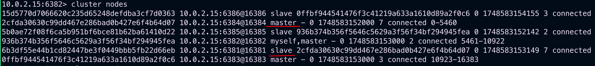

# 40 高级篇简介

# 41 mysql主从复制Docker版

1. 新建主服务器容器3307

```Bash
docker run -p 3307:3306 --name mysql-master --privileged=true \
-v ~/Desktop/mysql-volume/mysql-master/log:/var/log/mysql \
-v ~/Desktop/mysql-volume/mysql-master/data:/var/lib/mysql \
-v ~/Desktop/mysql-volume/mysql-master/conf:/etc/mysql/conf.d \
-e MYSQL_ROOT_PASSWORD=123456 \
-d mysql:5.7
```

2. 进入`~/Desktop/mysql-volume/mysql-master/conf`目录下新建`my.cnf`。

```properties
[mysqld]
## 设置server_id，同一局域网中需要唯一
server_id=101
## 指定不需要同步的数据库名称
binlog-ignore-db=mysql
## 开启二进制日志功能
log-bin=mall-mysql-bin
## 设置二进制日志使用内存大小（事务）
binlog_cache_size=1M
## 设置使用的二进制日志格式（mixed,statement,row）
binlog_format=mixed
## 二进制日志过期清理时间。默认值为0，表示不自动清理。
expire_logs_days=7
## 跳过主从复制中遇到的所有错误或指定类型的错误，避免slave端复制中断。
## 如：1062错误是指一些主键重复，1032错误是因为主从数据库数据不一致
slave_skip_errors=1062
```

3. 修改完配置文件后重启master实例。
4. 进入mysql-master容器后，进入mysql数据库。
5. master容器实例内创建数据同步用户。

```mysql
CREATE USER 'slave'@'%' IDENTIFIED BY '123456';
GRANT REPLICATION SLAVE, REPLICATION CLIENT ON *.* TO 'slave'@'%';
```

6. 新建从服务器容器实例3308

```Bash
docker run -p 3308:3306 --name mysql-slave --privileged=true \
-v ~/Desktop/mysql-volume/mysql-slave/log:/var/log/mysql \
-v ~/Desktop/mysql-volume/mysql-slave/data:/var/lib/mysql \
-v ~/Desktop/mysql-volume/mysql-slave/conf:/etc/mysql/conf.d \
-e MYSQL_ROOT_PASSWORD=123456 \
-d mysql:5.7
```

7. 进入`~/Desktop/mysql-volume/mysql-slave/conf`目录下新建`my.cnf`。

```properties
[mysqld]
## 设置server_id，同一局域网中需要唯一
server_id=102
## 指定不需要同步的数据库名称
binlog-ignore-db=mysql
## 开启二进制日志功能，以备Slave作为其它数据库实例的Master时使用
log-bin=mall-mysql-slave1-bin
## 设置二进制日志使用内存大小（事务）
binlog_cache_size=1M
## 设置使用的二进制日志格式（mixed,statement,row）
binlog_format=mixed
## 二进制日志过期清理时间。默认值为0，表示不自动清理。
expire_logs_days=7
## 跳过主从复制中遇到的所有错误或指定类型的错误，避免slave端复制中断。
## 如：1062错误是指一些主键重复，1032错误是因为主从数据库数据不一致
slave_skip_errors=1062
## relay_log配置中继日志
relay_log=mall-mysql-relay-bin
## log_slave_updates表示slave将复制事件写进自己的二进制日志
log_slave_updates=1
## slave设置为只读（具有super权限的用户除外）
read_only=1
```

8. 修改完配置文件后重启slave实例。
9. 在主数据库中查看主从同步状态: `show master status`。
   
10. 进入mysql-slave容器后，进入mysql数据库。
11. 在从数据库中配置主从复制。

```mysql
change master to master_host ='宿主机IP', master_user ='slave', master_password ='123456', master_port =3307, master_log_file ='mall-mysql-bin.000001', master_log_pos ='master status命令中的Position', master_connect_retry =30;
```

12. 在从数据库中查看主从同步状态: `show slave status \G;`
    
13. 在从数据库中开启主从同步: `start slave;`
14. 查看从数据库状态发现已经同步。
    
15. 主从复制测试:
    - 在主数据库新建库，新建表，插入数据
    - 在从数据库中查看记录，OK

# 42 分布式存储之哈希取余算法


2亿条记录就是2亿个k,v，我们单机不行，必须要分布式多机，假设有3台机器构成一个集群，用户每次读写操作都是根据公式:
hash(key) % N个机器台数，计算出哈希值，用来决定数据映射到哪一个节点上。

- 优点：
  简单粗暴，直接有效，只需要预估好数据规划好节点，例如3台、8台、10台，就能保证一段时间的数据支撑。  
  使用Hash算法让固定的一部分请求落到同一台服务器上，这样每台服务器固定处理一部分请求（并维护这些请求的信息），起到负载均衡+分而治之的作用。
- 缺点：
  原来规划好的节点，进行扩容或者缩容就比较麻烦了额，不管扩缩，每次数据变动导致节点有变动，  
  映射关系需要重新进行计算，在服务器个数固定不变时没有问题，如果需要弹性扩容或故障停机的情况下，原来的取模公式就会发生变化:
  Hash(key)/3会变成Hash(key)/?。  
  此时地址经过取余运算的结果将发生很大变化，根据公式获取的服务器也会变得不可控。  
  某个redis机器宕机了，由于台数数量变化，会导致hash取余全部数据重新洗牌。

# 43 分布式存储之一致性哈希算法


为了在节点数目发生改变时尽可能少的迁移数据，将所有的存储节点排列在收尾相接的Hash环上。  
每个key在计算Hash后会顺时针找到临近的存储节点存放。 而当有节点加入或退出时仅影响该节点在Hash环上顺时针相邻的后续节点。

- 优点:
  加入和删除节点只影响哈希环中顺时针方向的相邻的节点，对其他节点无影响。
- 缺点:
  数据的分布和节点的位置有关，因为这些节点不是均匀的分布在哈希环上的，所以数据在进行存储时达不到均匀分布的效果。

# 44 分布式存储之哈希槽算法


# 45 46 47 3主3从redis集群配置

* 此实验在MacOS和Windows的Docker中没有成功，必须在Linux中进行。

- 新建6个docker容器实例。

```bash
docker run -d --name redis-node-1 --net host --privileged=true -v ~/redis-volume/redis-node-1:/data redis:6.0.8 --cluster-enabled yes --appendonly yes --port 6381
docker run -d --name redis-node-2 --net host --privileged=true -v ~/redis-volume/redis-node-2:/data redis:6.0.8 --cluster-enabled yes --appendonly yes --port 6382
docker run -d --name redis-node-3 --net host --privileged=true -v ~/redis-volume/redis-node-3:/data redis:6.0.8 --cluster-enabled yes --appendonly yes --port 6383
docker run -d --name redis-node-4 --net host --privileged=true -v ~/redis-volume/redis-node-4:/data redis:6.0.8 --cluster-enabled yes --appendonly yes --port 6384
docker run -d --name redis-node-5 --net host --privileged=true -v ~/redis-volume/redis-node-5:/data redis:6.0.8 --cluster-enabled yes --appendonly yes --port 6385
docker run -d --name redis-node-6 --net host --privileged=true -v ~/redis-volume/redis-node-6:/data redis:6.0.8 --cluster-enabled yes --appendonly yes --port 6386
```


- 进入容器`redis-node-1`并为6台机器构建集群关系。

```bash
docker exec -it redis-node-1 /bin/bash
# 下面的IP是宿主机的IP
redis-cli --cluster create 10.0.2.15:6381 10.0.2.15:6382 10.0.2.15:6383 10.0.2.15:6384 10.0.2.15:6385 10.0.2.15:6386 --cluster-replicas 1
```


- 链接进入`6381`作为切入点，查看节点状态。

```bash
redis-cli -p 6381

cluster info

cluster nodes
```


# 48 redis集群读写error说明

- 对redis集群进行操作时，不能采用操作单机的方式。


# 49 redis集群读写路由增强正确案例

- 使用`-c`参数在集群模式下进行数据操作。


# 50 查看集群信息cluster check


# 51 主从容错切换迁移

- 主6381和从机切换，先停止主机6381: `docker stop redis-node-1`
- 再次查看集群信息:

```Bash
docker exec -it redis-node-2 /bin/bash

redis-cli -p 6382 -c

clster nodes
```

可以看到6381挂了，6384上位称为master。之前存储的数据没有丢失。


还原之前的3主3从:

- 重新启动6381主机: `docker start redis-node-1`
- 查看集群信息，可以看到6384还是master，6381称为slave。
  
- 为了恢复原状，让6381成为master，6384成为slave，先停止6384容器，再启动6384容器。

```Bash
docker stop redis-node-4
docker start redis-node-4
```


可以看到已经恢复最初的架构: `redis-cli --cluster check 宿主机IP:6381`

# 52 主从扩容需求分析


# 53 主从扩容案例演示

- 新建6387、6388两个节点+新建后启动+查看是否是8个节点

```Bash
docker run -d --name redis-node-7 --net host --privileged=true -v ~/redis-volume/redis-node-7:/data redis:6.0.8 --cluster-enabled yes --appendonly yes --port 6387
docker run -d --name redis-node-8 --net host --privileged=true -v ~/redis-volume/redis-node-8:/data redis:6.0.8 --cluster-enabled yes --appendonly yes --port 6388
docker ps
```

- 进入6387容器实例内部: `docker exec -it redis-node-7 /bin/bash`
- 将新增的6387节点(空槽号)作为master节点加入原集群
  `redis-cli --cluster add-node 10.0.2.15:6387 10.0.2.15:6381`
  

- 检查集群情况第1次: `redis-cli --cluster check 10.0.2.15:6381`
  

- 重新分配槽位: `redis-cli --cluster reshard 10.0.2.15:6381`
  

- 检查集群情况第2次: `redis-cli --cluster check 10.0.2.15:6381`
  

- 为主节点6387分配从节点6388:
  `redis-cli --cluster add-node 10.0.2.15:6388 10.0.2.15:6387 --cluster-slave --cluster-master-id [6387的ID]`
  

- 检查集群情况第3次: `redis-cli --cluster check 10.0.2.15:6382`
  

# 54 主从缩容需求分析


# 55 主从缩容案例演示

- 目的: 6387和6388下线
- 查看集群情况，获得6388的节点ID: `redis-cli --cluster check 10.0.2.15:6382`
- 从集群中将4号从节点6388删除: `redis-cli --cluster del-node 10.0.2.15:6388 [6388的节点ID]`
- 查看集群情况
  
- 将6387的槽位清空，本例将清出来的槽位都给6381: `redis-cli --cluster reshard 10.0.2.15:6381`
  
- 查看集群情况
  
- 将6387从集群中删除: `redis-cli --cluster del-node 10.0.2.15:6387 [6387的节点ID]`
- 查看集群情况
  

# 56 分布式存储案例小总结

# 57 Dockerfile简介

- 是什么? Dockerfile是用来构建Docker镜像的文本文件，是由一条条构建镜像所需的指令和参数构成的脚本。
  
- 构建三部曲:
    1. 编写Dockerfile文件
    2. `docker build`命令构建镜像
    3. `docker run`运行容器实例


