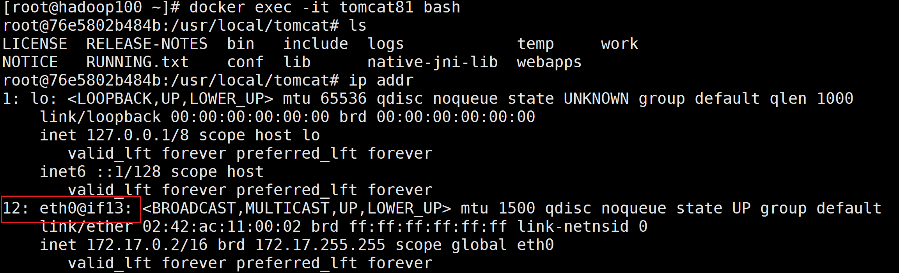

# 40 高级篇简介

# 41 mysql主从复制Docker版

1. 新建主服务器容器3307

```Bash
docker run -p 3307:3306 --name mysql-master --privileged=true \
-v ~/Desktop/mysql-volume/mysql-master/log:/var/log/mysql \
-v ~/Desktop/mysql-volume/mysql-master/data:/var/lib/mysql \
-v ~/Desktop/mysql-volume/mysql-master/conf:/etc/mysql/conf.d \
-e MYSQL_ROOT_PASSWORD=123456 \
-d mysql:5.7
```

2. 进入`~/Desktop/mysql-volume/mysql-master/conf`目录下新建`my.cnf`。

```properties
[mysqld]
## 设置server_id，同一局域网中需要唯一
server_id=101
## 指定不需要同步的数据库名称
binlog-ignore-db=mysql
## 开启二进制日志功能
log-bin=mall-mysql-bin
## 设置二进制日志使用内存大小（事务）
binlog_cache_size=1M
## 设置使用的二进制日志格式（mixed,statement,row）
binlog_format=mixed
## 二进制日志过期清理时间。默认值为0，表示不自动清理。
expire_logs_days=7
## 跳过主从复制中遇到的所有错误或指定类型的错误，避免slave端复制中断。
## 如：1062错误是指一些主键重复，1032错误是因为主从数据库数据不一致
slave_skip_errors=1062
```

3. 修改完配置文件后重启master实例。
4. 进入mysql-master容器后，进入mysql数据库。
5. master容器实例内创建数据同步用户。

```mysql
CREATE USER 'slave'@'%' IDENTIFIED BY '123456';
GRANT REPLICATION SLAVE, REPLICATION CLIENT ON *.* TO 'slave'@'%';
```

6. 新建从服务器容器实例3308

```Bash
docker run -p 3308:3306 --name mysql-slave --privileged=true \
-v ~/Desktop/mysql-volume/mysql-slave/log:/var/log/mysql \
-v ~/Desktop/mysql-volume/mysql-slave/data:/var/lib/mysql \
-v ~/Desktop/mysql-volume/mysql-slave/conf:/etc/mysql/conf.d \
-e MYSQL_ROOT_PASSWORD=123456 \
-d mysql:5.7
```

7. 进入`~/Desktop/mysql-volume/mysql-slave/conf`目录下新建`my.cnf`。

```properties
[mysqld]
## 设置server_id，同一局域网中需要唯一
server_id=102
## 指定不需要同步的数据库名称
binlog-ignore-db=mysql
## 开启二进制日志功能，以备Slave作为其它数据库实例的Master时使用
log-bin=mall-mysql-slave1-bin
## 设置二进制日志使用内存大小（事务）
binlog_cache_size=1M
## 设置使用的二进制日志格式（mixed,statement,row）
binlog_format=mixed
## 二进制日志过期清理时间。默认值为0，表示不自动清理。
expire_logs_days=7
## 跳过主从复制中遇到的所有错误或指定类型的错误，避免slave端复制中断。
## 如：1062错误是指一些主键重复，1032错误是因为主从数据库数据不一致
slave_skip_errors=1062
## relay_log配置中继日志
relay_log=mall-mysql-relay-bin
## log_slave_updates表示slave将复制事件写进自己的二进制日志
log_slave_updates=1
## slave设置为只读（具有super权限的用户除外）
read_only=1
```

8. 修改完配置文件后重启slave实例。
9. 在主数据库中查看主从同步状态: `show master status`。
   
10. 进入mysql-slave容器后，进入mysql数据库。
11. 在从数据库中配置主从复制。

```mysql
change master to master_host ='宿主机IP', master_user ='slave', master_password ='123456', master_port =3307, master_log_file ='mall-mysql-bin.000001', master_log_pos ='master status命令中的Position', master_connect_retry =30;
```

12. 在从数据库中查看主从同步状态: `show slave status \G;`
    
13. 在从数据库中开启主从同步: `start slave;`
14. 查看从数据库状态发现已经同步。
    
15. 主从复制测试:
    - 在主数据库新建库，新建表，插入数据
    - 在从数据库中查看记录，OK

# 42 分布式存储之哈希取余算法


2亿条记录就是2亿个k,v，我们单机不行，必须要分布式多机，假设有3台机器构成一个集群，用户每次读写操作都是根据公式:
hash(key) % N个机器台数，计算出哈希值，用来决定数据映射到哪一个节点上。

- 优点：
  简单粗暴，直接有效，只需要预估好数据规划好节点，例如3台、8台、10台，就能保证一段时间的数据支撑。  
  使用Hash算法让固定的一部分请求落到同一台服务器上，这样每台服务器固定处理一部分请求（并维护这些请求的信息），起到负载均衡+分而治之的作用。
- 缺点：
  原来规划好的节点，进行扩容或者缩容就比较麻烦了额，不管扩缩，每次数据变动导致节点有变动，  
  映射关系需要重新进行计算，在服务器个数固定不变时没有问题，如果需要弹性扩容或故障停机的情况下，原来的取模公式就会发生变化:
  Hash(key)/3会变成Hash(key)/?。  
  此时地址经过取余运算的结果将发生很大变化，根据公式获取的服务器也会变得不可控。  
  某个redis机器宕机了，由于台数数量变化，会导致hash取余全部数据重新洗牌。

# 43 分布式存储之一致性哈希算法


为了在节点数目发生改变时尽可能少的迁移数据，将所有的存储节点排列在收尾相接的Hash环上。  
每个key在计算Hash后会顺时针找到临近的存储节点存放。 而当有节点加入或退出时仅影响该节点在Hash环上顺时针相邻的后续节点。

- 优点:
  加入和删除节点只影响哈希环中顺时针方向的相邻的节点，对其他节点无影响。
- 缺点:
  数据的分布和节点的位置有关，因为这些节点不是均匀的分布在哈希环上的，所以数据在进行存储时达不到均匀分布的效果。

# 44 分布式存储之哈希槽算法


# 45 46 47 3主3从redis集群配置

* 此实验在MacOS和Windows的Docker中没有成功，必须在Linux中进行。

- 新建6个docker容器实例。

```bash
docker run -d --name redis-node-1 --net host --privileged=true -v ~/redis-volume/redis-node-1:/data redis:6.0.8 --cluster-enabled yes --appendonly yes --port 6381
docker run -d --name redis-node-2 --net host --privileged=true -v ~/redis-volume/redis-node-2:/data redis:6.0.8 --cluster-enabled yes --appendonly yes --port 6382
docker run -d --name redis-node-3 --net host --privileged=true -v ~/redis-volume/redis-node-3:/data redis:6.0.8 --cluster-enabled yes --appendonly yes --port 6383
docker run -d --name redis-node-4 --net host --privileged=true -v ~/redis-volume/redis-node-4:/data redis:6.0.8 --cluster-enabled yes --appendonly yes --port 6384
docker run -d --name redis-node-5 --net host --privileged=true -v ~/redis-volume/redis-node-5:/data redis:6.0.8 --cluster-enabled yes --appendonly yes --port 6385
docker run -d --name redis-node-6 --net host --privileged=true -v ~/redis-volume/redis-node-6:/data redis:6.0.8 --cluster-enabled yes --appendonly yes --port 6386
```


- 进入容器`redis-node-1`并为6台机器构建集群关系。

```bash
docker exec -it redis-node-1 /bin/bash
# 下面的IP是宿主机的IP
redis-cli --cluster create 10.0.2.15:6381 10.0.2.15:6382 10.0.2.15:6383 10.0.2.15:6384 10.0.2.15:6385 10.0.2.15:6386 --cluster-replicas 1
```


- 链接进入`6381`作为切入点，查看节点状态。

```bash
redis-cli -p 6381

cluster info

cluster nodes
```


# 48 redis集群读写error说明

- 对redis集群进行操作时，不能采用操作单机的方式。


# 49 redis集群读写路由增强正确案例

- 使用`-c`参数在集群模式下进行数据操作。


# 50 查看集群信息cluster check


# 51 主从容错切换迁移

- 主6381和从机切换，先停止主机6381: `docker stop redis-node-1`
- 再次查看集群信息:

```Bash
docker exec -it redis-node-2 /bin/bash

redis-cli -p 6382 -c

clster nodes
```

可以看到6381挂了，6384上位称为master。之前存储的数据没有丢失。


还原之前的3主3从:

- 重新启动6381主机: `docker start redis-node-1`
- 查看集群信息，可以看到6384还是master，6381称为slave。
  
- 为了恢复原状，让6381成为master，6384成为slave，先停止6384容器，再启动6384容器。

```Bash
docker stop redis-node-4
docker start redis-node-4
```


可以看到已经恢复最初的架构: `redis-cli --cluster check 宿主机IP:6381`

# 52 主从扩容需求分析


# 53 主从扩容案例演示

- 新建6387、6388两个节点+新建后启动+查看是否是8个节点

```Bash
docker run -d --name redis-node-7 --net host --privileged=true -v ~/redis-volume/redis-node-7:/data redis:6.0.8 --cluster-enabled yes --appendonly yes --port 6387
docker run -d --name redis-node-8 --net host --privileged=true -v ~/redis-volume/redis-node-8:/data redis:6.0.8 --cluster-enabled yes --appendonly yes --port 6388
docker ps
```

- 进入6387容器实例内部: `docker exec -it redis-node-7 /bin/bash`
- 将新增的6387节点(空槽号)作为master节点加入原集群
  `redis-cli --cluster add-node 10.0.2.15:6387 10.0.2.15:6381`
  

- 检查集群情况第1次: `redis-cli --cluster check 10.0.2.15:6381`
  

- 重新分配槽位: `redis-cli --cluster reshard 10.0.2.15:6381`
  

- 检查集群情况第2次: `redis-cli --cluster check 10.0.2.15:6381`
  

- 为主节点6387分配从节点6388:
  `redis-cli --cluster add-node 10.0.2.15:6388 10.0.2.15:6387 --cluster-slave --cluster-master-id [6387的ID]`
  

- 检查集群情况第3次: `redis-cli --cluster check 10.0.2.15:6382`
  

# 54 主从缩容需求分析


# 55 主从缩容案例演示

- 目的: 6387和6388下线
- 查看集群情况，获得6388的节点ID: `redis-cli --cluster check 10.0.2.15:6382`
- 从集群中将4号从节点6388删除: `redis-cli --cluster del-node 10.0.2.15:6388 [6388的节点ID]`
- 查看集群情况
  
- 将6387的槽位清空，本例将清出来的槽位都给6381: `redis-cli --cluster reshard 10.0.2.15:6381`
  
- 查看集群情况
  
- 将6387从集群中删除: `redis-cli --cluster del-node 10.0.2.15:6387 [6387的节点ID]`
- 查看集群情况
  

# 56 分布式存储案例小总结

# 57 Dockerfile简介

- 是什么? Dockerfile是用来构建Docker镜像的文本文件，是由一条条构建镜像所需的指令和参数构成的脚本。
  
- 构建三部曲:
    1. 编写Dockerfile文件
    2. `docker build`命令构建镜像
    3. `docker run`运行容器实例

# 58 Dockerfile构建过程解析

从应用软件的角度来看，Dockerfile、Docker镜像与Docker容器分别代表软件的三个不同阶段:

- Dockerfile是软件的原材料
- Docker镜像是软件的交付品
- Docker容器则可以认为是软件镜像的运行态，也即依照镜像运行的容器实例


Dockerfile面向开发，Docker镜像成为交付标准，Docker容器则涉及部署与运维，三者缺一不可，合力充当Docker体系的基石。

1. Dockerfile，需要定义一个Dockerfile，Dockerfile定义了进程需要的一切东西。  
   Dockerfile涉及的内容包括执行代码或者是文件、环境变量、依赖包、运行时环境、动态链接库、操作系统的发行版、  
   服务进程和内核进程(当应用进程需要和系统服务和内核进程打交道，这时需要考虑如何设计namespace的权限控制)等等。
2. Docker镜像，在用Dockerfile定义一个文件之后，`docker build`时会产生一个Docker镜像，当运行Docker镜像时会真正开始提供服务。
3. Docker容器，容器是直接提供服务的。

# 59 Dockerfile保留字简介

- `FROM`: 基础镜像，当前镜像是基于哪个镜像的，指定一个已经存在的镜像作为模板，第一句必须是`FROM`。
- `MAINTAINER`: 镜像维护者的姓名和邮箱地址。
- `RUN`: 容器构建时需要运行的命令。
    - 两种格式
        - shell格式: `RUN <命令行命令>` 例如: `RUN yum -y install vim`
        - exec格式: `RUN ["可执行文件", "参数1", "参数2" ...]` 例如: `RUN ["./test.php", "dev", "offline"]`等价于
          `RUN ./test.php dev offline`
- `EXPOSE`: 当前容器对外暴露出的端口。
- `WORKDIR`: 指定在创建容器后，终端默认登录进来的工作目录，一个落脚点。
- `USER`: 指定该镜像以什么用户去执行命令，如果不指定，默认是`root`。
- `ENV`: 用来在构建镜像过程中设置环境变量。例如:
    ```dockerfile
    ENV MY_PATH /usr/mytest
    WORKDIR $MY_PATH
    ```
- `ADD`: 将宿主机目录下的文件复制进镜像且会自动处理URL和解压tar压缩包。相当于`COPY` + `解压`的合体。
- `COPY`: 类似于`ADD`，复制文件和目录到镜像中。  
  将从构建上下文目录中<源文件>的文件/目录复制到新的一层的镜像内的<目标路径>位置
    - `COPY src desc`
    - `COPY ["src", "dest"]`
    - <src源路径>: 元文件或者源目录
    - <dest目标路径>: 容器内的指定路径，该路径不用事先建好，路径如果不存在，会自动创建。
- `VOLUME`: 容器数据卷，用于数据保存和持久化工作。
- `CMD`: 指定容器启动后要做的事情。
    - Dockerfile中可以有多个`CMD`指令，但只有最后一个生效，`CMD`会被`docker run`之后的参数替换。
      
    - 它和`RUN`命令的区别:
        - `CMD`是在`docker run`时运行。
        - `RUN`是在`docker build`时运行。
- `ENTRYPOINT`: 也是用来指定一个容器启动时要运行的命令。
    - 类似于`CMD`命令，但是`ENTRYPOINT`不会被`docker run`后面的命令覆盖，  
      而且这些命令行参数会被当作参数送给`ENTRYPOINT`指令指定的程序。
      

# 60 CentOS之Dockerfile需求说明


- 写一个Dockerfile，使CentOS7镜像具备`Vim + ifconfig + JDK8`
- JDK的下载地址: `https://mirrors.yangxingzhen.com/jdk/`

# 61 CentOS之Dockerfile案例演示

* 由于CentOS7有网络问题，改用`almalinux:8`的Linux镜像。

- 编写Dockerfile文件:

```dockerfile
FROM almalinux:8
MAINTAINER ljy<liangjy881@gmail.com>

ENV MYPATH /usr/local
WORKDIR $MYPATH

RUN yum -y update
#安装vim编辑器
RUN yum -y install vim
#安装ifconfig命令查看网络IP
RUN yum -y install net-tools
RUN yum clean all
#安装java8及lib库
RUN yum -y install glibc.i686
RUN mkdir /usr/local/java
#ADD 是相对路径jar,把jdk-8u171-linux-x64.tar.gz添加到容器中,安装包必须要和Dockerfile文件在同一位置
ADD jdk-8u221-linux-x64.tar.gz /usr/local/java/
#配置java环境变量
ENV JAVA_HOME /usr/local/java/jdk1.8.0_221
ENV JRE_HOME $JAVA_HOME/jre
ENV CLASSPATH $JAVA_HOME/lib/dt.jar:$JAVA_HOME/lib/tools.jar:$JRE_HOME/lib:$CLASSPATH
ENV PATH $JAVA_HOME/bin:$PATH

EXPOSE 80

CMD echo $MYPATH
CMD echo "success--------------ok"
CMD /bin/bash
```

- 构建: `docker build -t 新镜像名称:TAG .`
    - 例如: `docker build -t almalinux-java8:1.5`

- 运行: `docker run -it 新镜像名称:TAG`
    - 例如: `docker run -it almalinux-java8:1.5 /bin/bash`

# 62 虚悬镜像

- 是什么? 仓库名、标签都是<none>的镜像，俗称dangling image。
- 使用Dockerfile构建时，如果不指定镜像名和标签，就会产生虚悬镜像。
- 查看虚悬镜像: `docker images -f dangling=true`
- 删除所有的虚悬镜像: `docker image prune`

# 63 新建微服务工程并形成jar包

- 新建一个Spring Boot项目
- 修改`pom.xml`:

```xml
<?xml version="1.0" encoding="UTF-8"?>
<project xmlns="http://maven.apache.org/POM/4.0.0" xmlns:xsi="http://www.w3.org/2001/XMLSchema-instance"
         xsi:schemaLocation="http://maven.apache.org/POM/4.0.0 https://maven.apache.org/xsd/maven-4.0.0.xsd">
    <modelVersion>4.0.0</modelVersion>
    <parent>
        <groupId>org.springframework.boot</groupId>
        <artifactId>spring-boot-starter-parent</artifactId>
        <version>2.5.6</version>
        <relativePath/>
    </parent>

    <groupId>com.atguigu.docker</groupId>
    <artifactId>docker_boot</artifactId>
    <version>0.0.1-SNAPSHOT</version>

    <properties>
        <java.version>8</java.version>
    </properties>
    <dependencies>
        <dependency>
            <groupId>org.springframework.boot</groupId>
            <artifactId>spring-boot-starter-web</artifactId>
        </dependency>

        <dependency>
            <groupId>org.springframework.boot</groupId>
            <artifactId>spring-boot-starter-test</artifactId>
            <scope>test</scope>
        </dependency>
    </dependencies>

    <build>
        <plugins>
            <plugin>
                <groupId>org.springframework.boot</groupId>
                <artifactId>spring-boot-maven-plugin</artifactId>
            </plugin>
            <plugin>
                <groupId>org.apache.maven.plugins</groupId>
                <artifactId>maven-resources-plugin</artifactId>
                <version>3.1.0</version>
            </plugin>
        </plugins>
    </build>
</project>
```

- 编写Controller:

```java

@RestController
public class OrderController {

    @Value("${server.port}")
    private String port;

    @RequestMapping("/order/docker")
    public String helloDocker() {
        return "hello docker\t" + port + "\t" + UUID.randomUUID();
    }

    @RequestMapping("/order/index")
    public String index() {
        return "服务端口号:\t" + port + "\t" + UUID.randomUUID();
    }
}
```

- 编写`application.yml`:

```yml
server:
  port: 6001
```

- 确认Controller在本地可以正常访问。
- 使用Maven的`package`

# 64 Dockerfile发布微服务部署到Docker容器

- 编写Dockerfile:

```dockerfile
# Specify basic layer
FROM openjdk:8-jdk-alpine
# Specify author
MAINTAINER ljy
# Specify volume
VOLUME /tmp
# Copy jar file to the container
ADD docker_boot-0.0.1-SNAPSHOT.jar ljy_docker.jar
# Run the jar
ENTRYPOINT ["java", "-jar", "/ljy_docker.jar"]
# Expose port 6001
EXPOSE 6001
```

- 构建镜像: `docker build -t ljy_docker:1.6 .`
- 运行容器: `docker run -d -p 6001:6001 ljy_docker:1.6`

# 65 测试容器上的微服务

- `curl 127.0.0.1:6001/order/docker`
- `curl 127.0.0.1:6001/order/index`

# 66 Docker network简介

# 67 Docker network常用命令

- 查看网络: `docker network ls`
- 查看网络数据源: `docker network inspect xxx网络名字`
- 删除网络数: `docker network rm xxx网络名字`

# 68 Docker network能干嘛

- 容器间的互联和通信以及端口映射。
- 容器IP变动时可以通过服务名直接网络通信而不受到影响。

# 69 Docker network网络模式有几种


- `bridge`模式: 使用`--network bridge`指定，默认使用`docker0`。
- `host`模式: 使用`--network host`指定。
- `none`模式: 使用`--network none`指定。
- `container`模式: 使用`--network container:NAME或者容器ID`指定。

# 70 Docker network底层IP和容器映射变化

- 通过实验说明docker容器内部的IP是有可能发生改变的，因此要规划好网络服务。

# 71 Docker network之bridge


- 案例
    - 运行2个tomcat容器
        - `docker run -d -p 8081:8080 --name tomcat81 billygoo/tomcat8-jdk8`
        - `docker run -d -p 8082:8080 --name tomcat82 billygoo/tomcat8-jdk8`
    - 验证两两匹配
        - 宿主机 `ip addr`
          
        - 容器内 `ip addr`
          
          

# 72 Docker network之host

- 直接使用宿主机的IP地址与外界进行通信，不再需要额外进行NAT转换。
  

- 案例
    - 警告: `docker run -d -p 8083:8080 --network host --name tomcat83 billygoo/tomcat8-jdk8`
        - `WARNING: Published ports are discarded when using host network mode`
    - 正确: `docker run -d --network host --name tomcat83 billygoo/tomcat8-jdk8`
    - 查看tomcat的信息: `docker inspect tomcat83`
      
    - 可以看到tomcat83容器没有自己的网关和IP地址。
    - 进入容器查看`ip addr`后也可以看到网络情况和宿主机的网络情况一致。
    - 没有设置`-p`的端口映射，如何访问启动的tomcat83?
        - `http://宿主机IP:8080/`

# 73 Docker network之none

- 是什么?
    - 禁用网络功能，只有lo标识(就是127.0.0.1表示本地回环)。
- 案例
    - `docker run -d -p 8084:8080 --network none --name tomcat84 billygoo/tomcat8-jdk8`
    - `docker inspect tomcat84`
      
    - 进入容器，`ip addr`
      

# 74 Docker network之container

- 是什么?
  
- 案例: 此案例不再使用tomcat，而是使用alpine，一个轻量级的Linux发行版。
    - `docker run -it --name alpine1 alpine /bin/sh`
    - `docker run -it --network container:alpine1 --name alpine2 alpine /bin/sh`
    - 此时查看两个容器的`ip addr`可以看到结果相同。
    - 此时关闭`alpine1`，在进入`aline2`可以看到之前的网络信息也消失了。
    


