# JDBC

- 使用 Docker 创建`mysql`容器

```bash
docker volume create mysql-volume

# 需要注意下面的配置文件目录的挂载配置需要根据不同的电脑设置合适的路径
docker run -d -p3310:3306  -v mysql-volume:/var/lib/mysql -v /Users/liangjinyong/Desktop/Playground/test:/etc/mysql/conf.d -e MYSQL_ROOT_PASSWORD=123456 --name mysql01 mysql:8.0
```

- 连接`mysql`数据库后，导入数据

```sql
/*!40101 SET @OLD_CHARACTER_SET_CLIENT=@@CHARACTER_SET_CLIENT */;
/*!40101 SET NAMES utf8 */;
/*!50503 SET NAMES utf8mb4 */;
/*!40014 SET @OLD_FOREIGN_KEY_CHECKS=@@FOREIGN_KEY_CHECKS, FOREIGN_KEY_CHECKS=0 */;
/*!40101 SET @OLD_SQL_MODE=@@SQL_MODE, SQL_MODE='NO_AUTO_VALUE_ON_ZERO' */;
/*!40111 SET @OLD_SQL_NOTES=@@SQL_NOTES, SQL_NOTES=0 */;


-- 导出 jdbc_learn 的数据库结构
DROP DATABASE IF EXISTS `jdbc_learn`;
CREATE DATABASE IF NOT EXISTS `jdbc_learn` /*!40100 DEFAULT CHARACTER SET utf8mb4 COLLATE utf8mb4_0900_ai_ci */ /*!80016 DEFAULT ENCRYPTION='N' */;
USE `jdbc_learn`;

-- 导出  表 jdbc_learn.customers 结构
DROP TABLE IF EXISTS `customers`;
CREATE TABLE IF NOT EXISTS `customers` (
  `id` int NOT NULL AUTO_INCREMENT,
  `name` varchar(15) DEFAULT NULL,
  `email` varchar(20) DEFAULT NULL,
  `birth` date DEFAULT NULL,
  `photo` mediumblob,
  PRIMARY KEY (`id`)
) ENGINE=InnoDB AUTO_INCREMENT=19 DEFAULT CHARSET=utf8mb4 COLLATE=utf8mb4_0900_ai_ci;

-- 正在导出表  jdbc_learn.customers 的数据：~0 rows (大约)
/*!40000 ALTER TABLE `customers` DISABLE KEYS */;
INSERT INTO `customers` (`id`, `name`, `email`, `birth`, `photo`) VALUES
	(1, '汪峰', 'wf@126.com', '2010-02-02', NULL),
	(2, '王菲', 'wangf@163.com', '1988-12-26', NULL),
	(3, '林志玲', 'linzl@gmail.com', '1984-06-12', NULL),
	(4, '汤唯', 'tangw@sina.com', '1986-06-13', NULL),
	(5, '成龙', 'Jackey@gmai.com', '1955-07-14', NULL),
	(6, '迪丽热巴', 'reba@163.com', '1983-05-17', NULL),
	(7, '刘亦菲', 'liuyifei@qq.com', '1991-11-14', NULL),
	(8, '陈道明', 'bdf@126.com', '2014-01-17', NULL),
	(10, '周杰伦', 'zhoujl@sina.com', '1979-11-15', NULL),
	(12, '黎明', 'LiM@126.com', '1998-09-08', NULL),
	(13, '张学友', 'zhangxy@126.com', '1998-12-21', NULL),
	(16, '朱茵', 'zhuyin@126.com', '2014-01-16', NULL),
	(18, '贝多芬', 'beidf@126.com', '2014-01-17', NULL);
/*!40000 ALTER TABLE `customers` ENABLE KEYS */;

-- 导出  表 jdbc_learn.examstudent 结构
DROP TABLE IF EXISTS `examstudent`;
CREATE TABLE IF NOT EXISTS `examstudent` (
  `FlowID` int NOT NULL AUTO_INCREMENT,
  `Type` int DEFAULT NULL,
  `IDCard` varchar(18) DEFAULT NULL,
  `ExamCard` varchar(15) DEFAULT NULL,
  `StudentName` varchar(20) DEFAULT NULL,
  `Location` varchar(20) DEFAULT NULL,
  `Grade` int DEFAULT NULL,
  PRIMARY KEY (`FlowID`)
) ENGINE=InnoDB AUTO_INCREMENT=7 DEFAULT CHARSET=gb2312;

-- 正在导出表  jdbc_learn.examstudent 的数据：~0 rows (大约)
/*!40000 ALTER TABLE `examstudent` DISABLE KEYS */;
INSERT INTO `examstudent` (`FlowID`, `Type`, `IDCard`, `ExamCard`, `StudentName`, `Location`, `Grade`) VALUES
	(1, 4, '412824195263214584', '200523164754000', '张锋', '郑州', 85),
	(2, 4, '222224195263214584', '200523164754001', '孙朋', '大连', 56),
	(3, 6, '342824195263214584', '200523164754002', '刘明', '沈阳', 72),
	(4, 6, '100824195263214584', '200523164754003', '赵虎', '哈尔滨', 95),
	(5, 4, '454524195263214584', '200523164754004', '杨丽', '北京', 64),
	(6, 4, '854524195263214584', '200523164754005', '王小红', '太原', 60);
/*!40000 ALTER TABLE `examstudent` ENABLE KEYS */;

-- 导出  表 jdbc_learn.order 结构
DROP TABLE IF EXISTS `order`;
CREATE TABLE IF NOT EXISTS `order` (
  `order_id` int NOT NULL AUTO_INCREMENT,
  `order_name` varchar(20) DEFAULT NULL,
  `order_date` date DEFAULT NULL,
  PRIMARY KEY (`order_id`)
) ENGINE=InnoDB AUTO_INCREMENT=5 DEFAULT CHARSET=utf8mb4 COLLATE=utf8mb4_0900_ai_ci;

-- 正在导出表  jdbc_learn.order 的数据：~0 rows (大约)
/*!40000 ALTER TABLE `order` DISABLE KEYS */;
INSERT INTO `order` (`order_id`, `order_name`, `order_date`) VALUES
	(1, 'AA', '2010-03-04'),
	(2, 'BB', '2000-02-01'),
	(4, 'GG', '1994-06-28');
/*!40000 ALTER TABLE `order` ENABLE KEYS */;

-- 导出  表 jdbc_learn.user 结构
DROP TABLE IF EXISTS `user`;
CREATE TABLE IF NOT EXISTS `user` (
  `id` int NOT NULL AUTO_INCREMENT,
  `name` varchar(10) NOT NULL,
  `password` varchar(15) NOT NULL DEFAULT '123456',
  `address` varchar(25) DEFAULT NULL,
  `phone` varchar(15) DEFAULT NULL,
  PRIMARY KEY (`id`)
) ENGINE=InnoDB AUTO_INCREMENT=6 DEFAULT CHARSET=utf8mb4 COLLATE=utf8mb4_0900_ai_ci;

-- 正在导出表  jdbc_learn.user 的数据：~5 rows (大约)
/*!40000 ALTER TABLE `user` DISABLE KEYS */;
INSERT INTO `user` (`id`, `name`, `password`, `address`, `phone`) VALUES
	(1, '章子怡', 'qwerty', 'Beijing', '13788658672'),
	(2, '郭富城', 'abc123', 'HongKong', '15678909898'),
	(3, '林志玲', '654321', 'Taiwan', '18612124565'),
	(4, '梁静茹', '987654367', 'malaixiya', '18912340998'),
	(5, 'LadyGaGa', '123456', 'America', '13012386565');
/*!40000 ALTER TABLE `user` ENABLE KEYS */;

-- 导出  表 jdbc_learn.user_table 结构
DROP TABLE IF EXISTS `user_table`;
CREATE TABLE IF NOT EXISTS `user_table` (
  `user` varchar(20) DEFAULT NULL,
  `password` varchar(20) DEFAULT NULL,
  `balance` int DEFAULT NULL
) ENGINE=InnoDB DEFAULT CHARSET=utf8mb4 COLLATE=utf8mb4_0900_ai_ci;

-- 正在导出表  jdbc_learn.user_table 的数据：~4 rows (大约)
/*!40000 ALTER TABLE `user_table` DISABLE KEYS */;
INSERT INTO `user_table` (`user`, `password`, `balance`) VALUES
	('AA', '123456', 1000),
	('BB', '654321', 1000),
	('CC', 'abcd', 2000),
	('DD', 'abcder', 3000);
/*!40000 ALTER TABLE `user_table` ENABLE KEYS */;

/*!40101 SET SQL_MODE=IFNULL(@OLD_SQL_MODE, '') */;
/*!40014 SET FOREIGN_KEY_CHECKS=IF(@OLD_FOREIGN_KEY_CHECKS IS NULL, 1, @OLD_FOREIGN_KEY_CHECKS) */;
/*!40101 SET CHARACTER_SET_CLIENT=@OLD_CHARACTER_SET_CLIENT */;
/*!40111 SET SQL_NOTES=@OLD_SQL_NOTES */;

CREATE TABLE IF NOT EXISTS goods
(
    id   INT PRIMARY KEY AUTO_INCREMENT,
    name VARCHAR(25)
);
```

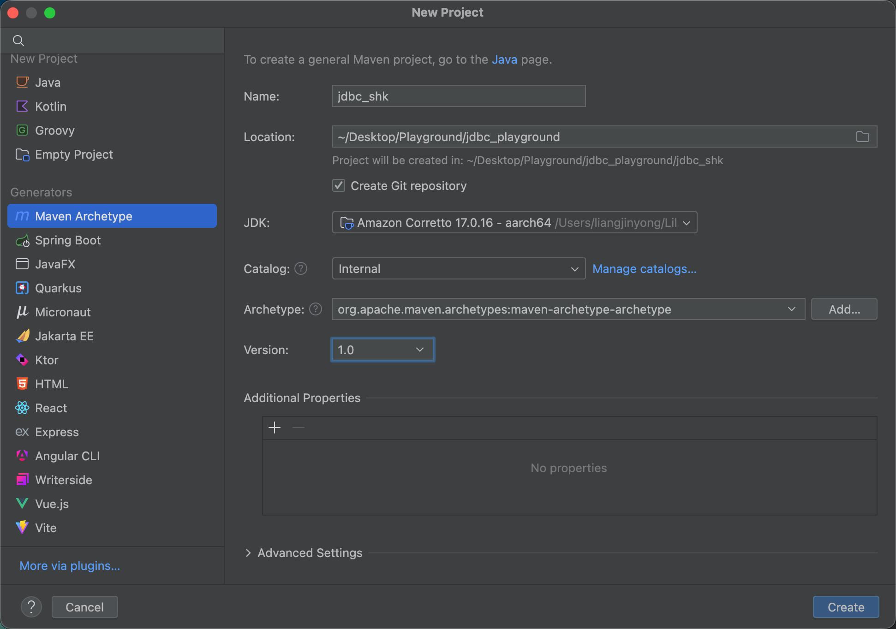

- `pom.xml`

```xml
<project xmlns="http://maven.apache.org/POM/4.0.0" xmlns:xsi="http://www.w3.org/2001/XMLSchema-instance"
         xsi:schemaLocation="http://maven.apache.org/POM/4.0.0 http://maven.apache.org/maven-v4_0_0.xsd">
    <modelVersion>4.0.0</modelVersion>
    <groupId>com.atguigu</groupId>
    <artifactId>jdbc_shk</artifactId>
    <version>1.0-SNAPSHOT</version>

    <properties>
        <maven.compiler.source>17</maven.compiler.source>
        <maven.compiler.target>17</maven.compiler.target>
        <project.build.sourceEncoding>UTF-8</project.build.sourceEncoding>
    </properties>

    <dependencies>
        <dependency>
            <groupId>com.mysql</groupId>
            <artifactId>mysql-connector-j</artifactId>
            <version>9.1.0</version>
        </dependency>

        <dependency>
            <groupId>org.junit.jupiter</groupId>
            <artifactId>junit-jupiter</artifactId>
            <version>5.12.2</version>
            <scope>compile</scope>
        </dependency>
    </dependencies>
</project>

```

## 第 2 章 获取数据库的连接

- 测试类
- 方式一

```java
public class ConnectionTest {

  @Test
  public void testConnection1() throws SQLException {
      // 获取Driver实现类对象
      Driver driver = new com.mysql.cj.jdbc.Driver();
      // jdbc:mysql: 协议
      // localhost: IP地址
      // 3310: 数据库端口号
      // jdbc_learn: 数据库名称
      String url = "jdbc:mysql://localhost:3310/jdbc_learn";
      // 将用户名和密码封装在Properties中
      Properties info = new Properties();
      info.setProperty("user", "root");
      info.setProperty("password", "123456");

      Connection conn = driver.connect(url, info);
      System.out.println("方式一: " + conn);
  }
}
```

- 方式二: 对方式一的迭代
- 为了让上面的程序能有更好的移植性，不能在程序里看到直接使用第三方类的代码(com.mysql.cj.jdbc.Driver)。

```java
  @Test
  public void testConnection2() throws Exception {
      // 1. 获取Driver实现类对象
      Class clazz = Class.forName("com.mysql.cj.jdbc.Driver");
      Driver driver = (Driver) clazz.newInstance();

      // 2. 提供要连接的数据库
      String url = "jdbc:mysql://localhost:3310/jdbc_learn";

      // 3. 提供连接需要的用户名和密码
      Properties info = new Properties();
      info.setProperty("user", "root");
      info.setProperty("password", "123456");

      // 4. 获取连接
      Connection conn = driver.connect(url, info);
      System.out.println("方式二: " + conn);
  }
```

- 方式三: 使用 DriverManager 替代 Driver

```java
  @Test
  public void testConnection3() throws Exception {
      // 1. 获取Driver实现类对象
      Class clazz = Class.forName("com.mysql.cj.jdbc.Driver");
      Driver driver = (Driver) clazz.newInstance();

      // 2. 提供另外三个连接的基本信息
      String url = "jdbc:mysql://localhost:3310/jdbc_learn";
      String user = "root";
      String password = "123456";

      // 注册驱动
      DriverManager.registerDriver(driver);

      // 获取连接
      Connection conn = DriverManager.getConnection(url, user, password);
      System.out.println("方式三: " + conn);
  }
```

- 方式四: 使用 DriverManager 替代 Driver
- 可以只是加载驱动，不用显式地注册驱动了。

```java
  @Test
  public void testConnection4() throws Exception {
      // 1. 提供三个连接的基本信息
      String url = "jdbc:mysql://localhost:3310/jdbc_learn";
      String user = "root";
      String password = "123456";

      // 2. 获取Driver实现类对象 --> 该步骤可以优化 -> 加载Driver
      // 对于MySQL数据库，甚至下面这一行也可以省略 -> mysql-connector-j-9.1.0.jar > META-INF > services > java.sql.Driver
      // 但是建议不要省略，因为如果换成其他数据库，省略这一行可能就不能正常运行了
      Class.forName("com.mysql.cj.jdbc.Driver");
      // 相较于方式三，可以省略如下的操作:
      // Driver driver = (Driver) clazz.newInstance();
      // 注册驱动
      // DriverManager.registerDriver(driver);

      /*
      此代码块是MySql驱动的源码，可以看到Driver的静态代码块中已经注册了驱动，所以注册的步骤可以省略
      static {
          try {
              java.sql.DriverManager.registerDriver(new com.mysql.cj.jdbc.Driver());
          } catch (SQLException E) {
              throw new RuntimeException("Can't register driver!");
          }
      }
        */

      // 3. 获取连接
      Connection conn = DriverManager.getConnection(url, user, password);
      System.out.println("方式四: " + conn);
  }
```

- 方式五(final 版): 将数据库连接需要的 4 个基本信息声明在配置文件中，通过读取配置文件的方式获取连接
- 此种方式的好处?

1. 实现了数据与代码的分离，实现了解耦。
2. 如果需要修改配置文件信息，可以避免程序重新打包。

- 目前使用`JUnit`测试时，`properties`配置文件的位置是在`resources`下

```properties
user=root
password=123456
url=jdbc:mysql://localhost:3310/jdbc_learn
driverClass=com.mysql.cj.jdbc.Driver
```

```java
  @Test
  public void getConnection5() throws Exception {
      // 1. 读取配置文件中的4个基本信息
      InputStream is = ConnectionTest.class.getClassLoader().getResourceAsStream("jdbc.properties");

      Properties props = new Properties();
      props.load(is);

      String user = props.getProperty("user");
      String password = props.getProperty("password");
      String url = props.getProperty("url");
      String driverClass = props.getProperty("driverClass");

      // 2. 加载驱动
      Class.forName(driverClass);

      // 3. 获取连接
      Connection conn = DriverManager.getConnection(url, user, password);
      System.out.println(conn);
  }
```

## 第 3 章 使用 PreparedStatement 实现 CRUD 操作

- 使用 Statement 操作数据表存在弊端:
  1. 存在拼串操作，繁琐
  2. 存在 SQL 注入问题: 利用某些系统没有对用户输入的数据进行充分的检查，而在用户输入的数据中注入非法的 SQL 语句段或命令，从而利用系统的 SQL 引擎完成恶意行为的做法。

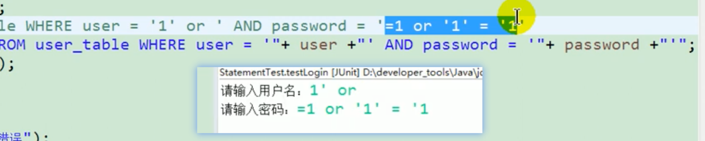

- 如何避免出现 SQL 注入? 只要用`PreparedStatement`(从`Statement`扩展而来)取代`Statement`。

---

- 使用`PreparedStatement`

```java
package com.atguigu3.preparedstatement.crud;

import org.junit.jupiter.api.Test;

import java.io.InputStream;
import java.sql.*;
import java.text.SimpleDateFormat;
import java.util.Properties;

/**
 * 使用PreparedStatement来替换Statement，实现对数据表的增删改操作。
 * 增删改; 查
 */
public class PreparedStatementUpdateTest {
    // 向customers表中添加一条记录
    @Test
    public void testInsert() {
        Connection conn = null;
        PreparedStatement ps = null;

        try {
            // 1. 读取配置文件中的4个基本信息
            InputStream is = ClassLoader.getSystemClassLoader().getResourceAsStream("jdbc.properties");

            Properties props = new Properties();
            props.load(is);

            String user = props.getProperty("user");
            String password = props.getProperty("password");
            String url = props.getProperty("url");
            String driverClass = props.getProperty("driverClass");

            // 2. 加载驱动
            Class.forName(driverClass);

            // 3. 获取连接
            conn = DriverManager.getConnection(url, user, password);

            // 4. 预编译SQL语句，返回PreparedStatement的实例
            String sql = "insert into customers(name, email, birth) values(?, ?, ?)"; // ?: 占位符
            ps = conn.prepareStatement(sql);

            // 5. 填充占位符
            ps.setString(1, "哪吒");
            ps.setString(2, "nezha@gmail.com");
            SimpleDateFormat sdf = new SimpleDateFormat("yyyy-MM-dd");
            java.util.Date date = sdf.parse("1942-04-22");
            ps.setDate(3, new Date(date.getTime()));

            // 6. 执行SQL
            ps.execute();
        } catch (Exception e) {
            e.printStackTrace();
        } finally {
            // 7. 资源的关闭
            try {
                if (ps != null)
                    ps.close();
            } catch (SQLException e) {
                e.printStackTrace();
            }
            try {
                if (conn != null)
                    conn.close();
            } catch (SQLException e) {
                e.printStackTrace();
            }
        }
    }
}
```

---

- 对于`增删改`操作，有一些固定的步骤，比如`获取连接`，`关闭资源`。
- 可以把这些固定的操作封装到`工具类`中。

```java
/**
 * 操作数据库的工具类
 */
public class JDBCUtils {

    /**
     * 获取数据库连接
     *
     * @return
     * @throws Exception
     */
    public static Connection getConnection() throws Exception {
        // 1. 读取配置文件中的4个基本信息
        InputStream is = ClassLoader.getSystemClassLoader().getResourceAsStream("jdbc.properties");

        Properties props = new Properties();
        props.load(is);

        String user = props.getProperty("user");
        String password = props.getProperty("password");
        String url = props.getProperty("url");
        String driverClass = props.getProperty("driverClass");

        // 2. 加载驱动
        Class.forName(driverClass);

        // 3. 获取连接
        return DriverManager.getConnection(url, user, password);
    }

    /**
     * 关闭连接和Statement
     *
     * @param conn
     * @param stmt
     */
    public static void closeResources(Connection conn, Statement stmt) {
        try {
            if (stmt != null)
                stmt.close();
        } catch (SQLException e) {
            e.printStackTrace();
        }

        try {
            if (conn != null)
                conn.close();
        } catch (SQLException e) {
            e.printStackTrace();
        }
    }
}
```

---

- 使用封装好的工具类来执行一个修改的操作

```java
  // 修改customers表中的一条记录
  @Test
  public void testUpdate() {
      Connection conn = null;
      PreparedStatement ps = null;
      try {
          // 1. 获取数据库的连接
          conn = JDBCUtils.getConnection();
          // 2. 预编译SQL语句，返回PreparedStatement的实例
          String sql = "update customers set name = ? where id = ?";
          ps = conn.prepareStatement(sql);
          // 3. 填充占位符
          ps.setObject(1, "莫扎特");
          ps.setObject(2, 18);
          // 4. 执行
          ps.execute();
          System.out.println("修改成功");
      } catch (Exception e) {
          e.printStackTrace();
      } finally {
          // 5. 资源的关闭
          JDBCUtils.closeResources(conn, ps);
      }
  }
```

---

- 实现一个通用的`增删改`操作

```java
  // 通用的增删改操作
  public void update(String sql, Object... args) { // sql中占位符的个数要与可变形参的长度相同
      Connection conn = null;
      PreparedStatement ps = null;
      try {
          // 1. 获取数据库的连接
          conn = JDBCUtils.getConnection();
          // 2. 预编译SQL语句，返回PreparedStatement的实例
          ps = conn.prepareStatement(sql);
          // 3. 填充占位符
          for (int i = 0; i < args.length; i++) {
              ps.setObject(i + 1, args[i]);
          }
          // 4. 执行
          ps.execute();
      } catch (Exception e) {
          e.printStackTrace();
      } finally {
          // 5. 资源的关闭
          JDBCUtils.closeResources(conn, ps);
      }
  }
```

-- 对通用的`增删改`操作测试

```java
@Test
  public void testCommonUpdate() {
      // String sql = "delete from customers where id = ?";
      // update(sql, 3);

      String sql = "update `order` set order_name = ? where order_id = ?";
      update(sql, "DD", 2);
  }
```

---

- 针对 customers 表的查询操作举例

```java
public class CustomerForQuery {

    @Test
    public void testQuery1() {
        Connection conn = null;
        PreparedStatement ps = null;
        ResultSet resultSet = null;
        try {
            conn = JDBCUtils.getConnection();

            String sql = "select id, name, email, birth from customers where id = ?";
            ps = conn.prepareStatement(sql);
            ps.setObject(1, 1);

            // 执行并返回结果集
            resultSet = ps.executeQuery();
            // 处理结果集
            if (resultSet.next()) { // next(): 判断结果集的下一条是否有数据，如果有数据返回true，并指针下移；如果返回false，指针不下移。
                // 获取当前这条数据的各个字段值
                int id = resultSet.getInt(1);
                String name = resultSet.getString(2);
                String email = resultSet.getString(3);
                Date birth = resultSet.getDate(4);

                // 方式一: 直接打印各个结果字段值，有点low
                // System.out.println("id = " + id + ", name = " + name + ", email = " + email + ", birth = " + birth);

                // 方式二: 将结果放到一个数组中
                // Object[] data = new Object[]{id, name, email, birth};

                // 方式三: 将数据封装为一个对象(推荐)
                Customer customer = new Customer(id, name, email, birth);
                System.out.println(customer);
            }
        } catch (Exception e) {
            e.printStackTrace();
        } finally {
            JDBCUtils.closeResources(conn, ps, resultSet);
        }
    }
}
```

- 封装的 Customer 对象

```java
public class Customer {

    private int id;
    private String name;
    private String email;
    private Date birth;

    // 无参构造器
    // 有参构造器
    // getters and setters
    // toString()
}
```

- 由于结果集(`ResultSet`)使用后，也需要资源的关闭，需要在`JDBCUtils`中添加一个和之前方法重载的关闭资源的方法。

```java
  public static void closeResources(Connection conn, Statement stmt, ResultSet rs) {
      try {
          if (stmt != null)
              stmt.close();
      } catch (SQLException e) {
          e.printStackTrace();
      }

      try {
          if (conn != null)
              conn.close();
      } catch (SQLException e) {
          e.printStackTrace();
      }

      try {
          if (rs != null)
              rs.close();
      } catch (SQLException e) {
          e.printStackTrace();
      }
  }
```

---

- 针对 customers 表的通用的查询

```java
  public Customer queryForCustomers(String sql, Object... args) {
      Connection conn = null;
      PreparedStatement ps = null;
      ResultSet rs = null;
      try {
          conn = JDBCUtils.getConnection();

          ps = conn.prepareStatement(sql);
          for (int i = 0; i < args.length; i++) {
              ps.setObject(i + 1, args[i]);
          }

          // *** 下面这段代码可以说是查询乃至JDBC中最难的一段代码 ***
          rs = ps.executeQuery();
          // 获取结果集的元数据: ResultSetMetaData
          ResultSetMetaData rsmd = rs.getMetaData();
          // 通过ResultSetMetaData获取结果集中的列数
          int columnCount = rsmd.getColumnCount();
          if (rs.next()) {
              Customer cust = new Customer();
              // 处理结果集一行数据中的每一个列
              for (int i = 0; i < columnCount; i++) {
                  Object columnValue = rs.getObject(i + 1);
                  // 获取每个列的列名
                  // String columnName = rsmd.getColumnName(i + 1);
                  // 获取每个列的别名
                  String columnLabel = rsmd.getColumnLabel(i + 1);
                  // 给cust对象指定的某个属性，赋值为columnValue: 通过反射。
                  Field field = Customer.class.getDeclaredField(columnLabel);
                  field.setAccessible(true);
                  field.set(cust, columnValue);
              }
              return cust;
          }
      } catch (Exception e) {
          e.printStackTrace();
      } finally {
          JDBCUtils.closeResources(conn, ps, rs);
      }
      return null;
  }
```

- 测试

```java
  @Test
  public void testQueryForCustomers() {
      String sql = "select id, name, birth, email from customers where id = ?";
      Customer customer = queryForCustomers(sql, 13);
      System.out.println(customer);

      // 只查询一部分字段
      sql = "select name, email from customers where name = ?";
      customer = queryForCustomers(sql, "周杰伦");
      System.out.println(customer);
  }
```

---

- 针对 order 表的通用的查询

```java
public class OrderForQuery {

    @Test
    public void testQuery1() {
        Connection conn = null;
        PreparedStatement ps = null;
        ResultSet rs = null;
        try {
            conn = JDBCUtils.getConnection();
            String sql = "select order_id, order_name, order_date from `order` where order_id = ?";
            ps = conn.prepareStatement(sql);
            ps.setObject(1, 1);

            rs = ps.executeQuery();

            if (rs.next()) {
                int id = (int) rs.getObject(1);
                String name = (String) rs.getObject(2);
                Date date = (Date) rs.getObject(3);

                Order order = new Order(id, name, date);
                System.out.println(order);
            }

        } catch (Exception e) {
            e.printStackTrace();
        } finally {
            JDBCUtils.closeResources(conn, ps, rs);
        }
    }

    // 针对于Order表的通用查询操作
    public Order orderForQuery(String sql, Object... args) {
        Connection conn = null;
        PreparedStatement ps = null;
        ResultSet rs = null;
        try {
            conn = JDBCUtils.getConnection();

            ps = conn.prepareStatement(sql);
            for (int i = 0; i < args.length; i++) {
                ps.setObject(i + 1, args[i]);
            }

            rs = ps.executeQuery();
            // 获取结果集的元数据
            ResultSetMetaData rsmd = rs.getMetaData();
            // 获取列数
            int columnCount = rsmd.getColumnCount();
            if (rs.next()) {
                Order order = new Order();
                for (int i = 0; i < columnCount; i++) {
                    // 获取每个列的列值
                    Object columnValue = rs.getObject(i + 1);
                    // 获取每个列的列名: getColumnName() -- 不推荐使用
                    // 获取每个列的别名: getColumnLabel()
                    // String columnName = rsmd.getColumnName(i + 1);
                    String columnLabel = rsmd.getColumnLabel(i + 1);

                    // 通过反射，将对象中属性名为columnLabel的属性值赋值为columnValue
                    Field field = Order.class.getDeclaredField(columnLabel);
                    field.setAccessible(true);
                    field.set(order, columnValue);
                }
                return order;
            }
        } catch (Exception e) {
            e.printStackTrace();
        } finally {
            JDBCUtils.closeResources(conn, ps, rs);
        }
        return null;
    }

    @Test
    public void testOrderForQuery() {
        String sql = "select order_id orderId, order_name orderName, order_date orderDate from `order` where order_id = ?";
        Order order = orderForQuery(sql, 1);
        System.out.println(order);
    }
}
```

- 针对于表的字段名与类的属性名不相同的情况:
  1. 声明 SQL 时，必须使用类的属性名来命名字段的别名
  2. 使用 ResultSetMetaData 时，需要使用 getColumnLabel()来替换 getColumnName()，获取列的别名。
- 说明: 如果 SQL 中没有给字段起别名，getColumnName()获取的就是列名。

---

> 20 图解查询操作的流程

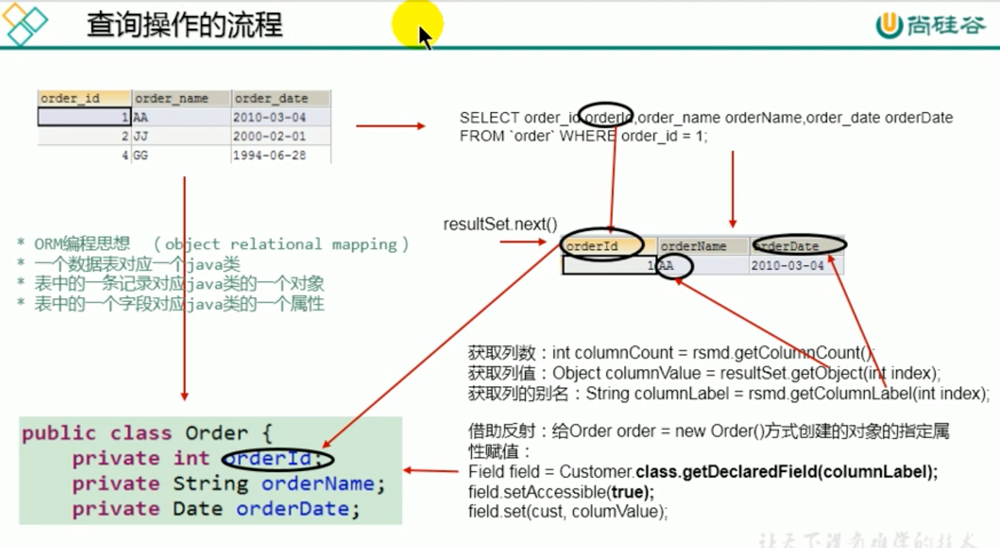

---

> 21 PreparedStatement 针对不同表的通用查询操作 1

- 针对与不同的表的通用的查询操作，返回表中的一条记录

```java
public class PreparedStatementQueryTest {
    public <T> T getInstance(Class<T> clazz, String sql, Object... args) {
        Connection conn = null;
        PreparedStatement ps = null;
        ResultSet rs = null;
        try {
            conn = JDBCUtils.getConnection();

            ps = conn.prepareStatement(sql);
            for (int i = 0; i < args.length; i++) {
                ps.setObject(i + 1, args[i]);
            }

            rs = ps.executeQuery();
            // 获取结果集的元数据
            ResultSetMetaData rsmd = rs.getMetaData();
            // 获取列数
            int columnCount = rsmd.getColumnCount();
            if (rs.next()) {
                T t = clazz.newInstance();
                for (int i = 0; i < columnCount; i++) {
                    Object columnValue = rs.getObject(i + 1);
                    String columnLabel = rsmd.getColumnLabel(i + 1);

                    Field field = clazz.getDeclaredField(columnLabel);
                    field.setAccessible(true);
                    field.set(t, columnValue);
                }
                return t;
            }
        } catch (Exception e) {
            e.printStackTrace();
        } finally {
            JDBCUtils.closeResources(conn, ps, rs);
        }
        return null;
    }

    @Test
    public void testGetInstance() {
        String sql = "select name, id, email from customers where id = ?";
        Customer customer = getInstance(Customer.class, sql, 12);
        System.out.println(customer);

        String sql1 = "select order_id orderId, order_name orderName from `order` where order_id = ?";
        Order order = getInstance(Order.class, sql1, 1);
        System.out.println(order);
    }
}
```

---

> 22 PreparedStatement 针对不同表的通用查询操作 2

- 针对与不同的表的通用的查询操作，返回表中的多条记录

```java
 public <T> List<T> getForList(Class<T> clazz, String sql, Object... args) {
     Connection conn = null;
     PreparedStatement ps = null;
     ResultSet rs = null;
     try {
         conn = JDBCUtils.getConnection();

         ps = conn.prepareStatement(sql);
         for (int i = 0; i < args.length; i++) {
             ps.setObject(i + 1, args[i]);
         }

         rs = ps.executeQuery();
         // 获取结果集的元数据
         ResultSetMetaData rsmd = rs.getMetaData();
         // 获取列数
         int columnCount = rsmd.getColumnCount();
         // 创建集合对象
         List<T> list = new ArrayList<>();

         while (rs.next()) {
             T t = clazz.newInstance();
             // 处理结果集一行数据中的每一个列: 给t对象指定的属性赋值
             for (int i = 0; i < columnCount; i++) {
                 Object columnValue = rs.getObject(i + 1);
                 String columnLabel = rsmd.getColumnLabel(i + 1);

                 Field field = clazz.getDeclaredField(columnLabel);
                 field.setAccessible(true);
                 field.set(t, columnValue);
             }
             list.add(t);
         }
         return list;
     } catch (Exception e) {
         e.printStackTrace();
     } finally {
         JDBCUtils.closeResources(conn, ps, rs);
     }
     return null;
 }

 @Test
 public void testGetForList() {
     String sql = "select name, id, email from customers where id < ?";
     List<Customer> list = getForList(Customer.class, sql, 12);
     list.forEach(System.out::println);

     String sql1 = "select order_id orderId, order_name orderName from `order`";
     List<Order> orderList = getForList(Order.class, sql1);
     orderList.forEach(System.out::println);
 }
```

---

> 23 PreparedStatement 解决 SQL 注入问题

- 通过实验演示了使用了 PreparedStatement 后，`SQL注入`的问题被解决了。
- 原理在于 PreparedStatement 是预编译的，查询语句中的逻辑在编译时已经确定，不会在运行时因为用户输入的值而有所改变。

- 除了解决 Statement 的拼串，SQL 注入的问题之外，PreparedStatement 还有哪些好处?
  1. PreparedStatement 可以操作`Blob`的数据，而 Statement 做不到。
  2. PreparedStatement 可以实现更高效的批量操作。

---

> 24 JDBC 核心技术 小结

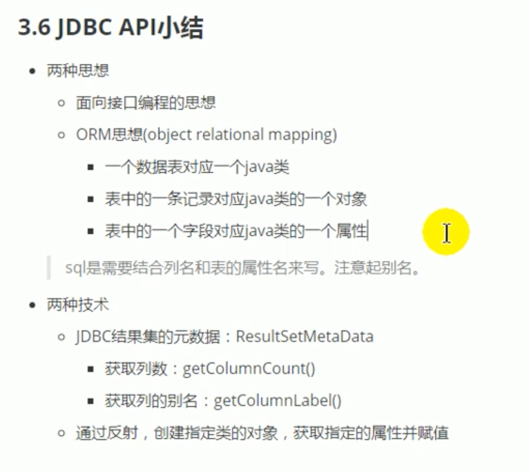

---

> 25 课后练习 1

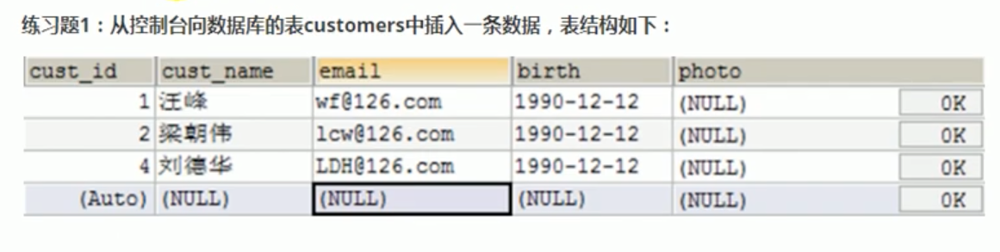

```java
public class Exer1Test {
    // 通用的增删改操作
    public int update(String sql, Object... args) {
        Connection conn = null;
        PreparedStatement ps = null;
        try {
            // 1. 获取数据库的连接
            conn = JDBCUtils.getConnection();
            // 2. 预编译SQL语句，返回PreparedStatement的实例
            ps = conn.prepareStatement(sql);
            // 3. 填充占位符
            for (int i = 0; i < args.length; i++) {
                ps.setObject(i + 1, args[i]);
            }
            // 4. 执行
            /*
            ps.execute():
            如果执行的是查询操作，有返回结果，则此方法返回true。
            如果执行的是增、删、改操作，没有返回结果，则此方法返回false。
             */
            // 方式一:
            // return ps.execute();
            // 方式二: executeUpdate()方法返回的是该增删改语句影响的行数
            return ps.executeUpdate();
        } catch (Exception e) {
            e.printStackTrace();
        } finally {
            JDBCUtils.closeResources(conn, ps);
        }
        return 0;
    }

    @Test
    public void insertTest() {
        Scanner scanner = new Scanner(System.in);
        System.out.print("请输入用户名: ");
        String name = scanner.next();
        System.out.print("请输入邮箱: ");
        String email = scanner.next();
        System.out.print("请输入生日: ");
        String birthday = scanner.next(); // '1992-09-08' 只要输入的是正常的日期格式，数据库内部会有自动的隐式转换

        String sql = "insert into customers (name, email, birth) values (?, ?, ?)";
        int insertCount = update(sql, name, email, birthday);

        if (insertCount > 0) {
            System.out.println("添加成功");
        } else {
            System.out.println("添加失败");
        }
    }
}
```

---

> 26 课后练习 2-1: 添加四六级成绩

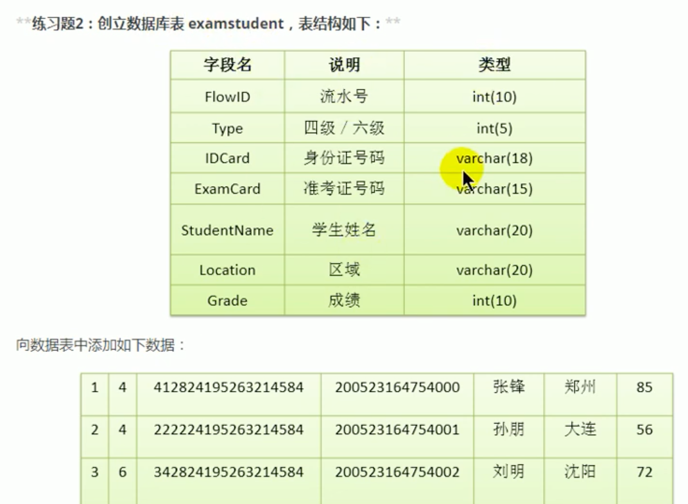


```java
public class Exer2Test {

    public int update(String sql, Object... args) {
        Connection conn = null;
        PreparedStatement ps = null;
        try {
            conn = JDBCUtils.getConnection();
            ps = conn.prepareStatement(sql);
            for (int i = 0; i < args.length; i++) {
                ps.setObject(i + 1, args[i]);
            }
            return ps.executeUpdate();
        } catch (Exception e) {
            e.printStackTrace();
        } finally {
            JDBCUtils.closeResources(conn, ps);
        }
        return 0;
    }

    // 问题1，向examstudent表中添加一条记录
    @Test
    public void testInsert() {
        Scanner scanner = new Scanner(System.in);
        System.out.print("四级/六级: ");
        int type = scanner.nextInt();
        System.out.print("身份证号: ");
        String idCard = scanner.next();
        System.out.print("准考证号: ");
        String examCard = scanner.next();
        System.out.print("学生姓名: ");
        String studentName = scanner.next();
        System.out.print("所在城市: ");
        String location = scanner.next();
        System.out.print("考试成绩: ");
        int grade = scanner.nextInt();

        String sql = "insert into examstudent (type, idcard, examcard, studentname, location, grade) values (?, ?, ?, ?, ?, ?)";
        int insertCount = update(sql, type, idCard, examCard, studentName, location, grade);
        if (insertCount > 0) {
            System.out.println("添加成功");
        } else {
            System.out.println("添加失败");
        }
    }
}
```

---

> 27 课后练习 2-2: 查询考试结果

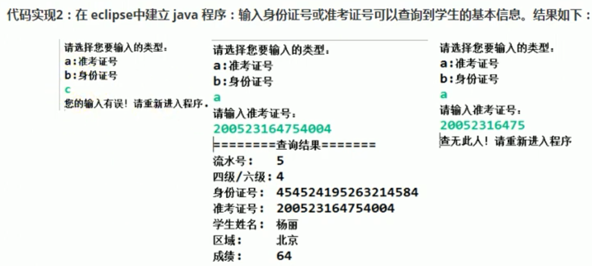

`src/main/java/com/atguigu4/exer/Student.java`

```java
@Override
public String toString() {
    System.out.println("==========查询结果==========");
    return info();
}

private String info() {
    return "流水号: " + flowId + "\n四级/六级: " + type + "\n身份证号: " + idCard + "\n准考证号: " + examCard
            + "\n学生姓名: " + name + "\n区域: " + location + "\n成绩: " + grade;
}
```

`src/main/java/com/atguigu4/exer/Exer2Test.java`

```java
public <T> T getInstance(Class<T> clazz, String sql, Object... args) {
    Connection conn = null;
    PreparedStatement ps = null;
    ResultSet rs = null;
    try {
        conn = JDBCUtils.getConnection();
        ps = conn.prepareStatement(sql);
        for (int i = 0; i < args.length; i++) {
            ps.setObject(i + 1, args[i]);
        }
        rs = ps.executeQuery();

        if (rs.next()) {
            ResultSetMetaData rsmd = rs.getMetaData();
            int columnCount = rsmd.getColumnCount();

            T t = clazz.newInstance();

            for (int i = 0; i < columnCount; i++) {
                Object columnValue = rs.getObject(i + 1);
                String columnLabel = rsmd.getColumnLabel(i + 1);

                Field field = clazz.getDeclaredField(columnLabel);
                field.setAccessible(true);
                field.set(t, columnValue);
            }
            return t;
        }
    } catch (Exception e) {
        e.printStackTrace();
    } finally {
        JDBCUtils.closeResources(conn, ps, rs);
    }
    return null;
}

// 问题2: 根据身份证号或者准考证号查询学生成绩信息
@Test
public void testQueryWithIdCardOrExamCard() {
    System.out.println("请选择您要输入的类型:");
    System.out.println("a: 准考证号");
    System.out.println("b: 身份证号");
    Scanner scanner = new Scanner(System.in);
    String selection = scanner.next();
    if ("a".equalsIgnoreCase(selection)) {
        System.out.println("请输入准考证号: ");
        String examCard = scanner.next();

        String sql = "select FlowID flowId, Type type, IDCard idCard, ExamCard examCard, StudentName name, Location location, Grade grade from examstudent where ExamCard = ?";
        Student student = getInstance(Student.class, sql, examCard);
        if (student != null) {
            System.out.println(student);
        } else {
            System.out.println("输入的准考证号有误!");
        }
    } else if ("b".equalsIgnoreCase(selection)) {
        System.out.println("请输入身份证号: ");
        String idCard = scanner.next();

        String sql = "select FlowID flowId, Type type, IDCard idCard, ExamCard examCard, StudentName name, Location location, Grade grade from examstudent where IDCard = ?";
        Student student = getInstance(Student.class, sql, idCard);
        if (student != null) {
            System.out.println(student);
        } else {
            System.out.println("输入的身份证号有误!");
        }
    } else {
        System.out.println("您的输入有误! 请重新进入程序。");
    }
}
```

---

> 28 课后练习 2-3: 删除考试数据


```java
// 问题3: 删除指定的学生信息
@Test
public void testDeleteByExamCard() {
    System.out.println("请输入学生的考号:");
    Scanner scanner = new Scanner(System.in);
    String examCard = scanner.next();
    // 查询指定准考证号的学生
    String sql = "select FlowID flowId, Type type, IDCard idCard, ExamCard examCard, StudentName name, Location location, Grade grade from examstudent where ExamCard = ?";
    Student student = getInstance(Student.class, sql, examCard);

    if (student == null) {
        System.out.println("查无此人，请重新输入");
    } else {
        String sql1 = "delete from examstudent where ExamCard = ?";
        int deleteCount = update(sql1, examCard);
        if (deleteCount > 0) {
            System.out.println("删除成功");
        }
    }
}

// 对上面方式的优化，没有必要与数据库交互两次
@Test
public void testDeleteByExamCard1() {
    System.out.println("请输入学生的考号:");
    Scanner scanner = new Scanner(System.in);
    String examCard = scanner.next();
    String sql = "delete from examstudent where ExamCard = ?";
    int deleteCount = update(sql, examCard);
    if (deleteCount > 0) {
        System.out.println("删除成功");
    } else {
        System.out.println("查无此人，请重新输入");
    }
}
```

---

> 29 向数据表中插入 Blob 类型数据

```java
public class BlobTest {
    // 向customers数据表中插入Blob类型的字段
    @Test
    public void testInsert() throws Exception {
        Connection conn = JDBCUtils.getConnection();
        String sql = "insert into customers (name, email, birth, photo) values (?, ?, ?, ?)";
        PreparedStatement ps = conn.prepareStatement(sql);
        ps.setObject(1, "朴英三");
        ps.setObject(2, "cys@qq.com");
        ps.setObject(3, "1992-09-02");
        FileInputStream is = new FileInputStream("src/main/resources/images/bird.png");
        ps.setBlob(4, is);

        ps.execute();

        JDBCUtils.closeResources(conn, ps);
    }
}
```

---

> 30 从数据表中读取 Blob 类型数据

```java
// 查询数据表customers中Blob类型的字段
@Test
public void testQuery() {
    Connection conn = null;
    PreparedStatement ps = null;
    ResultSet rs = null;
    InputStream is = null;
    FileOutputStream fos = null;
    try {
        conn = JDBCUtils.getConnection();
        String sql = "select id, name, email, birth, photo from customers where id = ?";
        ps = conn.prepareStatement(sql);
        ps.setInt(1, 21);

        rs = ps.executeQuery();
        if (rs.next()) {
            Customer customer = new Customer();
            // 方式一:
            // int id = rs.getInt(1);
            // String name = rs.getString(2);
            // String email = rs.getString(3);
            // Date birth = rs.getDate(4);

            // 方式二:
            int id = rs.getInt("id");
            String name = rs.getString("name");
            String email = rs.getString("email");
            Date birth = rs.getDate("birth");

            Customer cust = new Customer(id, name, email, birth);
            System.out.println(cust);

            // 将Blob类型的字段下载下来，以文件的形式保存在本地
            Blob photo = rs.getBlob("photo");
            is = photo.getBinaryStream();
            fos = new FileOutputStream("efficient_linux.png");
            byte[] buffer = new byte[1024];
            int len;
            while ((len = is.read(buffer)) != -1) {
                fos.write(buffer, 0, len);
            }
        }
    } catch (Exception e) {
        e.printStackTrace();
    } finally {
        try {
            if (is != null)
                is.close();
        } catch (IOException e) {
            e.printStackTrace();
        }
        try {
            if (fos != null)
                fos.close();
        } catch (IOException e) {
            e.printStackTrace();
        }
        JDBCUtils.closeResources(conn, ps, rs);
    }
}
```

---

> 31 插入 Blob 字段特殊情况的说明

- 在目前的 MySQL(`8.0.44`)版本中，`max_allowed_packet`的值是`64MB`。
- 在以前的版本，该变量的值是`1MB`，所以可以根据需要来调节这个值的大小。
- 如果插入的图片的大小超过了`max_allowed_packet`的值，则会报`Packet for query is to large`的异常。

- 配置该变量的值

```cnf
vim ~/Desktop/Playground/mysql_conf/my.cnf -> (/etc/mysql/conf.d/my.cnf)

[mysqld]
max_allowed_packet=10M
```

- 查看该变量的值

```sql
show variables like 'max_allowed_packet';
```

---

> 32 批量插入数据的操作 1

- 使用 PreparedStatement 可以实现批量插入数据的操作
- update 和 delete 本身就有批量操作的效果。
- 此时的批量操作主要指的就是批量插入。
- 使用 PreparedStatement 如何实现更高效的批量插入?

- 题目: 向 goods 表中插入 20000 条数据。

```sql
CREATE TABLE goods
(
    id   INT PRIMARY KEY AUTO_INCREMENT,
    name VARCHAR(25)
);
```

- 方式一: 会很慢，而且不安全，不建议使用。

```txt
方式一: 使用Statement。
Connection conn = JDBCUtils.getConnection();
Statement st = conn.createStatement();
for(int i = 1; i <= 20000; i++) {
    String sql = "insert into goods (name) values ('name_'" + i + ")";
    st.execute(sql);
}
```

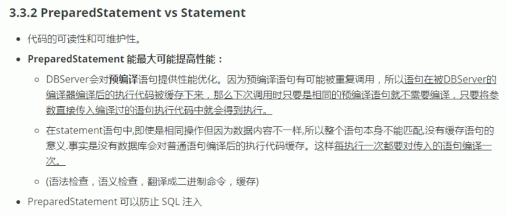

- 方式二: 使用`PreparedStatement`。

```java
public class BatchInsertTest {

    // 批量插入的方式二: 使用PreparedStatement
    @Test
    public void testBatchInsert2() {
        Connection conn = null;
        PreparedStatement ps = null;
        try {
            long start = System.currentTimeMillis();
            conn = JDBCUtils.getConnection();
            String sql = "insert into goods (name) values (?)";
            ps = conn.prepareStatement(sql);
            for (int i = 1; i <= 20000; i++) {
                ps.setObject(1, "name_" + i);

                ps.execute();
            }
            long end = System.currentTimeMillis();
            System.out.println("所需要的时间: " + (end - start)); // 53078
        } catch (Exception e) {
            e.printStackTrace();
        } finally {
            JDBCUtils.closeResources(conn, ps);
        }
    }
}
```

---

> 33 批量插入数据的操作 2

- 方式三: 使用`批处理(Batch)`。
  1. `addBatch()`, `executeBatch()`, `clearBatch()`
  2. MySQL 服务器是默认关闭批处理的， 需要在连接 URL 后面加上`?rewriteBatchedStatements=true`

```properties
user=root
password=123456
url=jdbc:mysql://localhost:3310/jdbc_learn?rewriteBatchedStatements=true
driverClass=com.mysql.cj.jdbc.Driver
```

```java
@Test
public void testBatchInsert3() {
    Connection conn = null;
    PreparedStatement ps = null;
    try {
        conn = JDBCUtils.getConnection();
        long start = System.currentTimeMillis();
        String sql = "insert into goods (name) values (?)";
        ps = conn.prepareStatement(sql);
        for (int i = 1; i <= 1000000; i++) {
            ps.setObject(1, "name_" + i);

            // 1. "攒"SQL
            ps.addBatch();

            if (i % 500 == 0) {
                // 2. 执行Batch
                ps.executeBatch();

                // 3. 清空Batch
                ps.clearBatch();
            }
        }
        long end = System.currentTimeMillis();
        System.out.println("花费的时间为: " + (end - start)); // 20000: 456; 1000000: 13314
    } catch (Exception e) {
        e.printStackTrace();
    } finally {
        JDBCUtils.closeResources(conn, ps);
    }
}
```

- 方式四: 设置不允许`自动提交`数据。

```java
@Test
public void testBatchInsert4() {
    Connection conn = null;
    PreparedStatement ps = null;
    try {
        conn = JDBCUtils.getConnection();
        // 设置不允许自动提交数据
        conn.setAutoCommit(false);
        long start = System.currentTimeMillis();
        String sql = "insert into goods (name) values (?)";
        ps = conn.prepareStatement(sql);
        for (int i = 1; i <= 1000000; i++) {
            ps.setObject(1, "name_" + i);

            // 1. "攒"SQL
            ps.addBatch();

            if (i % 500 == 0) {
                // 2. 执行Batch
                ps.executeBatch();

                // 3. 清空Batch
                ps.clearBatch();
            }
        }

        // 提交数据
        conn.commit();

        long end = System.currentTimeMillis();
        System.out.println("花费的时间为: " + (end - start)); // 1000000: 8016
    } catch (Exception e) {
        e.printStackTrace();
    } finally {
        JDBCUtils.closeResources(conn, ps);
    }
}
```

---

> 34 数据库连接及 PreparedStatement 使用小结

---

> 35 数据库事务的问题引入

```txt
针对于数据表user_table来说:
    AA用户给BB用户转账100

    update user_table set balance = balance - 100 where user = 'AA';
    update user_table set balance = balance + 100 where user = 'BB';
```

```java
// 未考虑数据库事务情况下的转账操
@Test
public void testUpdate() {
    String sql1 = "update user_table set balance = balance - 100 where user = ?";
    update(sql1, "AA");

    // 模拟网络异常
    System.out.println(10 / 0);

    String sql2 = "update user_table set balance = balance + 100 where user = ?";
    update(sql2, "BB");

    System.out.println("转账成功");
}
```

---

> 36 何为事务及数据库事务的处理原则

- 1. 什么叫数据库事务?
- 事务: 一组逻辑操作单元，使数据从一种状态变换到两一种状态。
  - 一组逻辑操作单元: 一个或多个`DML`操作。

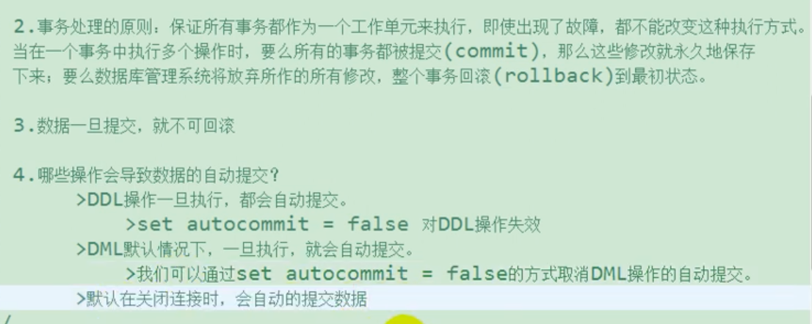

- 所以说，要想解决目前没有考虑事务时产生的问题，要从两个方面来考虑如何解决:
  1. 要将`autocommmit`到值设置为`false`。
  2. 每次完成一个`DML`操作后不能关掉数据库到连接。(目前的`update()`方法都是完成操作后关掉数据库连接的)


---

> 37 考虑事务以后的代码实现
> 38 设置连接恢复为默认状态

```java
// ************* 考虑数据库事务情况下的转账操 *************
// 通用的增删改操作 -- version2.0
public int update(Connection conn, String sql, Object... args) {
    PreparedStatement ps = null;
    try {
        // 1. 预编译SQL语句，返回PreparedStatement的实例
        ps = conn.prepareStatement(sql);
        // 2. 填充占位符
        for (int i = 0; i < args.length; i++) {
            ps.setObject(i + 1, args[i]);
        }
        // 3. 执行
        return ps.executeUpdate();
    } catch (SQLException e) {
        e.printStackTrace();
    } finally {
        // 4. 关闭资源
        JDBCUtils.closeResources(null, ps);
    }
    return 0;
}

@Test
public void testUpdateWithTx() {
    Connection conn = null;
    try {
        conn = JDBCUtils.getConnection();
        // 取消数据的自动提交
        System.out.println("isAutoCommit: " + conn.getAutoCommit());
        conn.setAutoCommit(false);
        String sql1 = "update user_table set balance = balance - 100 where user = ?";
        update(conn, sql1, "AA");

        // 模拟网络异常
        System.out.println(10 / 0);

        String sql2 = "update user_table set balance = balance + 100 where user = ?";
        update(conn, sql2, "BB");

        System.out.println("转账成功");

        // 提交数据
        conn.commit();
    } catch (Exception e) {
        e.printStackTrace();
        // 回滚数据
        try {
            conn.rollback();
        } catch (SQLException ex) {
            ex.printStackTrace();
        }
    } finally {
        // 修改其为自动提交数据
        // 主要针对于使用数据库连接池的使用
        try {
            conn.setAutoCommit(true);
        } catch (SQLException e) {
            e.printStackTrace();
        }
        JDBCUtils.closeResources(conn, null);
    }
}
```

---

> 39 事务的 ACID 属性及 4 种隔离级别

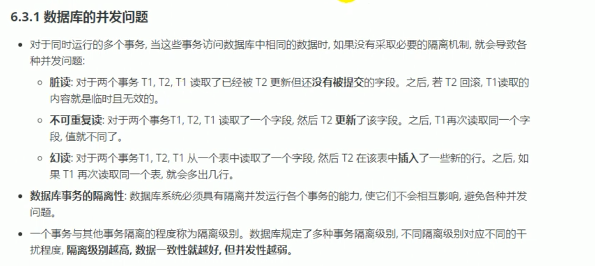

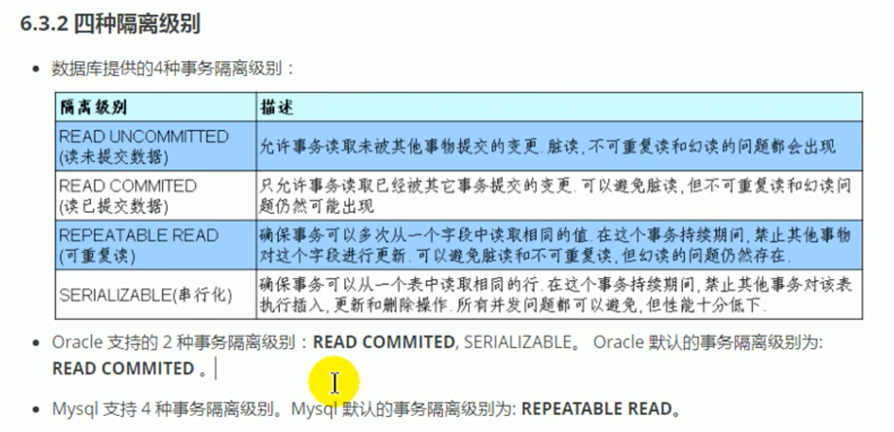

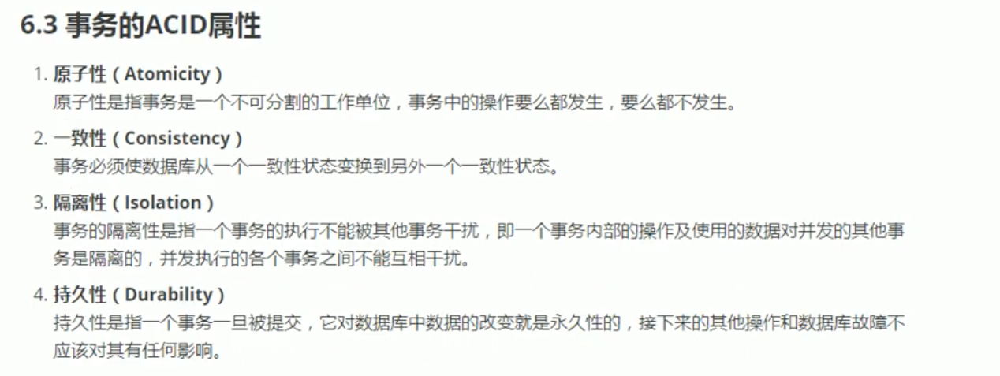

---

> 40 使用命令行验证 MySQL 的隔离级别

- 使用`root`用户创建一个新的用户，用来模拟两个人同时访问数据库时的情况。
- 这里使用 MySQL`8.0`版本的命令，与`5.7`的命令是不同的。
- 使用下面的命令来验证不同`隔离级别`下，读取数据时产生的不同效果。

```bash
-- 创建用户
create user 'jerry'@'localhost' identified by 'abc123';

- 赋予权限
grant select, insert, update, delete on jdbc_learn.* to 'jerry'@'localhost';

- 取消自动提交
set autocommit = false;

- 查看当前的隔离级别
select @@tx_isolation;

- 设置全局的事务隔离级别为`read committed`
set global transaction isolation level read committed;
```

---

> 41 Java 代码演示并设置数据库的隔离级别

`src/main/java/com/atguigu7/transaction/User.java`

```java
public class User {
    private String user;
    private String password;
    private int balance;

    // No args constructor
    // All args constructor
    // Getters and Setters
    // toString()
}
```

```java
// 通用的查询操作，用于返回数据表中的一条记录 (Version 2.0: 考虑事务)
public <T> T getInstance(Connection conn, Class<T> clazz, String sql, Object... args) {
    PreparedStatement ps = null;
    ResultSet rs = null;
    try {
        ps = conn.prepareStatement(sql);
        for (int i = 0; i < args.length; i++) {
            ps.setObject(i + 1, args[i]);
        }

        rs = ps.executeQuery();
        // 获取结果集的元数据
        ResultSetMetaData rsmd = rs.getMetaData();
        // 获取列数
        int columnCount = rsmd.getColumnCount();
        if (rs.next()) {
            T t = clazz.newInstance();
            for (int i = 0; i < columnCount; i++) {
                Object columnValue = rs.getObject(i + 1);
                String columnLabel = rsmd.getColumnLabel(i + 1);

                Field field = clazz.getDeclaredField(columnLabel);
                field.setAccessible(true);
                field.set(t, columnValue);
            }
            return t;
        }
    } catch (Exception e) {
        e.printStackTrace();
    } finally {
        JDBCUtils.closeResources(null, ps, rs);
    }
    return null;
}

@Test
public void testTransactionSelect() throws Exception {
    Connection conn = JDBCUtils.getConnection();
    // 获取当前的隔离级别
    System.out.println("隔离级别: " + conn.getTransactionIsolation());
    // 设置数据库的事务隔离级别
    conn.setTransactionIsolation(Connection.TRANSACTION_READ_COMMITTED);
    // 取消自动提交数据
    conn.setAutoCommit(false);

    String sql = "select user, password, balance from user_table where user = ?";
    User user = getInstance(conn, User.class, sql, "CC");

    System.out.println(user);
}

@Test
public void testTransactionUpdate() throws Exception {
    Connection conn = JDBCUtils.getConnection();
    // 取消自动提交数据
    conn.setAutoCommit(false);

    String sql = "update user_table set balance = ? where user = ?";
    update(conn, sql, 5000, "CC");

    Thread.sleep(15000);
    System.out.println("修改结束");
}
```
