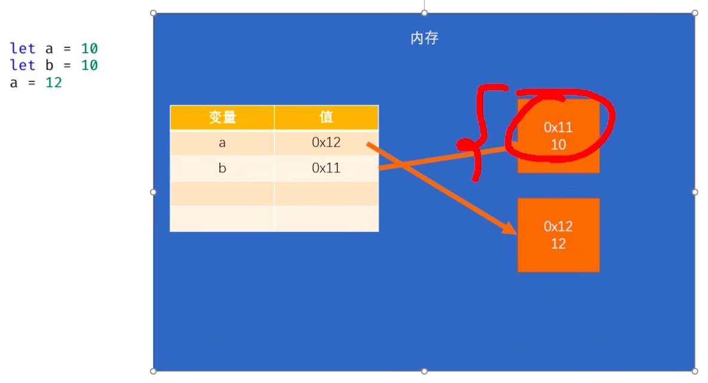
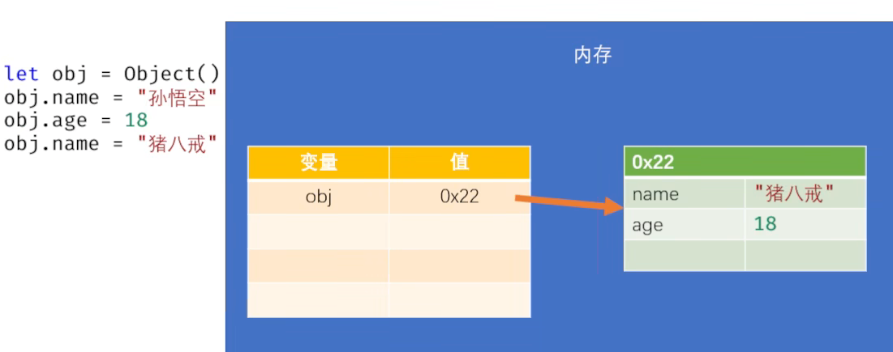
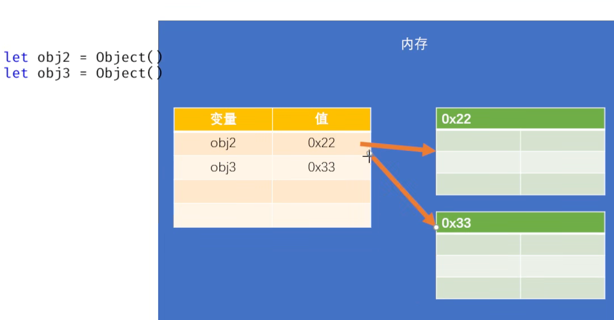

# JavaScript

> 46 对象

```javascript
/*
数据类型:
    原始值
        1. 数值 Number
        2. 大整数 BigInt
        3. 字符串 String
        4. 布尔值 Boolean
        5. 空值 Null
        6. 未定义 Undefined
        7. 符号 Symbol
    对象
        - 对象是JS中的一种复合数据类型
            它相当于一个容器，在对象中可以存储各种不同类型的数据。

    原始值只能用来表示一些简单的数据，但是不能表示复杂的数据。

    比如: 现在需要在程序中表示一个人的信息。
*/

let a = 10;
let b = "hello";

let name = "孙悟空";
let age = 18;
let gender = "男";

// 创建对象
// let obj = new Object();
let obj = Object(); // 可以省略new

/*
对象中可以存储多个各种类型的数据
    对象中存储的数据，我们称为属性
向对象中添加属性
    对象.属性名 = 属性值;
读取象中的属性
    对象.属性名
    - 如果读取的是一个对象中没有的属性
        不会报错而是undefined
*/

obj.name = "孙悟空";
obj.age = 18;
obj.gender = "男";

console.log(obj);

console.log(obj.name);
console.log(obj.age);
console.log(obj.gender);

// 修改属性
obj.name = "Tom sun";
console.log(obj);

// 删除属性
delete obj.name;
console.log(obj);
console.log(obj.name); // undefined
```

> 47 对象的属性

```javascript
let obj = Object();
/*
属性名:
    - 通常属性名就是一个字符串，所以属性名可以是任何值，没有什么特殊要求。
        但是如果属性名太特殊了，就不能直接使用了，需要使用[]来设置。
        虽然如此，还是强烈建议属性名也按照标识符的规范命名。

    - 也可以使用符号(Symbol)作为属性名，来添加属性。
        获取这种属性时，也必须使用Symbol。
        使用Symbol添加的属性，通常是那些不希望被外界访问的属性。

    - 使用[]去操作属性时，可以使用变量。

属性值:
    - 对象的属性值可以是任意的数据类型，也可以是一个对象。

使用typeof检查一个对象时，会返回object。

in 运算符
    - 用来检查对象中是否含有某个属性。
    - 语法: 属性名 in obj。
    - 如果有则返回true，没有则返回false。
*/

obj.name = "孙悟空";
obj.if = "哈哈"; // 不建议使用的属性名
obj.let = "嘻嘻"; // 不建议使用的属性名
//obj.1234123!@#="呵呵";
obj["1234123!@#"] = "呵呵"; // 不建议使用的属性名
console.log(obj); // { name: "孙悟空", if: "哈哈", let: "嘻嘻", "1234123!@#": "呵呵" }
console.log(obj["1234123!@#"]); // 呵呵

let mySymbol = Symbol();
let newSymbol = Symbol();
console.log(mySymbol); // Symbol()
console.log(typeof mySymbol); // symbol
// 使用Symbol作为属性名
obj[mySymbol] = "通过Symbol添加的属性";
console.log(obj); // { name: "孙悟空", if: "哈哈", let: "嘻嘻", "1234123!@#": "呵呵", Symbol(): "通过Symbol添加的属性" }
console.log(obj[mySymbol]); // 通过Symbol添加的属性
console.log(obj[newSymbol]); // undefined

obj.age = 18;
obj["gender"] = "男";

console.log(obj.gender); // 男
console.log(obj["gender"]); // 男

let str = "address";
obj[str] = "花果山"; // 等价于obj["address"] = "花果山";

console.log(obj); // { name: "孙悟空", if: "哈哈", let: "嘻嘻", "1234123!@#": "呵呵", age: 18, gender: "男", address: "花果山", Symbol(): "通过Symbol添加的属性" }
console.log(obj[str]); // 花果山

obj.str = "哈哈"; // 使用.的形式添加属性时，不能使用变量。

console.log(obj); // { name: "孙悟空", if: "哈哈", let: "嘻嘻", "1234123!@#": "呵呵", age: 18, gender: "男", address: "花果山", str: "哈哈", Symbol(): "通过Symbol添加的属性" }

obj.a = 123;
obj.b = "hello";
obj.c = true;
obj.d = 123n;
obj.f = Object();
console.log(obj);
obj.f.name = "猪八戒";
obj.f.age = 28;
console.log(obj);

console.log(typeof obj); // object
console.log("a" in obj); // true
```

> 48 对象字面量

```javascript
let obj = Object();
console.log(obj);
/*
对象字面量:
    - 可以直接使用{}来创建对象。
    - 使用{}所创建对象，可以直接向对象中添加属性。
    - 语法:
        {
            属性名: 属性值,
            [属性名]: 属性值,
        }
*/
let mySymbol = Symbol();

let obj2 = {
  name: "孙悟空", //
  age: 18,
  ["gender"]: "男",
  [mySymbol]: "特殊的属性",
  hello: {
    a: 1,
    b: 2,
  },
};
// obj2.name = "孙悟空";
console.log(obj2); // { name: "孙悟空" }
console.log(typeof obj2); // object
```

> 49 枚举对象中的属性

```javascript
/*
    枚举属性: 指将对象中的所有的属性全部获取。

    for-in语句
        - 语法:
            for(let propName in 对象) {
                语句...
            }

        - for-in的循环体会执行多次，有几个属性就会执行几次。
            每次执行时，都会将一个属性名赋值给我们所定义的变量。

        - 注意: 并不是所有的属性都可以枚举，比如，使用符号添加的属性。
*/
let obj = {
  name: "孙悟空",
  age: 18,
  gender: "男",
  address: "花果山",
  [Symbol()]: "测试的属性", // 符号添加的属性是不能枚举的
};

for (let propName in obj) {
  console.log(propName, obj[propName]);
}
```

> 50 可变类型

```javascript
/*
- 原始值都属于不可变类型，一旦创建就无法修改。
- 在内存中不会创建重复的原始值。
*/
let a = 10;
let b = 10;
a = 12; // 当我们为一个变量重新赋值时，绝对不会影响其他的变量。

console.log("a =", a);
console.log("b =", b);

/*
- 对象属于可变类型。
- 对象创建完成以后，可以任意地添加删除对象中的属性。
- 注意:
    - 当对两个对象进行相等或全等比较时，比较的是对象的内存地址。
    - 如果有两个变量同时指向一个对象，
        通过一个变量修改对象时，对另外一个变量也会产生影响。
*/
// let obj = { name: "孙悟空" };
let obj = Object();
obj.name = "孙悟空";
obj.age = 18;
console.log(obj);

let obj2 = Object();
let obj3 = Object();

console.log(obj2); // {}
console.log(obj3); // {}

console.log(obj2 === obj3); // false

let obj4 = obj;
obj4.name = "猪八戒"; // 当修改一个对象时，所有指向该对象的变量都会受到影响。
console.log("obj", obj);
console.log("obj4", obj4);
console.log(obj === obj4);
```

- 原始类型变量
  

- 对象类型变量
  

- 多个变量指向各自的对象
  

- 多个变量指向一个对象
  
