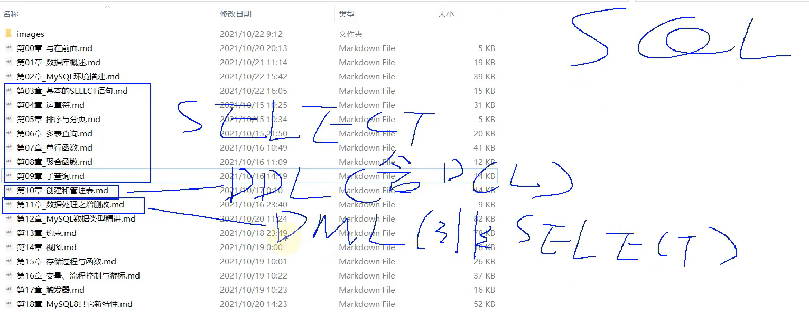

# 第 3 章 基本的`SELECT`语句

> 12 `SQL`概述与`SQL`分类

## 1. SQL 的分类

    DDL: 数据定义语言: CREATE \ ALTER \ DROP \ RENAME \ TRUNCATE
    DML: 数据操作语言: INSERT \ DELETE \ UPDATE \ SELECT (重中之重)
    DCL: 数据控制语言: COMMIT \ ROLLBACK \ SAVEPOINT \ GRANT \ REVOKE

学习技巧: `大处着眼、小处着手。`



> 13 `SQL`使用规范与数据的导入

## 2. SQL语言的规则与规范

### 2.1 基本规则 --- 必须要遵守

- SQL 可以写在一行或者多行。为了提高可读性，各子句分行写，必要时使用缩进。
- 每条命令以`;`或`\g`或`\G`结束。`\g`和`\G`只能在命令行中使用，`\G`的作用是将一般的输出结果行列转换。
- 关键字不能被缩写也不能分行。
- 关于标点符号:
    - 必须保证所有的()、单引号、双引号是成对结束的。
    - 必须使用英文状态下的半角输入方式。
    - 字符串类型和日期时间类型的数据可以使用单引号('')表示。
    - 列的别名，尽量使用双引号("")，而且不建议省略`as`。

### 2.2 SQL大小写规范 --- 建议遵守

- MySQL在`Windows`环境下是大小写不敏感的。
- MySQL在`Linux`环境下是大小写敏感的。
    - `数据库名`、`表名`、`表的别名`、`变量名`是严格区分大小写的。
    - `关键字`、`函数名`、`列名(或字段名)`、`列的别名(字段的别名)`是忽略大小写的。
- 推荐采用统一的书写规范:
    - 数据库名、表名、表别名、字段名、字段别名等都小写。
    - SQL 关键字、函数名、绑定变量等都大写。

### 2.3 注释

- 单行注释: `#注释文字`(MySQL特有的方式)
- 单行注释: `-- 注释文字`(--后面必须包含一个空格)
- 多行注释: `/* 注释文字 */`

### 2.4 导入数据表和数据

方式1: 在命令行中，使用`source 文件的全路径名`命令。

方式2: 基于具体的图形化界面的工具导入数据。

> 14 最基本的`SELECT FROM`结构

## 3. 基本的`SELECT`语句: SELECT 字段1, 字段2... FROM 表名

### 3.0 SELECT ...

```mysql
SELECT 1;
SELECT 1 + 1, 3 * 2;
SELECT 1 + 1, 3 * 2
FROM DUAL; # DUAL: 伪表
```

### 3.1 SELECT ... FROM

```mysql
# *: 表中的所有字段(或列)
SELECT *
FROM employees;

SELECT employee_id, last_name, salary
FROM employees;
```

> 15 列的别名 去重 NULL DESC等操作

### 3.2 列的别名

```mysql
# AS: 全称为Alias(别名),可以省略。
# 列的别名可以使用一对""引起来。不要使用''。
SELECT employee_id emp_id, last_name AS lname, department_id "部门id", salary * 12 AS "annual sal"
FROM employees;
```

### 3.3 去除重复行

```mysql
# 查询员工表中一共有哪些部门ID呢?
# 错误的: 没有去重的情况
SELECT department_id
FROM employees;

# 正确的: 去重的情况
SELECT DISTINCT employee_id
FROM employees;

# 错误的:
# SELECT salary, DISTINCT department_id
# FROM employees;

# 仅仅是没有报错，但是没有实际意义。
SELECT DISTINCT department_id, salary
FROM employees;
```

### 3.4 空值参与运算

- 空值: `NULL`
- `NULL`不等同于`0`，`''`, `'null'`

```mysql
SELECT commission_pct
FROM employees;
```

- 空值参与运算: `结果一定也为空`。

```mysql
SELECT employee_id, salary "月工资", salary * (1 + commission_pct) * 12 "年工资", commission_pct
FROM employees;

# 实际问题的解决方案: 引入IFNULL函数。
SELECT employee_id, salary "月工资", salary * (1 + IFNULL(commission_pct, 0)) * 12 "年工资", commission_pct
FROM employees;
```

### 3.5 着重号 ``

```mysql
SELECT *
FROM `order`;
```

### 3.6 查询常数

```mysql
SELECT '尚硅谷', 123, employee_id, last_name
FROM employees;
```

## 4. 显示表结构

```mysql
DESCRIBE employees; # 显示了表中字段的详细信息

DESC employees;
DESC departments;
```

> 16 使用`WHERE`过滤数据

```mysql
# 练习: 查询90号部门的员工信息。
SELECT *
FROM employees
# 过滤条件，声明在FROM结构的后面。
WHERE department_id = 90;

# 练习: 查询last_name为'King'的员工信息。
SELECT *
FROM employees
WHERE last_name = 'King';
```
> 17 第3章 基本SELECT查询课后练习

## 课后练习

```mysql
# 1.查询员工12个月的工资总和，并起别名为ANNUAL SALARY
# 理解1: 计算12个月的基本工资
SELECT employee_id, last_name, salary * 12 "ANNUAL SALARY"
FROM employees;

# 理解2: 计算12个月的基本工资和奖金
SELECT employee_id, last_name, salary * 12 * (1 + IFNULL(commission_pct, 0)) "ANNUAL SALARY"
FROM employees;

# 2.查询employees表中去除重复的job_id以后的数据
SELECT DISTINCT job_id
FROM employees;

# 3.查询工资大于12000的员工姓名和工资
SELECT last_name, salary
FROM employees
WHERE salary > 12000;

# 4.查询员工号为176的员工的姓名和部门号
SELECT last_name, department_id
FROM employees
WHERE employee_id = 176;

# 5.显示表 departments的结构，并查询其中的全部数据
DESC departments;

SELECT *
FROM departments;
```
