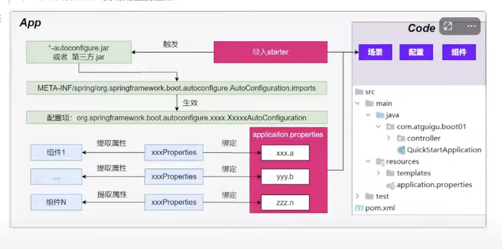
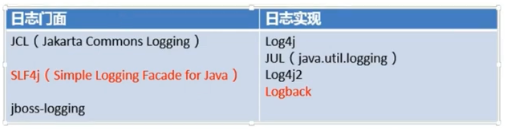

# 006 SpringBoot3 细节分析 依赖管理机制

## 3. 应用分析

### 1. 依赖管理机制

思考:

1. 为什么导入`starter-web`所有相关依赖都会导入进来？

- 开发什么场景，导入什么**场景启动器**。
- Maven 的**依赖传递原则**。A-B-C: A 就拥有 B 和 C。
- 导入场景启动器，就会自动把这个场景的所有核心依赖全部导入进来。

2. 为什么版本号都不用写？

- 每个 boot 项目都有一个父项目`spring-boot-starter-parent`
- parent 的父项目是`spring-boot-dependencies`
- 父项目: 版本仲裁中心，把所有常见的 jar 的依赖版本都声明好了。
  比如: `mysql-connector-j`

3. 自定义版本号

- 利用 Maven 的就近原则
  - 直接在`properties`标签中声明父项目用的版本属性的 key
  - 直接在导入依赖的时候声明版本

4. 第三方的 jar 包

- boot 父项目没有管理的需要自行声明好

```xml
<!-- https://mvnrepository.com/artifact/com.alibaba/druid -->
<dependency>
    <groupId>com.alibaba</groupId>
    <artifactId>druid</artifactId>
    <version>1.2.16</version>
</dependency>
```

# 007 SpringBoot3 细节分析 自动配置机制

### 2. 自动配置机制

#### 1. 初步理解

- 自动配置的 Tomcat、SpringMVC 等

  - 导入场景，容器中就会自动配置好这个场景的核心组件
  - 以前: `DispatcherServlet`、`ViewResolver`、`CharacterEncodingFilter`
  - 现在: 自动配置好的这些组件
  - 验证: **容器中有了什么组件，就具有什么功能**

```java
    public static void main(String[] args) {
        // Java10: 局部变量类型的自动推断
        var ioc = SpringApplication.run(MainApplication.class, args);

        // 1. 获取容器中所有组件的名字
        String[] names = ioc.getBeanDefinitionNames();

        // 2. 挨个遍历: dispatcherServlet、beanNameResolver、characterEncodingFilter、multipartResolver
        // SpringBoot把以前配置的核心组件现在都给我们自动给配置好了
        for (String name : names) {
            System.out.println(name);
        }
    }
```

- 默认的包扫描规则

  - @SpringBootApplication 标注的类就是主程序类
  - **SpringBoot 只会扫描主程序所在的包及其下面的子包，自动的 component-scan 功能**
  - **自定义扫描路径**
    - @SpringBootApplication(scanBasePackages = "com.atguigu")
    - `@ComponentScan("com.atguigu")`直接指定扫描的路径

- 配置默认值
  - 配置文件的所有配置项是和某个**类的对象**值进行一一绑定的。
  - 绑定了配置文件中每一项值的类: **配置属性类**
  - 比如:
    - `ServerProperties`绑定了所有 Tomcat 服务器有关的配置
    - `MultipartProperties`绑定了所有文件上传相关的配置
    - ...参照官方文档: 或者参照绑定的**属性类**
- 按需加载自动配置
  - 导入场景`spring-boot-starter-web`
  - 场景启动器除了会导入相关功能依赖，还会导入一个`spring-boot-starter`，是所有`starter`的`starter`，基础核心 starter
  - `spring-boot-starter`导入了一个包`spring-boot-autoconfigure`。包里面都是各种场景的`AutoConfiguration`**自动配置类**
  - 虽然全场景的自动配置都在`spring-boot-autoconfigure`这个包，但是不是全都开启的。
    - 导入哪个场景就开启哪个自动配置

> 总结: 导入场景启动器、触发`spring-boot-autoconfigure`这个包的自动配置生效、容器中就会具有相关场景的功能。

# 011 SpringBoot3 自动配置 深入理解自动配置原理

#### 2. 完整流程

流程:


1. 导入`starter-web`: 导入了 web 开发场景

- 1、场景启动器导入了相关场景的所有依赖: `starter-json`、`starter-tomcat`、`springmvc`
- 2、每个场景启动器都引入了一个`spring-boot-starter`，核心场景启动器。
- 3、**核心场景启动器**引入了`spring-boot-autoconfigure`包。
- 4、`spring-boot-autoconfigure`里面囊括了所有场景都所有配置。
- 5、只要这个包下的所有类都能生效，那么相当于 SpringBoot 官方写好的整合功能就生效了。
- 6、SpringBoot 默认却扫描不到`spring-boot-autoconfigure`下写好的所有**配置类**。(这些**配置类**给我们做了整合操作)，**默认只扫描主程序所在的包**。

2. **主程序**: `@SpringBootApplication`

- 1、`@SpringBootApplication`有三个注解组成: `@SpringBootConfiguration`、`@EnableAutoConfiguration`、`@ComponentScan`
- 2、SpringBoot 默认只能扫描自己主程序所在的包及其下面的子包，扫描不到`spring-boot-autoconfigure`包中官方写好的**配置类**。
- 3、**`@EnableAutoConfiguration`**: SpringBoot**开启自动配置的核心**。
  - 1、是由`@Import(AutoConfigurationImportSelector.class)`提供功能: 给容器中导入组件
  - 2、SpringBoot 启动会默认加载 142(SpringBoot3.0.5 基准)个配置类
  - 3、这 142 个配置类来自于`spring-boot-autoconfigure`下`META-INF/spring/org.springframework.boot.autoconfigure.AutoConfiguration.imports`文件指定的
  - 项目启动的时候利用@Import 批量导入组件机制把 autoconfigure 包下的 142 个`xxxAutoConfiguration`类导入进来(**自动配置类**)
  - 虽然导入了`142`个自动配置类
- 4、按需生效:
  - 并不是这`142`个自动配置类都能生效。
  - 每一个自动配置类，都有条件注解`@ConditionalOnXxx`，只有条件成立，才能生效。

3. `xxxAutoConfiguration`**自动配置类**

   - 1、给容器中使用`@Bean`放一堆组件
   - 2、每个自动配置类都可能有这个注解`@EnableConfigurationProperties(serverProperties.class)`，用来把配置文件中配的指定前缀的属性值封装到`xxxProperties`**属性类**中
   - 3、以 Tomcat 为例，把服务器的所有配置都是以`server`开头的配置都封装到了属性类中。
   - 4、给**容器**中放的所有**组件**的一些**核心参数**，都来自于`xxxProperties`。`xxxProperties`都是和**配置文件**绑定的。
   - 只需要修改配置文件的值，核心组件的底层参数就都能修改。

4. 写业务: 全程无需关心各种整合(底层这些整合写好了，而且也生效了)

核心流程:

1. 导入`starter`，就会导入`autoconfigure`包。
1. `autoconfigure`包里面有一个文件`META-INF/spring/org.springframework.boot.autoconfigure.AutoConfiguration.imports`，里面指定了所有启动时加载的自动配置类。
1. `@EnableAutoConfiguration`会自动地把上面文件里面写的所有自动配置类都导入进来。**xxxAutoConfiguration**是有条件注解进行按需加载。
1. `xxxAutoConfiguration`给容器中导入一堆组件，组件都是从`xxxProperties`中提取属性值。
1. `xxxProperties`又是和配置文件进行了绑定。

效果： 导入`starter`，修改配置文件，就能修改底层行为。

# 012 SpringBoot3 整合 Redis 为例 理解如何学好 SpringBoot

框架的整合、底层基于 Spring。能调整每一个场景的底层行为。100%的项目一定用到**底层自定义**。
摄影:

- 傻瓜: 自动配置好
- **单反**: 焦距、光圈、快门、感光度...
- 傻瓜+**单反**

1. 理解**自动配置原理**

- a. **导入 starter** -> **生效 xxxAutoConfiguration** -> **组件** -> **xxxProperties** -> **配置文件**

2. 理解**其他框架底层**

- a. 拦截器

3. 可以随时**定制化任何组件**

- a. 配置文件
- b. 自定义组件

普通开发: 导入`starter`，`Controller`、`Service`、`Mapper`、偶尔修改配置文件
高级开发: 自定义组件、自定义配置、自定义 starter

核心:

- 这个场景自动配置导入了哪些组件，我们能不能 Autowired 进来使用
- 能不能通过修改配置改变组件的一些默认参数
- 需不需要自己完全定义这个组件
- <span style="color: red; font-weight: bold">场景定制化</span>

最佳实践:

- 选场景，导入项目
  - 官方: starter
  - 第三方: 去仓库搜
- 写配置，修改配置文件关键项
  - 数据库参数(连接地址，账号密码...)
- 分析这个场景给我们导入了哪些能用的组件
  - 自动装配这些组件进行后续使用
  - 不满意 SpringBoot 提供的自动配好的默认组件
    - 定制化
      - 改配置
      - 自定义组件

整合 redis:

- [选场景](https://docs.spring.io/spring-boot/reference/using/build-systems.html#using.build-systems.starters) `spring-boot-starter-data-redis`
  - 场景的 AutoConfiguration 就是这个场景的自动配置类
- 写配置:
  - 分析到这个场景的自动配置类开启了哪些属性绑定关系
  - `@EnableConfigurationProperties(RedisProperties.class)`
  - 修改 Redis 相关的配置
- 分析组件:
  - 分析到`RedisAutoConfiguration`给容器中放了`StringRedisTemplate`
- 定制化：
  - 修改配置文件
  - 自定义组件，自己给容器中放一个`StringRedisTemplate`

# 008 SpringBoot3 常用注解 组件注册

## 4. 核心技能

### 1. 常用注解

SpringBoot 摒弃了 XML 配置方式，改为全注解驱动。

#### 1. 组件注册

`@Configuration`、`@SpringBootConfiguration`
`@Bean`、`@Scope`
`@Controller`、`@Service`、`@Repository`、`@Component`
`@Import`
`@ComponentScan`

步骤

1. `@Configuration`编写一个配置类
1. 在配置类中，自定义方法给容器中注册组件、配合@Bean
1. 或使用`@Import`导入第三方的组件

#### 2. 条件注解

> 如果注解指定的条件成立，则触发指定行为

<span style="color: red">@ConditionOnXxx</span>
<span style="color: purple; font-weight: bold">@ConditionOnClass: 如果类路径中存在这个类，则触发指定行为</span>
<span style="color: blue; font-weight: bold">@ConditionOnMissingClass: 如果类路径中不存在这个类，则触发指定行为</span>
<span style="color: purple; font-weight: bold">@ConditionOnBean: 如果容器中存在这个 Bean(组件)，则触发指定行为</span>
<span style="color: blue; font-weight: bold">@ConditionOnMissingBean: 如果容器中不存在这个 Bean(组件)，则触发指定行为</span>

> 场景:

- 如果存在`FastsqlException`这个类，给容器中放一个`Cat`组件，名为`cato01`
- 否则，就给容器中放一个`Dog`组件，名为`dog01`
- 如果系统中有`dog01`这个组件，就给容器中放一个`User`组件，名为`zhangsan`
- 否则，就放一个`User`组件，名为`lisi`

#### 3. 属性绑定

`@ConfigurationProperties`: 声明组件的属性和配置文件哪些前缀开始的项进行绑定
`@EnableConfigurationProperties`: 快速注册注解

- 场景: SpringBoot 默认只扫描自己主程序所在的包。如果导入第三方包，即使组件上标注了`@Component`、`@ConfigurationProperties`注解，也没用。因为组件都扫描不进来。

> 将容器中任意**组件(Bean)**的**属性值**和**配置文件**的配置项的值**进行绑定**

1. 给容器中注册组件(`@Component`、`@Bean`)
1. 使用@ConfigurationProperties 声明组件和配置文件的哪些配置项进行绑定

# 013 SpringBoot3 Yaml 配置文件 基本用法

### 1. 基本语法

- **大小写敏感**
- 使用**缩进**表示层级关系，k: v，使用**空格分割**k，v
- 缩进时不允许使用 Tab 键，只允许**使用空格**。换行。
- 缩进的空格个数不重要，只用**相同层级**的元素**左侧对齐**即可。
- **#表示注释**，从这个字符一直到行尾，都会被解析器忽略。

支持的写法:

- 对象: 键值对的集合，如: 映射(map) / 哈希(hash) / 字典(dictionary)
- 数组: 一组按次序排列的值，如: 序列(sequence) / 列表(list)
- 纯量: 单个的、不可再分的值，如: 字符串、数字、bool、日期

```yaml
server:
  port: 9999

spring:
  servlet:
    multipart:
      max-file-size: 10MB
  data:
    redis:
      host: localhost
      port: 6379
  datasource:
    url: aaa
```

# 014 SpringBoot3 复杂对象表示 使用 properties 文件

```java
@Component
@ConfigurationProperties(prefix = "person") // 和配置文件person前缀的所有配置进行绑定
@Data // 自动生成JavaBean属性的getter/setter
@NoArgsConstructor // 自动生成无参构造器
@AllArgsConstructor // 自动生成全参构造器
public class Person {
    private String name;
    private Integer age;
    private Date birthday;
    private Boolean like;
    private Child child; // 嵌套对象
    private List<Dog> dogs; // 数组(里面是对象)
    private Map<String, Cat> cats; // 表示Map
}

@Data
public class Child {
    private String name;
    private Integer age;
    private Date birthday;
    private List<String> text;
}

@Data
public class Dog {
    private String name;
    private Integer age;
}

@Data
public class Dog {
    private String name;
    private Integer age;
}
```

```properties
# properties表示复杂对象
person.name=张三
person.age=18
person.birthday=2010/10/12 12:12:12
person.like=true
person.child.name=李四
person.child.age=12
person.child.birthday=2018/10/12
person.child.text[0]=abc
person.child.text[1]=def
person.dogs[0].name=小黑
person.dogs[0].age=3
person.dogs[1].name=小白
person.dogs[1].age=2
person.cats.c1.name=小蓝
person.cats.c1.age=5
person.cats.c2.name=小灰
person.cats.c2.age=6
```

```
绑定结果:
person: Person(name=张三, age=18, birthday=Tue Oct 12 12:12:12 KST 2010, like=true, child=Child(name=李四, age=12, birthday=Fri Oct 12 00:00:00 KST 2018, text=[abc, def]), dogs=[Dog(name=小黑, age=3), Dog(name=小白, age=2)], cats={c1=Cat(name=小蓝, age=5), c2=Cat(name=小灰, age=6)})
```

# 015 SpringBoot3 复杂对象表示 使用 yaml 文件

```yaml
person:
  name: 张三
  age: 18
  birthday: 2010/10/10 12:12:12
  like: true
  child:
    name: 李四
    age: 20
    birthday: 2018/10/10
    #    text: ["abc", "def"]
    text:
      - abc
      - def
  dogs:
    - name: 小黑
      age: 3
    - name: 小白
      age: 4
  cats:
    c1:
      name: 小蓝
      age: 2
    c2: { name: 小绿, age: 2 } # 对象也可以用{}表示
```

# 016 SpringBoot3 复杂对象表示 yaml 语法细节

### 3. 细节

- `birthDay` 推荐写为 `birth-day`
- **文本**:
  - 单引号不会转义(\n 以普通字符串显示)
  - 双引号会转义(\n 会显示为换行符)
- **大文本**:
  - `|`开头，大文本下写在下层，保留文本格式，换行符正确显示
  - `>`开头，大文本下写在下层，折叠换行符
- **多文档合并**:
  - 使用`---`可以把多个 yaml 文档合并在一个文档中，每个文档区依然认为内容独立

### 4. 小技巧: lombok

简化 JavaBean 开发、自动生成构造器、getter/setter、自动生成 Builder 模式等

```xml
<dependency>
    <groupId>org.projectlombok</groupId>
    <artifactId>lombok</artifactId>
    <version>1.18.30</version>
    <scope>compile</scope>
</dependency>
```

# 017 SpringBoot3 日志 整合原理



## 1. 简介

1. Spring 使用`commons-logging`作为内部日志，但底层日志实现是开放的。可对接其他日志框架。
1. 支持`jul`、`log4j2`、`logback`。SpringBoot 提供了默认的控制台输出配置，也可以配置输出为文件。
1. `logback`是默认使用的。
1. 虽然**日志框架很多**，但是我们不用担心，该用 SpringBoot 的**默认配置**就能很好的工作。

**SpringBoot 是怎么把日志默认配置好的?**

1. 每个`starter`场景，都会导入一个核心场景`spring-boot-starter`。
1. 核心场景引入了日志的所有功能`spring-boot-starter-logging`
1. 默认使用了`logback + slf4j`组合作为默认底层日志
1. **日志是系统一启动就要用的**，`xxxAutoConfiguration`是系统启动好了以后放的组件，后来用的。
1. 日志是利用**监听器机制**配置好的。`ApplicationListener`。
1. 日志所有的配置都是可以通过配置文件实现的。以`logging`开始的所有配置。
