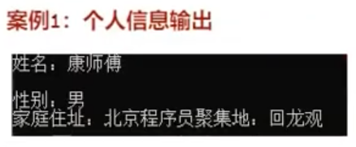
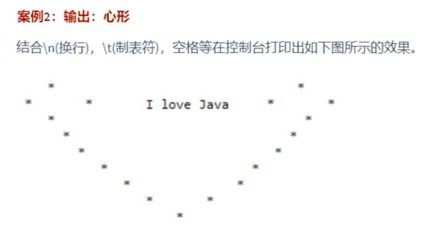
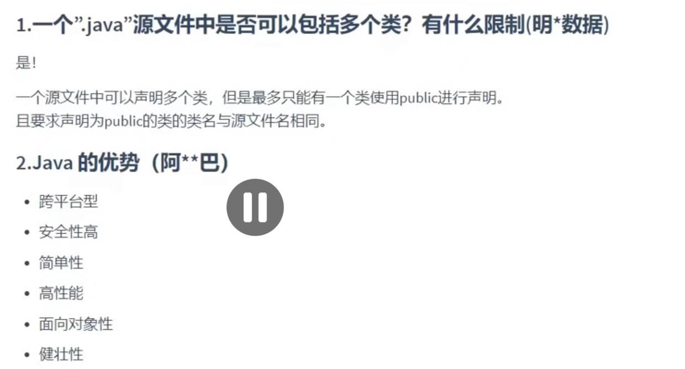
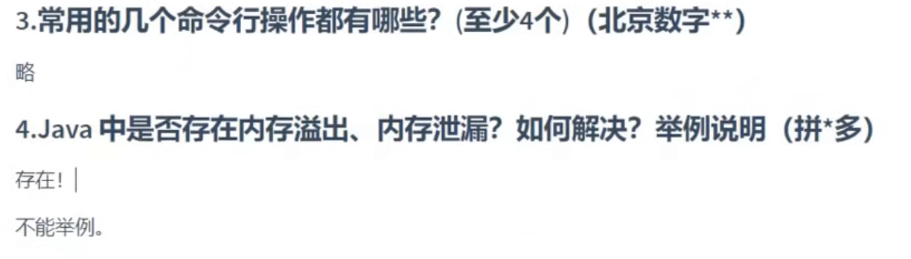
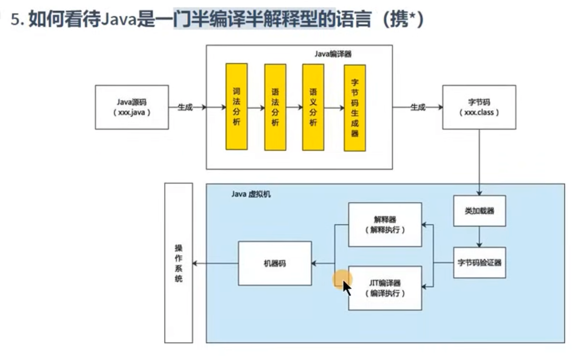

## 14 Java语言概述 第一个`HelloWorld`程序的总结

- 总结:

1. Java程序编写和执行的过程:
   - 步骤1: 编写。将Java代码编写在`.java`结尾的源文件中。
   - 步骤2: 编译。针对于`.java`结尾的源文件进行编译操作。格式: `javac 源文件名.java`。
   - 步骤3: 运行。针对于编译后生成的字节码文件，进行解释运行。格式: `java 字节码文件名`。

2. 针对于`步骤1`的编写进行说明:

```java
class HelloChina {
    public static void main(String[] args) {
        System.out.println("hello,world!!你好，中国！！");
    }
}
```

- 其中,
- 1️⃣: class: 关键字，表示"类"，后面跟着类名。
- 2️⃣: `main()`方法的格式是固定的。务必记住！  
  `public static void main(String[] args)`
  如果非要有些变化的话，只能变化`String[] args`结构。可以写成: 方式1: `String args[]` 方式2: `String[] a`。  
  `args`: 全称是`arguments`，简写成args。
- 3️⃣: Java程序，是严格区分大小写的。
- 4️⃣: 从控制台输出数据的操作:  
  `System.out.println("输出的信息")`: 输出数据之后会换行。  
  `System.out.print("输出的信息")`: 输出数据之后不会换行。
- 5️⃣: 每一行执行语句必须以`;`结束。

3. 针对于`步骤2`的编译进行说明:
   - 1️⃣: 如果编译不通过，可以考虑的问题:
     问题1: 查看编译的文件名、文件路径是否书写错误。  
     问题2: 查看代码中是否存在语法问题。如果存在，就可能导致编译不通过。

   - 2️⃣: 编译以后，会生成1个或多个字节码文件。每一个字节码文件对应一个Java类，并且字节码文件名与类名相同。

4. 针对于`步骤3`的运行进行说明:
   - 1️⃣: 我们是针对于字节码文件对应的Java类进行解释运行的。  
     要注意区分大小写！
   - 2️⃣: 如果运行不通过，可以考虑的问题:
     问题1: 查看解释运行的类名、字节码文件路径是否书写错误。  
     问题2: 可能存在运行时异常。(放到`第9章`具体讲解)

5. 一个源文件中可以声明多个类，但是最多只能有一个类使用`public`进行声明。
   且要求声明为`public`的类的类名与源文件名相同。

## 15 Java语言概述 单行注释和单行注释的使用

## 16 Java语言概述 文档注释的使用与API文档的说明

```java
/*
这是多行注释。

我们可以声明多行注释的信息！

1. Java中的注释的种类
单行注释、多行注释、文档注释(Java特有)

2. 单行注释、多行注释的作用:
1️⃣  对程序中的代码进行解释说明。
2️⃣  对程序进行调试。

3. 注意:
1️⃣ 单行注释和多行注释中说明的信息，不参与编译。
换句话说，编译以后生成的字节码文件不包含单行注释和多行注释中的信息。

2️⃣  多行注释不能嵌套使用。

4. 文档注释:
文档注释的内容可以别JDK提供的工具javadoc所解析，生成一套以网页文件形式体现的该程序的说明文档。

生成文档的命令:
javadoc -d mydir -author -version CommentTest.java
 */
/**
这是我的第一个Java程序。很开森^_^

@author shkstart
@version 1.0

 */
public class CommentTest {
    /**
     这是main()方法。格式是固定的。(文档注释)
     */
    /*
     这是main()方法。格式是固定的。(多行注释)
     */
    public static void main(String[] args) {
        // 这是输出语句
        System.out.println("hello,world!!");
        // System.out.println("hello,world!!");
    }
}

```

## 17 Java语言概述 Java语言的特点和JVM的功能

## 18 Java语言概述 两个案例的代码实现



```java
class personalinfo {
    public static void main(string[] args) {
        system.out.println("姓名: 康师傅");
        system.out.println(); // 换行的操作
        system.out.println("性别: 男");
        system.out.println("家庭地址: 北京程序员聚集地: 回龙观");
    }
}
```



```java
class StarPrintTest {
    public static void main(String[] args) {
        System.out.print("\t" + "*" + "\t\t\t\t\t\t\t\t\t\t\t\t" + "*" + "\t" + "\n");
        System.out.print("*" + "\t\t" + "*" + "\t\t\t\t" + "I love Java" + "\t\t\t\t" + "*" + "\t\t\t" + "*" + "\n");
        System.out.print("\t" + "*" + "\t\t\t\t\t\t\t\t\t\t\t\t" + "*" + "\n");
        System.out.print("\t\t" + "*" + "\t\t\t\t\t\t\t\t\t\t" + "*" + "\n");
        System.out.print("\t\t\t" + "*" + "\t\t\t\t\t\t\t\t" + "*" + "\n");
        System.out.print("\t\t\t\t" + "*" + "\t\t\t\t\t\t" + "*" + "\n");
        System.out.print("\t\t\t\t\t" + "*" + "\t\t\t\t" + "*" + "\n");
        System.out.print("\t\t\t\t\t\t" + "*" + "\t\t" + "*" + "\n");
        System.out.print("\t\t\t\t\t\t\t" + "*" + "\n");
    }
}
```

## 19 Java语言概述 第01章 复习与企业真题

1. Java基础全称第学习内容

- 第1阶段: Java基本语法
  > Java概述、关键字、标识符、变量、运算符、流程控制(条件判断、选择结构、循环结构)、IDEA、数组
- 第2阶段: Java面向对象编程
  > 类及类的内部成员
  > 面向对象的三大特征
  > 其他关键字的使用
- 第3阶段: Java语言的高级应用
  > 异常处理、多线程、IO流、集合框架、反射、网络编程、新特性、其它常用的API等

* 神书: `Java核心技术`、`Effective Java`、 `Java编程思想`

2. 软件开发相关内容
   2.1 计算机的构成
   硬件+软件
   2.2 软件
   软件，即一系列按照`特定顺序组织`的计算机`数据`和`指令`的集合。有`系统软件`和`应用软件`之分。  
    系统软件: 即操作系统，Windows、Mac OS、Linux、Android、IOS。  
    应用软件: 即OS之上的应用程序。
   2.3 人机交互的方式
   图形化界面(GUI)
   命令行交互方式(CLI)
   - 熟悉常用的dos命令: `dir、cd、cd..、cd/、cd\、md、rd`等。
     2.4 计算机编程语言
   * 语言的分代:
     . 第1代: 机器语言
     . 第2代: 汇编语言
     . 第3代: 高级语言
     - 面向过程的语言: C
     - 面向对象的语言: C++、Java、C#、Python、Go、JavaScript
   - 没有"最好"的语言，只有在特定场景下相对来说，最合适的语言而已。

3. Java概述
   3.1 Java发展史
   几个重要的版本: 1996年，发布JDK1.0;里程碑式的版本: JDK5.0、JDK8.0(2014年发布)
   JDK11 (LTS)、JDK17(LTS) Long Term Support
   3.2 Java之父
   詹姆斯 高斯林
   3.3 Java具体的平台划分
   J2SE --> JavaSE
   J2EE --> JavaEE
   J2ME --> JavaME

- Java目前主要的应用场景: JavaEE后台开发、Android客户端的开发、大数据的开发

4. Java环境的搭建

- JDK、JRE、JVM三者之间的关系
- JDK的下载(官网)
- JDK的安装
  - 安装JDK8和JDK17
- 环境变量的配置(重要)

5. HelloWorld的编写和常见问题的解决(重要)

- 第1个程序

```java
class HelloChina {
    public static void main(String a[]) {
        System.out.println("hello,world!!你好，中国！！");
        System.out.print("123abc");
        System.out.println(123 + 1);
    }
}
```

- 测试程序

```java
public class HelloJava {
    public static void main(String[] args) {
        System.out.println("hello");
        System.out.println(10 / 0);
    }
}

class HelloShangHai {

}

class HelloBeijing {

}

class Hellojava {
    public static void main(String[] args) {
        System.out.println("2222");
    }
}
```

- 总结 (参考14讲)

6. 注释的使用(参考15讲)
7. API文档
8. 练习1(参考18讲)
9. 练习2(参考18讲)

- 企业真题
  
  
  
