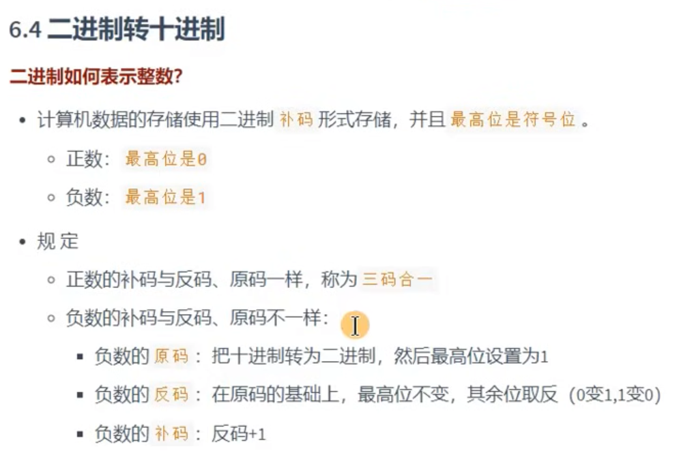
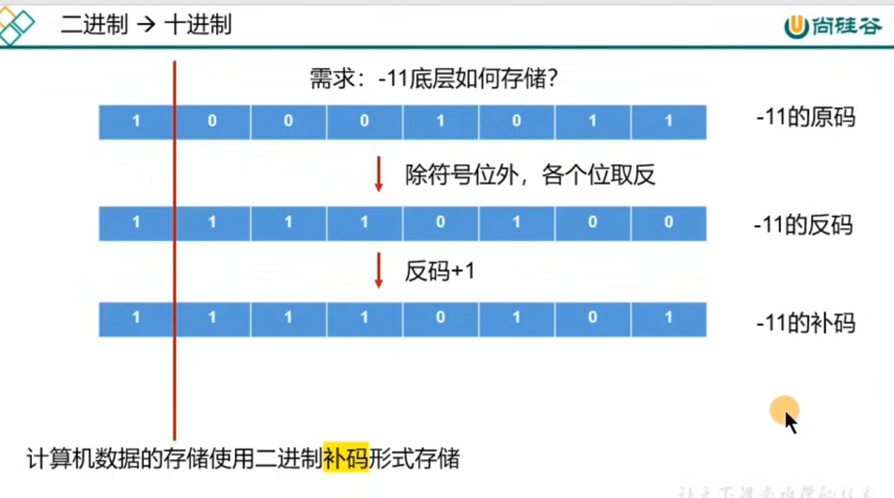
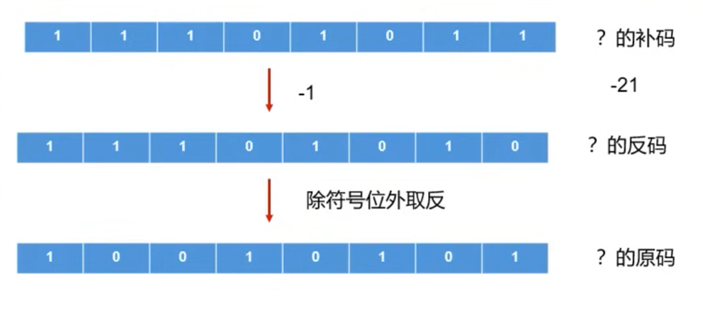
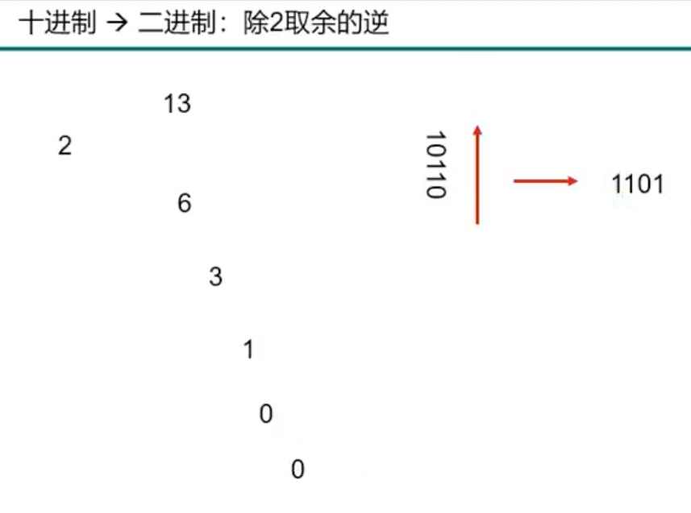
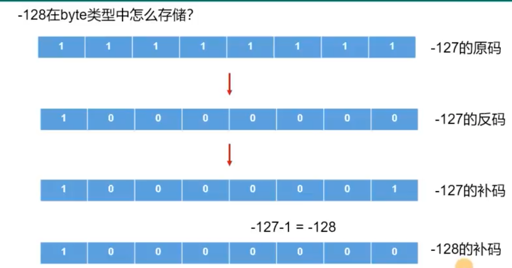

# 第02章 变量与运算符

## 21 变量与运算符 关键字的使用

## 22 变量与运算符 标识符的使用

1. 什么是标识符? Java中变量、方法、类等要素命名时使用的字符序列，称为标识符。

- 技巧: 凡是自己可以起名字的地方都叫标识符。比如: 类名、方法名、变量名、包名、常量名等。

2.  标识符的命名规则 (必须要遵守！！否则，编译不通过)

    > 由26个英文字母大小写，0-9，\_或$组成。
    > 数字不可以开头。
    > 不可以使用关键字和保留字，但能包含关键字和保留字。
    > Java中严格区分大小写，长度无限制。
    > 标识符不能包含空格。

3.  标识符的命名规范 (建议遵守。如果不遵守，编译和运行都能正常执行。只是容易被人鄙视)

    > 包名: 多单词组成时所有字母都小写： xxxyyyzzz。
    - 例如: java.lang, com.atguigu.bean

    > 类名、接口名: 多单词组成时，所有单词的首字母大写: XxxYyyZzz
    - 例如：HelloWorld,String,System等

    > 变量名，方法名: 多单词组成时，第一个单词首字母小写，第二个单词开始每个单词首字母大写: xxxYyyZzz
    - 例如: age,name,bookName,main,binarySearch,getName

    > 常量名: 所有字母都大写。多单词时每个单词用下划线连接: XXX_YYY_ZZZ
    - 例如: MAX_VALUE,PI,DEFAULT_CAPACITY

说明: 大家在定义标识符时，要注意"见名知意"。

```java
class IdentifierTest {
    public static void main(String[] args) {
        int abc = 12;
        int age = 12; // age: 标识符

        char gender = '男';
        char c1 = '女';

        // 不推荐的写法
        int myage = 12;

        System.out.println(myage);
    }

    public static void main1(String[] args) {

    }
}

class _a$bc {
}

/*
class 1abc {
}
*/

class Public {
}

class publicstatic {
}

class BiaoShiFuTest {
}
```

## 23 变量与运算符 变量的基本使用

- 测试变量的基本使用
  1.  变量的理解: 内存中的一个存储区域，该区域的数据可以在同一个类型范围内不断变化。
  2.  变量的构成包含三个要素: 数据类型，变量名，存储的值。
  3.  Java中变量声明的格式: 数据类型 变量名 = 变量值。
  4.  Java中的变量按照数据类型来分类:
      - 基本数据类型(8种):
        整型: byte \ short \ int \ long  
        浮点型: float \ double  
        字符型: char  
        布尔型: boolean

      - 引用数据类型:
        类(class)  
        数组(array)  
        接口(interface)  
        枚举(enum)  
        注解(annotation)  
        记录(record)

  5.  定义变量时，变量名要遵循标识符命名的规则和规范。

  6.  说明:  
      1️⃣ 变量都有其作用域。变量只在作用域内是有效的，出了作用域就失效了。  
      2️⃣ 在同一个作用域内，不能声明两个同名的变量。  
      3️⃣ 定义好变量以后，就可以通过变量名的方式对变量进行调用和运算。  
      4️⃣ 变量值在赋值时，必须满足变量的数据类型，并且在数据类型有效的范围内变化。

```java
class VariableTest {
    public static void main(String[] args) {

        // 定义变量的方式1
        char gender; // 过程1: 变量的声明
        gender = '男'; // 过程2: 变量的赋值(或初始化)
        gender = '女';

        // 定义变量的方式2: 声明与初始化合并
        int age = 10;

        System.out.println(age);
        System.out.println("age = " + age);

        System.out.println("gender = " + gender);

        // 在同一个作用域内，不能声明两个同名的变量
        // char gender = '女';
        gender = '女';

        // 由于number前没有声明类型，即当前number变量没有提前定义。所以编译不通过。
        // number = 10;

        byte b1 = 127;
        // b1超过了byte的范围，编译不通过。
        // b1 = 128;
    }

    public static void main123(String[] args) {
        // System.out.println("gender = " + gender);

        char gender = '女';
    }
}
```

## 24 变量与运算符 整型数据类型的使用

## 25 变量与运算符 浮点类型的使用及练习

```java
/*
测试整型和浮点型变量的使用
*/
class VariableTest1 {
    public static void main(String[] args) {

        // 1. 测试整型变量的使用
        // byte(1字节=8bit) / short(2字节) / int(4字节) /long(8字节)
        byte b1 = 12;
        byte b2 = 127;
        // 编译不通过，因为超出了byte的存储范围。
        // byte b3 = 128;

        short s1 = 1234;

        int i1 = 123234123;

        // 1️⃣  声明long类型变量时，需要提供后缀。后缀为'l'或'L'。
        long l1 = 123234123L;

        // 2️⃣  开发中，大家定义整型变量时，没有特殊情况的话，通常都声明为int类型。

        // 2. 测试浮点类型变量的使用
        // float / double
        double d1 = 12.3;
        // 1️⃣  声明float类型变量时，需要提供后缀。后缀为'f'或'F'。
        float f1 = 12.3F;
        System.out.println("f1 = " + f1);

        // 2️⃣  开发中，大家定义浮点型变量时，没有特殊情况的话，通常都声明为double类型，因为精度更高。

        // 3️⃣  float类型表数范围要大于long类型的表数范围，但是精度不高。

        // 测试浮点型变量的精度
        // 结论: 通过测试发现浮点型变量的精度不高。如果在开发中，需要极高的精度，需要使用BigDecimal类替换浮点型变量。
        // 测试1
        System.out.println(0.1 + 0.2); // 0.30000000000000004
                                       //
        // 测试2
        float ff1 = 123123123f;
        float ff2 = ff1 + 1;
        System.out.println(ff1);
        System.out.println(ff2);
        System.out.println(ff1 == ff2);

    }
}
/*
结果:
f1 = 12.3
0.30000000000000004
1.2312312E8
1.2312312E8
true
*/
```

```java
/*
案例1: 定义圆周率并赋值为3.14，现有3个圆的半径分别为1.2、2.5、6，求它们的面积。
*/
class FloatDoubleExer {
    public static void main(String[] args) {

        // 定义圆周率变量
        double pi = 3.14;

        // 定义3个圆的半径
        double radius1 = 1.2;
        double radius2 = 2.5;
        int radius3 = 6;

        // 计算面积
        double area1 = pi * radius1 * radius1;
        double area2 = pi * radius2 * radius2;
        double area3 = pi * radius3 * radius3;

        System.out.println("圆1的半径为: " + radius1 + "，面积为: " + area1);
        System.out.println("圆2的半径为: " + radius2 + "，面积为: " + area2);
        System.out.println("圆3的半径为: " + radius3 + "，面积为: " + area3);
    }
}
/*
结果:
圆1的半径为: 1.2，面积为: 4.521599999999999
圆2的半径为: 2.5，面积为: 19.625
圆3的半径为: 6，面积为: 113.03999999999999
*/
```

```java
/*
案例2: 小明要到美国旅游，可是那里的温度是以华氏度为单位记录的。
它需要一个程序将华氏温度(80度)转换为摄氏度，并以华氏度和摄氏度为单位分别显示该温度。

'C = ('F - 32) / 1.8
*/

class FloatDoubleExer1 {
    public static void main(String[] args) {

        double hua = 80.0;

        double she = (hua - 32) / 1.8;

        System.out.println("华氏度" + hua + "'F 对应的摄氏度为" + she + "'C");
    }
}
/*
结果:
华氏度80.0'F 对应的摄氏度为26.666666666666664'C
*/
```

## 26 变量与运算符 字符类型的使用

## 27 变量与运算符 布尔类型的使用

```java
/*
测试字符类型和布尔类型的使用
*/
class VariableTest2 {
    public static void main(String[] args) {

        // 1. 字符类型: char(2字节)

        // 表示形式1: 使用一对''表示，内部有且只有一个字符。
        char c1 = 'a';
        char c2 = '中';
        char c3 = '1';
        char c4 = '%';
        char c5 = '👏';

        // 编译不通过
        // char c6 = '';

        // char c7 = 'ab';

        // 表示形式2: 直接使用Unicode值来表示字符型常量。
        char c8 = '\u0036';
        System.out.println(c8); // 6

        // 表示形式3: 使用转义字符。
        char c9 = '\n';
        char c10 = '\t';
        System.out.println("hello" + c9 + "world"); // hello
                                                    // world
        System.out.println("hello" + c10 + "world"); // hello	world

        // 表示形式4: 使用具体字符对应的数值(比如ASCII码)。
        char c11 = 97;
        System.out.println(c11);

        char c12 = '1'; // 49
        char c13 = 1;
        System.out.println(c12 == c13); // false

        // 2. 布尔类型: boolean
        // 1️⃣  只有两个取值: true、false。
        boolean bo1 = true;
        boolean bo2 = false;

        // 编译不通过
        // boolean bo3 = 0;

        // 2️⃣  常使用在流程控制语句中。比如: 条件判断、选择结构、循环结构等。
        boolean isMarried = true;
        if(isMarried) {
            System.out.println("很遗憾，不能参加单身派对了");
        } else {
            System.out.println("可以多谈几个女朋友或男朋友");
        }

        // 3️⃣  了解: 我们不谈boolean类型占用的空间大小。但是，真正在内存中分配的话，使用的是4个字节。
    }
}
```

## 28 变量与运算符 基本数据类型变量间的自动类型提升规则

```java
/*
测试基本数据类型变量间的运算规则。

1. 这里提到可以做运算的基本数据类型有7种，不包含boolean类型。
2. 运算规则包括:
    1️⃣  自动类型提升
    2️⃣  强制类型转换
3. 此VariableTest3.java用来测试自动类型提升。

规则: 当容量小的变量与容量大的变量做运算时，结果自动转换为容量大的数据类型。

    byte 、short、char --> int --> long --> float --> double

    特别的: byte、short类型的变量之间做运算，结果为int类型。

说明: 此时的容量小或大，并非指占用的内存空间的大小，而是值表示数据的范围的大小。
    long(8字节)、float(4字节)
 */
class VariableTest3 {
    public static void main(String[] args) {

        int i1 = 10;
        int i2 = i1;

        long l1 = i1;

        float f1 = l1; // 由于float类型的表数范围比long类型的大，所以此处编译没有问题。

        byte b1 = 12;
        int i3 = b1 + i1;

        // 编译不通过
        // byte b2 = b1 + i1;

        // ************************************************************
        // 特殊的情况1: byte、short之间做运算。
        byte b3 = 12;
        short s1 = 10;
        // 编译不通过
        // short s2 = b3 + s1;
        i3 = b3 + s1;

        byte b4 = 10;
        // 编译不通过
        // byte b5 = b3 + b4;

        // 特殊的情况2: char。
        char c1 = 'a';
        // 编译不通过
        // char c2 = c1 + b3;
        int i4 = c1 + b3;

        // ************************************************************
        // 练习1:
        long l2 = 123L;
        long l3 = 123; // 自动类型提升(int --> long)

        // long l4 = 123123123123; // 123123123123理解为int类型，因为超出了int范围，所以报错。
        long l5 = 123123123123L; // 此时的123123123123就是使用8个字节存储的long类型的值。

        // 练习2:
        float f2 = 12.3F;
        // float f3 = 12.3; // 不满足自动类型提升的规则(double --> float)，所以报错。

        // 练习3:
        // 规定1: 整型常量，规定为int类型。
        byte b5 = 10;
        // byte b6 = b5 + 1;
        int ii1 = b5 + 1;

        // 规定2: 浮点型常量，规定为double类型。
        double dd1 = b5 + 12.3;

        // 练习4: 说明为什么不允许变量名是以数字开头的，为了"自洽"。
        // int 123L = 12;
        // long l6 = 123L;

        System.out.println("自动类型提升");
    }
}
```

## 29 变量与运算符 基本数据类型变量间的强制类型转换规则

```java
/*
此VariableTest4.java用来测试强制类型转换。

规则:
1. 如果需要将容量大的变量的类型转换为容量小的变量的类型，需要使用强制类型转换。
2. 强制类型转换需要使用强转符: ()。在()内指明要转换为的数据类型。
3. 强制类型转换过程中，可能导致精度损失。
*/
class VariableTest4 {
    public static void main(String[] args) {

        double d1 = 12; // 自动类型提升

        // 编译失败
        // int i1 = d1;

        int i2 = (int) d1;
        System.out.println(i2); // 12

        long l1 = 123;

        // 编译失败
        // short s1 = l1;
        short s2 = (short) l1;
        System.out.println(s2); // 123

        // 练习
        int i3 = 12;
        float f1 = i3; // 自动类型转换
        System.out.println(f1); // 12.0

        float f2 = (float) i3; // 编译可以通过。只不过可以省略()而已。

        // 精度损失的例子1:
        double d2 = 12.9;
        int i4 = (int) d2;
        System.out.println(i4); // 12

        // 精度损失的例子1:
        int i5 = 128;
        byte b1 = (byte) i5;
        System.out.println(b1); // -128

        // 实际开发举例:
        byte b2 = 12;
        method(b2); // num = 12

        long l2 = 12L;
        // 编译不通过
        // method(l2);
        method((int) l2); // num = 12
    }

    public static void method(int num) { // int num = b2; 自动类型提升
        System.out.println("num = " + num);
    }
}
/*
练习: 判断是否能通过编译?

1) short s = 5;
s = s - 2;                 // 判断: no

2) byte b = 3;
b = b + 4;                 // 判断: no
b = (byte) (b + 4);        // 判断: yes

3) char c = 'a';
int i = 5;
float d = .314F;
double result = c + i + d; // 判断: yes

4) byte b = 5;
short s = 3;
short t = s + b;           // 判断: no
*/
```

## 30 变量与运算符 String类的基本使用

```java
/*
基本数据类型与String的运算

一、关于String的理解
1. String类，属于引用数据类型，俗称字符串。
2. String类型的变量可以使用一对""的方式进行赋值。
3. String声明的字符串内部，可以包含0个，1个或多个字符。

二、String与基本数据类型变量间的运算
1. 这里的基本数据类型包括boolean在内的8种。
2. String与基本数据类型的变量只能做连接运算，使用"+"表示。
3. 运算的结果只能是String类型。
*/
class StringTest {
    public static void main(String[] args) {
        String str1 = "Hello World!";
        System.out.println("str1");
        System.out.println(str1);

        String str2 = "";
        String str3 = "a"; // char c1 = 'a';

        // 测试连接运算
        int num1 = 10;
        boolean b1 = true;
        String str4 = "hello";

        System.out.println(str4 + b1); // hellotrue

        String str5 = str4 + b1;
        String str6 = str4 + b1 + num1;
        System.out.println(str6); // hellotrue10

        // 思考? 如下的声明编译能通过吗? -> no: 布尔类型不能直接和整型做+运算。
        // String str7 = b1 + num1 + str4;

        // 如何将String类型的变量转换为基本数据类型？
        String str8 = "abc"; // 不能考虑转换为基本数据类型

        int num2 = 10;
        String str9 = num2 + ""; // "10"
        // 编译不通过
        // int num3 = (int) str9;

        // 如何实现呢？使用Integer类，暂时了解。
        int num4 = Integer.parseInt(str9);
        System.out.println(num4 + 1); // 11
    }
}
```

## 31 变量与运算符 String类的课后练习

```java
/*
要求填写自己的姓名、年龄、性别、体重、婚姻状况(已婚用true表示，单身用false表示)、联系方式等等。
 */
class StringExer {
    public static void main(String[] args) {

        String name = "Java";
        int age = 24;
        char gender = '男';
        double weight = 130.5;
        boolean isMarried = false;
        String phoneNumber = "13012341234";

        String info = "name = " + name + ", age = " + age + ", gender = " + gender
                + ", weight = " + weight + ", isMarried = " + isMarried + ", phoneNumber = " + phoneNumber;

        System.out.println(info);
    }
}
```

```java
class StringExer1 {
    public static void main(String[] args) {

        // 练习1:
        // String str1 = 4;                      // 判断对错: no
        String str2 = 3.5f + "";                 // 判断str2对错: yes
        System.out.println(str2);                // 输出: 3.5
        System.out.println(3 + 4 + "Hello!");    // 输出: 7Hello!
        System.out.println("Hello!" + 3 + 4);    // 输出: Hello!34
        System.out.println('a' + 1 + "Hello!");  // 输出: 98Hello!
        System.out.println("Hello" + 'a' + 1);   // 输出: Helloa1

        // 练习2:
        System.out.println("*    *");            // 输出: *    *
        System.out.println("*\t*");              // 输出: *\t*
        System.out.println("*" + "\t" + "*");    // 输出: *\t*
        System.out.println('*' + "\t" + "*");    // 输出: *\t *
        System.out.println('*' + '\t' + "*");    // 输出: 51*
        System.out.println('*' + "\t" + '*');    // 输出: *\t*
        System.out.println('*' + '\t' + '*');    // 输出: 93
    }
}
```

## 32 变量与运算符 常见进制的理解与二进制转十进制操作

```java
/*
测试常用的进制:

- 十进制(decimal)
    - 数组组成: 0 - 9
    - 进位规则: 满十进一

- 二进制(binary)
    - 数组组成: 0 - 1
    - 进位规则: 满二进一，以'0b'或'0B'开头

- 八进制(octal): 很少使用
    - 数组组成: 0 - 7
    - 进位规则: 满八进一，以数字'0'开头

- 十六进制(hexadecimal)
    - 数组组成: 0 - 7，a-f
    - 进位规则: 满十六进一，以'0x'或'0X'开头表示。此处的a-f不区分大小写。
 */
class BinaryTest {
    public static void main(String[] args) {

        int num1 = 103; // 十进制

        int num2 = 0b10; // 二进制

        int num3 = 023; // 八进制

        int num4 = 0X23a; // 十六进制

        System.out.println(num1); // 103
        System.out.println(num2); // 2
        System.out.println(num3); // 19
        System.out.println(num4); // 570
    }
}
```







## 33 变量与运算符 十进制转二进制 其它进制间的相互转换





## 34 变量与运算符 算术运算符的使用

```java
/*
测试运算符的使用1: 算术运算符的使用

1. +(正号) -(负号) +(加) -(减) * / % (前)++ (前)++ (后)-- (后)-- +(连接)
 */
class AriTest {
    public static void main(String[] args) {

        // ******************************
        // 除法: /
        int m1 = 12;
        int n1 = 5;

        int k1 = m1 / n1;
        System.out.println(k1); // 2

        System.out.println(m1 / n1 * n1); // 10

        // ******************************
        // 取模(或取余): %
        int i1 = 12;
        int j1 = 5;
        System.out.println(i1 % j1); // 2

        // 开发中，经常用来判断某个数num1能整除另外一个数num2。 num1 % num2 == 0
        // 比如: 判断num1是否是偶数: num1 % 2 == 0

        // 结论: 取模以后，结果与被模数的符号相同。
        int i2 = -12;
        int j2 = 5;
        System.out.println(i2 % j2); // -2

        int i3 = 12;
        int j3 = -5;

        System.out.println(i3 % j3); // 2

        int i4 = -12;
        int j4 = -5;
        System.out.println(i4 % j4); // -2

        // ******************************
        // (前)++: 先自增1，再运算。
        // (后)++: 先运算，后自增1。
        int a1 = 10;
        int b1 = ++a1;
        System.out.println("a1 = " + a1 + ", b1 = " + b1); // a1 = 11, b1 = 11

        int a2 = 10;
        int b2 = a2++;
        System.out.println("a2 = " + a2 + ", b2 = " + b2); // a1 = 11, b1 = 10

        // 练习1:
        int i = 10;
        // i++;
        ++i;
        System.out.println("i = " + i); // 11

        // 练习2:
        short s1 = 10;

        // 方式1:

        // 编译不通过
        // s1 = s1 + 1;

        // s1 = (short) (s1 + 1);
        // System.out.println(s1); // 11

        // 方式2:
        s1++;
        System.out.println(s1); // 11

        // ******************************
        // (前)--: 先自减1，再运算。
        // (后)--: 先运算，后自减1。
        // 略

        // 结论: ++ 或 -- 运算，不会改变变量的数据类型！

        // +: 连接符，只适用于String与其它类型的变量间的运算，而且运算的结果也是String类型。
    }
}
```

```java
/*
随意给出一个三位的整数，打印显示它的个位数，十位数，百位数的值。
格式如下:
数字xxx的情况如下:
个位数:
十位数:
百位数:

例如:
数字153的情况如下:
个位数: 3
十位数: 5
百位数: 1
 */

class AriExer {
    public static void main(String[] args) {

        int num = 153;
        int ge = num % 10; // 个位
        int shi = num / 10 % 10; // 十位 或者int shi = num % 100 / 10
        int bai = num / 100 % 10; // 百位

        System.out.println("个位是: " + ge);
        System.out.println("十位是: " + shi);
        System.out.println("百位是: " + bai);
    }
}
```

```java
/*
案例2: 为抵抗洪水，战士连续作战89小时，编程计算共多少天零多少个小时?
 */

class AriExer1 {
    public static void main(String[] args) {

        int hours = 89;

        int day = hours / 24;
        int hour = hours % 24;

        System.out.println("共奋战了" + day + "天" + hour + "小时"); // 共奋战了3天17小时

        // 额外的练习1:
        System.out.println("5+5=" + 5 + 5); // 5+5=55
        System.out.println("5+5=" + (5 + 5)); // 5+5=10

        // 额外的练习2:
        byte bb1 = 127;
        bb1++;
        System.out.println("bb1 = " + bb1); // bb1 = -128

        // 额外的练习3:
        // int i = 1;
        // int j = i++ + ++i * i++; // 1 + 3 * 3
        // System.out.println("j = " + j); // 10

        // 额外的练习4:
        int i = 2;
        int j = i++;
        System.out.println(j); // 2

        int k = 2;
        int z = ++k;
        System.out.println(z); // 3

        int m = 2;
        m = m++;
        System.out.println(m); // 2
    }
}
```

## 35 变量与运算符 赋值运算符的使用

```java
/*
测试运算符的使用2: 赋值运算符

1. =、+=、-=、*=、/=、%=

2. 说明:
  1️⃣  当"="两侧数据类型不一致时，可以使用自动类型转换或使用强制类型转换原则进行处理。
  2️⃣  支持连续赋值。
  3️⃣  +=、-=、*=、/=、%= 操作，不会改变变量本身的数据类型。
 */
class SetValueTest {
    public static void main(String[] args) {

        int i = 5;

        long l = 10; // 自动类型提升

        byte b = (byte) i; // 强制类型转换

        // 操作方式1:
        int a1 = 10;
        int b1 = 10;

        // 操作方式2: 连续赋值
        int a2;
        int b2;
        // 或合并: int a2, b2;
        a2 = b2 = 10;

        System.out.println(a2 + ", " + b2); // 10, 10

        // 操作方式3:
        // int a3 = 10;
        // int b3 = 20;

        int a3 = 10, b3 = 20;
        System.out.println(a3 + ", " + b3);

        // ******************************
        // 说明 += 的使用
        int m1 = 10;
        m1 += 5; // 类似于 m1 = m1 + 5;
        System.out.println(m1); // 15

        byte by1 = 10;
        by1 += 5; // by1 = by1 + 5; 操作会编译报错。应该写为: by1 = (byte) (by1 + 5);
        System.out.println(by1); // 15

        int m2 = 1;
        m2 *= 0.1; // m2 = (int) (m2 * 0.1);
        System.out.println(m2); // 0

        // 练习1: 如何实现变量的值增加2。
        // 方式1:
        int n1 = 10;
        n1 = n1 + 2;

        // 方式2: 推荐
        int n2 = 10;
        n2 += 2;

        // 练习2: 如何实现变量的值增加1。
        int i1 = 10;
        i1 = i1 + 1;

        // 方式2:
        int i2 = 10;
        i2 += 1;

        // 方式3: 推荐
        int i3 = 10;
        i3++; // ++i3;

        // 错误的写法:
        // int n3 = 10;
        // n3++++;

        // 练习3:
        int m = 2;
        int n = 3;
        n *= m++; // n = n * m++;
        System.out.println("m = " + m); // m = 3
        System.out.println("n = " + n); // n = 6

        // 练习4:
        int k = 10;
        k += (k++) + (++k); // k = k + (k++) + (++k); // 10 + 10 + 12
        System.out.println("k = " + k); // k = 32
    }
}
```

## 36 变量与运算符 比较运算符的使用

```java
/*
测试运算符的使用3: 比较运算符

1. == != > < >= <= instanceof

2. 说明
 1️⃣  instanceof 在面向对象的多态性的位置讲解。
 2️⃣  == != > < >= <= 适用于基本数据类型。(细节: > < >= <= 不适用于boolean类型)
     运算的结果为boolean类型。
 3️⃣  了解: == != 可以适用于引用数据类型。
 4️⃣  区分: == 与 =
 */
class CompareTest {
    public static void main(String[] args) {
        int m1 = 10;
        int m2 = 20;

        boolean compare1 = m1 > m2;
        System.out.println(compare1); // false

        int n1 = 10;
        int n2 = 20;
        System.out.println(n1 == n2); // false
        System.out.println(n1 = n2); // 20

        boolean b1 = false;
        boolean b2 = true;
        System.out.println(b1 == b2); // false
        System.out.println(b1 = b2); // true
    }
}
```

## 37 变量与运算符 逻辑运算符的使用

```java
/*
测试运算符的使用4: 逻辑运算符

1. & && | || ! ^
2. 说明
  1️⃣  逻辑运算符针对的都是boolean类型的变量进行的操作。
  2️⃣  逻辑运算符运算的结果也是boolean类型。
  3️⃣  逻辑运算符常使用于条件判断结构、循环结构中。
 */
class LogicTest {
    public static void main(String[] args) {
        /*
        区分: & 和 &&

        1. 相同点: 两个符号表达的都是"且"的关系。只有当符号左右两边的类型值均为true时，结果才为true。

        2. 执行过程:
            1) 如果符号左边是true，则&、&&都会执行符号右边的操作。
            2) 如果符号左边是false，则&会继续执行符号右边的操作，
                                    && 不会执行符号右边的操作。

        3. 开发中，推荐使用&&。
         */
        boolean b1 = false;
        int num1 = 10;

        if(b1 & (num1++ > 0)) {
            System.out.println("床前明月光");
        } else {
            System.out.println("我叫郭德纲"); // 输出
        }

        System.out.println("num1 = " + num1); // num1 = 11

        boolean b2 = false;
        int num2 = 10;

        if(b2 && (num2++ > 0)) {
            System.out.println("床前明月光");
        } else {
            System.out.println("我叫郭德纲"); // 输出
        }

        System.out.println("num2 = " + num2); // num2 = 10

        // ******************************
        /*
        区分: | 和 ||

        1. 相同点: 两个符号表达的都是"或"的关系。只有符号两边存在true的情况，结果就为true。

        2. 执行过程:
            1) 如果符号左边是false，则|、||都会执行符号右边的操作。
            2) 如果符号左边是true，则|会继续执行符号右边的操作，
                                    || 不会执行符号右边的操作。

        3. 开发中，推荐使用||。
         */
        boolean b3 = true;
        int num3 = 10;

        if(b3 | (num3++ > 0)) {
            System.out.println("床前明月光"); // 输出
        } else {
            System.out.println("我叫郭德纲");
        }

        System.out.println("num3 = " + num3); // num3 = 11

        boolean b4 = true;
        int num4 = 10;

        if(b4 || (num4++ > 0)) {
            System.out.println("床前明月光"); // 输出
        } else {
            System.out.println("我叫郭德纲");
        }

        System.out.println("num4 = " + num4); // num4 = 10
    }
}
```

```java
/*
1. 定义类 LogicExer。
2. 定义main方法。
3. 定义一个int类型变量a，变量b，都赋值为20。
4. 定义boolean类型变量bo1，判断++a是否被3整除，并且a++是否被7整除，将结果赋值给bo1。
5. 输出a的值，bo1的值。
6. 定义boolean类型变量bo2，判断b++是否被3整除，并且++b是否被7整除，将结果赋值给bo2。
7. 输出b的值，bo2的值。
 */
class LogicExer {
    public static void main(String[] args) {
        int a, b;
        a = b = 20;

        boolean bo1 = (++a % 3 == 0) && (a++ % 7 == 0);
        System.out.println("a = " + a + ", bo1 = " + bo1); // a = 22, bo1 = true

        boolean bo2 = (b++ % 3 == 0) && (++b % 7 == 0);
        System.out.println("b = " + b + ", bo2 = " + bo2); // b = 21, bo2 = false
    }
}
```

## 38 变量与运算符 位运算符的使用

```java
/*
测试运算符的使用5: 位运算符

1. << >> >>>     & | ^ ~

2. 说明
  1️⃣  << >> >>>     & | ^ ~: 针对数值类型的变量或常量进行运算，运算的结果也是数值。
  2️⃣
    <<: 在一定范围内，每向左移动一位，结果就在原有的基础上 * 2。(对于正数、负数都适用)
    >>: 在一定范围内，每向右移动一位，结果就在原有的基础上 / 2。(对于正数、负数都适用)

3. 面试题: 高效的方式计算2 * 8?
  2 << 3 或 8 << 1
 */
class BitTest {
    public static void main(String[] args) {

        int num1 = 7;
        System.out.println("num1 << 1: " + (num1 << 1)); // num1 << 1: 14
        System.out.println("num1 << 2: " + (num1 << 2)); // num1 << 2: 28
        System.out.println("num1 << 3: " + (num1 << 3)); // num1 << 3: 56
        System.out.println("num1 << 28: " + (num1 << 28)); // num1 << 28: 1879048192
        System.out.println("num1 << 29: " + (num1 << 29)); // num1 << 29: -536870912 过犹不及

        int num2 = -7;
        System.out.println("num2 << 1: " + (num2 << 1)); // num2 << 1: -14
        System.out.println("num2 << 2: " + (num2 << 2)); // num2 << 2: -28
        System.out.println("num2 << 3: " + (num2 << 3)); // num2 << 3: -56

        System.out.println("~9: " + ~9); // ~9: -10
        System.out.println("~-10: " + ~-10); // ~-10: 9
    }
}
```

```java
/*
案例2: 如何交换两个int型变量的值? String呢?
 */
class BitExer {
    public static void main(String[] args) {

        int m = 10;
        int n = 20;

        System.out.println("m = " + m + ", n = " + n);

        // 交换两个变量的值
        // 方式1: 说明一个临时变量 (推荐)
        // int temp = m;
        // m = n;
        // n = temp;

        // 方式2: 优点: 不需要定义临时变量。缺点: 难理解、适用性差(不适用于非数值类型)、可能超出int的范围。
        // m = m + n; // 30 = 10 + 20;
        // n = m - n; // 10 = 30 - 20;
        // m = m - n; // 20 = 30 - 10;

        // 方式3: 优点: 不需要定义临时变量。缺点: 更难理解、适用性差(不适用于非数值类型)。
        m = m ^ n;
        n = m ^ n; // (m ^ n) ^ n --> m
        m = m ^ n;

        System.out.println("m = " + m + ", n = " + n);
    }
}
```

## 39 变量与运算符 条件运算符的使用

```java
/*
测试运算符的使用6: 条件运算符

1. (条件表达式) ? 表达式1 : 表达2

2. 说明
  1️⃣  条件表达式的结果是boolean类型。
  2️⃣  如果条件表达式的结果是true，则执行表达式1。否则，执行表达式2。
  3️⃣  表达式1和表达式2需要是相同的类型或能兼容的类型。
  4️⃣  开发中，凡是可以使用条件运算符的位置，都可以改写为if-else。
            反之，能使用if-else结构的地方，不一定能改写为条件运算符。
    建议: 在二者都能使用的情况下，推荐使用条件运算符。因为执行效率稍高。

 */
class ConditionTest {
    public static void main(String[] args) {

        String info = (2 > 1) ? "表达式1" : "表达式2";
        System.out.println(info); // 表达式1

        double result = (2 > 1) ? 1 : 2.0; // 表达式1和表达式2的类型不同的情况
        System.out.println(result); // 1.0

        // 练习1: 获取两个正数的较大值
        int m = 10;
        int n = 20;

        int max = (m > n) ? m : n;
        System.out.println("较大值为: " + max); // 较大值为: 20

        // 练习2: 获取三个正数的较大值
        int i = 20;
        int j = 30;
        int k = 23;

        int tempMax = (i > j) ? i : j;
        int finalMax = (tempMax > k) ? tempMax : k;
        System.out.println("finalMax: " + finalMax); // finalMax: 30

        // 合并以后的写法: 不推荐，可读性极差。
        int finalMax1 = (((i > j) ? i : j) > k) ? ((i > j) ? i : j) : k;
        System.out.println("finalMax1: " + finalMax1); // finalMax1: 30
    }
}
```

```java
/*
今天是周2，10天以后是周几？

要求: 控制台输出:"今天是周2，10天以后是周x"。
 */
class ConditionExer {
    public static void main(String[] args) {

        int weekday = 2;

        weekday += 10;

        weekday %= 7;

        System.out.println("今天是周2，10天以后是周" + ((weekday == 0) ? "日" : weekday));
    }
}
```
