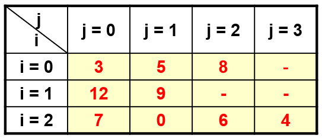
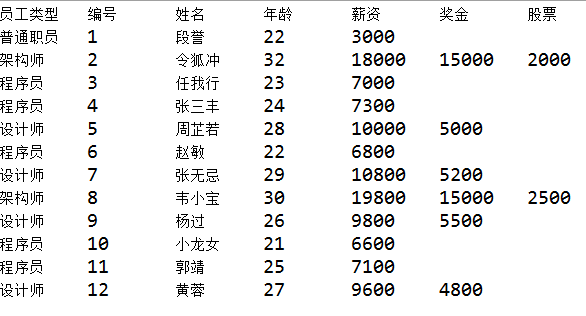
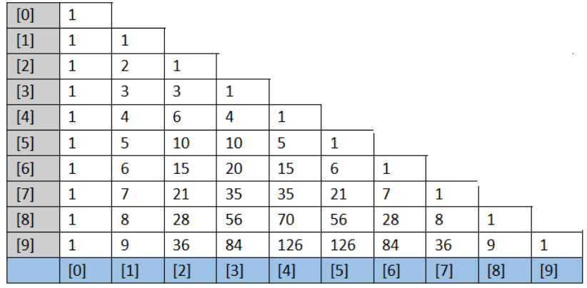
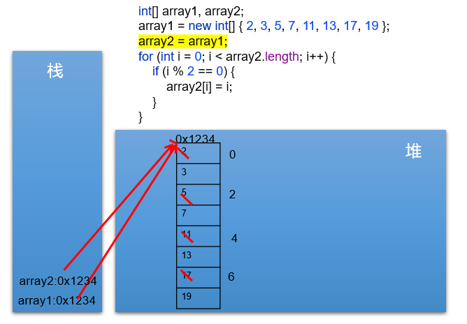
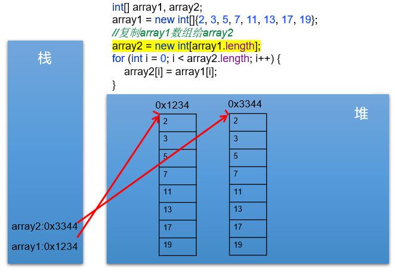
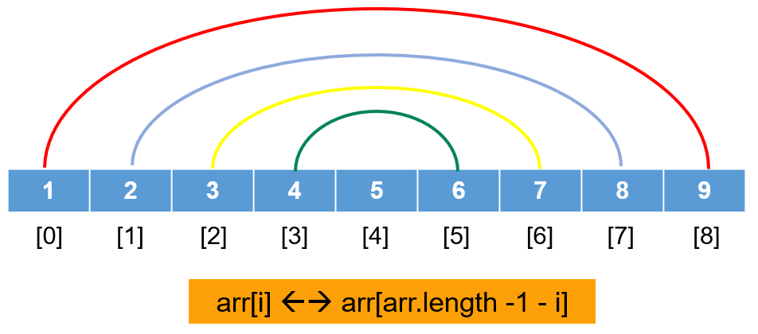
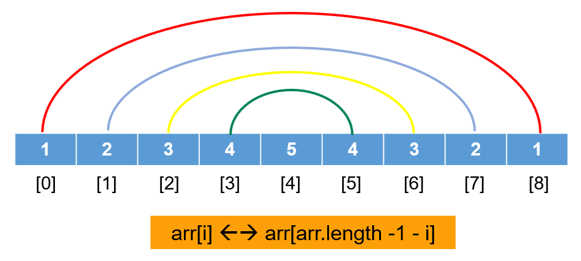

# 第05章 数组

## 62 数组 数组的概述

## 63 数组 一维数组的初始化、遍历与元素默认初始化值

## 64 数组 一维数组的内存解析

```text
1. 数组的理解(Array)

概念: 是多个相同类型数据按照一定顺序排列的集合，并使用一个名字命名，并通过编号的方式对这些数据进行统一管理。

简称: 多个数据的组合。

Java中的容器: 数组、集合框架(第12章): 在内存中对多个数据的存储。

2. 几个相关的概念:
> 数组名
> 数组的元素(即内部存储的多个元素)
> 数组的下标、角标、下角标、索引、index(即找到指定数组元素所使用的编号)
> 数组的长度(即数组容器中存储的元素的个数)

3. 数组的特点
> 数组中元素在内存中是依次紧密排列的，有序的。
> 数组，属于引用数据类型的变量。数组的元素，既可以是基本数据类型，也可以是引用数据类型。
> 数组，一旦初始化完成，其长度就确定了，并且其长度不可更改。
> 创建数组对象会在内存中开辟一整块'连续的空间'。占据的空间的大小，取决于数组的长度和数组中元素的类型。

4. 复习: 变量按照数据类型的分类:
4.1 基本数据类型: byte \ short \ int \ long; float \ double; char \ boolean
4.2 引用数据类型: 类、数组、接口、枚举、注解、记录。

5. 数组的分类
5.1 按照元素的类型: 基本数据类型元素的数组; 引用数据类型元素的数组。
5.2 按照数组的维数来分: 一维数组，二维数组...

6. 一维数组的使用(6个基本点)
> 数组的声明和初始化
> 调用数组的指定元素
> 数组的属性: length，表示数组的长度
> 数组的遍历
> 数组元素的默认初始化值
> 一维数组的内存解析(难)

7. 数组元素的默认初始化值的情况
注意: 以数组的动态初始化方式为例说明。

> 整型数组元素的默认初始化值: 0
> 浮点型数组元素的默认初始化值: 0.0
> 字符型数组元素的默认初始化值: 0 (或理解为'\u0000')
> boolean型数组元素的默认初始化值: false
> 引用数据类型数组元素的默认初始化值: null

8. 一维数组的内存解析
8.1 Java中的内存结构是如何划分的？(主要关心JVM的运行时内存环境)
> 将内存区域划分为5个部分: 程序计数器、虚拟机栈、本地方法栈、堆、方法区。

> 与目前数组相关的内存结构:     比如: int[] arr = new int[]{1, 2, 3};
    > 虚拟机栈: 用于存放方法中声明的局部变量。 比如: arr。
    > 堆: 用于存放数组的实体(即数组中的所有元素)。比如: 1, 2, 3。

8.2 举例: 具体一维数组的代码的内存解析
```

```java
package com.atguigu1.one;

public class OneArrayTest {
    public static void main(String[] args) {

        // 1. 数组的声明与初始化
        // 复习: 变量的定义格式: 数据类型 变量名 = 变量值;
        int num1 = 10;
        int num2; // 声明
        num2 = 20; // 初始化

        // 1.1 声明数组
        double[] prices;
        // 1.2 数组的初始化
        // 静态初始化: 数组变量的赋值与数组元素的赋值操作同时进行。
        prices = new double[]{20.32, 43.21, 43.22};

        // String[] foods;
        // foods = new String[]{"拌海蜇", "龙须菜", "炝冬笋", "玉兰片"};

        // 数组的声明和初始化
        // 动态初始化: 数组变量的赋值与数组元素的赋值操作分开进行。
        String[] foods = new String[4];

        // 其它正确的方式
        int arr[] = new int[4];
        int[] arr1 = {1, 2, 3, 4}; // 类型推断，这种写法必须写在一行。

        // 错误的方式
        // int[] arr2 = new int[3]{1, 2, 3};
        // int[3] arr3 = new int[];

        // 2. 数组元素的调用
        // 通过角标的方式，获取数组的元素
        // 角标的范围从0开始，到数组的长度-1结束。
        System.out.println(prices[0]); // 20.32
        System.out.println(prices[2]); // 43.22
        // System.out.println(prices[3]); // 报异常: ArrayIndexOutOfBoundsException

        foods[0] = "拌海蜇";
        foods[1] = "龙须菜";
        foods[2] = "炝冬笋";
        foods[3] = "玉兰片";
        // foods[4]="酱茄子"; // 报异常: ArrayIndexOutOfBoundsException

        // 3. 数组的长度: 用来描述数组容器中容量的大小
        // 使用length属性表示
        System.out.println(foods.length); // 4
        System.out.println(prices.length); // 3

        // 4. 如何遍历数组
        // System.out.println(foods[0]);
        // System.out.println(foods[1]);
        // System.out.println(foods[2]);
        // System.out.println(foods[3]);

        for (int i = 0; i < foods.length; i++) {
            System.out.println(foods[i]);
        }

        for (int i = 0; i < prices.length; i++) {
            System.out.println(prices[i]);
        }
    }
}
```

```java
package com.atguigu1.one;

/**
 * ClassName: OneArrayTest1
 * Package: com.atguigu1.one
 * Description: 一维数组的基本使用(承接OneArrayTest.java)
 *
 * @Author ljy
 * @Create 2026. 3. 23. 오후 11:44
 * @Version 1.0
 */
public class OneArrayTest1 {
    public static void main(String[] args) {
        // 5. 数组元素的默认初始化值
        // > 整型数组元素的默认初始化值: 0
        int[] arr1 = new int[3];
        System.out.println(arr1[0]);

        short[] arr2 = new short[4];
        for (int i = 0; i < arr2.length; i++) {
            System.out.println(arr2[i]);
        }

        // > 浮点型数组元素的默认初始化值:
        double[] arr3 = new double[5];
        System.out.println(arr3[0]);

        // > 字符型数组元素的默认初始化值: 0(或理解为: '\u0000')
        char[] arr4 = new char[4];
        System.out.println(arr4[0]);

        if (arr4[0] == 0) {
            System.out.println("111"); // 输出
        }

        if (arr4[0] == '0') {
            System.out.println("222");
        }

        if (arr4[0] == '\u0000') {
            System.out.println("333");
        }

        System.out.println(arr4[0] + 1);

        // > boolean型数组元素的默认初始化值: false
        boolean[] arr5 = new boolean[4];
        System.out.println(arr5[0]);

        // > 引用数据类型数组元素的默认初始化值: null
        String[] arr6 = new String[5];
        for (int i = 0; i < arr6.length; i++) {
            System.out.println(arr6[i]);
        }

        if (arr6[0] == null) {
            System.out.println("aaa");
        }

        if (arr6[0] == "null") {
            System.out.println("bbb");
        }

        // 6. 数组的内存解析
        int[] a1 = new int[]{1, 2, 3};
        int[] a2 = a1;
        a2[1] = 10;
        System.out.println(a1[1]); // 10
        System.out.println(a1); // [I@3fee733d
        System.out.println(a2); // [I@3fee733d
    }
}
```


## 65 数组 一维数组的课后练习 1-3

```java
package com.atguigu1.one.exer1;

/**
 * ClassName: ArrayExer
 * Package: com.atguigu1.one.exer1
 * Description:
 * 案例: "破解"房东电话
 * 升景坊单间短期出租4个月，550元/月(水电煤公摊，网费35元/月)，空调、卫生间、厨房齐全。屋内均是IT行业人士，喜欢安静。
 * 所以要求来租者最好是同行或者刚毕业的年轻人，爱干净、安静。
 */
public class ArrayExer {
    public static void main(String[] args) {
        int[] arr = new int[]{8, 2, 1, 0, 3};
        int[] index = new int[]{2, 0, 3, 2, 4, 0, 1, 3, 2, 3, 3};

        String tel = "";

        for (int i = 0; i < index.length; i++) {
            int value = index[i];
            tel += arr[value];
        }
        System.out.println("联系方式: " + tel); // 联系方式: 18013820100
    }
}
```

```text
案例: 输出英文星期几。

用一个数组，保存星期一到星期天到7个英语单词，从键盘输入1-7，显示对应的单词。
{"Monday", "Tuesday", "Wednesday", "Thursday", "Friday", "Saturday", "Sunday"}

拓展: 一年12个月的存储

用一个数组，保存12个月的英语单词，从键盘输入1-12，显示对应的单词。
{"January", "February", "March", "April", "May", "June", "July", "August", "September", "October", "November", "December"}
```

```java
package com.atguigu1.one.exer2;

import java.util.Scanner;

public class ArrayExer02 {
    public static void main(String[] args) {
        // 定义包含7个单词的数组。
        String[] weeks = new String[]{"Monday", "Tuesday", "Wednesday", "Thursday", "Friday", "Saturday", "Sunday"};

        // 从键盘获取指定的数值，使用Scanner。
        Scanner scan = new Scanner(System.in);
        System.out.print("请输入数值(1-7): ");
        int day = scan.nextInt();

        // 针对获取的数据进行判断即可
        if (day < 1 || day > 7) {
            System.out.println("你输入的数据有误。");
        } else {
            System.out.println(weeks[day - 1]);
        }

        scan.close();
    }
}
```

```text
案例: 学生考试等级划分

从键盘读入学生成绩，找出最高分，并输出学生成绩等级。
    成绩 >= 最高分-10    等级为'A'
    成绩 >= 最高分-20    等级为'B'
    成绩 >= 最高分-30    等级为'C'
    其余                等级为'D'

提示: 先读入学生人数，根据人数创建int数组，存放学生成绩。
```


```java
package com.atguigu1.one.exer3;

import java.util.Scanner;

public class ArrayExer03 {
    public static void main(String[] args) {
        // 1. 从键盘输入学生的人数，根据人数，成绩数组。(动态初始化)
        Scanner scan = new Scanner(System.in);
        System.out.print("请学生学生人数: ");
        int count = scan.nextInt();

        int[] scores = new int[count];

        // 2. 根据提示，依次输入学生成绩，并将成绩保存在数组元素中。
        System.out.println("请输入" + count + "个成绩:");
        for (int i = 0; i < scores.length; i++) {
            scores[i] = scan.nextInt();
        }

        // 3. 获取学生成绩的最大值
        int maxScore = scores[0];
        for (int i = 1; i < scores.length; i++) {
            if (maxScore < scores[i]) {
                maxScore = scores[i];
            }
        }
        System.out.println("最高分是: " + maxScore);

        // 4. 遍历数组元素，根据学生成绩与最高分的差值，得到每个学生的等级，并输出成绩和等级。
        for (int i = 0; i < scores.length; i++) {
            if (scores[i] >= maxScore - 10) {
                System.out.println("student " + i + " score is " + scores[i] + " grade is A");
            } else if (scores[i] >= maxScore - 20) {
                System.out.println("student " + i + " score is " + scores[i] + " grade is B");
            } else if (scores[i] >= maxScore - 30) {
                System.out.println("student " + i + " score is " + scores[i] + " grade is C");
            } else {
                System.out.println("student " + i + " score is " + scores[i] + " grade is D");
            }
        }

        scan.close();
    }
}
```

- 对上面程序的优化

```java
package com.atguigu1.one.exer3;

import java.util.Scanner;

public class ArrayExer03_1 {
    public static void main(String[] args) {
        // 1. 从键盘输入学生的人数，根据人数，成绩数组。(动态初始化)
        Scanner scan = new Scanner(System.in);
        System.out.print("请学生学生人数: ");
        int count = scan.nextInt();

        int[] scores = new int[count];

        // 2. 根据提示，依次输入学生成绩，并将成绩保存在数组元素中。
        // 优化点1: 在获取输入的成绩的同时，得到最大值。
        int maxScore = scores[0];
        System.out.println("请输入" + count + "个成绩:");
        for (int i = 0; i < scores.length; i++) {
            scores[i] = scan.nextInt();
            // 3. 获取学生成绩的最大值
            if (maxScore < scores[i]) {
                maxScore = scores[i];
            }
        }

        System.out.println("最高分是: " + maxScore);

        // 4. 遍历数组元素，根据学生成绩与最高分的差值，得到每个学生的等级，并输出成绩和等级。
        // 优化点2: 去掉大量的重复代码。
        char grade;
        for (int i = 0; i < scores.length; i++) {
            if (scores[i] >= maxScore - 10) {
                grade = 'A';
            } else if (scores[i] >= maxScore - 20) {
                grade = 'B';
            } else if (scores[i] >= maxScore - 30) {
                grade = 'C';
            } else {
                grade = 'D';
            }
            System.out.println("student " + i + " score is " + scores[i] + " grade is " + grade);
        }

        scan.close();
    }
}
```

## 66 数组 二维数组的初始化、遍历与元素默认初始化值

## 67 数组 二维数组的内存解析与课后练习1 2 3

```text
1. 二维数组的理解
- 对于二维数组的理解，可以看成是一维数组array1又作为另一个一维数组array2的元素而存在。
- 其实，从数组底层的运行机制来看，其实没有多维数组。
- 概念: 数组的外层元素; 数组的内层元素。


2. 二维数组的使用(6个基本点)
> 数组的声明和初始化
> 调用数组的指定元素
> 数组的属性: length，表示数组的长度
> 数组的遍历
> 数组元素的默认初始化值
> 二维数组的内存解析(难)


3. 二维数组元素的默认初始化值
3.1 动态初始化方式1: (比如: int[][] arr = new int[3][4])

1) 外层元素: 默认存储地址值。
2) 内存元素: 默认与一维数组元素的不同类型的默认值规定相同。
    > 整型数组元素的默认初始化值: 0
    > 浮点型数组元素的默认初始化值: 0.0
    > 字符型数组元素的默认初始化值: 0 (或理解为'\u0000')
    > boolean型数组元素的默认初始化值: false
    > 引用数据类型数组元素的默认初始化值: null

3.2 动态初始化方式2: (比如: int[][] arr = new int[3][])
1) 外层元素: 默认存储null。
2) 内存元素: 不存在的。如果调用会报错 (NullPointerException)
```

```java
package com.atguigu2.two;
/**
 * ClassName: TwoArrayTest
 * Package: com.atguigu1.one
 * Description:
 * 二维数组的基本使用(难点)
 *
 * @Author ljy
 * @Create 2026. 3. 28. 오후 8:57
 * @Version 1.0
 */
public class TwoArrayTest {
    public static void main(String[] args) {
        // 1. 数组的声明与初始化
        // 复习
        int[] arr1 = new int[]{1, 2, 3};

        // 方式1: 静态初始化: 数组变量的赋值和数组元素的赋值同时进行。
        int[][] arr2 = new int[][]{{1, 2, 3}, {4, 5}, {6, 7, 8, 9}};

        // 方式2: 动态初始化1: 数组变量的赋值和数组元素的赋值分开进行。
        String[][] arr3 = new String[3][4];
        // 方式2: 动态初始化2
        double[][] arr4 = new double[2][];

        // 其它正确的写法:
        int arr5[][] = new int[][]{{1, 2, 3}, {4, 5}, {6, 7, 8, 9}};
        int[] arr6[] = new int[][]{{1, 2, 3}, {4, 5}, {6, 7, 8, 9}};
        int arr7[][] = {{1, 2, 3}, {4, 5}, {6, 7, 8, 9}};
        String arr8[][] = new String[3][4];

        // 错误的写法:
        // int[][] arr9 = new int[3][3]{{1, 2, 3}, {4, 5, 6}, {7, 8, 9}};
        // int[3][3] arr10 = new int[][]{{1, 2, 3}, {4, 5, 6}, {7, 8, 9}};
        // int[][] arr11 = new int[][10];

        // 2. 数组元素的调用
        // 针对于arr2来说，外层元素{1, 2, 3}, {4, 5}, {6, 7, 8, 9}; 内层元素: 1, 2, 3, 4, 5, 6, 7, 8, 9。
        // 调用内层元素
        System.out.println(arr2[0][0]); // 1
        System.out.println(arr2[2][1]); // 7

        // 调用外层元素
        System.out.println(arr2[0]); // [I@3fee733d

        // 测试arr3和arr4
        arr3[0][1] = "Tom";
        System.out.println(arr3[0][1]); // Tom
        System.out.println(arr3[0]); // [Ljava.lang.String;@5acf9800

        arr4[0] = new double[4];
        arr4[0][0] = 1.0;

        // 3. 数组的长度
        System.out.println(arr2.length); // 3
        System.out.println(arr2[0].length); // 3
        System.out.println(arr2[1].length); // 2
        System.out.println(arr2[2].length); // 4

        // 4. 如何遍历数组
        for (int i = 0; i < arr2.length; i++) {
            for (int j = 0; j < arr2[i].length; j++) {
                System.out.print(arr2[i][j] + "\t");
            }
            System.out.println();
        }
    }
}
```

```java
package com.atguigu2.two;
/**
 * ClassName: TwoArrayTest1
 * Package: com.atguigu2.two
 * Description:
 * 二维数组的基本使用(难点) (承接TwoArrayTest.java)
 *
 * @Author ljy
 * @Create 2026. 3. 28. 오후 9:53
 * @Version 1.0
 */
public class TwoArrayTest1 {
    public static void main(String[] args) {

        // 5. 数组元素的默认初始化值
        // 以动态初始化方式1说明:
        int[][] arr1 = new int[3][2];
        // 外层元素默认值:
        System.out.println(arr1[0]); // 地址值 [I@3fee733d
        System.out.println(arr1[1]); // 地址值 [I@5acf9800
        // 内层元素默认值:
        System.out.println(arr1[0][0]); // 0

        boolean[][] arr2 = new boolean[3][4];
        // 外层元素默认值:
        System.out.println(arr2[0]); // 地址值 [Z@4617c264
        // 内层元素默认值:
        System.out.println(arr2[0][1]); // false

        String[][] arr3 = new String[4][2];
        // 外层元素默认值:
        System.out.println(arr3[0]); // 地址值 [Ljava.lang.String;@36baf30c
        // 内层元素默认值:
        System.out.println(arr3[0][1]); // null

        // ******************************
        // 以动态初始化方式2说明:
        int[][] arr4 = new int[4][];
        // 外层元素默认值:
        System.out.println(arr4[0]); // null
        // 内层元素默认值:
        // System.out.println(arr4[0][0]); // 报错: 空指针异常

        String[][] arr5=new String[5][];
        // 外层元素默认值:
        System.out.println(arr5[0]); // null
        // 内层元素默认值:
        // System.out.println(arr5[0][0]); // 报错: 空指针异常

        // 6. 数组的内存解析
    }
}
```


- 练习1

```text
案例1: 获取arr数组中所有元素的和。

提示: 使用for的嵌套循环即可。
```



```java
package com.atguigu2.two.exer1;

public class ArrayExer01 {
    public static void main(String[] args) {
        // 初始化数组: 静态初始化
        int[][] arr = new int[][]{{3, 5, 8}, {12, 9}, {7, 0, 6, 4}};

        /* 这种情况下，动态初始化没有静态初始化方便:
        int[][] arr = new int[3][];
        arr[0] = new int[]{3, 5, 8};
        arr[1] = new int[]{12, 9};
        arr[2] = new int[]{7, 0, 6, 4};
         */

        int sum = 0; // 记录元素的总和

        for (int i = 0; i < arr.length; i++) {
            for (int j = 0; j < arr[i].length; j++) {
                sum += arr[i][j];
            }
        }

        System.out.println("总和为: " + sum);
    }
}
```

- 练习2

```text
案例: 声明 int[] x,y[]; 在给x, y变量赋值以后，以下选项允许通过编译的是: x: 一维int[], y: 二维int[][]。

a)   x[0] = y;              no
b)   y[0] = x;              yes
c)   y[0][0] = x;           no
d)   x[0][0] = y;           no
e)   y[0][0] = x[0];        yes
f)   x = y;                 no

提示:
一维数组: int[] x 或者 int x[]。
二维数组: int[][] y 或者 int[] y[] 或者 int y[][]。
```

```java
package com.atguigu2.two.exer2;

public class ArryExer02 {
    public static void main(String[] args) {
        // =: 赋值符号。
        int i = 10;
        int j = i;
        byte b = (byte) i;// 强制类型转换

        long l = i; // 自动类型提升


        // 举例: 数组
        int[] arr1 = new int[10];
        byte[] arr2 = new byte[10];
        // arr1 = arr2; // 编译不通过。原因: int[]和byte[]是两种不同类型的引用变量。

        System.out.println(arr1); // [I@3fee733d
        System.out.println(arr2); // [B@5acf9800

        int[][] arr3 = new int[3][2];
        // arr3 = arr1; // 编译不通过。

        arr3[0] = arr1;
        System.out.println(arr3[0]); // [I@3fee733d
        System.out.println(arr1); // [I@3fee733d

        System.out.println(arr3); // [[I@4617c264
    }
}
```

- 练习3

```text
案例：二维数组存储数据，并遍历

String[][] employees = {
    {"10", "1", "段 誉", "22", "3000"},
    {"13", "2", "令狐冲", "32", "18000", "15000", "2000"},
    {"11", "3", "任我行", "23", "7000"},
    {"11", "4", "张三丰", "24", "7300"},
    {"12", "5", "周芷若", "28", "10000", "5000"},
    {"11", "6", "赵 敏", "22", "6800"},
    {"12", "7", "张无忌", "29", "10800","5200"},
    {"13", "8", "韦小宝", "30", "19800", "15000", "2500"},
    {"12", "9", "杨 过", "26", "9800", "5500"},
    {"11", "10", "小龙女", "21", "6600"},
    {"11", "11", "郭 靖", "25", "7100"},
    {"12", "12", "黄 蓉", "27", "9600", "4800"}
};

其中"10"代表普通职员，"11"代表程序员，"12"代表设计师，"13"代表架构师。显示效果如图。
```



```java
package com.atguigu2.two.exer3;

public class ArrayExer03 {
    public static void main(String[] args) {
        // 定义二维employees数组:
        String[][] employees = {
                {"10", "1", "段 誉", "22", "3000"},
                {"13", "2", "令狐冲", "32", "18000", "15000", "2000"},
                {"11", "3", "任我行", "23", "7000"},
                {"11", "4", "张三丰", "24", "7300"},
                {"12", "5", "周芷若", "28", "10000", "5000"},
                {"11", "6", "赵 敏", "22", "6800"},
                {"12", "7", "张无忌", "29", "10800", "5200"},
                {"13", "8", "韦小宝", "30", "19800", "15000", "2500"},
                {"12", "9", "杨 过", "26", "9800", "5500"},
                {"11", "10", "小龙女", "21", "6600"},
                {"11", "11", "郭 靖", "25", "7100"},
                {"12", "12", "黄 蓉", "27", "9600", "4800"}
        };

        System.out.println("员工类型\t编号\t姓名\t\t年龄\t薪资\t\t奖金\t\t股票");

        for (int i = 0; i < employees.length; i++) {
            String employeeType = employees[i][0];
            switch (employeeType){
                // "10"代表普通职员，"11"代表程序员，"12"代表设计师，"13"代表架构师。显示效果如图。
                case "10":
                    System.out.print("普通职员\t");
                    break;
                case "11":
                    System.out.print("程序员\t");
                    break;
                case "12":
                    System.out.print("设计师\t");
                    break;
                case "13":
                    System.out.print("架构师\t");
                    break;
            }
            for (int j = 1; j < employees[i].length; j++) {
                System.out.print(employees[i][j] + "\t");
            }
            System.out.println();
        }
    }
}
```

## 68 数组 常见算法操作: 特征值计算、数组的赋值与复制

```text
[数组的常见算法1]

1. 数值型数组特征值统计
这里的特征值涉及到: 平均值、最大值、最小值、总和等。

2. 数组元素的赋值(实际开发中，遇到的场景比较多)

3. 数组的复制

4. 数组的反转
```

```text
案例: 定义一个int型的一维数组，包含10个元素，分别赋一些随机整数，然后求出所有元素的最大值，最小值，总和，平均值，
并输出出来。

要求: 所有随机数都是两位数: [10, 99]。
提示: 求[a, b]范围内的随机数: (int) (Math.random() * (b - a + 1)) + a;
```

```java
package com.atguigu3.common_algorithm.exer1;

public class ArrayExer01 {
    public static void main(String[] args) {
        // 1. 动态初始化方式创建数组
        int[] arr = new int[10];

        // 2. 通过循环给数组元素赋值
        for (int i = 0; i < arr.length; i++) {
            arr[i] = (int) (Math.random() * (99 - 10 + 1)) + 10;
            System.out.print(arr[i] + "\t");
        }
        System.out.println();

        // 3.1 求最大值
        int max = arr[0];
        for (int i = 1; i < arr.length; i++) {
            if (max < arr[i]) {
                max = arr[i];
            }
        }
        System.out.println("最大值为: " + max);

        // 3.2 求最小值
        int min = arr[0];
        for (int i = 1; i < arr.length; i++) {
            if (min > arr[i]) {
                min = arr[i];
            }
        }
        System.out.println("最小值为: " + min);

        // 3.3 求总和
        int sum = 0;
        for (int i = 0; i < arr.length; i++) {
            sum += arr[i];
        }
        System.out.println("总和为: " + sum);

        // 3.4 求平均值
        int avgValue = sum / arr.length;
        System.out.println("平均值为: " + avgValue);
    }
}
```

```text
案例: 评委打分。

分析一下需求，并用代码实现:
 (1) 在编程竞赛中，有10位评委为参赛的选手打分，分数分别为: 5, 4, 6, 8, 9, 0, 1, 2, 7, 3。
 (2) 求选手的最后得分(去掉一个最高分和一个最低分后其余8位评委打分的平均值)。
```

```java
package com.atguigu3.common_algorithm.exer2;

public class ArrayExer02 {
    public static void main(String[] args) {

        int[] scores = {5, 4, 6, 8, 9, 0, 1, 2, 7, 3};

        // 声明3个特征值
        int sum = 0;
        int max = scores[0];
        int min = scores[0];

        for (int i = 0; i < scores.length; i++) {
            sum += scores[i]; // 累加总分
            // 用于获取最高分
            if (max < scores[i]) {
                max = scores[i];
            }

            // 用于获取最低分
            if (min > scores[i]) {
                min = scores[i];
            }
        }

        int avg = (sum - max - min) / (scores.length - 2);
        System.out.println("最后得分为: " + avg);
    }
}
```

```text
案例: 使用二维数组打印一个10行杨辉三角。

提示:
1. 第一行有1个元素，第n行有n个元素。
2. 每一行的第一个元素和最后一个元素都是1。
3. 从第三行开始，对于非第一个元素和最后一个元素的元素，它的值是它上面的元素值和左上方元素值的和。即:
    yanghui[i][j] = yanghui[i-1][j-1] + yanghui[i-1][j];
```



```java
package com.atguigu3.common_algorithm.exer3;

public class YangHuiTest {
    public static void main(String[] args) {

        // 1. 创建二维数组
        int[][] yangHui = new int[10][];

        // 2. 初始化外层数组元素
        for (int i = 0; i < yangHui.length; i++) {
            yangHui[i] = new int[i + 1];
            // 3. 给数组的元素赋值
            // 3.1 给数组每行的首末元素赋值为1
            yangHui[i][0] = yangHui[i][i] = 1;
            // 3.2 给数组每行的非首末元素赋值
            if (i >= 2) {
                for (int j = 1; j < yangHui[i].length - 1; j++) { // j从每行的第2个元素开始，到倒数第2个元素结束

                    yangHui[i][j] = yangHui[i - 1][j] + yangHui[i - 1][j - 1];
                }
            }
        }

        // 遍历二维数组
        for (int i = 0; i < yangHui.length; i++) {
            for (int j = 0; j < yangHui[i].length; j++) {
                System.out.print(yangHui[i][j] + "\t");
            }
            System.out.println();
        }
    }
}
```

```text
案例: 复制、赋值。

使用简单数组
(1) 创建一个名为ArrayExer04的类，在main()方法中声明array1和array2两个变量，它们是int[]类型的数组。
(2) 使用大括号{}，把array1初始化为8个素数: 2, 3, 5, 7, 11, 13, 17, 19。
(3) 显示array1的内容。
(4) 赋值array2变量等于array1，修改array2中的偶索引元素，使其等于索引值(如array[0]=0, array[2]=2)。
(5) 打印出array1。

思考: array1和array2是什么关系？
[answer]: array1和array2是两个变量，共同指向了堆空间中的同一个数组结构。即二者的地址值相同。

拓展: 修改题目，实现array2对array1数组的复制。
```

```java
public class ArrayExer04 {
    public static void main(String[] args) {
        // (1) 创建一个名为ArrayExer04的类，在main()方法中声明array1和array2两个变量，它们是int[]类型的数组。
        int[] array1, array2;
        // (2) 使用大括号{}，把array1初始化为8个素数: 2, 3, 5, 7, 11, 13, 17, 19。
        array1 = new int[]{2, 3, 5, 7, 11, 13, 17, 19};
        // (3) 显示array1的内容。
        for (int i = 0; i < array1.length; i++) {
            System.out.print(array1[i] + "\t");
        }
        // (4) 赋值array2变量等于array1，修改array2中的偶索引元素，使其等于索引值(如array[0]=0, array[2]=2)。
        array2 = array1;
        System.out.println();
        System.out.println(array1);
        System.out.println(array2);

        for (int i = 0; i < array2.length; i++) {
            if (i % 2 == 0) {
                array2[i] = i;
            }
        }
        // (5) 打印出array1。
        for (int i = 0; i < array1.length; i++) {
            System.out.print(array1[i] + "\t");
        }
    }
}
```



```java
package com.atguigu3.common_algorithm.exer4;

public class ArrayExer04_1 {
    public static void main(String[] args) {
        // (1) 创建一个名为ArrayExer04的类，在main()方法中声明array1和array2两个变量，它们是int[]类型的数组。
        int[] array1, array2;
        // (2) 使用大括号{}，把array1初始化为8个素数: 2, 3, 5, 7, 11, 13, 17, 19。
        array1 = new int[]{2, 3, 5, 7, 11, 13, 17, 19};
        // (3) 显示array1的内容。
        for (int i = 0; i < array1.length; i++) {
            System.out.print(array1[i] + "\t");
        }
        // (4) 复制array1给array2，修改array2中的偶索引元素，使其等于索引值(如array[0]=0, array[2]=2)。
        array2 = new int[array1.length];
        for (int i = 0; i < array1.length; i++) {
            array2[i] = array1[i];
        }

        System.out.println();
        System.out.println(array1);
        System.out.println(array2);

        for (int i = 0; i < array2.length; i++) {
            if (i % 2 == 0) {
                array2[i] = i;
            }
        }
        // (5) 打印出array1。
        for (int i = 0; i < array1.length; i++) {
            System.out.print(array1[i] + "\t");
        }
    }
}
```



## 69 数组 常见算法操作: 数组的反转、扩容与缩容

## 70 数组 常见算法操作: 查找、冒泡排序、快速排序

```text
案例:
定义数组: int[] arr = new int[]{34, 54, 3, 2, 65, 7, 34, 5, 76, 34, 67};
如何实现数组元素的反转存储？你有几种方法？
```



```java
package com.atguigu3.common_algorithm.exer5;

public class ArrayExer05 {
    public static void main(String[] args) {
        int[] arr = new int[]{34, 54, 3, 2, 65, 7, 34, 5, 76, 34, 67};

        // 遍历
        for (int i = 0; i < arr.length; i++) {
            System.out.print(arr[i] + "\t");
        }
        System.out.println();

        // 反转操作
        // 方式1: 交换元素的位置
        /*
        for (int i = 0; i < arr.length / 2; i++) {
            // 交换arr[i] 与 arr[arr.length - 1 - i]位置的元素
            int temp = arr[i];
            arr[i] = arr[arr.length - 1 - i];
            arr[arr.length - 1 - i] = temp;
        }
         */
        // 方式2: 同样是交换元素的位置，不同的是声明两个参与遍历的变量。
        for (int i = 0, j = arr.length - 1; i < j; i++, j--) {
            // 交换arr[i] 与 arr[j]位置的元素
            int temp = arr[i];
            arr[i] = arr[j];
            arr[j] = temp;
        }

        // 方式3: 创建一个新的数组，不推荐。
        /*
        int[] newArr = new int[arr.length];
        for (int i = 0; i < arr.length; i++) {
            newArr[arr.length - 1 - i] = arr[i];
        }
        arr = newArr;
         */

        // 遍历
        for (int i = 0; i < arr.length; i++) {
            System.out.print(arr[i] + "\t");
        }
    }
}
```



```text
[数组的常见算法2]

1. 数组的扩容和缩容

2. 数组元素的查找
顺序查找:
    > 优点: 算法简单;
    > 缺点: 执行效率低。执行的时间复杂度为O(n)。

二分法查找:
    > 优点: 执行效率高。执行的时间复杂度为O(logN)。
    > 缺点: 算法相较于顺序查找难一点。前提: 数组必须有序。

3. 数组的排序

排序算法的衡量标准: 1. 时间复杂度 2. 空间复杂度 3. 稳定性

排序的分类: 内部排序; 外部排序(外部存储设备 + 内存)

内部排序的具体算法: 10种。

我们需要关注的几个排序算法:
> 冒泡排序: 最简单，需要会手写。时间复杂度: O(n^2)。
> 快速排序: 最快的，开发中默认选择的排序方式; 掌握快速排序的实现思路; 时间复杂度: O(nlogn)
```

```text
案例1: 数组的扩容:

现有数组 int[] arr = new int[] {1, 2, 3, 4, 5};
现将数组长度扩容1倍，并将10, 20, 30三个数据添加到arr数组中，如何操作？
```

```java
package com.atguigu4.search_sort.exer1;

public class ArrayExer01_1 {
    public static void main(String[] args) {
        int[] arr = new int[]{1, 2, 3, 4, 5};

        // 扩容1倍容量
        // int[] newArr = new int[arr.length * 2];
        int[] newArr = new int[arr.length << 1];

        // 将原有数组中元素复制到新的数组中
        for (int i = 0; i < arr.length; i++) {
            newArr[i] = arr[i];
        }

        // 将10, 20, 30三个数据添加到新数组中
        newArr[arr.length] = 10;
        newArr[arr.length + 1] = 20;
        newArr[arr.length + 2] = 30;

        // 将新的数组的地址赋值给原有的数组变量
        arr = newArr;

        // 遍历arr
        for (int i = 0; i < arr.length; i++) {
            System.out.print(arr[i] + "\t");
        }
    }
}
```

```text
案例: 数组的缩容:

现有数组 int[] arr = {1, 2, 3, 4, 5, 6, 7}。现需删除数组中索引为4的元素。
```

```java
package com.atguigu4.search_sort.exer1;

public class ArrayExer01_2 {
    public static void main(String[] args) {
        int[] arr = {1, 2, 3, 4, 5, 6, 7};

        int deleteIndex = 4;

        // 方式1: 不新建数组
        // for (int i = deleteIndex; i < arr.length - 1; i++) {
        //     arr[i] = arr[i + 1];
        // }

        // 修改最后的元素，设置为默认值。
        // arr[arr.length - 1] = 0;
        // 1	2	3	4	6	7	0

        // 方式2: 新建数组。新的数组的长度比原有数组的长度少1个。
        int[] newArr = new int[arr.length - 1];

        for (int i = 0; i < deleteIndex; i++) {
            newArr[i] = arr[i];
        }

        for (int i = deleteIndex; i < arr.length - 1; i++) {
            newArr[i] = arr[i + 1];
        }

        arr = newArr;
        // 1	2	3	4	6	7

        // 遍历arr数组
        for (int i = 0; i < arr.length; i++) {
            System.out.print(arr[i] + "\t");
        }
    }
}
```

```text
案例1: 线性查找

定义数组: int[] arr1 = new int[] {34, 54, 3, 2, 65, 7, 34, 5, 76, 34, 67};
查找元素5是否在上述数组中出现过？如果出现，输出对于的索引值。

案例2: 二分法查找

定义数组: int[] arr2 = new int[] {2, 4, 5, 8, 12, 15, 19, 26, 37, 49, 51, 66, 89, 100};
查找元素5是否在上述数组中出现过？如果出现，输出对应的索引值。
```

```java
package com.atguigu4.search_sort.exer2;

public class LinearSearchTest {
    public static void main(String[] args) {
        int[] arr1 = new int[]{34, 54, 3, 2, 65, 7, 34, 5, 76, 34, 67};

        int target = 5;
        target = 15;

        // 查找方式: 线性查找
        // 方式1:
        /*
        boolean isFlag = true;
        for (int i = 0; i < arr1.length; i++) {
            if (target == arr1[i]) {
                System.out.println("找到了" + target + "，对应的位置为: " + i);
                isFlag = false;
                break;
            }
        }

        if (isFlag) {
            System.out.println("不好意思，没有找到此元素。");
        }
         */
        // 方式2:
        int i = 0;
        for (; i < arr1.length; i++) {
            if (target == arr1[i]) {
                System.out.println("找到了" + target + "，对应的位置为: " + i);
                break;
            }
        }

        // 如果i的值达到了arr1.length，则说明上面的循环不是因为break结束的，而是循环到了循环条件不成立才结束的。
        if (i == arr1.length) {
            System.out.println("不好意思，没有找到此元素。");
        }
    }
}
```

```java
package com.atguigu4.search_sort.exer2;

public class BinarySearchTest {
    public static void main(String[] args) {
        int[] arr2 = new int[]{2, 4, 5, 8, 12, 15, 19, 26, 37, 49, 51, 66, 89, 100};

        int target = 5;
        // target = 17;

        int head = 0;// 默认的首索引
        int end = arr2.length - 1;// 默认的尾索引

        boolean isFlag = false;// 判断是否找到了指定的元素
        int times = 0; // 记录是第几次执行循环
        while (head <= end) {
            times++;
            int middle = (head + end) / 2;
            System.out.println("第" + times + "次执行循环, head: " + head + ", end: " + end + ", middle: " + middle);

            if (target == arr2[middle]) {
                System.out.println("找到了" + target + "，对应的位置为: " + middle);
                isFlag = true;
                break;
            } else if (target > arr2[middle]) {
                head = middle + 1;
            } else { // target < arr2[middle]
                end = middle - 1;
            }
        }

        if (!isFlag) {
            System.out.println("不好意思，未找到。");
        }
    }
}
```

```text
案例1: 使用冒泡排序，实现整型数组元素的排序操作。

比如: int[] arr = new int[]{34, 54, 3, 2, 65, 7, 34, 5, 76, 34, 67};
```

```java
package com.atguigu4.search_sort.exer3;

public class BubbleSortTest {
    public static void main(String[] args) {
        int[] arr = new int[]{34, 54, 3, 2, 65, 7, 34, 5, 76, 34, 67};

        // 遍历
        for (int i = 0; i < arr.length; i++) {
            System.out.print(arr[i] + "\t");
        }

        // 冒泡排序，实现数组元素从小到大的排序。
        for (int i = 0; i < arr.length - 1; i++) {
            for (int j = 0; j < arr.length - 1 - j; j++) {
                if (arr[j] > arr[j + 1]) {
                    // 交换arr[i] 和 arr[i+1]
                    int temp = arr[j];
                    arr[j] = arr[j + 1];
                    arr[j + 1] = temp;
                }
            }
        }

        System.out.println();
        for (int i = 0; i < arr.length; i++) {
            System.out.print(arr[i] + "\t");
        }
    }
}
```

```text
案例：使用快速排序，实现整型数组元素的排序操作

比如：int[] data = { 9, -16, 30, 23, -30, -49, 25, 21, 30 };
```

```java
package com.atguigu4.search_sort.exer3;

/**
 * 快速排序
 * 通过一趟排序将待排序记录分割成独立的两部分，其中一部分记录的关键字均比另一部分关键字小，
 * 则分别对这两部分继续进行排序，直到整个序列有序。
 *
 * @author 尚硅谷-宋红康
 */
public class QuickSort {
    public static void main(String[] args) {
        int[] data = {9, -16, 30, 23, -30, -49, 25, 21, 30};
        System.out.println("排序之前：");
        for (int i = 0; i < data.length; i++) {
            System.out.print(data[i] + " ");
        }

        quickSort(data);//调用实现快排的方法

        System.out.println("\n排序之后：");
        for (int i = 0; i < data.length; i++) {
            System.out.print(data[i] + " ");
        }
    }

    public static void quickSort(int[] data) {
        subSort(data, 0, data.length - 1);
    }

    private static void subSort(int[] data, int start, int end) {
        if (start < end) {
            int base = data[start];
            int low = start;
            int high = end + 1;
            while (true) {
                while (low < end && data[++low] - base <= 0)
                    ;
                while (high > start && data[--high] - base >= 0)
                    ;
                if (low < high) {
                    //交换data数组[low]与[high]位置的元素
                    swap(data, low, high);
                } else {
                    break;
                }
            }
            //交换data数组[start]与[high]位置的元素
            swap(data, start, high);

            //经过代码[start, high)部分的元素 比[high, end]都小

            //通过递归调用，对data数组[start, high-1]部分的元素重复刚才的过程
            subSort(data, start, high - 1);
            //通过递归调用，对data数组[high+1,end]部分的元素重复刚才的过程
            subSort(data, high + 1, end);
        }
    }

    private static void swap(int[] data, int i, int j) {
        int temp = data[i];
        data[i] = data[j];
        data[j] = temp;
    }
}
```

## 71 数组 Arrays工具类的使用与数组中的常见异常

```text
数组工具类Arrays的使用 (熟悉)

1. Arrays类所在位置: 处在java.util包下。

2. 作用:
java.util.Arrays类即为操作数组的工具类，包含了用来操作数组(比如排序和搜索)的各种方法。
```

```java
package com.atguigu5.arrays;

import java.util.Arrays;

public class ArraysTest {
    public static void main(String[] args) {
        // 1. boolean equals(int[] a, int[] b): 比较两个数组的元素是否依次相等。
        int[] arr1 = new int[]{1, 2, 3, 4, 5};
        int[] arr2 = new int[]{1, 2, 3, 4, 5};
        arr2 = new int[]{1, 2, 3, 5, 4};

        System.out.println(arr1 == arr2); // false
        boolean isEquals = Arrays.equals(arr1, arr2);
        System.out.println(isEquals); // true

        // 2. String toString(int[] a): 输出数组元素的信息。
        System.out.println(arr1); // [I@3fee733d
        System.out.println(Arrays.toString(arr1)); // [1, 2, 3, 4, 5]

        // 3. void fill(int[] a, int val): 将指定值填充到数组之中。
        Arrays.fill(arr1, 10);
        System.out.println(Arrays.toString(arr1)); // [10, 10, 10, 10, 10]

        // 4. void sort(int[] a): 使用快速排序算法实现的排序。
        int[] arr3 = new int[]{34, 54, 3, 2, 65, 7, 34, 5, 76, 34, 67};
        Arrays.sort(arr3);
        System.out.println(Arrays.toString(arr3)); // [2, 3, 5, 7, 34, 34, 34, 54, 65, 67, 76]

        // 5. void binarySearch(int[] a, int key): 二分查找
        // 使用前提: 当前数组必须是有序的。
        int index = Arrays.binarySearch(arr3, 5);
        if (index >= 0) {
            System.out.println("找到了，索引位置为: " + index);
        } else {
            System.out.println("未找到");
        }
    }
}
```

```text
1. 数组的使用中常见的异常小结

> 数组角标越界的异常: ArrayIndexOutOfBoundsException
> 空指针的异常: NullPointerException

2. 出现异常会怎样? 如何处理?
> 一旦程序执行中出现了异常，程序就会终止执行。
> 针对于异常提供的信息，修改对应的代码，避免异常再次出现。
```

```java
package com.atguigu6.exception;

public class ArrayExceptionTest {
    public static void main(String[] args) {
        // 1. 数组角标越界的异常:
        int[] arr = new int[10];
        // 角标的有效范围: 0, 1, 2....9
        // System.out.println(arr[10]);
        // System.out.println(arr[-1]);

        // 2. 空指针异常:
        // 情况1:
        int[] arr1 = new int[10];
        arr1 = null;
        // System.out.println(arr1[0]); // NullPointerException

        // 情况2:
        int[][] arr2 = new int[3][];
        // arr2[0] = new int[10]; // 此行代码不存在时，下一行代码出现NullPointerException
        // System.out.println(arr2[0][1]); // NullPointerException

        // 情况3:
        String[] arr3 = new String[4];
        System.out.println(arr3[0].toString()); // NullPointerException
    }
}
```
