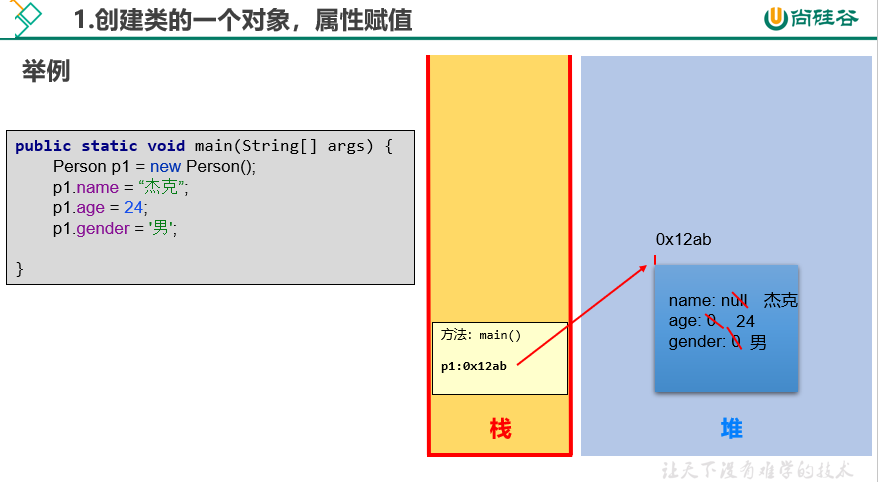
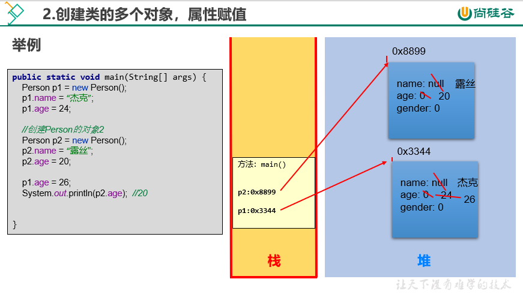
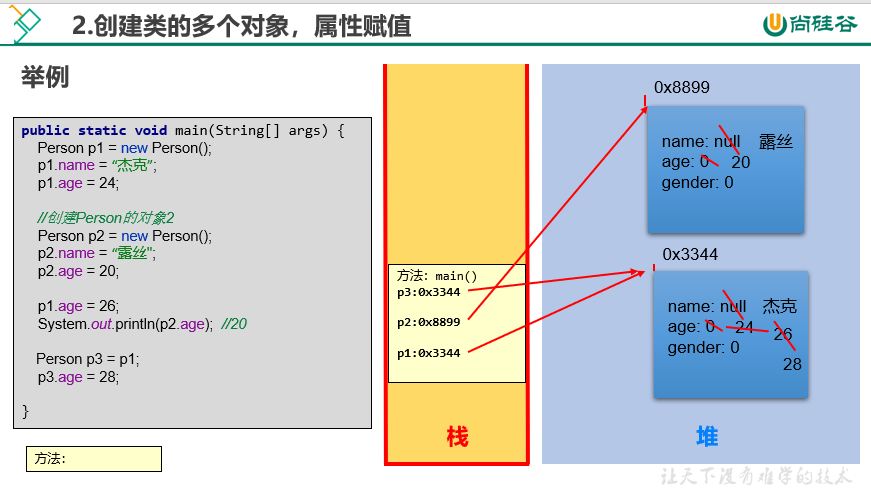
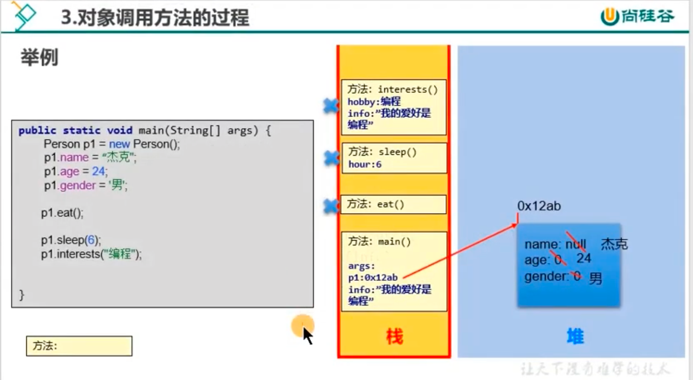
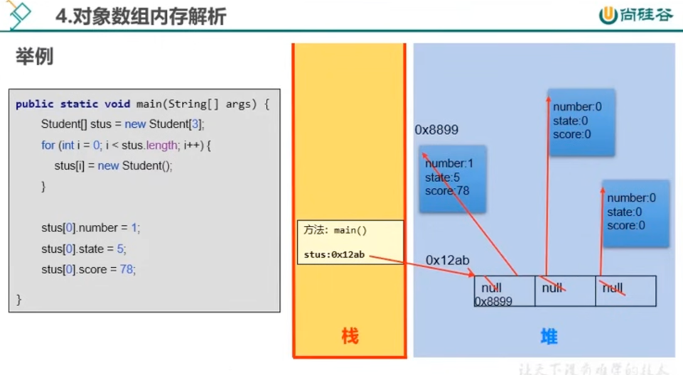
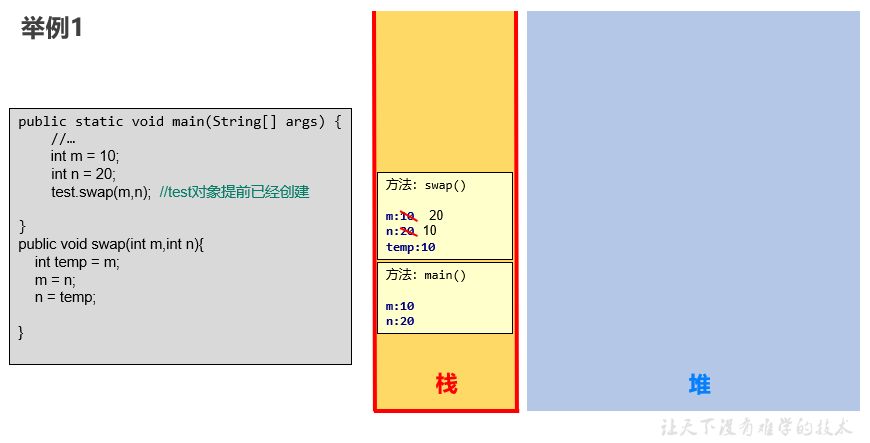
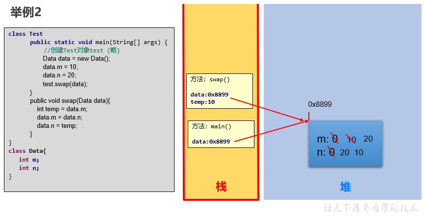
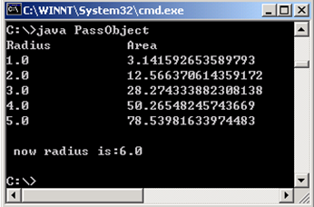
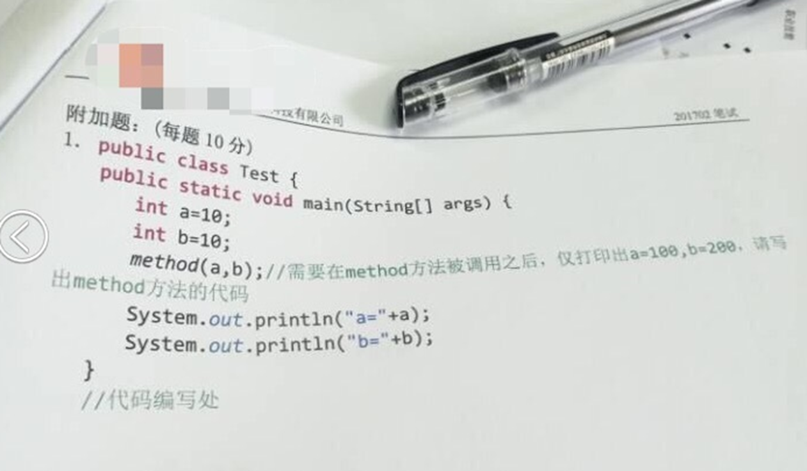

# 第06章 面向对象基础

## 73 面向对象基础 面向对象的概述及两大要素: 类与对象

```text
1. 面向对象内容的三条主线:
- Java类及类的成员: (重点) 属性、方法、构造器; (熟悉) 代码块、内部类。
- 面向对象的特征: 封装、继承、多态 (抽象)。
- 其它关键字的使用: this、super、package、import、static、final、interface、abstract等。

2. 面向过程编程(POP) VS 面向对象编程 (OOP)
2.1 简单的语言描述二者的区别
> 面向过程:
    - 以'函数'为组织单位。
    - 是一种'执行者思维'，适合解决简单问题。扩展能力差、后期维护难度较大。

> 面向对象:
    - 以'类'为组织单位。每种事物都具备自己的'属性'和'行为/功能'。
    - 是一种'设计者思维'，适合解决复杂问题。代码扩展性强、可维护性高。

2.2 二者关系
我们千万不要把面向过程和面向对象对立起来。它们是相辅相成的。面向对象离不开面向过程!

3.
> 面向对象编程的两个核心概念: 类(Class)、对象(Object)。
> 谈谈对这两个概念的理解?
    类: 具有相同特征的事物的抽象描述，是'抽象的'、概念上的定义。
    对象: 实际存在的该类事物的'每个个体'，是'具体的'，因而也称为'实例'。

4. 类的声明与使用
4.1 体会: 设计类，其实就是设计类的成员。
class Person {

}

4.2 类的内部成员一、二:

成员之一: 属性、成员变量、field(字段、域)。
成员之二: (成员)方法、函数、method。

4.3 类的实例化
等价描述: 类的实例化 <=> 创建类的对象 <=> 创建类的实例
格式: 类类型 对象名 = 通过new创建的对象实体
举例:
Phone p1 = new Phone();
Scanner scan = new Scanner(System.in);
String str = new String();

5. 面向对象完成具体功能的操作的三步流程(非常重要)
步骤1: 创建类，并设计类的内部成员(属性、方法)。
步骤2: 创建类的对象。比如: Phone p1 = new Phone();
步骤3: 通过对象，调用其内部声明的属性或方法，完成相关的功能。
```

```java
package com.atguigu01.oop;

public class Phone {

    // 属性
    String name; // 品牌
    double price; // 价格

    // 方法
    public void call() {
        System.out.println("手机能够拨打电话");
    }

    public void sendMessage(String message) {
        System.out.println("发送信息: " + message);
    }

    public void playGame() {
        System.out.println("手机可以玩游戏");
    }
}
```

```java
package com.atguigu01.oop;

public class PhoneTest { // 是Phone类的测试类
    public static void main(String[] args) {

        // 复习:
        // Scanner scan = new Scanner(System.in);

        // 创建Phone的对象
        Phone p1 = new Phone();

        // 通过Phone的对象，调用其内部声明的属性或方法。
        // 格式: "对象.属性" 或 "对象.方法"
        p1.name = "juhua mate50";
        p1.price = 6999;

        System.out.println("name = " + p1.name + ", price = " + p1.price);

        // 调用方法
        p1.call();
        p1.sendMessage("有内鬼，终止交易");
        p1.playGame();
    }
}
```

## 74 面向对象基础 类的实例化与对象的内存解析

```text
1. 对象在内存中的分配设计到的内存结构(理论)
- 栈(stack): 方法内定义的变量，存储在栈中。
- 堆(heap): new出来的结构(比如: 数组实体、对象的实体)。包括对象中的属性。
- 方法区(method area): 存放类的模版。比如: Person类的模版。

2. 类中对象的内存解析
2.1 创建类的一个对象
见<01-创建类的一个对象.png>

2.2 创建类的多个对象
见<02-创建类的多个对象1.png>、<02-创建类的多个对象2.png>。

强调: 创建类Person类的两个对象:
Person p1 = new Person();
Person p2 = new Person();

说明: 创建的类的多个对象时，每个对象在堆空间中有一个对象实体。每个对象实体中保存着一份类的属性。
如果修改某一个对象的某属性值时，不会影响其它对象此属性的值。
p1.age = 10;
p2.age = 20;

p1.age = 30;
System.out.println(p2.age); // 20

强调2: 说明类的两个变量
Person p1 = new Person();
Person p3 = p1;

说明: 此时的p1、p3两个变量指向了堆空间中的同一个对象实体。(或p1、p3保存的地址值相同)
如果通过其中某一个对象变量修改对象的属性时，会影响另一个对象变量此属性的值。

p1.age = 10;
p3.age = 20;
System.out.println(p1.age); // 20

2.3 对象调用方法的过程(在'03-类的成员之二: 方法'中讲解)
```

```java
package com.atguigu02.memory;

public class Person {

    // 属性
    String name; // 姓名
    int age; // 年龄
    char gender; // 性别

    // 方法
    public void eat() {
        System.out.println("人吃饭");
    }

    public void sleep(int hour) {
        System.out.println("人至少保证每天" + hour + "小时的睡眠");
    }

    public void interests(String hobby) {
        System.out.println("我的爱好是: " + hobby);
    }
}
```

```java
package com.atguigu02.memory;

public class PersonTest {
    public static void main(String[] args) {

        // 创建对象、类的实例化
        Person p1 = new Person();

        // 通过对象调用属性或方法
        p1.name = "杰克";
        p1.age = 24;
        p1.gender = '男';

        System.out.println("name = " + p1.name + ", age = " + p1.age + ", gender = " + p1.gender);

        p1.eat();
        p1.sleep(8);
        p1.interests("画画");

        // 再创建Person类的一个实例
        Person p2 = new Person();
        p2.name = "露丝";
        p2.age = 18;
        p2.gender = '女';

        System.out.println("name = " + p2.name + ", age = " + p2.age + ", gender = " + p2.gender);
        System.out.println("name = " + p1.name + ", age = " + p1.age + ", gender = " + p1.gender);
    }
}
```







## 75 面向对象基础 成员变量与局部变量的对比及练习

```text
类的成员之一: 属性

1. 变量的分类
- 角度一: 按照数据类型来分: 基本数据类型(8种)、引用数据类型(数组、类、接口、枚举、注解、记录)。
- 角度二: 按照变量在类中声明的位置的不同: 成员变量(或属性)、局部变量(方法内、方法形参、构造器内、代码块内等)。

2. 属性的几个称谓: 成员变量、属性、field(字段、域)。

3. 区分成员变量    vs.   局部变量
3.1 相同点
> 变量声明的格式相同: 数据类型 变量名 = 变量值;
> 变量都有其有效的作用域，出了作用域，就失效了。
> 变量必须先声明,后赋值，再使用。

3.2 不同点
1) 类中声明的位置的不同:
    属性: 声明在类内，方法外的变量。
    局部变量: 声明在方法、构造器内部的变量。

2) 在内存中分配的位置不同(难):
    属性: 随着对象的创建，存储在堆空间中。
    局部变量: 存储在栈空间中。

3) 生命周期:
    属性: 随着对象的创建而创建，随着对象的消亡而消亡。
    局部变量: 随着方法对应的栈帧入栈，局部变量会在栈中分配; 随着方法对应的栈帧出栈，局部变量消亡。

4) 作用域:
    属性: 在整个类的内部都是有效的。
    局部变量: 仅限于声明此局部变量所在的方法(或构造器、代码块)中。

5) 是否可以有权限修饰符进行修饰(难):
    都有哪些权限修饰符: public、protected、缺省、private。(用于表明所修饰的结构可调用的范围的大小)

    属性: 可以使用权限修饰符进行修饰。暂时还未讲封装性，所以暂且不写任何权限修饰符。
    局部变量: 不能使用任何权限修饰符进行修饰。

6) 是否有默认值:
    属性: 都有默认初始化值。
        意味着: 如果没有给属性进行显式初始化赋值，则会有默认初始化值。
    局部变量: 都没有默认初始化值。
        意味着: 在使用局部变量之前，必须要显式地赋值，否则报错。

    注意: 对于方法的形参而言，在调用方法时，给此形参赋值即可。
```

```java
package com.atguigu03.field_method.field;

public class FieldTest {
    public static void main(String[] args) {
        Person p1 = new Person();
        System.out.println(p1.name + ", " + p1.age);
    }
}

class Person {
    // 属性（或成员变量）
    String name;
    int age;
    char gender;

    // 方法
    public void eat() {
        String food = "宫保鸡丁"; // 局部变量
        System.out.println("我喜欢吃" + food);
    }

    public void sleep(int hour) { // 形参，属于局部变量
        System.out.println("人不能少于" + hour + "小时的睡眠");

        // 编译不通过，因为超出了food变量的作用域。
        // System.out.println("我喜欢吃" + food);

        // 编译通过
        System.out.println("name = " + name);
    }
}
```

```text
案例:

声明员工类Employee，包含属性: 编号id、姓名name、年龄age、薪资salary。

声明EmployeeTest测试类，并在main方法中，创建2个员工对象，并为属性赋值，并打印两个员工的信息。
```

```java
package com.atguigu03.field_method.field.exer1;

public class Employee {
    // 属性
    int id; // 编号
    String name; // 姓名
    int age; // 年龄
    double salary; // 薪资
}
```

```java
package com.atguigu03.field_method.field.exer1;

public class EmployeeTest {
    public static void main(String[] args) {
        // 创建类的实例(或创建类的对象、类的实例化)
        Employee emp1 = new Employee();

        System.out.println(emp1); // 类型@地址值

        emp1.id = 1001;
        emp1.name = "Tom";
        emp1.age = 24;
        emp1.salary = 7800;

        System.out.println("id = " + emp1.id + ", name = " + emp1.name +
                ", age = " + emp1.age + ", salary = " + emp1.salary);

        // 创建Employee的第2个对象
        // Employee emp3 = emp1; // 错误写法
        Employee emp2 = new Employee();

        System.out.println(emp2);
        System.out.println("id = " + emp2.id + ", name = " + emp2.name +
                ", age = " + emp2.age + ", salary = " + emp2.salary);
    }
}
```

```text
案例:

(1) 声明一个MyDate类型，有属性: 年year，月month，日day。
(2) 声明一个Employee类型，包含属性: 编号、姓名、年龄、薪资、生日(MyDate类型)。
(3) 在EmployeeTest测试类中的main()中，创建两个员工对象，并为他们的姓名和生日赋值，并显示。
```

```java
package com.atguigu03.field_method.field.exer2;

public class MyDate {
    int year; // 年
    int month; // 月
    int day; // 日
}
```

```java
package com.atguigu03.field_method.field.exer2;

public class Employee {

    int id; // 编号
    String name; // 姓名
    int age; // 年龄
    double salary; // 工资
    MyDate birthday; // 生日
}
```

```java
package com.atguigu03.field_method.field.exer2;

public class EmployeeTest {
    public static void main(String[] args) {

        // 创建Employee的一个实例
        Employee emp1 = new Employee();

        emp1.id = 1001;
        emp1.name = "杰克";
        // emp1.name = new String("杰克");
        emp1.age = 24;
        emp1.salary = 8900;
        emp1.birthday = new MyDate();
        emp1.birthday.year = 1998;
        emp1.birthday.month = 2;
        emp1.birthday.day = 28;

        /*
        // 另一种写法:
        MyDate mydate1 = new MyDate();
        emp1.birthday = mydate1;
         */

        // 打印员工信息
        System.out.println("id = " + emp1.id + ", name = " + emp1.name +
                ", age = " + emp1.age + ", salary = " + emp1.salary +
                ", birthday = [" + emp1.birthday.year + "年" + emp1.birthday.month + "月" + emp1.birthday.day + "日]");
    }
}
```

## 76 面向对象基础 方法的作用与方法的声明

```text
类的成员之二: 方法(method)

1. 使用方法的好处
方法的理解: '方法'是类或对象行为特征的抽象，用来完成某个功能操作。
方法的好处: 实现代码重用，减少冗余，简化代码。

2. 使用举例
- Math.random()的random()方法
- Math.sqrt(x)的sqrt(x)方法
- System.out.println(x)的println(x)方法
- new Scanner(System.in).nextInt()的nextInt()方法
- Arrays类中的binarySearch()方法、sort()方法、equals()方法

3. 声明举例
public void eat()
public void sleep(int hour)
public String interests(String hobby)
public int getAge()

4. 方法声明的格式 (重要)

权限修饰符 [其它修饰符] 返回值类型 方法名(形参列表) [throws 异常类型] { // 方法头
    // 方法体
}

注: []中的内容不是必须的，以后再讲。

5. 具体的方法声明的细节
5.1 权限修饰符
    1) Java规定了哪些权限修饰符呢？ 有四种，private \ 缺省 \ protected \ public (放到封装性讲)
       声明方法时，暂时先都写成public。

5.2 返回值类型: 描述当调用完此方法时，是否需要返回一个结果。
    分类:
    > 无返回值类型: 使用void表示即可。比如: System.out.println(x)的println(x)方法、Arrays的sort()。
    > 有具体的返回值类型: 需要指明返回的数据的类型。可以是基本数据类型，也可以是引用数据类型。
        > 需要在方法内部配合使用"return + 返回值类型的变量或常量"。
        比如: Math.random()、new Scanner(System.in).nextInt()等。

    [经验] 我们在声明方法时，要不要提供返回值类型呢？
        > 根据方法具体实现的功能来决定。换句话说，具体问题具体分析。
        > 根据题目要求。

5.3 方法名: 属于标识符。需要满足标识符的规定和规范。"见名知意"

5.4 形参列表: 形参，属于局部变量，且可以声明多个。
    格式: (形参类型1 形参1, 形参类型2 形参2, ...)
    分类: 无形参列表、有形参列表
        > 无形参列表: 不能省略一对()。比如: Math.random()、new Scanner(System.in).nextInt()。
        > 有形参列表: 根据方法调用时，需要的不确定的变量的类型和个数，确定形参的类型和个数。
        比如: Arrays类中binarySearch()方法、sort()方法、equals()方法。

    [经验] 我们在声明方法时，是否需要形参列表呢？
        > 根据方法具体实现的功能来决定。换句话说，具体问题具体分析。
        > 根据题目要求。

5.5 方法体: 当我们调用一个方法时，真正执行的代码。体现了此方法的功能。

6. 注意点
> Java里的方法'不能独立存在'，所有的方法必须定义在类里。
> 方法内可以调用本类中的(其它)方法或属性。
> 方法内不能定义方法。

7. 关键字: return
7.1 return的作用
    - 作用1: 结束一个方法。
    - 作用2: 结束一个方法的同时，可以返回数据给方法的调用者。(方法声明中如果有返回值类型，则方法内需要搭配return使用)

7.2 使用注意点
    return后面不能声明执行语句。

8. 方法调用的内存解析:
- 形参: 方法在声明时，一对()内声明的一个或多个形式参数，简称为形参。
- 实参: 方法在被调用时，实际传递给形参的变量或常量，就称为实际参数，简称实参。
```

```java
package com.atguigu03.field_method.method;

public class MethodTest {
    public static void main(String[] args) {
        Person p1 = new Person();
        p1.eat();

        p1.info();
    }
}


class Person {
    // 属性
    String name;
    int age;
    char gender;

    // 方法
    public void eat() {
        System.out.println("人吃饭");

        sleep(8);

        System.out.println("name = " + name);
    }

    public void sleep(int hour) {
        System.out.println("人至少每天睡眠" + hour + "小时");
    }

    public String interests(String hobby) {
        String info = "我的爱好" + hobby;
        System.out.println("我的爱好是" + hobby);
        // return info;
        return "abc";
    }

    public int getAge() {
        return age;
    }

    public void info() {
        System.out.println("Person info()");
        // info();

        // 方法内不能定义方法
        /*
        public void show() {

        }
         */
    }

    public void printNumber(int targetNumber) { // 10
        for (int i = 0; i < targetNumber; i++) {
            if (i == 4) {
                return; // 用于结束方法

                // return后面不能声明执行语句。
                // System.out.println("xxx");
            }
            System.out.println(i);
        }
    }
}
```

## 77 面向对象基础 方法的课后练习及内存解析

```text
案例: 将属性测试的exer1中关于员工信息的输出内容放到方法中。通过调用方法显示。
```

```java
package com.atguigu03.field_method.method.exer;

/**
 * ClassName: Employee
 * Package: com.atguigu03.field_method.field.exer1
 * Description:
 * 声明员工类Employee，包含属性: 编号id、姓名name、年龄age、薪资salary。
 * 声明EmployeeTest测试类，并在main方法中，创建2个员工对象，并为属性赋值，并打印两个员工的信息。
 *
 * @Author: ljy
 * @Create: 2026. 4. 4. 오후 7:32
 * @Version 1.0
 */
public class Employee {
    // 属性
    int id; // 编号
    String name; // 姓名
    int age; // 年龄
    double salary; // 薪资

    // 定义一个方法，用于显示员工的属性信息
    public void show() {
        System.out.println("id = " + id + ", name = " + name +
                ", age = " + age + ", salary = " + salary);
    }

    public String show1() {
        return "id = " + id + ", name = " + name +
                ", age = " + age + ", salary = " + salary;
    }
}
```

```java
package com.atguigu03.field_method.method.exer;

public class EmployeeTest {
    public static void main(String[] args) {
        // 创建类的实例(或创建类的对象、类的实例化)
        Employee emp1 = new Employee();

        System.out.println(emp1); // 类型@地址值

        emp1.id = 1001;
        emp1.name = "Tom";
        emp1.age = 24;
        emp1.salary = 7800;

        // System.out.println("id = " + emp1.id + ", name = " + emp1.name +
        //         ", age = " + emp1.age + ", salary = " + emp1.salary);
        // 替换为:
        emp1.show();

        // System.out.println(emp1.show()); // 编译报错
        System.out.println(emp1.show1()); // 编译通过

        // 创建Employee的第2个对象
        // Employee emp3 = emp1; // 错误写法
        Employee emp2 = new Employee();

        System.out.println(emp2);
        // System.out.println("id = " + emp2.id + ", name = " + emp2.name +
        //         ", age = " + emp2.age + ", salary = " + emp2.salary);
        // 替换为:
        emp2.show();
    }
}
```



## 78 面向对象基础 属性和方法的整体练习 1 - 4

```text
案例:

(1) 创建Person类的对象，设置该对象的name、age和gender属性，
调用study方法，输出字符串"studying";
调用showAge方法，返回age值;
调用addAge(int addAge)方法给对象的age属性值增加addAge岁。比如: 2岁。

(2) 创建第二个对象，执行上述操作，体会同一个类的不同对象之间的关系。
```

```java
package com.atguigu04.example.exer1;

/**
 * Description:
 * 创建Person类的对象，设置该对象的name、age和gender属性，
 * 调用study方法，输出字符串"study";
 * 调用showAge方法，返回age值;
 * 调用addAge(int addAge)方法给对象的age属性值增加addAge岁。比如: 2岁。
 */
public class Person {

    String name;
    int age;
    char gender;

    public void study() {
        System.out.println("studying");
    }

    public int showAge() {
        return age;
    }

    public void addAge(int addAge) {
        age += addAge;
    }
}
```

```java
package com.atguigu04.example.exer1;

public class PersonTest {
    public static void main(String[] args) {

        Person p1 = new Person();

        // 调用属性
        p1.name = "Tom";
        p1.age = 12;
        p1.gender = '男';

        // 调用方法
        p1.study();

        p1.addAge(2);

        int age = p1.showAge();
        System.out.println("age = " + age); // 12 -> 14

        Person p2=new Person();

        System.out.println(p2.age); // 0

        p2.addAge(10);

        System.out.println(p2.showAge()); // 10

        System.out.println(p1.showAge()); // 14
    }
}
```

```text
案例:

1. 编写程序，声明一个method1方法，在方法中打印一个10*8的*型矩形，在main方法中调用该方法。

2. 编写程序，声明一个method2方法，除打印一个10*8的*型矩形外，
再计算该矩形的面积，并将其作为方法返回值。在main方法中调用该方法，接收返回的面积值并打印。

3. 编写程序，声明一个method3方法，在method3方法提供m和n两个参数，方法中打印一个m*n的*型矩形，
并计算该矩形的面积，将其作为方法返回值。在main方法中打印该方法，接收返回的面积值并打印。
```

```java
package com.atguigu04.example.exer2;

public class Exer02 {
    public void method1() {
        for (int i = 0; i < 10; i++) {
            for (int j = 0; j < 8; j++) {
                System.out.print("*");
            }
            System.out.println();
        }
    }

    public int method2() {
        for (int i = 0; i < 10; i++) {
            for (int j = 0; j < 8; j++) {
                System.out.print("*");
            }
            System.out.println();
        }
        return 10 * 8;
    }

    public int method3(int m, int n) {
        for (int i = 0; i < m; i++) {
            for (int j = 0; j < n; j++) {
                System.out.print("*");
            }
            System.out.println();
        }
        return m * n;
    }
}
```

```java
package com.atguigu04.example.exer2;

public class Exer02Test {
    public static void main(String[] args) {
        // 创建Exer02的对象
        Exer02 exer = new Exer02();
        // exer.method1();

        // int area = exer.method2();
        // System.out.println("面积为: " + area);

        int area1 = exer.method3(3, 8);
        System.out.println("面积为: " + area1);
    }
}
```

```text
案例:

利用面向对象的编程方法，设计类Circle计算圆的面积。
```

```java
package com.atguigu04.example.exer3;

public class Circle {
    // 属性
    double radius; // 半径

    // 方法
    public void findArea() {
        System.out.println("面积为: " + 3.14 * radius * radius);
    }

    // 或:
    public double findArea2() {
        return 3.14 * radius * radius;
    }

    // 错误的:
    // public void findArea1(double r) {
    //     System.out.println("面积为: " + 3.14 * r * r);
    // }
}
```

```java
package com.atguigu04.example.exer3;

public class CircleTest {
    public static void main(String[] args) {
        Circle c1 = new Circle();

        c1.radius = 2.3;
        c1.findArea();

        // c1.findArea1(3.2);

        System.out.println("面积为: " + c1.findArea2());
    }
}
```

```text
案例:

根据上一章数组中的常用算法操作，自定义一个操作int[]的工具类。
设计到的方法有: 求最大值、最小值、总和、平均数、遍历数组、复制数组、数组反转、
            数组排序(默认从小到大排序)、查找等。
```

```java
package com.atguigu04.example.exer4;

public class MyArrays {

    /**
     * 获取int[]数组的最大值
     *
     * @param arr 要获取最大值的数组
     * @return 数组的最大值
     */
    public int getMax(int[] arr) {
        int max = arr[0];

        for (int i = 1; i < arr.length; i++) {
            if (arr[i] > max) {
                max = arr[i];
            }
        }
        return max;
    }

    /**
     * 获取int[]数组的最小值
     *
     * @param arr 要获取最小值的数组
     * @return 数组的最小值
     */
    public int getMin(int[] arr) {
        int min = arr[0];
        for (int i = 1; i < arr.length; i++) {
            if (arr[i] < min) {
                min = arr[i];
            }
        }
        return min;
    }

    public int getSum(int[] arr) {
        int sum = 0;

        for (int i : arr) {
            sum += i;
        }
        return sum;
    }

    public int getAvg(int[] arr) {
        return getSum(arr) / arr.length;
    }

    public void print(int[] arr) { // [12, 234, 45]
        System.out.print("[");
        for (int i = 0; i < arr.length; i++) {
            if (i != arr.length - 1) {
                System.out.print(arr[i] + ", ");
            } else {
                System.out.print(arr[i]);
            }
        }
        System.out.println("]");
    }

    public int[] copy(int[] arr) {

        int[] newArr = new int[arr.length];

        for (int i = 0; i < arr.length; i++) {
            newArr[i] = arr[i];
        }
        return newArr;
    }

    public void reverse(int[] arr) {
        for (int i = 0, j = arr.length - 1; i < j; i++, j--) {
            int temp = arr[i];
            arr[i] = arr[j];
            arr[j] = temp;
        }
    }

    public void sort(int[] arr) {
        for (int i = 0; i < arr.length - 1; i++) {
            for (int j = 0; j < arr.length - 1 - i; j++) {
                if (arr[j] > arr[j + 1]) {
                    int temp = arr[j];
                    arr[j] = arr[j + 1];
                    arr[j + 1] = temp;
                }
            }
        }
    }

    /**
     * 使用线性查找的算法，查找指定的元素。
     *
     * @param arr 待查找的数组
     * @param target 要查找的元素
     * @return target元素在arr数组中的索引位置。若未找到，则返回-1。
     */
    public int linearSearch(int[] arr, int target) {

        for (int i = 0; i < arr.length; i++) {
            if (target == arr[i]) {
                return i;
            }
        }
        // 只要代码执行到此位置，一定是没找到。
        return -1;
    }
}
```

```java
package com.atguigu04.example.exer4;

public class MyArraysTest {
    public static void main(String[] args) {

        MyArrays arrs = new MyArrays();
        int[] arr = new int[]{34, 56, 223, 2, 56, 24, 56, 67, 778, 45};

        // 求最大值
        System.out.println("最大值为:" + arrs.getMax(arr)); // 最大值为:778
        // 求平均值
        System.out.println("平均值为: " + arrs.getAvg(arr)); // 平均值为: 134
        // 遍历
        arrs.print(arr); // [34, 56, 223, 2, 56, 24, 56, 67, 778, 45]

        // 查找
        int index = arrs.linearSearch(arr, 24);
        if (index >= 0) {
            System.out.println("找到了，位置为: " + index); // 找到了，位置为: 5
        } else {
            System.out.println("未找到");
        }

        // 排序
        arrs.sort(arr);
        // 遍历
        arrs.print(arr); // [2, 24, 34, 45, 56, 56, 56, 67, 223, 778]
    }
}
```

## 79 面向对象基础 对象数组的使用及内存解析

```text
对象数组

1. 何为对象数组？如何理解？
数组的元素可以是基本数据类型，也可以是引用数据类型。当元素是引用类型中的类时，我们称之为对象数组。

2. 举例
String[], Person[], Student[], Customer[]等。

3. 案例
1) 定义类Student，包含三个属性: 学号number(int)、年级state(int)、成绩score(int)。
2) 创建20个学生对象，学号为1到20，年级和成绩都由随机数确定。
问题一: 打印出3年级(state值为3)的学生信息。
问题二: 使用冒泡排序按学生成绩排序，并遍历所有学生信息。
提示:
1) 生成随机数: Math.random()，返回值类型double;
2) 四舍五入取整: Math.round(double d)，返回值类型long。
年级[1, 6]: (int) (Math.random() * 6 + 1)
分数[0, 100]: (int) (Math.random() * 101)

4. 内存解析

5. 拓展: 提供封装Student相关操作的工具类。
```

```java
package com.atguigu04.example.exer5_objarr;

public class Student {

    // 属性
    int number; // 学号
    int state; // 年级
    int score; // 成绩

    // 声明一个方法，显示学生的属性信息
    public String show() {
        return "number: " + number + ", state: " + state + ", score: " + score;
    }
}
```

```java
package com.atguigu04.example.exer5_objarr;

public class StudentTest {
    public static void main(String[] args) {
        // 创建Student[]
        Student[] students = new Student[20];

        // 使用循环，给数组的元素赋值
        for (int i = 0; i < 20; i++) {
            students[i] = new Student();
            // 给每一个学生对象的number、state、score属性赋值
            students[i].number = i + 1;
            students[i].state = (int) (Math.random() * 6 + 1);
            students[i].score = (int) (Math.random() * 101);
        }

        // 需求1: 打印出3年级(state值为3)的学生信息。
        for (int i = 0; i < students.length; i++) {
            if (3 == students[i].state) {
                Student stu = students[i];
                System.out.println(stu.show());
            }
        }

        // 排序前遍历
        for (int i = 0; i < students.length; i++) {
            System.out.println(students[i].show());
        }
        System.out.println("@@@@@@@@@@@@@@@@@@@@");

        // 需求2: 使用冒泡排序按学生成绩排序，并遍历所有学生信息。
        for (int i = 0; i < students.length - 1; i++) {
            for (int j = 0; j < students.length - 1 - i; j++) {
                if (students[j].score > students[j + 1].score) {
                    // 错误的，不满足实际需求!
                    // int temp = students[j].score;
                    // students[j].score = students[j + 1].score;
                    // students[j + 1].score = temp;

                    // 正确的:
                    Student temp = students[j];
                    students[j] = students[j + 1];
                    students[j + 1] = temp;
                }
            }
        }

        // 遍历
        for (int i = 0; i < students.length; i++) {
            System.out.println(students[i].show());
        }
    }
}
```

```java
package com.atguigu04.example.exer5_objarr1;

public class StudentUtil {

    /*
    打印指定年级的学生信息
     */
    public void printStudentsByGrade(Student[] students, int grade) {
        for (int i = 0; i < students.length; i++) {
            if (grade == students[i].state) {
                Student stu = students[i];
                System.out.println(stu.show());
            }
        }
    }

    /*
    遍历指定的学生数组
     */
    public void printStudents(Student[] students) {
        for (int i = 0; i < students.length; i++) {
            System.out.println(students[i].show());
        }
    }

    public void sortStudents(Student[] students) {
        for (int i = 0; i < students.length - 1; i++) {
            for (int j = 0; j < students.length - 1 - i; j++) {
                if (students[j].score > students[j + 1].score) {
                    Student temp = students[j];
                    students[j] = students[j + 1];
                    students[j + 1] = temp;
                }
            }
        }
    }
}
```

```java
package com.atguigu04.example.exer5_objarr1;

public class StudentTest {
    public static void main(String[] args) {
        // 创建Student[]
        Student[] students = new Student[20];

        // 使用循环，给数组的元素赋值
        for (int i = 0; i < 20; i++) {
            students[i] = new Student();
            // 给每一个学生对象的number、state、score属性赋值
            students[i].number = i + 1;
            students[i].state = (int) (Math.random() * 6 + 1);
            students[i].score = (int) (Math.random() * 101);
        }

        // 需求1: 打印出3年级(state值为3)的学生信息。
        StudentUtil util = new StudentUtil();
        util.printStudentsByGrade(students, 3);
        System.out.println("@@@@@@@@@@@@@@@@@@@@");

        // 排序前遍历
        util.printStudents(students);
        System.out.println("@@@@@@@@@@@@@@@@@@@@");

        // 需求2: 使用冒泡排序按学生成绩排序，并遍历所有学生信息。
        util.sortStudents(students);

        // 遍历
        util.printStudents(students);
    }
}
```



## 80 面向对象基础 方法应用1: 方法的重载

```text
再谈方法之1: 方法的重载(Overload)

1. 定义: 在同一个类中，允许存在一个以上的同名方法，只要它们的参数列表不同即可。
        满足这样特征的多个方法，彼此之间构成方法的重载。

2. 总结为: "两同一不同"
        两同: 同一个类、相同的方法名。
        一不同: 参数列表不同。 1) 参数的个数不同 2) 参数的类型不同

        注意: 方法的重载与形参的名、权限修饰符、返回值类型都没有关系。

3. 举例:
Arrays类中的sort(xxx[] arr)、binarySearch(xxx[] arr, xxx)、equals(xxx[], yyy[])。

4. 如何判断两个方法是相同的呢？(换句话说，编译器是如何确定调用的某个具体的方法呢？)

方法名相同，且形参列表相同。(形参列表相同指的是参数个数和参数类型都相同，与形参名无关。)

要求: 在一个类中，允许存在多个相同名字的方法，只要它们的形参列表不同即可。

编译器是如何确定调用的某个具体的方法呢？先通过方法名确定了一波重载的方法，进而通过不同的形参列表，确定具体的某一个方法。

5. 在同一个类中不允许定义两个相同的方法。
```

```java
package com.atguigu05.method_more._01overload;

public class OverloadTest {
    public static void main(String[] args) {
        OverloadTest test = new OverloadTest();

        test.add(1, 2, 3);

        test.add(10, 20);
        test.add(10, 20.0);
    }

    public void add(int i, int j) {
        System.out.println("1111");
    }

    public void add(double d1, double d2) {
        System.out.println("3333");
    }

    public void add(int i, int j, int k) {

    }

    public void add(String s1, String s2) {
    }

    public void add(int i, String s) {
    }

    public void add(String s, int i) {
    }

    // public void add(int m, int n) {
    //   System.out.println("2222");
    // }

    // public int add(int m, int n) {
    //     return m + n;
    // }
}
```

```text
练习1: 判断与void show(int a, char b, double c){}构成重载的有:

a) void show(int x, char y, double z){}      // no

b) int show(int a, double c, char b){}       // yes

c) void show(int a, double c, char b){}      // yes

d) boolean show(int c, char b){}             // yes

e) void show(double c){}                     // yes

f) double show(int x, char y, double z){}    // no

g) void shows(double c){}                    // no

练习2:
编写程序，定义三个重载的方法并调用。方法名为mOL。
三个方法分别接收一个int参数、两个int参数、一个字符串参数。
分别执行平方运算并输出结果，相乘并输出结果，输出字符串信息。

练习3:
定义三个重载方法max()，
第一个方法求两个int值中的最大值，
第二个方法求两个double值中的最大值，
第三个方法求三个double值中的最大值，并分别调用三个方法。
```

```java
package com.atguigu05.method_more._01overload.exer;

public class OverloadExer {
    /*
    练习2:
    编写程序，定义三个重载的方法并调用。方法名为mOL。
    三个方法分别接收一个int参数、两个int参数、一个字符串参数。
    分别执行平方运算并输出结果，相乘并输出结果，输出字符串信息。
     */
    public void mOL(int num) {
        System.out.println(num * num);
    }

    public void mOL(int num1, int num2) {
        System.out.println(num1 * num2);
    }

    public void mOL(String message) {
        System.out.println(message);
    }

    /*
    练习3:
    定义三个重载方法max()，
    第一个方法求两个int值中的最大值，
    第二个方法求两个double值中的最大值，
    第三个方法求三个double值中的最大值，并分别调用三个方法。
     */
    public int max(int i, int j) {
        return (i >= j) ? i : j;
    }

    public double max(double d1, double d2) {
        return (d1 >= d2) ? d1 : d2;
    }

    public double max(double d1, double d2, double d3) {
        // double tempMax = max(d1, d2);
        // return max(tempMax, d3);

        return (max(d1, d2) > d3) ? (max(d1, d2)) : d3;
    }
}
```

```java
package com.atguigu05.method_more._01overload;

// 面试题
public class InterviewTest {
    public static void main(String[] args) {

        int[] arr = new int[]{1, 2, 3};
        System.out.println(arr); // 地址值

        char[] arr1 = new char[]{'a', 'b', 'c'};
        System.out.println(arr1); // abc
        // println方法有很多重载的方法，这里调用的是参数为char[]的方法，其它的两个方法调用的是参数为Object的方法。

        boolean[] arr2 = new boolean[]{false, true, true};
        System.out.println(arr2); // 地址值

    }
}
```

## 81 面向对象基础 方法应用2: 可变个数形参的方法

```text
再谈方法之2: 可变个数形参的方法(JKD5.0)

1. 使用场景
在调用方法时，可能会出现方法形参的类型是确定的，但是参数的个数不确定。此时，我们就可以使用可变个数形参的方法。

2. 格式: (参数类型... 参数名)

3. 说明:
1) 可变个数形参的方法在调用时，针对于可变的形参赋的实参的个数可以为: 0个、1个或多个。
2) 可变个数形参的方法与同一个类中，同名的多个方法之间可以构成重载。
3) 特例: 可变个数形参的方法与同一个类中方法名相同，且与可变个数形参的类型相同的数组参数，不构成重载。
4) 可变个数的形参必须声明在形参列表的最后。
5) 可变个数的形参在一个方法的形参列表中最多出现一次。
```

```java
package com.atguigu05.method_more._02args;

public class ArgsTest {

    public static void main(String[] args) {
        ArgsTest test = new ArgsTest();

        test.print(); // 1111
        test.print(1); // 2222
        test.print(1, 2); // 3333

        test.print(new int[]{1, 2, 3});
        // test.print(1, 2, 3);
    }

    public void print(int... nums) {
        System.out.println("1111");

        for (int i = 0; i < nums.length; i++) {
            System.out.println(nums[i]);
        }
    }

    // public void print(int[] nums) {

    // }

    public void print(int i, int... nums) {

    }

    // 编译不通过
    // public void print(int... nums, int i) {

    // }

    public void print(int i) {
        System.out.println("2222");
    }

    public void print(int i, int j) {
        System.out.println("3333");
    }

    /*
    场景举例:
    String sql = "update customer set name = ?, email = ? where id = ?";

    String sql1 = "update customers set name = ? where id = ?";

    public void update(String sql, Object... objs);
     */
}
```

```text
练习: 可变形参的方法

n个字符串进行拼接，每一个字符串之间使用某字符进行分割，如果没有传入字符串，那么返回空字符串""。
```

```java
package com.atguigu05.method_more._02args.exer;

public class StringConcatTest {

    public static void main(String[] args) {
        StringConcatTest test = new StringConcatTest();
        String info = test.concat("-", "hello", "world");
        System.out.println(info); // hello-world

        System.out.println(test.concat("/", "hello"));

        System.out.println(test.concat("-"));
    }

    public String concat(String separator, String... strs) {
        String result = "";
        for (int i = 0; i < strs.length; i++) {
            if (i == 0) {
                result += strs[i];
            } else {
                result += (separator + strs[i]);
            }
        }
        return result;
    }
}
```

## 82 面向对象基础 方法应用3: 方法值传递机制的剖析

```text
再谈方法之3: 方法的值传递机制

1. (复习) 对于方法内声明的局部变量来说:
    如果出现赋值操作:
    > 如果是基本数据类型的变量，则将此变量保存的数据值传递出去。
    > 如果是引用数据类型的变量，则将此变量保存的地址值传递出去。

2. 方法的参数的传递机制: 值传递机制

2.1 概念(复习)
形参: 在定义方法时，方法名后面括号()中声明的变量称为形式参数，简称形参。
实参: 在调用方法时，方法名后面括号()中的使用的值/变量/表达式称为实际参数，简称实参。

2.2 规则: 实参给形参赋值的过程
    > 如果形参是基本数据类型的变量，则将实参保存的数据值赋给形参。
    > 如果形参是引用数据类型的变量，则将实参保存的地址值赋给形参。


3. 面试题: Java中的参数传递机制是什么？ 值传递。(不是引用传递)
```

```java
package com.atguigu05.method_more._03valuetransfer;

public class ValueTransferTest {
    public static void main(String[] args) {
        // 1. 基本数据类型的局部变量
        int m = 10;
        int n = m; // 传递的是数据值

        System.out.println("m = " + m + ", n = " + n); // m = 10, n = 10

        m++;
        System.out.println("m = " + m + ", n = " + n); // m = 11, n = 10

        // 2. 引用数据类型的局部变量
        // 2.1 数组类型
        int[] arr1 = new int[]{1, 2, 3, 4, 5};
        int[] arr2 = arr1; // 传递的是地址值

        arr2[0] = 10;

        System.out.println(arr1[0]); // 10

        // 2.2 对象类型
        Order order1 = new Order();
        order1.orderId = 1001;

        Order order2 = order1; // 传递的是地址值
        order2.orderId = 1002;

        System.out.println(order1.orderId); // 1002
    }
}

class Order {
    int orderId;
}
```

```java
package com.atguigu05.method_more._03valuetransfer;

public class ValueTransferTest1 {
    public static void main(String[] args) {

        ValueTransferTest1 test = new ValueTransferTest1();

        // 1. 对于基本数据类型的变量来说
        int m = 10;
        test.method1(m);

        System.out.println("m = " + m); // m = 10

        // 2. 对于引用数据类型的变量来说
        Person p = new Person();
        p.age = 10;

        test.method2(p);

        System.out.println(p.age); // 11
    }

    public void method1(int m) {
        m++;
    }

    public void method2(Person p) {
        p.age++;
    }
}

class Person {
    int age;
}
```

```java
package com.atguigu05.method_more._03valuetransfer;

public class ValueTransferTest2 {
    public static void main(String[] args) {

        ValueTransferTest2 test = new ValueTransferTest2();

        int m = 10;
        int n = 20;

        System.out.println("m = " + m + ", n = " + n);

        // 交换两个变量的值
        // 操作1:
        // int temp = m;
        // m = n;
        // n = temp;

        // 操作2: 调用方法
        test.swap(m, n);

        System.out.println("m = " + m + ", n = " + n);
    }

    public void swap(int m, int n) {
        int temp = m;
        m = n;
        n = temp;
    }
}
```

```java
package com.atguigu05.method_more._03valuetransfer;

public class ValueTransferTest3 {
    public static void main(String[] args) {
        ValueTransferTest3 test = new ValueTransferTest3();

        Data data = new Data();
        data.m = 10;
        data.n = 20;

        System.out.println("m = " + data.m + ", n = " + data.n); // m = 10, n = 20

        // 操作1:
        // int temp = data.m;
        // data.m = data.n;
        // data.n = temp;

        // 操作2: 调用方法
        test.swap(data);


        System.out.println("m = " + data.m + ", n = " + data.n); // m = 20, n - 10
    }

    public void swap(Data data) {
        int temp = data.m;
        data.m = data.n;
        data.n = temp;
    }

}

class Data {
    int m;
    int n;
}
```




```text
1. 定义一个Circle类，包含一个double型的radius属性代表圆的半径，一个findArea()方法返回圆的面积。

2. 定义一个类PassObject，在类中定义一个方法printAreas()，该方法的定义如下:
    public void printArea(Circle c, int time)。

3. 在printAreas方法中打印输出1到time之间的每个整数半径值，以及对应的面积。
    例如: time为5，则输出半径1, 2, 3, 4, 5，以及对应的圆面积。

4. 在main方法中调用printAreas()方法，调用完毕后输出当前半径值。程序运行结果如图所示。
```



```java
package com.atguigu05.method_more._03valuetransfer.exer1;

public class Circle {

    double radius; // 半径

    public double findArea() {
        return Math.PI * radius * radius;
    }
}
```

```java
package com.atguigu05.method_more._03valuetransfer.exer1;

public class PassObject {

    public static void main(String[] args) {
        PassObject obj = new PassObject();
        Circle circle = new Circle();
        obj.printAreas(circle, 5);

        System.out.println("now radius is " + circle.radius);
    }

    public void printAreas(Circle c, int time) {
        System.out.println("Radius\t\tArea");

        int i = 1;
        for (; i < time; i++) {
            c.radius = i;
            System.out.println(c.radius + "\t\t\t" + c.findArea());
        }

        c.radius = i;
    }
}
```

```text
针对atguigu04.example.exer4中MyArrays类的如下方法进行修改:
数组排序，可以指明排序的方式(从小到大、从大到小)
```

```java
package com.atguigu05.method_more._03valuetransfer.exer2;

public class MyArrays {

    /**
     * 获取int[]数组的最大值
     *
     * @param arr 要获取最大值的数组
     * @return 数组的最大值
     */
    public int getMax(int[] arr) {
        int max = arr[0];

        for (int i = 1; i < arr.length; i++) {
            if (arr[i] > max) {
                max = arr[i];
            }
        }
        return max;
    }

    /**
     * 获取int[]数组的最小值
     *
     * @param arr 要获取最小值的数组
     * @return 数组的最小值
     */
    public int getMin(int[] arr) {
        int min = arr[0];
        for (int i = 1; i < arr.length; i++) {
            if (arr[i] < min) {
                min = arr[i];
            }
        }
        return min;
    }

    public int getSum(int[] arr) {
        int sum = 0;

        for (int i : arr) {
            sum += i;
        }
        return sum;
    }

    public int getAvg(int[] arr) {
        return getSum(arr) / arr.length;
    }

    public void print(int[] arr) { // [12, 234, 45]
        System.out.print("[");
        for (int i = 0; i < arr.length; i++) {
            if (i != arr.length - 1) {
                System.out.print(arr[i] + ", ");
            } else {
                System.out.print(arr[i]);
            }
        }
        System.out.println("]");
    }

    public int[] copy(int[] arr) {

        int[] newArr = new int[arr.length];

        for (int i = 0; i < arr.length; i++) {
            newArr[i] = arr[i];
        }
        return newArr;
    }

    public void reverse(int[] arr) {
        for (int i = 0, j = arr.length - 1; i < j; i++, j--) {
            int temp = arr[i];
            arr[i] = arr[j];
            arr[j] = temp;
        }
    }

    public void sort(int[] arr) {
        for (int i = 0; i < arr.length - 1; i++) {
            for (int j = 0; j < arr.length - 1 - i; j++) {
                if (arr[j] > arr[j + 1]) {
                    int temp = arr[j];
                    arr[j] = arr[j + 1];
                    arr[j + 1] = temp;
                }
            }
        }
    }

    /**
     * 针对于数组进行排序操作
     *
     * @param arr        待排序的数组
     * @param sortMethod asc 升序    desc 降序
     */
    public void sort(int[] arr, String sortMethod) {
        if ("asc".equals(sortMethod)) { // ascend: 升序
            for (int i = 0; i < arr.length - 1; i++) {
                for (int j = 0; j < arr.length - 1 - i; j++) {
                    if (arr[j] > arr[j + 1]) {
                        // int temp = arr[j];
                        // arr[j] = arr[j + 1];
                        // arr[j + 1] = temp;
                        // 错误的:
                        // swap(arr[j], arr[j + 1]);
                        // 正确的:
                        swap(arr, j, j + 1);
                    }
                }
            }
        } else if ("desc".equals(sortMethod)) { // descend: 降序
            for (int i = 0; i < arr.length - 1; i++) {
                for (int j = 0; j < arr.length - 1 - i; j++) {
                    if (arr[j] < arr[j + 1]) {
                        // int temp = arr[j];
                        // arr[j] = arr[j + 1];
                        // arr[j + 1] = temp;
                        // 错误的:
                        // swap(arr[j], arr[j + 1]);
                        // 正确的:
                        swap(arr, j, j + 1);
                    }
                }
            }
        } else {
            System.out.println("你输入的排序方式有误");
        }
    }

    // 错误的:
    // public void swap(int i, int j) {
    //     int temp = i;
    //     i = j;
    //     j = temp;
    // }

    public void swap(int[] arr, int i, int j) {
        int temp = arr[i];
        arr[i] = arr[j];
        arr[j] = temp;
    }

    /**
     * 使用线性查找的算法，查找指定的元素。
     *
     * @param arr    待查找的数组
     * @param target 要查找的元素
     * @return target元素在arr数组中的索引位置。若未找到，则返回-1。
     */
    public int linearSearch(int[] arr, int target) {

        for (int i = 0; i < arr.length; i++) {
            if (target == arr[i]) {
                return i;
            }
        }
        // 只要代码执行到此位置，一定是没找到。
        return -1;
    }
}
```

```java
package com.atguigu05.method_more._03valuetransfer.exer2;

public class MyArraysTest {
    public static void main(String[] args) {

        MyArrays arrs = new MyArrays();
        int[] arr = new int[]{34, 56, 223, 2, 56, 24, 56, 67, 778, 45};

        // 求最大值
        System.out.println("最大值为:" + arrs.getMax(arr)); // 最大值为:778
        // 求平均值
        System.out.println("平均值为: " + arrs.getAvg(arr)); // 平均值为: 134
        // 遍历
        arrs.print(arr); // [34, 56, 223, 2, 56, 24, 56, 67, 778, 45]

        // 查找
        int index = arrs.linearSearch(arr, 24);
        if (index >= 0) {
            System.out.println("找到了，位置为: " + index); // 找到了，位置为: 5
        } else {
            System.out.println("未找到");
        }

        // 排序
        arrs.sort(arr, "asc");
        // 遍历
        arrs.print(arr); // [2, 24, 34, 45, 56, 56, 56, 67, 223, 778]
    }
}
```



```java
package com.atguigu05.method_more._03valuetransfer.interview;

import java.io.PrintStream;

/**
 * @author 尚硅谷-宋红康
 * @create 21:33
 */
public class Answer {
    //法一：
    public static void method1(int a, int b) {
        // 在不改变原本题目的前提下，如何写这个函数才能在main函数中输出a=100，b=200？
        a = a * 10;
        b = b * 20;
        System.out.println(a);
        System.out.println(b);
        System.exit(0);
    }

    //法二：
    public static void method2(int a, int b) {

        PrintStream ps = new PrintStream(System.out) {
            @Override
            public void println(String x) {

                if ("a=10".equals(x)) {
                    x = "a=100";
                } else if ("b=10".equals(x)) {
                    x = "b=200";
                }
                super.println(x);
            }
        };
        System.setOut(ps);
    }
}
```
