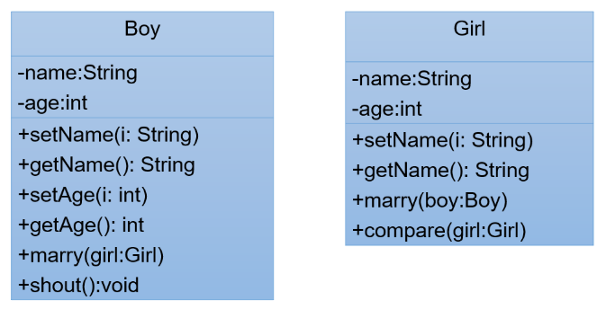
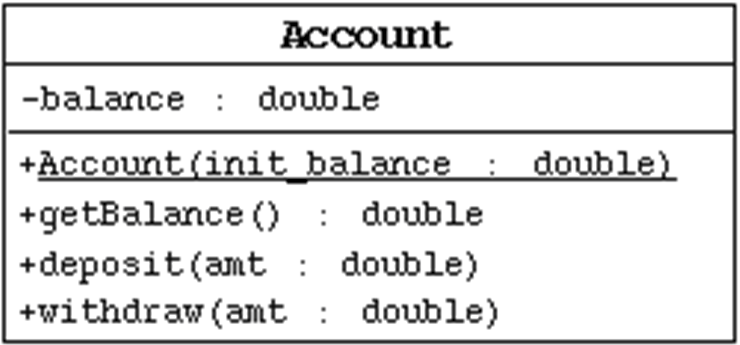
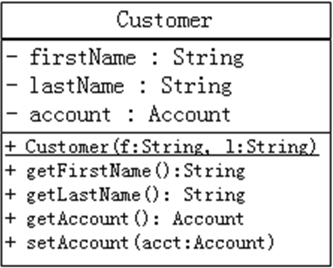
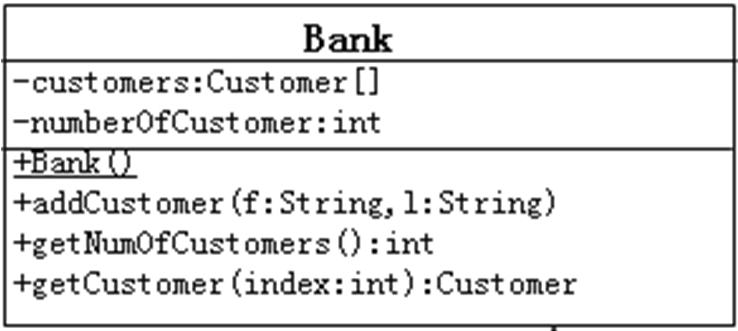

# 第07章 面向对象进阶

## 90 面向对象进阶 关键字this调用属性、方法、构造器

```text
this关键字的使用

1. 目前可能出现的问题？及解决方案？
我们在声明一个属性对应的setXxx方法时，通过形参给对应的属性赋值，如果形参名和属性名同名了，
那么该如何在方法内区分这两个变量呢？

解决方案: 使用this。具体来讲，使用this修饰的变量，表示的是属性；没有使用this修饰的变量，表示的是形参。

2. this可以调用的结构: 成员变量、方法、构造器。

3. this的理解: 当前对象(在方法中调用时) 或 当前正在创建的对象(在构造器中调用时)

4.1 this调用属性和方法
【针对于方法内的使用情况: (准确地说是非static修饰的方法)】

一般情况下，我们通过对象a调用方法，可以在方法内调用当前对象的属性或其他方法，此时，我们可以在属性和其他方法前
使用"this."表示当前属性或方法所属的对象a。但是，一般情况下，我们都选择省略此"this."结构。

特殊情况: 如果方法的形参与对象的属性同名了，我们必须使用"this."进行区分。使用"this."修饰的变量即为属性(或成员变量)，
没有使用"this."修饰的变量即为局部变量。

【针对于构造器的使用情况:】
一般情况下，我们通过构造器参加对象时，可以在构造器内调用当前正在创建的对象的属性或方法。此时，我们可以在属性或方法前
使用"this."，表示当前属性或方法所属的对象。但是，一般情况下，我们都选择省略此"this."结构。
特殊情况: 如果构造器的形参与正在创建的对象的属性同名了，我们必须使用"this."进行区分。使用"this."修饰的变量即为属性(或成员变量)，
没有使用"this."修饰的变量即为局部变量。

4.2 this调用构造器
> 格式: this(形参列表)
> 我们可以在类的构造器中调用当前类中指定的其它构造器。
> 要求: "this(形参列表)"必须声明在当前构造器的首行。
> 结论: "this(形参列表)"在构造器中最多只能声明一个。
> 如果一个类中声明了n个构造器，则最多有n-1个构造器可以声明有"this(形参列表)"的结构。
```

```java
package com.atguigi01._this;

public class PersonTest {
    public static void main(String[] args) {
        Person p1 = new Person();
        p1.setAge(10);
        System.out.println(p1.age);

        Person p2 = new Person("Tom", "tom@126.com");
        System.out.println("name = " + p2.name + ", email = " + p2.email);
    }
}

class Person {
    String name;
    int age;
    String email;

    public Person() {

    }

    public Person(String n) {
        name = n;
        eat();
    }

    public Person(String name, String email) {
        this.name = name;
        this.email = email;
    }

    public void setAge(int age) {
        this.age = age;
    }

    public int getAge() {
        return this.age;
    }

    public void eat() {
        System.out.println("人吃饭");

        this.sleep();
    }

    public void sleep() {
        System.out.println("人睡觉");
    }
}
```

```java
package com.atguigi01._this;

public class UserTeest {
    public static void main(String[] args) {
        // 只创建了User类的1个对象
        User u1 = new User("Tom", 12);
    }
}

class User {
    String name;
    int age;

    public User() {
        // 模拟对象创建时，需要初始化50行代码
        // init();
        // this("Tom", 12);
    }

    public User(String name) {
        this();
        this.name = name;
    }

    public User(String name, int age) {
        this(name);
        // this.name = name;
        this.age = age;
    }

    // private void init(){
    //     // 模拟对象创建时，需要初始化50行代码
    // }
}
```

## 91 面向对象进阶 this课后练习1 2

```text
案例:
根据图示，添加必要的构造器，综合应用构造器的重载、this关键字。
```



```java
package com.atguigi01._this.exer1;

public class Boy {

    private String name;
    private int age;

    public String getName() {
        return name;
    }

    public void setName(String name) {
        this.name = name;
    }

    public int getAge() {
        return age;
    }

    public void setAge(int age) {
        this.age = age;
    }

    public Boy() {
    }

    public Boy(String name, int age) {
        this.name = name;
        this.age = age;
    }

    public void marry(Girl girl) {
        System.out.println("我想娶" + girl.getName());
    }

    public void shout() {
        if (age >= 22) {
            System.out.println("我终于可以结婚了！");
        } else {
            System.out.println("我只能多谈恋爱了");
        }
    }
}
```

```java
package com.atguigi01._this.exer1;

public class Girl {

    private String name;
    private int age;

    public Girl() {
    }

    public Girl(String name, int age) {
        this.name = name;
        this.age = age;
    }

    public String getName() {
        return name;
    }

    public void setName(String name) {
        this.name = name;
    }

    public void marry(Boy boy) {
        System.out.println("我想嫁给" + boy.getName());

        boy.marry(this);
    }

    /**
     * 比较两个Girl对象的大小。
     *
     * @param girl
     * @return 正数: 当前对象大; 负数: 当前对象小(或形参girl大); 0: 相等。
     */
    public int compare(Girl girl) {
        if (this.age > girl.age) {
            return 1;
        } else if (this.age < girl.age) {
            return -1;
        } else {
            return 0;
        }
    }
}
```

```java
package com.atguigi01._this.exer1;

public class BoyGirlTest {
    public static void main(String[] args) {

        Boy boy1 = new Boy("杰克", 24);

        Girl girl1 = new Girl("朱丽叶", 20);

        girl1.marry(boy1);

        boy1.shout();

        Girl girl2 = new Girl("肉丝", 18);

        int compare = girl1.compare(girl2);
        if (compare > 0) {
            System.out.println(girl1.getName() + "大");
        } else if (compare < 0) {
            System.out.println(girl2.getName() + "大");
        } else {
            System.out.println("一样大");
        }
    }
}
```

```text
案例:

1. 按照UML类图，创建Account类，提供必要的结构。
- 在提款方法withdraw()中，需要判断用户余额是否能够满足提款数额的要求，如果不能，应给出提示。
- deposit()方法表示存款。

2. 按照UML类图，创建Customer类，提供必要的结构。

3. 按照UML类图，创建Bank类，提供必要的结构。
- addCustomer方法必须依照参数(姓, 名)构造一个新的Customer对象，然后把它放到customer数组中。
    还必须把numberOfCustomer属性的值加1。
- getNumOfCustomers方法返回numberOfCustomers属性值。
- getCustomer方法返回与给出的index参数相关的客户。

4. 创建BankTest类，进行测试。
```





```java
package com.atguigi01._this.exer2;

public class Account {
    private double balance; // 余额

    public Account(double init_balance) {
        this.balance = init_balance;
    }

    public double getBalance() {
        return balance;
    }

    // 存钱
    public void deposit(double amt) {
        if (amt > 0) {
            balance += amt;
            System.out.println("成功存入:" + amt);
        }
    }

    // 取钱
    public void withdraw(double amt) {
        if (balance >= amt && amt > 0) {
            balance -= amt;
            System.out.println("成功取出: " + amt);
        } else {
            System.out.println("取款数额有误或余额不足");
        }
    }
}
```

```java
package com.atguigi01._this.exer2;

public class Customer {
    private String firstName; // 名
    private String lastName; // 姓
    private Account account; // 账户

    public Customer(String f, String l) {
        firstName = f;
        lastName = l;
    }

    public String getFirstName() {
        return firstName;
    }

    public String getLastName() {
        return lastName;
    }

    public Account getAccount() {
        return account;
    }

    public void setAccount(Account account) {
        this.account = account;
    }
}
```

```java
package com.atguigi01._this.exer2;

public class Bank {

    private Customer[] customers; // 用于保存多个客户
    private int numberOfCustomer; // 用于记录存储的客户的个数

    public Bank() {
        customers = new Customer[10];
    }

    /**
     * 将指定姓名的客户保存在银行的客户列表中
     *
     * @param f
     * @param l
     */
    public void addCustomer(String f, String l) {
        Customer cust = new Customer(f, l);
        // customers[numberOfCustomer] = cust;
        // numberOfCustomer++;
        // 或合并成一行
        customers[numberOfCustomer++] = cust;
    }

    /**
     * 获取客户列表中存储的客户的个数
     *
     * @return
     */
    public int getNumOfCustomers() {
        return numberOfCustomer;
    }

    /**
     * 获取指定索引位置上的客户
     *
     * @param index
     * @return
     */
    public Customer getCustomer(int index) {
        if (index < 0 || index >= numberOfCustomer) {
            return null;
        }
        return customers[index];
    }
}
```

```java
package com.atguigi01._this.exer2;

public class BankTest {
    public static void main(String[] args) {

        Bank bank = new Bank();

        bank.addCustomer("操", "曹");
        bank.addCustomer("备", "刘");

        bank.getCustomer(0).setAccount(new Account(1000));
        bank.getCustomer(0).getAccount().withdraw(50);

        System.out.println("账户余额为: " + bank.getCustomer(0).getAccount().getBalance());
        // 成功取出: 50.0
        // 账户余额为: 950.0
    }
}
```

## 92 面向对象进阶 项目二: 拼电商客户管理系统的演示及代码实现

```java
package com.atguigi02_project;


import java.util.Scanner;

/**
 * CMUtility工具类：
 * 将不同的功能封装为方法，就是可以直接通过调用方法使用它的功能，而无需考虑具体的功能实现细节。
 *
 * @author 尚硅谷-宋红康
 * @create 17:17
 */
public class CMUtility {
    private static Scanner scanner = new Scanner(System.in);

    /**
     * 用于界面菜单的选择。该方法读取键盘，如果用户键入’1’-’5’中的任意字符，则方法返回。返回值为用户键入字符。
     */
    public static char readMenuSelection() {
        char c;
        for (; ; ) {
            String str = readKeyBoard(1, false);
            c = str.charAt(0);
            if (c != '1' && c != '2' &&
                    c != '3' && c != '4' && c != '5') {
                System.out.print("选择错误，请重新输入：");
            } else break;
        }
        return c;
    }

    /**
     * 从键盘读取一个字符，并将其作为方法的返回值。
     */
    public static char readChar() {
        String str = readKeyBoard(1, false);
        return str.charAt(0);
    }

    /**
     * 从键盘读取一个字符，并将其作为方法的返回值。
     * 如果用户不输入字符而直接回车，方法将以defaultValue 作为返回值。
     */
    public static char readChar(char defaultValue) {
        String str = readKeyBoard(1, true);
        return (str.length() == 0) ? defaultValue : str.charAt(0);
    }

    /**
     * 从键盘读取一个长度不超过2位的整数，并将其作为方法的返回值。
     */
    public static int readInt() {
        int n;
        for (; ; ) {
            String str = readKeyBoard(2, false);
            try {
                n = Integer.parseInt(str);
                break;
            } catch (NumberFormatException e) {
                System.out.print("数字输入错误，请重新输入：");
            }
        }
        return n;
    }

    /**
     * 从键盘读取一个长度不超过2位的整数，并将其作为方法的返回值。
     * 如果用户不输入字符而直接回车，方法将以defaultValue 作为返回值。
     */
    public static int readInt(int defaultValue) {
        int n;
        for (; ; ) {
            String str = readKeyBoard(2, true);
            if (str.equals("")) {
                return defaultValue;
            }

            try {
                n = Integer.parseInt(str);
                break;
            } catch (NumberFormatException e) {
                System.out.print("数字输入错误，请重新输入：");
            }
        }
        return n;
    }

    /**
     * 从键盘读取一个长度不超过limit的字符串，并将其作为方法的返回值。
     */
    public static String readString(int limit) {
        return readKeyBoard(limit, false);
    }

    /**
     * 从键盘读取一个长度不超过limit的字符串，并将其作为方法的返回值。
     * 如果用户不输入字符而直接回车，方法将以defaultValue 作为返回值。
     */
    public static String readString(int limit, String defaultValue) {
        String str = readKeyBoard(limit, true);
        return str.equals("") ? defaultValue : str;
    }

    /**
     * 用于确认选择的输入。该方法从键盘读取‘Y’或’N’，并将其作为方法的返回值。
     */
    public static char readConfirmSelection() {
        char c;
        for (; ; ) {
            String str = readKeyBoard(1, false).toUpperCase();
            c = str.charAt(0);
            if (c == 'Y' || c == 'N') {
                break;
            } else {
                System.out.print("选择错误，请重新输入：");
            }
        }
        return c;
    }

    private static String readKeyBoard(int limit, boolean blankReturn) {
        String line = "";

        while (scanner.hasNextLine()) {
            line = scanner.nextLine();
            if (line.length() == 0) {
                if (blankReturn) return line;
                else continue;
            }

            if (line.length() < 1 || line.length() > limit) {
                System.out.print("输入长度（不大于" + limit + "）错误，请重新输入：");
                continue;
            }
            break;
        }

        return line;
    }
}
```

```java
package com.atguigi02_project;

/**
 * 客户类
 */
public class Customer {

    private String name;
    private char gender;
    private int age;
    private String phone;
    private String email;

    public Customer() {
    }

    public Customer(String name, char gender, int age, String phone, String email) {
        this.name = name;
        this.gender = gender;
        this.age = age;
        this.phone = phone;
        this.email = email;
    }

    public String getName() {
        return name;
    }

    public void setName(String name) {
        this.name = name;
    }

    public char getGender() {
        return gender;
    }

    public void setGender(char gender) {
        this.gender = gender;
    }

    public int getAge() {
        return age;
    }

    public void setAge(int age) {
        this.age = age;
    }

    public String getPhone() {
        return phone;
    }

    public void setPhone(String phone) {
        this.phone = phone;
    }

    public String getEmail() {
        return email;
    }

    public void setEmail(String email) {
        this.email = email;
    }

    public String getDetails() {
        return name + "\t" + gender + "\t" + age + "\t" + phone + "\t" + email;
    }
}
```

```java
package com.atguigi02_project;

/**
 * CustomerList为Customer对象的管理模块，内部使用数组管理一组Customer对象
 */
public class CustomerList {

    private Customer[] customers; // 用来保存客户对象的数组
    private int total; // 记录已保存客户对象的数量

    /**
     * 用途: 构造器，用来初始化customers数组。
     *
     * @param totalCustomer: 指定customers数组的最大空间
     */
    public CustomerList(int totalCustomer) {
        customers = new Customer[totalCustomer];
    }

    /**
     * 用途: 将参数customer以最后一个元素添加到customers数组中。
     *
     * @param customer 要添加到客户对象
     * @return 添加成功返回true; false表示数组已满，无法添加
     */
    public boolean addCustomer(Customer customer) {
        if (total < customers.length) {
            // customers[total] = customer;
            // total++;
            customers[total++] = customer;
            return true;
        }
        return false;
    }

    /**
     * 用途: 用参数customer替换数组中由index指定的对象。
     *
     * @param index    指定所替换对象在数组中的位置，从0开始。
     * @param customer 指定替换的新客户对象。
     * @return 替换成功返回true; false表示索引无效，无法替换。
     */
    public boolean replaceCustomer(int index, Customer customer) {

        if (index >= 0 && index < total) {
            customers[index] = customer;
            return true;
        }
        return false;
    }

    /**
     * 用途: 从数组中删除参数index指定索引位置的客户对象记录。
     *
     * @param index 指定所删除对象在数组中的索引位置，从0开始。
     * @return 删除成功返回true; false表示索引无效，无法删除。
     */
    public boolean deleteCustomer(int index) {
        if (index < 0 || index >= total) {
            return false;
        }

        for (int i = index; i < total - 1; i++) {
            customers[i] = customers[i + 1];
        }
        // 将有效数据的最后一个位置置空
        // customers[total - 1] = null;
        // total--;
        // 或
        customers[--total] = null;
        return true;
    }

    /**
     * 用途: 返回数组中记录的所有客户对象。
     *
     * @return Customer[]数组中包含了当前所有客户对象，该数组长度与对象个数相同。
     */
    public Customer[] getAllCustomers() {
        // 错误的:
        // return customers;

        // 正确的:
        Customer[] custs = new Customer[total];
        for (int i = 0; i < custs.length; i++) {
            custs[i] = customers[i];
        }
        return custs;
    }

    /**
     * 用途: 返回参数index指定索引位置的客户对象记录。
     *
     * @param index 指定所要获取的客户在数组中的索引位置，从0开始。
     * @return 封装了客户信息的Customer对象。
     */
    public Customer getCustomer(int index) {
        if (index < 0 || index >= total) {
            return null;
        }
        return customers[index];
    }

    /**
     * 获取客户列表中客户的数量
     *
     * @return total
     */
    public int getTotal() {
        return total;
    }
}
```

```java
package com.atguigi02_project;

/**
 * 主模块，负责菜单的显示和处理用户操作。
 */
public class CustomerView {
    CustomerList customerList = new CustomerList(10);

    /**
     * 进入主界面
     */
    public void enterMainMenu() {

        boolean isFlag = true;

        while (isFlag) {
            // 显示界面
            System.out.println("\n--------------------拼电商客户管理系统--------------------\n");
            System.out.println("                    1 添加客户");
            System.out.println("                    2 修改客户");
            System.out.println("                    3 删除客户");
            System.out.println("                    4 客户列表");
            System.out.println("                    5 退   出\n");
            System.out.print("                   请选择(1-5): ");

            char key = CMUtility.readMenuSelection();

            switch (key) {
                case '1':
                    addNewCustomer();
                    break;
                case '2':
                    modifyCustomer();
                    break;
                case '3':
                    deleteCustomer();
                    break;
                case '4':
                    listAllCustomers();
                    break;
                case '5':
                    System.out.print("确认是否退出(Y/N): ");
                    char isExit = CMUtility.readConfirmSelection();
                    if (isExit == 'Y') {
                        isFlag = false;
                    }
                    break;
            }
        }
    }

    private void addNewCustomer() {
        System.out.println("---------------------添加客户---------------------");
        System.out.print("姓名：");
        String name = CMUtility.readString(4);
        System.out.print("性别：");
        char gender = CMUtility.readChar();
        System.out.print("年龄：");
        int age = CMUtility.readInt();
        System.out.print("电话：");
        String phone = CMUtility.readString(15);
        System.out.print("邮箱：");
        String email = CMUtility.readString(15);

        Customer cust = new Customer(name, gender, age, phone, email);
        boolean flag = customerList.addCustomer(cust);
        if (flag) {
            System.out
                    .println("---------------------添加完成---------------------");
        } else {
            System.out.println("----------------记录已满,无法添加-----------------");
        }
    }

    private void modifyCustomer() {
        System.out.println("---------------------修改客户---------------------");

        int index = 0;
        Customer cust = null;
        for (; ; ) {
            System.out.print("请选择待修改客户编号(-1退出)：");
            index = CMUtility.readInt();
            if (index == -1) {
                return;
            }

            cust = customerList.getCustomer(index - 1);
            if (cust == null) {
                System.out.println("无法找到指定客户！");
            } else
                break;
        }

        System.out.print("姓名(" + cust.getName() + ")：");
        String name = CMUtility.readString(4, cust.getName());

        System.out.print("性别(" + cust.getGender() + ")：");
        char gender = CMUtility.readChar(cust.getGender());

        System.out.print("年龄(" + cust.getAge() + ")：");
        int age = CMUtility.readInt(cust.getAge());

        System.out.print("电话(" + cust.getPhone() + ")：");
        String phone = CMUtility.readString(15, cust.getPhone());

        System.out.print("邮箱(" + cust.getEmail() + ")：");
        String email = CMUtility.readString(15, cust.getEmail());

        cust = new Customer(name, gender, age, phone, email);

        boolean flag = customerList.replaceCustomer(index - 1, cust);
        if (flag) {
            System.out
                    .println("---------------------修改完成---------------------");
        } else {
            System.out.println("----------无法找到指定客户,修改失败--------------");
        }
    }

    private void deleteCustomer() {
        System.out.println("---------------------删除客户---------------------");

        int index = 0;
        Customer cust = null;
        for (; ; ) {
            System.out.print("请选择待删除客户编号(-1退出)：");
            index = CMUtility.readInt();
            if (index == -1) {
                return;
            }

            cust = customerList.getCustomer(index - 1);
            if (cust == null) {
                System.out.println("无法找到指定客户！");
            } else
                break;
        }

        System.out.print("确认是否删除(Y/N)：");
        char yn = CMUtility.readConfirmSelection();
        if (yn == 'N')
            return;

        boolean flag = customerList.deleteCustomer(index - 1);
        if (flag) {
            System.out
                    .println("---------------------删除完成---------------------");
        } else {
            System.out.println("----------无法找到指定客户,删除失败--------------");
        }
    }

    private void listAllCustomers() {
        System.out.println("---------------------------客户列表---------------------------");
        Customer[] custs = customerList.getAllCustomers();
        if (custs.length == 0) {
            System.out.println("没有客户记录！");
        } else {
            System.out.println("编号\t姓名\t性别\t年龄\t电话\t\t\t邮箱");
            for (int i = 0; i < custs.length; i++) {
//            System.out.println(i + 1 + "\t" + custs[i].getName() + "\t" + custs[i].getGender() + "\t" + custs[i].getAge() + "\t\t" + custs[i].getPhone() + "\t" + custs[i].getEmail());
                System.out.println((i + 1) + "\t" + custs[i].getDetails());
            }
        }

        System.out.println("-------------------------客户列表完成-------------------------");
    }

    public static void main(String[] args) {
        CustomerView view = new CustomerView();
        view.enterMainMenu();
    }
}
```

```text
1. 为什么知识听得懂，到项目时就听不懂了？
> 讲知识时，涉及到的代码量少。
> 项目，代码量大！逻辑复杂！

2. 为什么项目听得懂，写的时候就不知道从何入手了？
> 沉下心来，捋一捋具体逻辑。
> 代码一定是一点点写出来的！

3. 如果时间紧张，项目没有练习完，学习后面的知识会不会有影响？
> 不会！

4. 如何才能使得项目掌握得比较好？
> 敲！！！
```

## 93 面向对象进阶 面向对象的特征二: 继承性

```text
面向对象特征之二: 继承性

1. 继承性的理解
> 生活上: 财产的继承、颜值的继承。
> 代码层面:
    > 自上而下: 定义了一个类A，在定义另一个类B时，发现类B的功能与类A相似，考虑类B继承于类A。
    > 自下而上: 定义了类B、C、D等，发现B、C、D有类似的属性和方法，则可以考虑将相同的属性和方法进行抽取，
        封装到类A中，让类B、C、D继承于类A，同时，B、C、D中的相似的功能就可以删除了。

2. 继承性的好处
- 继承的出现减少了代码冗余，提高了代码的复用性。
- 继承的出现，更有利于功能的扩展。
- 继承的出现让类与类之间产生了'is-a'的关系，为多态的使用提供了前提。
- 继承描述事物之间的所属关系，这种关系是: 'is-a'的关系。可见，父类更通用、更一般，子类更具体。

3. 继承性的格式
class A {
    // 属性、方法
}

class B extends A {

}

继承中的基本概念
类A: 父类、Super Class、超类、基类。
类B: 子类、Sub Class、派生类。

4. 有了继承性以后:
> 子类就获取到了父类中声明的所有的属性和方法。
> 但是，由于封装性的影响，子类可能不能直接调用父类中声明的属性或方法。
> 子类在继承父类以后，还可以扩展自己特有的功能。(体现: 增加特有的属性、方法)
    extends: 延展、扩展、延伸。
    子类和父类的理解，要区别于集合和子集。
> 不要为了继承而继承。在继承之前，判断一下是否有'is-a'的关系。

5. 默认的父类:
Java中声明的类，如果没有显式地声明其父类时，则默认继承于java.lang.Object。

6. 补充说明:
> Java支持多层继承。
    > 概念: 直接父类、间接父类。
> Java中的子父类的概念是相对的。
> Java中一个父类可以声明多个子类。反之，一个子类只能有一个父类。(Java的单继承性)
```

```java
package com.atguigu03._extends;

public class Person {

    // 属性
    String name;
    private int age;

    // 方法
    public void eat() {
        System.out.println("人吃饭");
    }

    public void sleep() {
        System.out.println("人睡觉");
    }

    public void show() {
        System.out.println("age = " + age);
    }

    public int getAge() {
        return age;
    }

    public void setAge(int age) {
        this.age = age;
    }
}
```

```java
package com.atguigu03._extends;

public class Student extends Person {

    // 属性
    // String name;
    // int age;

    String school;

    // 方法
    // public void eat() {
    //     System.out.println("人吃饭");
    // }

    // public void sleep() {
    //     System.out.println("人睡觉");
    // }

    public void study() {
        System.out.println("学生学习");
    }

    public void show1() {
        // System.out.println("age = " + age);
        System.out.println("age = " + getAge());
    }
}
```

```java
package com.atguigu03._extends;

public class ExtendsTest {
    public static void main(String[] args) {

        Person p1 = new Person();
        p1.name = "Tony";
        // p1.age = 12;
        p1.eat();

        System.out.println(p1.toString());

        Student s1 = new Student();
        s1.name = "Tom";
        // s1.age = 12;
        s1.eat();

        // 超纲: 获取s1所属类的父类
        System.out.println(s1.getClass().getSuperclass()); // class com.atguigu03._extends.Person
        // 超纲: 获取p1所属类的父类
        System.out.println(p1.getClass().getSuperclass()); // class java.lang.Object
    }
}
```

## 94 面向对象进阶 继承性课后练习1 2与4中权限修饰的测试

```text
一、测试4种权限修饰
在com.atguigu04.override包下创建两个package: test1和test2，测试Java中提供的4种权限修饰。

实际开发中，各权限修饰的使用频率是怎样的？
public、private是使用频率最高的！
```

```java
package com.atguigu04.override.test1;

public class Order {
    private int orderPrivate;
     int orderDefault;
    protected int orderProtected;
    public int orderPublic;

    private void methodPrivate() {
    }

    void methodDefault() {
    }

    protected void methodProtected() {
    }

    public void methodPublic() {
    }

    // 类内部
    public  void show(){
        orderPrivate = 1;
        orderDefault = 2;
        orderProtected = 3;
        orderPublic = 4;

        methodPrivate();
        methodDefault();
        methodProtected();
        methodPublic();
    }
}
```

```java
package com.atguigu04.override.test1;

public class OrderTest {

    public void method1(){
        Order order = new Order();

        // 通过对象调用Order类中声明的属性、方法。
        order.orderDefault = 2;
        order.orderProtected = 3;
        order.orderPublic = 4;

        order.methodDefault();
        order.methodProtected();
        order.methodPublic();

        // 受封装性的影响，不能调用。
        // order.orderPrivate = 1;
        // order.methodPrivate();
    }
}
```

```java
package com.atguigu04.override.test2;

import com.atguigu04.override.test1.Order;

public class SubOrder extends Order {

    public void method() {
        orderProtected = 1;
        orderPublic = 2;

        methodProtected();
        methodPublic();

        // 不能访问
        // orderPrivate = 3;
        // orderDefault = 4;
        // methodPrivate();
        // methodDefault();
    }

}
```

```java
package com.atguigu04.override.test2;

import com.atguigu04.override.test1.Order;

public class OrderTest {
    public void method() {
        Order order = new Order();

        order.orderPublic = 1;
        order.methodPublic();

        // 不能访问
        // order.orderDefault = 3;
        // order.orderProtected = 2;
        // order.orderPrivate = 4;

        // order.methodDefault();
        // order.methodProtected();
        // order.methodPrivate();
    }
}
```

## 95 面向对象进阶 方法的重写规则及练习1 2

```text
二、方法的重写(Overwrite / Override)

1. 为什么需要方法的重写？

子类在继承父类以后，就获取了父类中声明的所有的方法。但是，父类中的方法可能不太适用于子类，换句话说，
子类需要对父类中继承过来的方法进行覆盖、蝠写的操作。

举例(银行账户):
class Account { // 账户
    double balance; // 余额

    // 取钱
    public void withdraw(double amt) {
        // 判断balance余额是否够amt取钱的额度
    }
}

class CheckAccount extends Account { // 信用卡
    double protectedBy; // 透支额度

    // 取钱
    public void withdraw(double amt) {
        // 判断balance余额是否够amt取钱的额度
        // 如果不够，还可以考虑从protectedBy额度里取
    }
}

class AccountTest {
    public static void main(String[] args) {
        CheckAccount acct = new CheckAccount();
        acct.withdraw(100); // 执行的是子类重写父类的方法
    }
}

2. 何为方法的重写？
子类对父类继承的方法进行的覆盖、覆写的操作，就称为方法的重写。

3. 方法重写应遵循的规则:

[复习]方法声明的格式: 权限修饰符 返回值类型 方法名(形参列表) [throws 异常类型] { // 方法体 }

具体规则:
1) 父类被重写的方法与子类重写的方法的方法名和形参列表必须相同。
2) 子类重写的方法的权限修饰符不小于父类被重写的方法的权限修饰分。
    > 子类不能重写父类中声明为private权限修饰的方法。
3) 关于返回值类型:
    > 父类被重写的方法的返回值类型是void，则子类重写的方法的返回值类型必须是void。
    > 如果父类被重写的方法的返回值类型是基本数据类型，则子类重写的方法的返回值类型必须与被重写的方法的返回值类型相同。
    > 如果父类被重写的方法的返回值类型是引用数据类型(比如类)，则子类重写的方法返回值类型可以与被重写的方法返回值类型相同，
        或是被重写的方法的返回值类型的子类。

4) (超纲) 子类重写的方法抛出的异常类型可以与父类被重写的方法抛出的异常类型相同，或时父类被重写的方法抛出的异常类型的子类。

补充说明: 方法体，没有要求，但是子类重写的方法的方法体必然与父类被重写的方法不同。

4. 面试题: 区分方法的重载(Overload)与重写(Overwrite / Override)
重载: "两同一不同"。
重写: 继承以后，子类覆盖父类中同名同参数的方法。

[类比]相同类型的面试题:

throws / throw
final / finally / finalize
Collection / Collections
String / StringBuffer / StringBuilder
ArrayList / LinkedList
HashMap / LinkedHashMap / HashTable
...

sleep() / wait()
== / equals()
同步 / 异步
```

```java
package com.atguigu04.override;

public class Person {

    // 属性
    String name;
    private int age;

    // 方法
    public void eat() {
        System.out.println("人吃饭");
    }

    public void sleep() {
        System.out.println("人睡觉");
    }

    public void show() {
        System.out.println("age = " + age);
    }

    public int getAge() {
        return age;
    }

    public void setAge(int age) {
        this.age = age;
    }

    public int info() {
        return 1;
    }

    public Person info1() {
        return null;
    }
}
```

```java
package com.atguigu04.override;

public class Student extends Person {

    String school;

    public void study() {
        System.out.println("学生学习");
    }

    public void eat() {
        System.out.println("学生应该多吃有营养的食物");
    }

    public void show1() {
        System.out.println("age = " + getAge());
    }

    // 重写的针对于返回值类型的测试
    public int info() {
        return 2;
    }

    public Student info1() {
        return null;
    }

    public void sleep() {
        System.out.println("学生应该多睡，养大脑");
    }
}
```

```java
package com.atguigu04.override;

public class OverrideTest {
    public static void main(String[] args) {

        Student s1 = new Student();

        s1.eat(); // 学生应该多吃有营养的食物
        s1.sleep(); // 学生应该多睡，养大脑
    }
}
```

- 练习1

```text
修改继承内容的练习1中定义的类Kids，在Kids中重新定义employeed()方法，

覆盖父类ManKind中定义的employeed()方法，输出"Kids should study and no job."。
```

```java
package com.atguigu04.override.exer1;

public class ManKind {
    private int sex;
    private int salary;

    public ManKind() {
    }

    public ManKind(int sex, int salary) {
        this.sex = sex;
        this.salary = salary;
    }

    public int getSex() {
        return sex;
    }

    public void setSex(int sex) {
        this.sex = sex;
    }

    public int getSalary() {
        return salary;
    }

    public void setSalary(int salary) {
        this.salary = salary;
    }

    public void manOrWoman() {
        if (sex == 1) {
            System.out.println("Man");
        } else if (sex == 0) {
            System.out.println("Woman");
        }
    }

    public void employeed() {
        if (salary == 0) {
            System.out.println("No job");
        } else {
            System.out.println("Job!");
        }
    }
}
```

```java
package com.atguigu04.override.exer1;

public class Kids extends ManKind {

    private int yearsOld;

    public Kids() {
    }

    public Kids(int yearsOld) {
        this.yearsOld = yearsOld;
    }

    public Kids(int sex, int salary, int yearsOld) {
        this.yearsOld = yearsOld;
        setSex(sex);
        setSalary(salary);
    }

    public int getYearsOld() {
        return yearsOld;
    }

    public void setYearsOld(int yearsOld) {
        this.yearsOld = yearsOld;
    }

    public void printAge() {
        System.out.println("I am " + yearsOld + " years old.");
    }

    public void employeed() {
        System.out.println("Kids should study and no job.");
    }
}
```

```java
package com.atguigu04.override.exer1;

public class KidsTest {
    public static void main(String[] args) {

        Kids kid = new Kids();

        kid.setSex(1);
        kid.setSalary(100);
        kid.setYearsOld(12);

        // 来自于父类中声明的方法
        kid.employeed(); // Kids should study and no job.
        kid.manOrWoman(); // Man

        // Kids类自己声明的方法
        kid.printAge(); // I am 12 years old.
    }
}
```

- 练习2

```text
修改继承内容的练习中定义的类Cylinder，在Cylinder中重写父类方法findArea()，用于计算圆柱的表面积。
```

```java
package com.atguigu04.override.exer2;

public class Circle {
    private double radius; // 半径

    public Circle() {
        radius = 1;
    }

    public double getRadius() {
        return radius;
    }

    public void setRadius(double radius) {
        this.radius = radius;
    }

    // 求圆的面积
    public double findArea() {
        return Math.PI * radius * radius;
    }
}
```

```java
package com.atguigu04.override.exer2;

// 圆柱类
public class Cylinder extends Circle {

    private double height; // 高

    public Cylinder() {
        height = 1;
    }

    public double getHeight() {
        return height;
    }

    public void setHeight(double height) {
        this.height = height;
    }

    // 求圆柱的体积
    double findVolume() {
        // 错误的:
        // return findArea() * height;
        return Math.PI * getRadius() * getRadius() * height;
    }

    // 求表面积
    public double findArea() {
        return Math.PI * getRadius() * getRadius() * 2
                + getHeight() * getRadius() * Math.PI * 2;
    }
}
```

```java
package com.atguigu04.override.exer2;

public class CylinderTest {
    public static void main(String[] args) {

        Cylinder cylinder = new Cylinder();
        cylinder.setRadius(2.3);
        cylinder.setHeight(1.4);

        System.out.println("圆柱的体积为: " + cylinder.findVolume());

        System.out.println("圆柱的表面积为: " + cylinder.findArea());
        // 圆柱的体积为: 23.266635192486003
        // 圆柱的表面积为: 53.46990696409827
    }
}
```

## 96 面向对象进阶 关键字super调用父类属性、方法、构造器

```text
一、super关键字的使用

1. 为什么需要super？

举例1: 子类继承父类以后，对父类的方法进行了重写，那么在子类中，是否还可以对父类中的被重写的方法进行调用？
可以！

举例2: 子类继承父类以后，发现子类和父类中定义了同名的属性，那么是否可以在子类中区分两个同名的属性？
可以！

如何调用？ 使用super关键字即可。

2. super的理解: 父类的

3. super可以调用的结构: 属性、方法、构造器。

具体的:
3.1 super调用属性、方法

子类继承父类以后，我们就可以在子类的方法或构造器中，调用父类中声明的属性和方法。(满足封装性的前提下)
如何调用呢？ 需要使用"super."的结构，表示调用父类的属性或方法。
一般情况下，我们可以考虑省略"super."的结构。但是，如果出现子类重写了父类的方法或子类和父类中出现了同名的属性时，
则必须使用"super."的声明，显式地调用父类被重写的方法或父类中声明的同名的属性。

3.2 super调用构造器
1) 子类继承父类时，不会继承父类的构造器。只能通过"super(形参列表)"的方式调用父类指定的构造器。
2) 规定: "super(形参列表)"，必须声明在构造器的首行。
3) 我们前面讲过，在构造器的首行可以使用"this(形参列表)"，调用本类中重载的构造器，
    结合2)，结论: 在构造器的首行，"this(形参列表)"和"super(形参列表)"只能二选一。
4) 如果在子类构造器的首行没有显示调用"this(形参列表)"，也没有显示调用"super(形参列表)"，"
    则子类此构造器默认调用"super()"，即调用父类中空参的构造器。
5) 由3)和4)得到结论: 子类的任何一个构造器中，要么会调用本类中重载的构造器，要么会调用父类的构造器。
    只能是这两种情况之一。
6) 有5)得到: 一个类中声明有n个构造器，最多有n-1个构造器中使用了"this(形参列表)"，
    则剩下的那一个一定使用"super(形参列表)"。

--> 我们在通过子类的构造器创建对象时，一定在调用子类构造器的过程中，直接或间接地调用到父类的构造器。
也正因为调用过父类的构造器，我们才会将父类中声明的属性或方法加载到内存中，供子类对象使用。
```

```java
package com.atguigu05._super;

public class Person {

    // 属性
    String name;
    private int age;

    int id = 1001; // 身份证号

    public Person() {
        System.out.println("Person()...");
    }

    public Person(String name, int age) {
        this.name = name;
        this.age = age;
    }

    public Person(String name, int age, int id) {
        this.name = name;
        this.age = age;
        this.id = id;
    }

    // 方法
    public void eat() {
        System.out.println("人吃饭");
    }

    public void sleep() {
        System.out.println("人睡觉");
    }

    public void doSport() {
        System.out.println("人运动");
    }
}
```

```java
package com.atguigu05._super;

public class Student extends Person {

    // 属性
    String school;

    int id = 1002; // 学号

    // 方法
    public void study() {
        System.out.println("学生学习");
    }

    public void eat() {
        System.out.println("学生多吃有营养的食物");
    }

    public void sleep() {
        System.out.println("学生保证每天不低于10个小时的睡眠");
    }

    // 测试super调用方法、属性。
    public void show() {
        eat(); // 省略了this
        this.eat();

        super.eat();
    }

    public void show1() {
        doSport(); // 省略了this
        this.doSport();
        super.doSport();
    }

    public void show2() {
        System.out.println(id); // 1002
        System.out.println(this.id); // 1002

        System.out.println(super.id); // 1001
    }

    public void show3() {
        System.out.println(name);
        System.out.println(this.name);
        System.out.println(super.name);
    }

    // 测试super调用父类的构造器
    public Student() {
        super();
        // this("Tom", 12);
        System.out.println("Student()...");
    }

    public Student(String name, int age) {
        super(name, age);
    }
}
```

```java
package com.atguigu05._super;

public class StudentTest {
    public static void main(String[] args) {
        Student s1 = new Student();
        s1.eat();
        s1.sleep();

        s1.show();
        s1.show1();
        s1.show2();

        // ******************************
        System.out.println();

        Student s2 = new Student();

        System.out.println();

        Student s3 = new Student("Tom", 12);
    }
}
```
