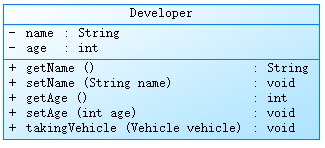
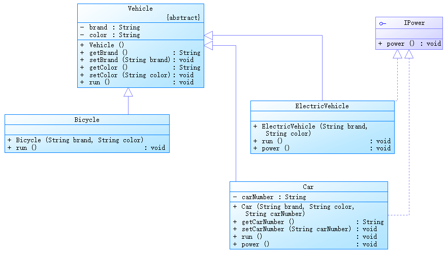

# 第08章 面向对象高级

## 105 面向对象高级 关键字static修饰属性、方法

```text
static关键字的使用

1. static: 静态的。

2. static用来修饰的结构: 属性、方法、代码块、内部类。

3. static修饰属性:
    3.1 复习： 变量的分类
    方式1: 按照数据类型: 基本数据类型、引用数据类型

    方式2: 按照类中声明的位置:
        成员变量: 按照是否使用static修饰进行分类。
            使用static修饰的成员变量: 静态变量、类变量。
            不使用static修饰的成员变量: 非静态变量、实例变量。

        局部变量: 方法内、方法形参、构造器内，构造器形参，代码块内等。

    3.2 静态变量: 类中的属性使用static进行修饰。
        对比静态变量与实例变量:
        1) 个数
        > 静态变量: 在内存空间中只有一份，被类等多个对象所共享。
        > 实例变量: 类的每一个实例(或对象)都保存着一份实例变量。
        2) 内存位置
        > 静态变量: JDB6及之前，存放在方法区; JDK7及之后，存放在堆空间。
        > 实例变量: 存放在堆空间的对象实体中。
        3) 加载时机
        > 静态变量: 随着类的加载而加载。由于类只会加载一次，所以静态变量也只有一份。
        > 实例变量: 随着对象的创建而加载。每个对象拥有一份实例变量。
        4) 调用者
        > 静态变量: 可以被类直接调用，也可以使用对象调用。
        > 实例变量: 只能使用对象进行调用。
        5) 判断是否可以调用 --> 从生命周期的角度解释
                类变量         实例变量
        类       yes           no
        对象      yes           yes

        6) 消亡时机
        > 静态变量: 随着类的卸载而消亡。
        > 实例变量: 随着对象的消亡而消亡。

4. static修饰方法: (类方法、静态方法)

> 随着类的加载而加载。
> 可以通过"类.静态方法"的方式，直接调用静态方法。
> 静态方法内可以调用静态的属性或静态的方法。(属性和方法的前缀使用的是当前类，可以省略。)
        不可以调用非静态的结构。(比如: 属性、方法)

                类方法         实例方法
        类       yes           no
        对象      yes           yes

> 补充: 在类的非静态方法中，可以调用当前类的静态结构(属性、方法)或非静态结构(属性、方法)。
> static修饰的方法内，不能使用this和super。

5. 开发中，什么时候需要将属性声明为静态的？
    > 判断当前类的多个实例是否能共享此成员变量，且此成员变量的值是相同的。
    > 开发中，常将一些常量声明是静态的，比如: Math类中的PI。

    什么时候需要将方法声明为静态的？
    > 方法内操作的变量如果都是静态变量(而非实例变量)的话，则此方法建议声明为静态方法。
    > 开发中，常常将工具类中的方法，声明为静态方法。比如: Arrays类、Math类。
```


```java
package com.atguigu01._static;

public class ChineseTest {
    public static void main(String[] args) {

        System.out.println(Chinese.nation);
        Chinese.show();

        Chinese c1 = new Chinese();
        c1.name = "姚明";
        c1.age = 40;
        c1.nation = "China";

        Chinese c2 = new Chinese();
        c2.name = "刘翔";
        c2.age = 39;

        System.out.println(c1);
        System.out.println(c2);

        System.out.println(c1.nation);
        System.out.println(c2.nation);

        c2.nation = "CHN";
        System.out.println(c1.nation);
        System.out.println(c2.nation);

        c1.show();

        test();
    }

    public static void test() {
        System.out.println("我是static的测试方法");
    }
}

class Chinese { // 中国人类

    // 非静态变量
    String name;
    int age;

    // 静态变量、类变量
    static String nation = "中国";

    @Override
    public String toString() {
        return "Chinese{" +
                "name='" + name + '\'' +
                ", age=" + age +
                '}';
    }

    public void eat(String food) {
        System.out.println("我喜欢吃" + food);
    }

    public static void show() {
        System.out.println("我是一个中国人");

        // 调用静态的结构
        System.out.println("nation = " + nation);
        method1();

        // 调用非静态的结构
        // System.out.println("name = " + name);
        // this.eat("饺子");
    }

    public static void method1() {
        System.out.println("我是静态的测试方法");
    }

    public void method2() {
        System.out.println("我是非静态的测试方法");
        // 调用非静态的结构
        System.out.println("name = " + name);
        this.eat("饺子");

        // 调用静态的结构
        System.out.println("nation = " + Chinese.nation);
        Chinese.method1();
    }

    public static String getNation() {
        return nation;
    }

    public static void setNation(String nation) {
        Chinese.nation = nation;
    }
}
```

## 106 面向对象高级 static的应用举例及练习1 2

```java
package com.atguigu01._static.apply;

public class CircleTest {
    public static void main(String[] args) {
        Circle c1 = new Circle();
        System.out.println(c1);

        Circle c2 = new Circle();
        System.out.println(c2);

        Circle c3 = new Circle();
        System.out.println(c3);

        Circle c4 = new Circle(2.3);
        System.out.println(c4);

        System.out.println(Circle.total);
    }
}

class Circle {
    double radius;

    int id; // 编号

    static int total; // 创建的Circle实例的个数

    public Circle() {
        this.id = init;
        init++;
        total++;
    }

    public Circle(double radius) {
        this();
        this.radius = radius;
    }

    private static int init = 1001; // 自动给id赋值的基数

    @Override
    public String toString() {
        return "Circle{" +
                "id=" + id +
                ", radius=" + radius +
                '}';
    }
}
```

```text
编写一个类实现银行账户的概念，包含的属性有"账号"、"密码"、"存款余额"、"最小余额"，
定义封装这些属性的方法。账号要自动生成。

编写主类，使用银行账户类，输入、输出3个储户的上述信息。

考虑: 哪些属性可以设计成static属性。
```

```java
package com.atguigu01._static.exer1;

public class Account {

    private int id; // 账号
    private String password; // 密码
    private double balance; // 余额
    private static double interestRate; // 利率
    private static double minBalance = 1.0; // 最小余额

    private static int init = 1001; // 用于自动生成id的基数

    public Account() {
        this.id = init;
        init++;
        password = "000000";
    }

    public Account(String password, double balance) {
        this.password = password;
        this.balance = balance;
        this.id = init;
        init++;
    }

    public String getPassword() {
        return password;
    }

    public void setPassword(String password) {
        this.password = password;
    }

    public double getBalance() {
        return balance;
    }

    public void setBalance(double balance) {
        this.balance = balance;
    }

    public static double getInterestRate() {
        return interestRate;
    }

    public static void setInterestRate(double interestRate) {
        Account.interestRate = interestRate;
    }

    public static double getMinBalance() {
        return minBalance;
    }

    public static void setMinBalance(double minBalance) {
        Account.minBalance = minBalance;
    }

    @Override
    public String toString() {
        return "Account{" +
                "id=" + id +
                ", password='" + password + '\'' +
                ", balance=" + balance +
                '}';
    }
}
```

```java
package com.atguigu01._static.exer1;

public class AccountTest {
    public static void main(String[] args) {

        Account acct1 = new Account();
        System.out.println(acct1);

        Account acct2 = new Account("123456", 2000);
        System.out.println(acct2);

        Account.setInterestRate(0.0123);
        Account.setMinBalance(10);

        System.out.println("银行存款的利率为: " + Account.getInterestRate());
        System.out.println("银行最下存款额度为: " + Account.getMinBalance());
    }
}
```

```text
自定义一个数组的工具类，封装常用的数组算法。
```

```java
package com.atguigu01._static.exer2;

public class MyArrays {

    /**
     * 获取int[]数组的最大值
     *
     * @param arr 要获取最大值的数组
     * @return 数组的最大值
     */
    public static int getMax(int[] arr) {
        int max = arr[0];

        for (int i = 1; i < arr.length; i++) {
            if (arr[i] > max) {
                max = arr[i];
            }
        }
        return max;
    }

    /**
     * 获取int[]数组的最小值
     *
     * @param arr 要获取最小值的数组
     * @return 数组的最小值
     */
    public static int getMin(int[] arr) {
        int min = arr[0];
        for (int i = 1; i < arr.length; i++) {
            if (arr[i] < min) {
                min = arr[i];
            }
        }
        return min;
    }

    public static int getSum(int[] arr) {
        int sum = 0;

        for (int i : arr) {
            sum += i;
        }
        return sum;
    }

    public static int getAvg(int[] arr) {
        return getSum(arr) / arr.length;
    }

    public static void print(int[] arr) { // [12, 234, 45]
        System.out.print("[");
        for (int i = 0; i < arr.length; i++) {
            if (i != arr.length - 1) {
                System.out.print(arr[i] + ", ");
            } else {
                System.out.print(arr[i]);
            }
        }
        System.out.println("]");
    }

    public static int[] copy(int[] arr) {

        int[] newArr = new int[arr.length];

        for (int i = 0; i < arr.length; i++) {
            newArr[i] = arr[i];
        }
        return newArr;
    }

    public static void reverse(int[] arr) {
        for (int i = 0, j = arr.length - 1; i < j; i++, j--) {
            int temp = arr[i];
            arr[i] = arr[j];
            arr[j] = temp;
        }
    }

    public static void sort(int[] arr) {
        for (int i = 0; i < arr.length - 1; i++) {
            for (int j = 0; j < arr.length - 1 - i; j++) {
                if (arr[j] > arr[j + 1]) {
                    int temp = arr[j];
                    arr[j] = arr[j + 1];
                    arr[j + 1] = temp;
                }
            }
        }
    }

    /**
     * 使用线性查找的算法，查找指定的元素。
     *
     * @param arr    待查找的数组
     * @param target 要查找的元素
     * @return target元素在arr数组中的索引位置。若未找到，则返回-1。
     */
    public static int linearSearch(int[] arr, int target) {

        for (int i = 0; i < arr.length; i++) {
            if (target == arr[i]) {
                return i;
            }
        }
        // 只要代码执行到此位置，一定是没找到。
        return -1;
    }
}
```

```java
package com.atguigu01._static.exer2;

public class MyArraysTest {
    public static void main(String[] args) {

        int[] arr = new int[]{34, 56, 223, 2, 56, 24, 56, 67, 778, 45};

        // 求最大值
        System.out.println("最大值为:" + MyArrays.getMax(arr)); // 最大值为:778
        // 求平均值
        System.out.println("平均值为: " + MyArrays.getAvg(arr)); // 平均值为: 134
        // 遍历
        MyArrays.print(arr); // [34, 56, 223, 2, 56, 24, 56, 67, 778, 45]

        // 查找
        int index = MyArrays.linearSearch(arr, 24);
        if (index >= 0) {
            System.out.println("找到了，位置为: " + index); // 找到了，位置为: 5
        } else {
            System.out.println("未找到");
        }

        // 排序
        MyArrays.sort(arr);
        // 遍历
        MyArrays.print(arr); // [2, 24, 34, 45, 56, 56, 56, 67, 223, 778]
    }
}
```

- 面试题

```java
package com.atguigu01._static.interview;

/**
 * 判断如下程序运行时是否会报错？
 *
 * @author 尚硅谷-宋红康
 * @create 19:16
 */
public class StaticTest {
    public static void main(String[] args) {
        Order order = null;
        order.hello(); // hello!
        System.out.println(order.count); // 1
    }
}

class Order {
    public static int count = 1;

    public static void hello() {
        System.out.println("hello!");
    }
}
```

## 107 面向对象高级 单例设计模式与main的理解

```text
1. 设计模式概述:
设计模式是在大量的实践中总结和理论化之后优选的代码结构、编程风格、以及解决问题的思考方式。
设计模式免去我们自己再思考和摸索，就像是经典的棋谱，不同的棋局，我们用不同的棋谱。"套路"

经典的设计模式一共有23种。

2. 何为单例模式(Singleton Pattern):
所谓类的单例模式，就是采取一定的方法保证在整个软件系统中，对于某个类只能存在一个对象实例，
并且该类中只提供一个取得其对象实例的方法。

3. 如何实现单例模式(掌握):

> 饿汉式

> 懒汉式

4. 对比两种模式(特点、优缺点)
特点:
    > 饿汉式: "立即加载"，随着类的加载，当前的唯一实例就创建了。
    > 懒汉式: "延迟加载"，在需要使用的时候，进行创建。

优缺点:
    > 饿汉式: (优点)写法简单，由于内存中较早加载，使用更方便、更快。是线程安全的。(缺点)内存中占用时间较长。
    > 懒汉式: (缺点)是线程不安全的。(放到多线程章节时解决) (优点)在需要的时候进行创建，节省内存空间。
```

```java
package com.atguigu02.singleton;

public class BankTest {
    public static void main(String[] args) {
        // Bank bank1 = new Bank();
        // Bank bank2 = new Bank();

        Bank bank1 = Bank.getInstance();
        Bank bank2 = Bank.getInstance();

        System.out.println(bank1 == bank2); // true
    }
}

// 饿汉式
class Bank {

    // 1. 类的构造器私有化
    private Bank() {

    }

    // 2. 在类的内部创建当前类的实例
    // 4. 此属性也必须声明为static的。
    private static Bank instance = new Bank();

    // 3. 使用getXxx()方法获取当前类的实例，必须声明为static的。
    public static Bank getInstance() {
        return instance;
    }
}
```

```java
package com.atguigu02.singleton;

public class GirlFriendTest {
    public static void main(String[] args) {
        GirlFriend g1 = GirlFriend.getInstance();
        GirlFriend g2 = GirlFriend.getInstance();

        System.out.println(g1 == g2); // true
    }
}

// 懒汉式
class GirlFriend {

    // 1. 类的构造器私有化。
    private GirlFriend() {
    }

    // 2. 声明当前类的实例。
    // 4. 此属性也必须声明为static的。
    private static GirlFriend instance = null;

    // 3. 通过getXxx()获取当前类的实例，如果未创建对象，则在方法内部进行创建
    public static GirlFriend getInstance() {
        if (instance == null) {
            instance = new GirlFriend();
        }
        return instance;
    }
}
```

```text
main()方法的剖析
public static void main(String[] args) {}

1. 理解1: 看作是一个普通的静态方法。
   理解2: 看作是程序的入口，格式是固定的。

2. 与控制台交互
如何从键盘获取数据?
> 方式1: 使用Scanner。
> 方式2: 使用main()的形参进行传值。
```

```java
package com.atguigu03.main;

public class MainTest {
    public static void main(String[] args) { // 程序的入口
        String[] arr = new String[]{"AA", "BB", "CC"};
        Main.main(arr);
    }
}

class Main {
    public static void main(String[] args) { // 看作时普通的静态方法
        System.out.println("Main的main()的调用");
        for (int i = 0; i < args.length; i++) {
            System.out.println(args[i]);
        }
    }
}
```

```java
package com.atguigu03.main;

public class MainDemo {
    public static void main(String[] args) {
        for (int i = 0; i < args.length; i++) {
            System.out.println("hello: " + args[i]);
        }
    }
}
```

## 108 面向对象高级 类的成员之四: 代码块

```text
类的成员之四: 代码块

回顾: 类中可以声明的结构: 属性、方法、构造器; 代码块(或初始化块)、内部类。

1. 代码块(或初始化块)的作用:
用来初始化类或对象的信息(即初始化类或对象的成员变量)。

2. 代码块的修饰:
    只能使用static进行修饰。

3. 代码块的分类:
    静态代码块: 使用static修饰。
    非静态代码块: 没有使用static修饰。

4. 具体使用:
4.1 静态代码块:
    > 随着类的加载而执行。
    > 由于类的加载只会执行一次，进而静态代码块的执行，也只会执行一次。
    > 作用: 用来初始化类的信息。
    > 内部可以声明变量、调用属性或方法、编写输出语句等操作。
    > 静态代码块的执行要先于非静态代码块。
    > 如果声明有多个静态代码块，则按照声明的先后顺序执行。
    > 静态代码块内部只能调用静态的结构(即静态的属性、方法)，不能调用非静态的结构(即非静态的属性、方法)。

4.2 非静态代码块:
    > 随着对象的创建而执行。
    > 每创建当前类的一个实例，就会执行一次非静态代码块。
    > 作用: 用来初始化对象的信息。
    > 内部可以声明变量、调用属性或方法、编写输出语句等操作。
    > 如果声明有多个非静态代码块，则按照声明的先后顺序执行。
    > 非静态代码块内部可以调用静态的结构(即静态的属性、方法)，也可以调用非静态的结构(即非静态的属性、方法)。
```

```java
package com.atguigu04.block;

public class BlockTest {
    public static void main(String[] args) {
        System.out.println(Person.info);
        System.out.println(Person.info);

        Person p1 = new Person();
        Person p2 = new Person();
        System.out.println(p1.age); // 1
        // p1.eat();
    }
}

class Person {

    String name;
    int age;

    static String info = "我是一个人";

    public void eat() {
        System.out.println("人吃饭");
    }

    public Person() {
    }

    // 非静态代码块
    {
        System.out.println("非静态代码块1");
        age = 1;
        System.out.println("info = " + info);
    }

    {
        System.out.println("非静态代码块2");
    }

    // 静态代码块
    static {
        System.out.println("静态代码块1");
        System.out.println("info = " + info);
        // System.out.println("age = " + age);
        // eat();
    }

    static {
        System.out.println("静态代码块2");
    }
}
```

```text
(1) 声明User类:

- 包含属性: userName(String类型)，password(String类型)，registrationTime(long类型)，私有化。

- 包含get/set方法，其中registrationTime没有set方法。

- 包含无参构造器:
    - 输出"新用户注册"。
    - registrationTime赋值为当前系统时间。
    - userName默认为当前系统时间值。
    - password默认为"123456"。

- 包含有参构造器(String userName, String password):
    - 输出"新用户注册"。
    - registrationTime赋值为当前系统时间。
    - userName和password由参数赋值。

- 包含public String getInfo()方法，返回: "用户名: xx, 密码: xx, 注册时间: xx"

(2) 编写测试类，测试类main方法的代码。
```

```java
package com.atguigu04.block.exer;

public class User {

    private String userName;
    private String password;
    private long registrationTime; // 注册时间

    public String getUserName() {
        return userName;
    }

    public void setUserName(String userName) {
        this.userName = userName;
    }

    public String getPassword() {
        return password;
    }

    public void setPassword(String password) {
        this.password = password;
    }

    public long getRegistrationTime() {
        return registrationTime;
    }

    public void setRegistrationTime(long registrationTime) {
        this.registrationTime = registrationTime;
    }

    public User() {
        System.out.println("新用户注册");
        registrationTime = System.currentTimeMillis(); // 获取系统当前时间(距离1970-1-1 00:00:00的毫秒数)
        userName = System.currentTimeMillis() + "";
        password = "123456";
    }

    public User(String userName, String password) {
        System.out.println("新用户注册");
        registrationTime = System.currentTimeMillis();
        this.userName = userName;
        this.password = password;
    }

    public String getInfo() {
        return "用户名: " + userName + ", 密码: " + password + ", 注册时间: " + registrationTime;
    }
}
```

- 使用非静态代码块的实例:

```java
package com.atguigu04.block.exer;

public class User1 {

    private String userName;
    private String password;
    private long registrationTime; // 注册时间

    public String getUserName() {
        return userName;
    }

    public void setUserName(String userName) {
        this.userName = userName;
    }

    public String getPassword() {
        return password;
    }

    public void setPassword(String password) {
        this.password = password;
    }

    public long getRegistrationTime() {
        return registrationTime;
    }

    public void setRegistrationTime(long registrationTime) {
        this.registrationTime = registrationTime;
    }

    // 代码块的使用
    {
        System.out.println("新用户注册");
        registrationTime = System.currentTimeMillis(); // 获取系统当前时间(距离1970-1-1 00:00:00的毫秒数)
    }


    public User1() {
        userName = System.currentTimeMillis() + "";
        password = "123456";
    }

    public User1(String userName, String password) {
        this.userName = userName;
        this.password = password;
    }

    public String getInfo() {
        return "用户名: " + userName + ", 密码: " + password + ", 注册时间: " + registrationTime;
    }
}
```

```java
package com.atguigu04.block.exer;

public class UserTest {
    public static void main(String[] args) {
        User u1 = new User();
        System.out.println(u1.getInfo());
        // 新用户注册
        // 用户名: 1777730009956, 密码: 123456, 注册时间: 1777730009956

        User u2 = new User("Tom", "654321");
        System.out.println(u2.getInfo());
        // 新用户注册
        // 用户名: Tom, 密码: 654321, 注册时间: 1777730009975

        User u3 = new User();
        System.out.println(u3.getInfo());
        // 新用户注册
        // 用户名: 1777730009976, 密码: 123456, 注册时间: 1777730009976
    }
}
```

## 109 面向对象高级 小结: 类中属性赋值的位置及过程

```text
1. 可以给类的非静态的属性(即实例变量)赋值的位置有:
    1) 默认初始化
    2) 显式初始化 或 5) 代码块中初始化
    3) 构造器中初始化
    **********************
    4) 有了对象以后，通过"对象.属性"或"对象.方法"的方式进行赋值

2. 执行的先后顺序:
    1) -> 2) / 5) -> 3) -> 4)

3. (超纲)关于字节码文件中的<init>的简单说明: (通过插件jclasslib bytecode viewer查看)
> <init>方法在字节码文件中可以看到，每个<init>方法都对应着一个类的构造器。(类中声明了几个构造器就会有几个<init>方法)
> 编写的代码中的构造器在编译以后就会以<init>方法的方式呈现。
> <init>方法内部的代码包含了实例变量的显示赋值、代码块中的赋值和构造器中的代码。
> <init>方法用来初始化当前创建的对象的信息的。

4. 给实例变量赋值的位置很多，开发中如何选？

> 显示赋值: 比较适合于每个对象的属性值相同的场景。
> 构造器中赋值: 比较适合于每个对象的属性值不同的场景。
```

```java
package com.atguigu05.field;

public class FieldTest {
    public static void main(String[] args) {
        Order order = new Order();
        System.out.println(order.orderId);
    }
}

class Order {

    {
        orderId = 2;
    }

    int orderId = 1;

    public Order() {
        orderId = 3;
    }

    public Order(int orderId) {
        this.orderId = orderId;
    }

    public void eat() {
        sleep();
    }

    public void sleep() {
    }
}
```

```java
package com.atguigu05.field.exer;

//技巧： 由父及子，静态先行。

class Root {
    static {
        System.out.println("Root的静态初始化块");
    }

    {
        System.out.println("Root的普通初始化块");
    }

    public Root() {
        System.out.println("Root的无参数的构造器");
    }
}

class Mid extends Root {
    static {
        System.out.println("Mid的静态初始化块");
    }

    {
        System.out.println("Mid的普通初始化块");
    }

    public Mid() {
        System.out.println("Mid的无参数的构造器");
    }

    public Mid(String msg) {
        //通过this调用同一类中重载的构造器
        this();
        System.out.println("Mid的带参数构造器，其参数值："
                + msg);
    }
}

class Leaf extends Mid {
    static {
        System.out.println("Leaf的静态初始化块");
    }

    {
        System.out.println("Leaf的普通初始化块");
    }

    public Leaf() {
        //通过super调用父类中有一个字符串参数的构造器
        super("尚硅谷");
        System.out.println("Leaf的构造器");
    }
}

public class LeafTest {
    public static void main(String[] args) {
        new Leaf();
        System.out.println();
        new Leaf();
    }
}
```

```java
package com.atguigu05.field.interview;

/**
 * @author 尚硅谷-宋红康
 * @create 16:03
 */
class HelloA {
    public HelloA() {
        System.out.println("HelloA");
    }

    {
        System.out.println("I'm A Class");
    }

    static {
        System.out.println("static A");
    }
}

class HelloB extends HelloA {
    public HelloB() {
        System.out.println("HelloB");
    }

    {
        System.out.println("I'm B Class");
    }

    static {
        System.out.println("static B");
    }
}

public class Test01 {
    public static void main(String[] args) {
        new HelloB();
    }
    /*
    static A
    static B
    I'm A Class
    HelloA
    I'm B Class
    HelloB
     */
}
```

```java
package com.atguigu05.field.interview;

/**
 * 阅读代码，分析运行结果
 *
 * @author 尚硅谷-宋红康
 * @create 16:02
 */
public class Test02 {
    static int x, y, z;

    static {
        int x = 5;
        x--;
    }

    static {
        x--;
    }

    public static void method() {
        y = z++ + ++z; // z = -1;   z++ -> z = 0   z = 1 y = 0; z = 1;   1 + 2 = 3
    }

    public static void main(String[] args) {
        System.out.println("x = " + x); // x=4
        z--;
        method();
        System.out.println("result: " + (z + y + ++z)); // result: 3
    }
}
```

```java
package com.atguigu05.field.interview;

/**
 * @author 尚硅谷-宋红康
 * @create 16:03
 */
public class Test03 {
    public static void main(String[] args) {
        Sub s = new Sub();
        /*
        base
        sub : 100
        sub
        base : 70
         */
    }
}

class Base {
    Base() {
        method(100);
    }

    {
        System.out.println("base");
    }

    public void method(int i) {
        System.out.println("base : " + i);
    }
}

class Sub extends Base {
    Sub() {
        super.method(70);
    }

    {
        System.out.println("sub");
    }

    public void method(int j) {
        System.out.println("sub : " + j);
    }
}
```

## 110 面向对象高级 关键字final的使用及真题

```text
final关键字的使用

1. final的理解: 最终的。

2. final可以用来修饰的结构: 类、方法、变量。

3. 具体说明:
3.1 final修饰类: 表示此类不能被继承。
    比如: String、StringBuilder、StringBuffer。

3.2 final修饰方法: 表示此方法不能被重写。
    比如: Object类中的getClass()。

3.3 final修饰变量: 既可以修饰成员变量，也可以修饰局部变量。
    此时的"变量"其实就变成了"常量"，意味着一旦赋值，就不可更改。

    3.3.1 final修饰成员变量: 在哪些位置可以给成员变量赋值？
        > 显式赋值
        > 代码块中赋值
        > 构造器中赋值

    3.3.2 final修饰局部变量: 一旦赋值就不能修改。
        > 方法内声明的局部变量: 在调用局部变量前，一定要赋值。而且一旦赋值，就不可更改。
        > 方法的形参: 在调用此方法时，给形参进行赋值。而且一旦赋值，就不可更改。

4. final与static搭配: 修饰成员变量时，此成员变量称为: 全局常量。
```

```java
package com.atguigu06._final;

public class FinalTest {
    public static void main(String[] args) {
        E e = new E();
        System.out.println(e.MIN_SCORE);
        // e.MIN_SCORE = 1;

        E e1 = new E(10);
    }
}

class E {
    // 成员变量
    final int MIN_SCORE = 0;

    final int MAX_SCORE;

    final int LEFT;
    // final int RIGHT;

    {
        // MIN_SCORE = 1;
        MAX_SCORE = 100;
    }

    public E() {
        LEFT = 2;
    }

    public E(int left) {
        LEFT = left;
    }

    // public void setRight(int right) {
    //     RIGHT = right;
    // }
}

class F {
    public void method() {
        final int num;
        num = 10;
        // num++;
        System.out.println(num);
    }

    public void method(final int num) {
        // num++;
        System.out.println(num);
    }
}

final class A {

}

// class B extends A {
// }

// class SubString extends String {
// }

class C {
    public final void method() {
    }
}

class D extends C {
    // @Override
    // public void method() {
    //     super.method();
    // }
}
```

```text
题目1: 排错
public class Something {
    public int addOne(final int x) {
        return ++x;
        // return x + 1;
    }
}

题目2: 排错
public class Something {
    public static void main(String[] args) {
        Other o = new Other();
        new Something().addOne(o);
    }

    public void addOne(final Other o) {
        // o = new Other();
        o.i++;
    }
}
```

## 111 面向对象高级 抽象类与抽象方法的使用

```text
抽象类与抽象方法

1. 案例引入
举例1: GeometricObject-Circle-Rectangle

abstract class GeometricObject { // 几何图形

    // 求面积 (只能考虑提供方法的声明，而没有办法提供方法体。所以，此方法适合声明为抽象方法)

    // 求周长 (只能考虑提供方法的声明，而没有办法提供方法体。所以，此方法适合声明为抽象方法)
}

class Circle extends GeometricObject {

    // 求面积 (必须重写(或实现)父类中的抽象方法)

    // 求周长 (必须重写(或实现)父类中的抽象方法)
}

class Rectangle extends GeometricObject {

    // 求面积 (必须重写(或实现)父类中的抽象方法)

    // 求周长 (必须重写(或实现)父类中的抽象方法)
}


举例2: Account-SavingAccount-CheckAccount

abstract class Account {
    double balance; // 余额

    // 取钱 (声明为抽象方法)

    // 存钱 (声明为抽象方法)
}

class SavingAccount extends Account { // 储蓄卡
    // 取钱 (需要重写父类的抽象方法)

    // 存钱 (需要重写父类的抽象方法)
}

class CheckAccount extends Account { // 信用卡
    // 取钱 (需要重写父类的抽象方法)

    // 存钱 (需要重写父类的抽象方法)
}

2. abstract的概念: 抽象的。

3. abstract可以用来修饰: 类、方法。

4. 具体的使用:
4.1 abstract修饰类:
    > 此类称为抽象类。
    > 抽象类不能实例化。
    > 抽象类中是包含构造器的，因为子类对象实例化时，需要直接或间接地调用到父类的构造器。
    > 抽象类中可以没有抽象方法。反之，抽象方法所在的类，一定是抽象类。

4.2 abstract修饰方法:
    > 此方法即为抽象方法。
    > 抽象方法只有方法的声明，没有方法体。
    > 抽象方法其功能是确定的(通过方法的声明即可确定)，只是不知道如何具体实现(体现为没有方法体)。
    > 子类必须重写父类中的所有的抽象方法之后，方可实例化。否则，此子类仍然是一个抽象类。

5. abstract不能使用的场景:
5.1 abstract不能修饰哪些结构？
属性、构造器、代码块等。

5.2 abstract不能修饰哪些结构？(自洽)
不能用abstract修饰私有方法、静态方法、final的方法、final的类。
> 私有方法不能重写。
> 避免静态方法使用类进行调用。
> final的方法不能被重写。
> final修饰的类不能有子类。
```

```java
package com.atguigu07._abstract;

public abstract class Creature { // 生物类

    public abstract void breath(); // 呼吸
}
```

```java
package com.atguigu07._abstract;

public abstract class Person extends Creature { // 抽象类

    String name;
    int age;

    public Person() {
    }

    public Person(String name, int age) {
        this.name = name;
        this.age = age;
    }

    public abstract void eat(); // 抽象方法

    public abstract void sleep();
}
```

```java
package com.atguigu07._abstract;

public class Student extends Person {

    String school;

    public Student() {
    }

    public Student(String name, int age, String school) {
        super(name, age);
        this.school = school;
    }

    public void eat() {
        System.out.println("学生多吃有营养的食物");
    }

    public void sleep() {
        System.out.println("学生要保证充足的睡眠");
    }

    @Override
    public void breath() {
        System.out.println("学生应该多呼吸新鲜空气");
    }
}
```

```java
package com.atguigu07._abstract;

public abstract class Worker extends Person {

    @Override
    public void eat() {
        System.out.println("工人很辛苦，多吃");
    }

}
```

```java
package com.atguigu07._abstract;

public class AbstractTest {
    public static void main(String[] args) {

        // Person p1 = new Person();
        // p1.eat();

        Student s1 = new Student();
        s1.eat();

        // Worker worker = new Worker();
    }
}
```

## 112 面向对象高级 模板方法设计模式及抽象课后练习

```java
package com.atguigu07._abstract.template;

// 抽象应用案例: 模版方法的设计模式
public class TemplateTest {
    public static void main(String[] args) {
        PrintPrimeNumber p = new PrintPrimeNumber();

        p.spendTime();
    }
}

abstract class Template {

    // 计算某段代码的执行需要花费的时间
    public void spendTime() {

        long start = System.currentTimeMillis();

        code();

        long end = System.currentTimeMillis();

        System.out.println("花费的时间为: " + (end - start));
    }

    public abstract void code();
}

class PrintPrimeNumber extends Template {

    @Override
    public void code() {

        for (int i = 0; i < 10000; i++) {
            boolean isFlag = true;
            for (int j = 2; j <= Math.sqrt(i); j++) {
                if (i % j == 0) {
                    isFlag = false;
                    break;
                }
            }
            if (isFlag) {
                System.out.println(i);
            }
        }
    }
}
```

```java
package com.atguigu07._abstract.template;

//抽象类的应用：模板方法的设计模式
public class TemplateMethodTest {

    public static void main(String[] args) {
        BankTemplateMethod btm = new DrawMoney();
        btm.process();

        BankTemplateMethod btm2 = new ManageMoney();
        btm2.process();
    }
}

abstract class BankTemplateMethod {
    // 具体方法
    public void takeNumber() {
        System.out.println("取号排队");
    }

    public abstract void transact(); // 办理具体的业务

    public void evaluate() {
        System.out.println("反馈评分");
    }

    // 模板方法，把基本操作组合到一起，子类一般不能重写
    public final void process() {
        this.takeNumber();

        this.transact();// 像个钩子，具体执行时，挂哪个子类，就执行哪个子类的实现代码

        this.evaluate();
    }
}

class DrawMoney extends BankTemplateMethod {
    public void transact() {
        System.out.println("我要取款！！！");
    }
}

class ManageMoney extends BankTemplateMethod {
    public void transact() {
        System.out.println("我要理财！我这里有2000万美元!!");
    }
}
```

```text
针对多态性的练习题1，GeometricObject等类进行升级，体现抽象的使用。
```

```java
package com.atguigu07._abstract.exer1;

public abstract class GeometricObject {

    protected String color;
    protected double weight;

    protected GeometricObject(String color, double weight) {
        this.color = color;
        this.weight = weight;
    }

    public String getColor() {
        return color;
    }

    public void setColor(String color) {
        this.color = color;
    }

    public double getWeight() {
        return weight;
    }

    public void setWeight(double weight) {
        this.weight = weight;
    }

    public abstract double findArea();
}
```

```java
package com.atguigu07._abstract.exer1;

public class Circle extends GeometricObject {

    private double radius;

    public Circle(String color, double weight, double radius) {
        super(color, weight);
        this.radius = radius;
    }

    public double getRadius() {
        return radius;
    }

    public void setRadius(double radius) {
        this.radius = radius;
    }

    @Override
    public double findArea() {
        return 3.14 * radius * radius;
    }
}
```

```java
package com.atguigu07._abstract.exer1;

public class MyRectangle extends GeometricObject {

    private double width; // 宽
    private double height; // 高

    public MyRectangle(String color, double weight, double width, double height) {
        super(color, weight);
        this.width = width;
        this.height = height;
    }

    public double getWidth() {
        return width;
    }

    public void setWidth(double width) {
        this.width = width;
    }

    public double getHeight() {
        return height;
    }

    public void setHeight(double height) {
        this.height = height;
    }

    @Override
    public double findArea() {
        return width * height;
    }
}
```

```java
package com.atguigu07._abstract.exer1;

public class GeometricTest {

    public static void main(String[] args) {
        GeometricTest test = new GeometricTest();

        Circle c1 = new Circle("red", 1.0, 2.3);
        Circle c2 = new Circle("red", 1.0, 3.3);
        test.displayGeometricObject(c1);
        test.displayGeometricObject(c2);

        boolean isEquals = test.equalsArea(c1, c2);
        if (isEquals) {
            System.out.println("面积相等");
        } else {
            System.out.println("面积不相等"); // 输出
        }

        // 使用匿名对象
        test.displayGeometricObject(new MyRectangle("blue", 1.0, 2.3, 4.5));
    }

    /**
     * 比较两个集合几何图形的面积是否相等
     *
     * @param g1
     * @param g2
     * @return true: 表示面积相等  false: 面积不相等
     */
    public boolean equalsArea(GeometricObject g1, GeometricObject g2) {
        return g1.findArea() == g2.findArea();
    }

    /**
     * 显示几何图形的面积
     *
     * @param g
     */
    public void displayGeometricObject(GeometricObject g) { // GeometricObject g = new Circle("red", 1.0, 2.3);
        System.out.println("几何图形的面积为: " + g.findArea()); // 动态绑定 <---> 静态绑定
    }
}
```

```text
编写工资系统，实现不同类型员工(多态)的按月发放工资。如果当月出现某个Employee对象的生日，则将该雇员的工资增加100元。

实验说明：

（1）定义一个Employee类，该类包含：

private成员变量name,number,birthday，其中birthday 为MyDate类的对象；
提供必要的构造器；
abstract方法earnings(),返回工资数额；
toString()方法输出对象的name,number和birthday。

（2）MyDate类包含:
private成员变量year,month,day；
提供必要的构造器；
toDateString()方法返回日期对应的字符串：xxxx年xx月xx日

（3）定义SalariedEmployee类继承Employee类，实现按月计算工资的员工处理。
该类包括：private成员变量monthlySalary；
提供必要的构造器；
实现父类的抽象方法earnings(),该方法返回monthlySalary值；
toString()方法输出员工类型信息及员工的name，number,birthday。比如：SalariedEmployee[name = '',number = ,birthday=xxxx年xx月xx日]

（4）参照SalariedEmployee类定义HourlyEmployee类，实现按小时计算工资的员工处理。该类包括：
private成员变量wage和hour；
提供必要的构造器；
实现父类的抽象方法earnings(),该方法返回wage*hour值；
toString()方法输出员工类型信息及员工的name，number,birthday。

（5）定义PayrollSystem类，创建Employee变量数组并初始化，该数组存放各类雇员对象的引用。
利用循环结构遍历数组元素，输出各个对象的类型,name,number,birthday,以及该对象生日。
当键盘输入本月月份值时，如果本月是某个Employee对象的生日，还要输出增加工资信息。

//提示：
//定义People类型的数组People c1[]=new People[10];
//数组元素赋值
c1[0]=new People("John","0001",20);
c1[1]=new People("Bob","0002",19);
//若People有两个子类Student和Officer，则数组元素赋值时，可以使父类类型的数组元素指向子类。
c1[0]=new Student("John","0001",20,85.0);
c1[1]=new Officer("Bob","0002",19,90.5);
```

```java
package com.atguigu07._abstract.exer2;

public class MyDate {

    private int year;
    private int month;
    private int day;

    public MyDate() {
    }

    public MyDate(int year, int month, int day) {
        this.year = year;
        this.month = month;
        this.day = day;
    }

    public int getYear() {
        return year;
    }

    public void setYear(int year) {
        this.year = year;
    }

    public int getMonth() {
        return month;
    }

    public void setMonth(int month) {
        this.month = month;
    }

    public int getDay() {
        return day;
    }

    public void setDay(int day) {
        this.day = day;
    }

    public String toDateString() {
        return year + "年" + month + "月" + day + "日";
    }
}
```

```java
package com.atguigu07._abstract.exer2;

public abstract class Employee {

    private String name;
    private int number;
    private MyDate birthday;

    public Employee() {
    }

    public Employee(String name, int number, MyDate birthday) {
        this.name = name;
        this.number = number;
        this.birthday = birthday;
    }

    public String getName() {
        return name;
    }

    public void setName(String name) {
        this.name = name;
    }

    public int getNumber() {
        return number;
    }

    public void setNumber(int number) {
        this.number = number;
    }

    public MyDate getBirthday() {
        return birthday;
    }

    public void setBirthday(MyDate birthday) {
        this.birthday = birthday;
    }

    public abstract double earnings();

    @Override
    public String toString() {
        return "name = " + name + ", number = " + number + ", birthday = " + birthday.toDateString();
    }
}
```

```java
package com.atguigu07._abstract.exer2;

public class SalariedEmployee extends Employee {

    private double monthlySalary;

    public SalariedEmployee() {
    }

    public SalariedEmployee(String name, int number, MyDate birthday, double monthlySalary) {
        super(name, number, birthday);
        this.monthlySalary = monthlySalary;
    }

    // public double getMonthlySalary() {
    //     return monthlySalary;
    // }

    public void setMonthlySalary(double monthlySalary) {
        this.monthlySalary = monthlySalary;
    }

    @Override
    public double earnings() {
        return monthlySalary;
    }

    @Override
    public String toString() {
        return "SalariedEmployee[" + super.toString() + "]";
    }
}
```

```java
package com.atguigu07._abstract.exer2;

public class HourlyEmployee extends Employee {

    private double wage; // 单位小时的工资
    private int hour; // 月工作的小时数

    public HourlyEmployee() {
    }

    public HourlyEmployee(String name, int number, MyDate birthday, double wage, int hour) {
        super(name, number, birthday);
        this.wage = wage;
        this.hour = hour;
    }

    public double getWage() {
        return wage;
    }

    public void setWage(double wage) {
        this.wage = wage;
    }

    public int getHour() {
        return hour;
    }

    public void setHour(int hour) {
        this.hour = hour;
    }

    @Override
    public double earnings() {
        return wage * hour;
    }

    @Override
    public String toString() {
        return "HourlyEmployee[" + super.toString() + "]";
    }
}
```

```java
package com.atguigu07._abstract.exer2;

import java.util.Scanner;

public class PayrollSystem {
    public static void main(String[] args) {

        Scanner scan = new Scanner(System.in);

        Employee[] emps = new Employee[2];

        emps[0] = new SalariedEmployee("Harry", 1001, new MyDate(1980, 3, 12), 18000);
        emps[1] = new HourlyEmployee("Ron", 1002, new MyDate(1981, 2, 14), 20, 25);

        System.out.print("请输入当前的月份: ");
        int month = scan.nextInt();


        for (int i = 0; i < emps.length; i++) {
            System.out.println(emps[i].toString());
            System.out.println("工资为: " + emps[i].earnings());

            if (month == emps[i].getBirthday().getMonth()) {
                System.out.println("生日快乐! 加薪100！");
            }
        }

        scan.close();
    }
}
```

## 113 面向对象高级 接口的使用

```text
接口的使用

1. 接口的理解: 接口的本质是契约、标准、规范。就像我们的法律一样，制定好后大家都要遵守。

2. 定义接口的关键字: interface。

3. 接口内部结构的说明:
    > 可以声明:
        属性: 必须使用public static final修饰。(全局常量)
        方法: JDK8之前，声明抽象方法，修饰为public abstract。
             JDK8: 声明静态方法、默认方法。
             JDK9: 声明私有方法。

    > 不可以声明: 构造器、代码块等。

4. 接口与类的关系: 实现关系。

5. 格式: class A extends SuperA implements B, C {}

A相较于SuperA来讲，叫作子类。
A相较于B，C来讲，叫作实现类。

6. 满足此关系之后，说明:
> 类可以实现多个接口。
> 类针对于接口的多实现，一定程度上就弥补了类的单继承的局限性。
> 类必须将实现的接口中的所有的抽象方法都重写(或实现)，方可实例化。否则，此实现类必须声明为抽象类。

7. 接口与接口等关系: 继承关系，且可以多继承。

8. 接口的多态性: 接口名 变量名 = new 实现类对象;

9. 面试题: 区分抽象类和接口

> 共性: 都可以声明抽象方法;
       都不能实例化。

> 不同: 1) 抽象类一定有构造器; 接口没有构造器。
       2) 类与类之间是继承关系，类与接口之间是实现关系，接口与接口之间是多继承关系。
```

```java
package com.atguigu08._interface;

public class InterfaceTest {
    public static void main(String[] args) {

        System.out.println(Flyable.MIN_SPEED);

        System.out.println(Flyable.MAX_SPEED);

        // Flyable.MAX_SPEED = 7800;

        Bullet b1 = new Bullet();
        b1.fly();
        b1.attack();

        // 接口的多态性
        Flyable f1 = new Bullet();
        f1.fly();
    }
}

interface Flyable { // 接口
    // 全局常量
    public static final int MIN_SPEED = 0;

    // 可以省略public static final
    int MAX_SPEED = 7900;

    // 方法可以省略public abstract
    void fly();
}

interface Attackable { // 接口

    public abstract void attack();
}

abstract class Plane implements Flyable {

}

class Bullet implements Flyable, Attackable {
    @Override
    public void fly() {
        System.out.println("让子弹飞一会儿");
    }

    @Override
    public void attack() {
        System.out.println("子弹可以击穿身体");
    }
}

// 测试接口的继承关系
interface AA {
    void method1();
}

interface BB {
    void method2();
}

interface CC extends AA, BB { // 接口可以多继承
}

class DD implements CC {

    @Override
    public void method1() {

    }

    @Override
    public void method2() {

    }
}
```

```java
package com.atguigu08._interface.apply;

public class USBTest {
    public static void main(String[] args) {
        // 1. 创建接口实现类的对象
        Computer computer = new Computer();
        Printer printer = new Printer();
        computer.transferData(printer);

        // 2. 创建接口实现类的匿名对象
        computer.transferData(new Camera());

        // 3. 创建接口匿名实现类的对象
        USB usb1 = new USB() {
            public void start() {
                System.out.println("U盘开始工作");
            }

            public void stop() {
                System.out.println("U盘结束工作");
            }
        };
        computer.transferData(usb1);

        // 4. 创建接口匿名实现类的匿名对象
        computer.transferData(new USB() {
            @Override
            public void start() {
                System.out.println("扫描仪开始工作");
            }

            @Override
            public void stop() {
                System.out.println("扫描仪结束工作");

            }
        });
    }
}

class Computer {
    public void transferData(USB usb) { // 多态: USB usb = new Printer();
        System.out.println("设备连接成功...");

        usb.start();
        System.out.println("数据传输的细节操作...");
        usb.stop();
    }
}

class Camera implements USB {

    @Override
    public void start() {
        System.out.println("照相机开始工作");
    }

    @Override
    public void stop() {
        System.out.println("照相机开始工作");
    }
}

class Printer implements USB {

    @Override
    public void start() {
        System.out.println("打印机开始工作");
    }

    @Override
    public void stop() {
        System.out.println("打印机结束工作");
    }
}

interface USB {
    // 声明常量
    // USB的长、宽、高...

    // 方法
    public abstract void start();

    void stop();
}
```

## 114 面向对象高级 接口的课后练习1 2 3

```text
1. 声明接口Eatable，包含抽象方法public abstract void eat();
2. 声明实现类中国人Chinese，重写抽象方法，打印用筷子吃饭。
3. 声明实现类American，重写抽象方法，打印用刀叉吃饭。
4. 声明实现类Indian，重写抽象方法，打印用手吃饭。
5. 声明测试类EatableTest，创建Eatable数组，存储各国人对象，并遍历数组，调用eat()方法。
```

```java
package com.atguigu08._interface.exer1;

public interface Eatable {

    void eat();
}
```

```java
package com.atguigu08._interface.exer1;

public class Chinese implements Eatable {
    @Override
    public void eat() {
        System.out.println("中国人使用筷子吃饭");
    }
}
```

```java
package com.atguigu08._interface.exer1;

public class American implements Eatable {
    @Override
    public void eat() {
        System.out.println("美国人使用刀叉吃饭");
    }
}
```

```java
package com.atguigu08._interface.exer1;

public class Indian implements Eatable {
    @Override
    public void eat() {
        System.out.println("印度人使用手抓饭");
    }
}
```

```java
package com.atguigu08._interface.exer1;

public class EatableTest {
    public static void main(String[] args) {
        Eatable[] eatables = new Eatable[3];

        // 多态性
        eatables[0] = new Chinese();
        eatables[1] = new American();
        eatables[2] = new Indian();

        for (int i = 0; i < eatables.length; i++) {
            eatables[i].eat();
        }
    }
}
```

```text
定义一个接口用来实现两个对象的比较。

interface CompareObject {
    // 若返回值是0，代表相等; 若为正数，代表当前对象大; 负数代表当前对象小。
    public int compareTo(Object o);
}


定义一个Circle类，声明radius属性，提供getter和setter方法。

定义一个ComparableCircle类，继承Circle类并且实现CompareObject接口。
在ComparableCircle类中给出接口中方法compareTo的实现体，用来比较两个圆的半径大小。

定义一个测试类InterfaceTest，创建两个ComparableCircle对象，调用compareTo方法比较两个类的半径大小。

拓展: 参照上述做法定义矩形类Rectangle和ComparableRectangle类，在ComparableRectangle类中
给出compareTo方法的实现，比较两个矩形的面积大小。
```

```java
package com.atguigu08._interface.exer2;

public interface CompareObject {
    // 若返回值是0，代表相等; 若为正数，代表当前对象大; 负数代表当前对象小。
    public int compareTo(Object o);
}
```

```java
package com.atguigu08._interface.exer2;

public class Circle {
    private double radius; // 半径

    public Circle() {
    }

    public Circle(double radius) {
        this.radius = radius;
    }

    public double getRadius() {
        return radius;
    }

    public void setRadius(double radius) {
        this.radius = radius;
    }

    @Override
    public String toString() {
        return "Circle{" +
                "radius=" + radius +
                '}';
    }
}
```

```java
package com.atguigu08._interface.exer2;

public class ComparableCircle extends Circle implements CompareObject {

    public ComparableCircle() {
    }

    public ComparableCircle(double radius) {
        super(radius);
    }

    // 根据对象的半径的大小，比较对象的大小。
    @Override
    public int compareTo(Object o) {
        if (this == o) {
            return 0;
        }

        if (o instanceof ComparableCircle) {
            ComparableCircle c = (ComparableCircle) o;
            // 错误的:
            // return (int) (this.getRadius() - c.getRadius());
            // 正确的写法1:
            // if (this.getRadius() > c.getRadius()) {
            //     return 1;
            // } else if (this.getRadius() < c.getRadius()) {
            //     return -1;
            // } else {
            //     return 0;
            // }
            // 正确的写法2:
            return Double.compare(this.getRadius(), c.getRadius());
        } else {
            return 2; // 如果输入的类型不匹配，则返回2。
            // throw new RuntimeException("输入的类型不匹配");
        }
    }
}
```

```java
package com.atguigu08._interface.exer2;

public class InterfaceTest {
    public static void main(String[] args) {

        ComparableCircle c1 = new ComparableCircle(2.3);
        ComparableCircle c2 = new ComparableCircle(5.3);

        int compareValue = c1.compareTo(c2);

        if (compareValue > 0) {
            System.out.println("c1对象大");
        } else if (compareValue < 0) {
            System.out.println("c2对象大");
        } else {
            System.out.println("c1和c2一样大");
        }
    }
}
```

```text
阿里的一个工程师Developer，结构见图。

其中，有一个乘坐交通工具的方法takingVehicle()，在此方法中调用交通工具的run()。
为了出行方便，他买了一辆捷安特自行车、一辆雅迪电动车和一辆奔驰轿车。这里涉及到的相关类及接口关系如图。

其中，电动车增加动力的方式是充电，轿车增加动力的方式是加油。在具体交通工具的run()中调用其所在类的相关属性信息。

请编写相关代码，并测试。

提示: 创建Vehicle[]数组，保存阿里工程师的三辆交通工具，并分别在工程师的takingVehicle()中调用。
```




```java
package com.atguigu08._interface.exer3;

public abstract class Vehicle {

    private String brand; // 品牌
    private String color; // 颜色

    public Vehicle() {
    }

    public Vehicle(String brand, String color) {
        this.brand = brand;
        this.color = color;
    }

    public String getBrand() {
        return brand;
    }

    public void setBrand(String brand) {
        this.brand = brand;
    }

    public String getColor() {
        return color;
    }

    public void setColor(String color) {
        this.color = color;
    }

    abstract void run();
}
```

```java
package com.atguigu08._interface.exer3;

public interface IPower {

    void power();
}
```

```java
package com.atguigu08._interface.exer3;

public class Bicycle extends Vehicle {

    public Bicycle() {
    }

    public Bicycle(String brand, String color) {
        super(brand, color);
    }

    @Override
    void run() {
        System.out.println("自行车通过人力脚蹬行驶");
    }
}
```

```java
package com.atguigu08._interface.exer3;

public class ElectricVehicle extends Vehicle implements IPower {

    public ElectricVehicle() {
    }

    public ElectricVehicle(String brand, String color) {
        super(brand, color);
    }

    @Override
    void run() {
        System.out.println("电动车通过电机驱动行驶");
    }

    @Override
    public void power() {
        System.out.println("电动车使用电力提供动力");
    }
}
```

```java
package com.atguigu08._interface.exer3;

public class Car extends Vehicle implements IPower {

    private String carNumber;

    public Car(String carNumber) {
        this.carNumber = carNumber;
    }

    public Car(String brand, String color, String carNumber) {
        super(brand, color);
        this.carNumber = carNumber;
    }

    public String getCarNumber() {
        return carNumber;
    }

    public void setCarNumber(String carNumber) {
        this.carNumber = carNumber;
    }

    @Override
    void run() {
        System.out.println("汽车通过内燃机行驶");
    }

    @Override
    public void power() {
        System.out.println("汽车通过汽油提供动力");
    }
}
```

```java
package com.atguigu08._interface.exer3;

public class Developer {

    private String name;
    private int age;

    public Developer() {
    }

    public Developer(String name, int age) {
        this.name = name;
        this.age = age;
    }

    public String getName() {
        return name;
    }

    public void setName(String name) {
        this.name = name;
    }

    public int getAge() {
        return age;
    }

    public void setAge(int age) {
        this.age = age;
    }

    public void takingVehicle(Vehicle vehicle) {
        vehicle.run();
    }
}
```

```java
package com.atguigu08._interface.exer3;

public class VehicleTest {
    public static void main(String[] args) {

        Developer developer = new Developer();

        // 创建三个交通工具，保存在数组中。
        Vehicle[] vehicles = new Vehicle[3];
        vehicles[0] = new Bicycle("捷安特", "骚红色");
        vehicles[1] = new ElectricVehicle("雅迪", "天蓝色");
        vehicles[2] = new Car("奔驰", "黑色", "沪Au888");

        for (int i = 0; i < vehicles.length; i++) {
            developer.takingVehicle(vehicles[i]);

            if (vehicles[i] instanceof IPower) {
                ((IPower) vehicles[i]).power();
            }
        }
    }
    /*
    自行车通过人力脚蹬行驶
    电动车通过电机驱动行驶
    电动车使用电力提供动力
    汽车通过内燃机行驶
    汽车通过汽油提供动力
     */
}
```

## 115 面向对象高级 JDK8和JDK9中接口的新特性

```java
package com.atguigu08._interface.jdk8;

public interface CompareA {

    // 属性: 声明为public static final
    // 方法: JDK8之前: 只能声明抽象方法

    // 方法: JDK8中: 静态方法
    public static void method1() {
        System.out.println("CompareA:北京");
    }

    // 方法: JDK8中: 默认方法
    public default void method2() {
        System.out.println("CompareA:上海");
    }

    public default void method3() {
        System.out.println("CompareA:广州");
    }

    public default void method4() {
        System.out.println("CompareA:深圳");
    }

    // JDK9的新特性: 定义私有方法
    private void method5() {
        System.out.println("我是接口中定义的私有方法");
    }
}
```

```java
package com.atguigu08._interface.jdk8;

public interface CompareB {

    public default void method3() {
        System.out.println("CompareB:广州");
    }
}
```

```java
package com.atguigu08._interface.jdk8;

public class SuperClass {

    public void method4() {
        System.out.println("SuperClass:深圳");
    }
}
```

```java
package com.atguigu08._interface.jdk8;

public class SubClass extends SuperClass implements CompareA, CompareB {

    @Override
    public void method2() {
        System.out.println("SubClass:上海");
    }

    @Override
    public void method3() {
        System.out.println("SubClass:广州");
    }

    public void method4() {
        System.out.println("SubClass:深圳");
    }

    public void method() {
        // 知识点5: 如何在子类(或实现类)中调用父类或接口中的被重写的方法
        method4(); // 调用自己类中的方法
        super.method4(); // 调用父类中的method4()方法

        method3(); // 调用自己类中的方法

        CompareA.super.method3(); // 调用接口CompareA中的默认方法
        CompareB.super.method3(); // 调用接口CompareB中的默认方法
    }
}
```

```java
package com.atguigu08._interface.jdk8;

public class SubClassTest {
    public static void main(String[] args) {

        // 知识点1: 接口中声明的静态方法只能被接口来调用，不能使用其实现类进行调用。
        CompareA.method1();
        // SubClass.method1();

        // 知识点2: 接口中声明的默认方法可以被实现类继承，实现类在没有重写此方法的情况下，默认调用接口中声明的默认方法。
        // 如果实现类重写了此方法，则调用的是自己重写的方法。
        SubClass s1 = new SubClass();
        s1.method2();

        // 知识点3: 类实现了两个接口，而两个接口中定义了同名同参数的默认方法。则实现类在没有重写此两个接口
        // 默认方法的情况下，会报错。 --> 接口冲突
        // 要求: 此时实现类必须要重写接口中定义的同名同参数的方法。
        s1.method3();

        // 知识点4: 子类(或实现类)继承了父类并实现了接口。父类和接口中声明了同名同参数的方法。(其中，接口中的方法
        // 是默认方法)。默认情况下，子类(或实现类)在没有重写此方法的情况下，调用的是父类中的方法。 --> 类优先原则
        s1.method4(); // SuperClass: 深圳
    }
}
```

## 116 面向对象高级 类的成员之五: 内部类

```text
类的成员之五: 内部类

1. 什么是内部类?
将一个类A定义在另一个类B里面，里面的那个类A就称为'内部类(Inner Class)'，类B则称为'外部类(Outer Class)'。

2. 什么需要内部类?
具体来说，当一个事物A的内部，还有一个部分需要一个完整的结构B进行描述，而这个内部的完整的结构B又只为外部事物A提供服务，
不在其他地方单独使用，那么整个内部的完整结构B最好使用内部类。

总的来说，遵循'高内聚、低耦合'的面向对象开发原则。

3. 内部类使用举例:
Thread类内部声明了State类，表示线程的生命周期。
HashMap类中声明了Node类，表示封装的key和value。

4. 内部类的分类: (参考变量的分类)
    > 成员内部类: 直接声明在外部类的里面。
        > 使用static修饰的: 静态的成员内部类。
        > 不使用static修饰的: 非静态的成员内部类。

    > 局部内部类: 声明在方法内、构造器内、代码块内的内部类。
        > 匿名的局部内部类
        > 非匿名的局部内部类

5. 内部类这节要讲的知识:
    > 成员内部类的理解
    > 如何创建成员内部类的实例
    > 如何在成员内部类中调用外部类的结构
    > 局部内部类的基本使用

6. 关于成员内部类的理解:
    > 从类的角度看:
        - 内部可以声明属性、方法、构造器、代码块、内部类等结构。
        - 此内部类可以声明父类，可以实现接口。
        - 可以使用final修饰。
        - 可以使用abstract修饰。

    > 从外部类的成员的角度看:
        - 在内部可以调用外部类的结构。比如: 属性、方法等。
        - 除了使用public、缺省权限修饰之外，还可以使用private、protected修饰。
        - 可以使用static修饰。

7. 关于局部内部类的理解:
```

```java
package com.atguigu09.inner;

public class OuterClassTest {
    public static void main(String[] args) {

        // 1. 创建Person的静态的成员内部类的实例
        Person.Dog dog = new Person.Dog();
        dog.eat();

        // 2. 创建Person的非静态的成员内部类的实例
        // Person.Bird bird = new Person.Bird() // 报错
        Person p1 = new Person();
        Person.Bird bird = p1.new Bird(); // 正确的
        bird.eat();
        bird.show("黄鹂");

        bird.show1();
    }
}

class Person { // 外部类
    String name = "Tom";
    int age = 1;

    // 静态的成员内部类
    static class Dog {
        public void eat() {
            System.out.println("狗吃骨头");
        }
    }

    // 非静态的成员内部类
    class Bird {
        String name = "啄木鸟";

        public void eat() {
            System.out.println("鸟吃虫子");
        }

        public void show(String name) {
            System.out.println("age = " + age); // 省略了Person.this
            System.out.println("name = " + name); // 黄鹂
            System.out.println("name = " + this.name); // 啄木鸟
            System.out.println("name = " + Person.this.name); // Tom
        }

        public void show1() {
            eat();
            this.eat();
            Person.this.eat();
        }
    }

    public void eat() {
        System.out.println("人吃饭");
    }

    public void method() {
        // 局部内部类
        class InnerClass1 {

        }
    }

    public Person() {
        // 局部内部类
        class InnerClass1 {
        }
    }
}
```

```java
package com.atguigu09.inner;

public class OuterClassTest1 {

    // 说明: 局部内部类的使用
    public void method1() {
        // 局部内部类
        class A {
            // 可以声明属性、方法等
        }
    }

    // 开发中的场景
    public Comparable getInstance() {
        // 提供实现了Comparable接口的类
        // 方式1: 提供了接口的实现类的对象
        // class MyComparable implements Comparable {
        //     @Override
        //     public int compareTo(Object o) {
        //         return 0;
        //     }
        // }

        // MyComparable m = new MyComparable();
        // return m;

        // 方式2: 提供了接口的实现类的匿名对象
        // class MyComparable implements Comparable {

        //     @Override
        //     public int compareTo(Object o) {
        //         return 0;
        //     }
        // }

        // return new MyComparable();

        // 方式3: 提供了接口的匿名实现类的对象
        // Comparable c = new Comparable() {
        //     @Override
        //     public int compareTo(Object o) {
        //         return 0;
        //     }
        // };
        // return c;

        // 方式4: 提供了接口的匿名实现类的匿名对象
        return new Comparable() {
            @Override
            public int compareTo(Object o) {
                return 0;
            }
        };
    }
}
```

```text
编写一个匿名内部类，它继承Object，并在匿名内部类中，声明一个方法public void test()打印尚硅谷。

请编写代码调用这个方法。
```

```java
package com.atguigu09.inner.exer;

public class ObjectTest {
    public static void main(String[] args) {
        // SubObject subObject = new SubObject();
        // subObject.test();

        // 提供一个继承Object的匿名子类的匿名对象
        new Object() {
            public void test() {
                System.out.println("尚硅谷");
            }
        }.test();

        // obj.test();
    }
}

class SubObject extends Object {
    public void test() {
        System.out.println("尚硅谷");
    }
}
```

```java
package com.atguigu09.inner;

public class OuterClassTest2 {
    public static void main(String[] args) {
        SubA a = new SubA();
        a.method();

        // 举例1: 提供接口匿名实现类的对象
        A a1 = new A() {
            @Override
            public void method() {
                System.out.println("匿名实现类重写的方法method()");
            }
        };

        a1.method();

        // 举例2: 提供接口匿名实现类的匿名对象
        new A() {
            @Override
            public void method() {
                System.out.println("匿名实现类重写的方法method()");
            }
        }.method();

        // 举例3:
        SubB s1 = new SubB();
        s1.method1();

        // 举例4: 提供了继承于抽象类的匿名子类的对象
        B b = new B() {

            @Override
            public void method1() {
                System.out.println("继承与抽象类的子类调用的方法");
            }
        };

        b.method1();
        System.out.println(b.getClass()); // class com.atguigu09.inner.OuterClassTest2$3
        System.out.println(b.getClass().getSuperclass()); // class com.atguigu09.inner.B

        // 举例5: 提供了继承于抽象类的匿名子类的匿名对象
        new B() {

            @Override
            public void method1() {
                System.out.println("继承于抽象类的子类调用的方法1");
            }
        }.method1();

        // 举例6:
        C c = new C();
        c.method2();

        // 举例7: 提供了一个继承于C的匿名子类的对象
        C c1 = new C() {
        };
        c1.method2();
        System.out.println(c1.getClass()); // class com.atguigu09.inner.OuterClassTest2$5
        System.out.println(c1.getClass().getSuperclass()); // class com.atguigu09.inner.C

        C c2 = new C() {
            @Override
            public void method2() {
                System.out.println("SubC");
            }
        };
        c2.method2(); // SubC
    }
}

interface A {
    public void method();
}

class SubA implements A {
    @Override
    public void method() {
        System.out.println("SubA");
    }
}

abstract class B {

    public abstract void method1();
}

class SubB extends B {
    @Override
    public void method1() {
        System.out.println("SubB");
    }
}

class C {
    public void method2() {
        System.out.println("C");
    }
}
```

## 117 面向对象高级 枚举类的两种定义方式及练习

```text
枚举类的使用

1. 枚举类的理解
枚举类型本质上也是一种类，只不过这个类的对象是有限的、固定的几个，不能让用户随意创建。

2. 举例:
- 星期: Monday(星期一)...Sunday(星期天)
- 性别: Man(男)、Woman(女)
- 月份: January(1月)......December(12月)
- 季节: Spring(春天)......Winter(冬天)
- 三原色: red(红色)、green(绿色)、blue(蓝色)
- 支付方式: Cash(现金)、WeChatPay(微信)、Alipay(支付宝)、BankCard(银行卡)、CreditCard(信用卡)
- 就职状态: Busy(忙碌)、Free(空闲)、Vocation(休假)、Dismission(离职)
- 订单状态: Nonpayment(未付款)、Paid(已付款)、Fulfilled(已配货)、Delivered(已发货)、Checked(已确认收货)、Return(退货)、Exchange(换货)、Cancel(取消)
- 线程状态: 创建、就绪、运行、阻塞、死亡

3. 开发中的建议:
> 开发中，如果针对于某个类，其实例是确定个数的，则推荐将此类声明为枚举类。
> 如果枚举类的实例只有一个，则可以看作是单里的实现方式。

4. JDK5.0之前如何自定义枚举类 (了解)
见代码

5. JDK5.0中使用enum定义枚举类
见代码

6. Enum中的常用方法:
6.1 使用enum关键字定义的枚举类，默认的父类是java.lang.Enum类。
    使用enum关键字定义的枚举类，不要在显式地指定其父类，否则报错。

6.2 熟悉Enum类中常用的方法
    - String toString(): 默认返回的是常量名(对象名)，可以继续手动重写该方法。
    - (关注) static 枚举类型[] values(): 返回枚举类型的对象数组。该方法可以很方便地遍历所有的枚举值，是一个家庭方法。
    - (关注) static 枚举类型 valueOf(String name): 可以把一个字符串转为对应的枚举类对象。要求字符串必须是枚举类对象的"名字"。
        如果不是，会有运行时异常: IllegalArgumentException。
    - String name(): 得到当前枚举常量的名称。建议优先使用toString()。
    - int ordinal(): 返回当前枚举常量的次序号，默认从0开始。

7. 枚举类实现接口的操作
    情况1: 枚举类实现接口，在枚举类中重写接口中的抽象方法。当通过不同的枚举类对象调用此方法时，执行的是同一个方法。
    情况2: 让枚举类的每一个对象重写接口中的抽象方法。当通过不同的枚举类对象调用此方法时，执行的是不同的实现的方法。
```

```java
package com.atguigu10._enum;

public class SeasonTest {
    public static void main(String[] args) {
        // Season.SPRING = null;

        System.out.println(Season.SPRING);
        System.out.println(Season.SUMMER.getSeasonName());
        System.out.println(Season.SUMMER.getSeasonDesc());
    }
}

// JDK5.0之前定义枚举类的方式
class Season {

    // 2. 声明当前类的对象的实例变量，使用private final修饰。
    private final String seasonName; // 季节的名称
    private final String seasonDesc; // 季节的描述

    // 1. 私有化类的构造器
    private Season(String seasonName, String seasonDesc) {
        this.seasonName = seasonName;
        this.seasonDesc = seasonDesc;
    }

    // 3. 提供实例变量的get方法
    public String getSeasonName() {
        return seasonName;
    }

    public String getSeasonDesc() {
        return seasonDesc;
    }

    // 4. 创建当前类的实例，需要使用public static final修饰。
    public static final Season SPRING = new Season("春天", "春暖花开");
    public static final Season SUMMER = new Season("夏天", "夏日炎炎");
    public static final Season AUTUMN = new Season("秋天", "秋高气爽");
    public static final Season WINTER = new Season("冬天", "白雪皑皑");

    @Override
    public String toString() {
        return "Season{" +
                "seasonName='" + seasonName + '\'' +
                ", seasonDesc='" + seasonDesc + '\'' +
                '}';
    }
}
```

```java
package com.atguigu10._enum;

public class SeasonTest1 {
    public static void main(String[] args) {
        // System.out.println(Season1.SPRING.getClass()); // class com.atguigu10._enum.Season1
        // System.out.println(Season1.SPRING.getClass().getSuperclass()); // class java.lang.Enum
        // System.out.println(Season1.SPRING.getClass().getSuperclass().getSuperclass()); // class java.lang.Object

        // 测试方法
        // 1. toString()
        System.out.println(Season1.SPRING);
        System.out.println(Season1.AUTUMN);

        // 2. name()
        System.out.println(Season1.SPRING.name()); // SPRING

        // 3. values()
        Season1[] values = Season1.values();
        for (int i = 0; i < values.length; i++) {
            System.out.println(values[i]);
        }

        // 4. valueOf(String objName): 返回当前枚举类中名称为objName的枚举类对象。
        // 如果枚举类中不存在objName名称的对象，则报错。
        String objName = "WINTER";
        // objName = "WINTER1"; // IllegalArgumentException
        Season1 season1 = Season1.valueOf(objName);
        System.out.println(season1);

        // 5. ordinal()
        System.out.println(Season1.AUTUMN.ordinal());

        // 通过枚举类的对象调用重写接口中的方法
        Season1.SUMMER.show(); // 这是一个季节
    }
}

interface Info {
    void show();
}

// JDK5.0中使用enum关键字定义枚举类
enum Season1 implements Info {
    // 1. 必须在枚举类的开头明多个对象，对象之间使用,分隔。
    SPRING("春天", "春暖花开"),
    SUMMER("夏天", "夏日炎炎"),
    AUTUMN("秋天", "秋高气爽"),
    WINTER("冬天", "白雪皑皑");

    // 2. 声明当前类的对象的实例变量，使用private final修饰。
    private final String seasonName; // 季节的名称
    private final String seasonDesc; // 季节的描述

    // 3. 私有化类的构造器
    private Season1(String seasonName, String seasonDesc) {
        this.seasonName = seasonName;
        this.seasonDesc = seasonDesc;
    }

    // 4. 提供实例变量的get方法
    public String getSeasonName() {
        return seasonName;
    }

    public String getSeasonDesc() {
        return seasonDesc;
    }

    @Override
    public String toString() {
        return "Season1{" +
                "seasonName='" + seasonName + '\'' +
                ", seasonDesc='" + seasonDesc + '\'' +
                '}';
    }

    @Override
    public void show() {
        System.out.println("这是一个季节");
    }
}
```

```java
package com.atguigu10._enum;

public class SeasonTest2 {
    public static void main(String[] args) {
        Season2[] values = Season2.values();
        for (int i = 0; i < values.length; i++) {
            values[i].show();
        }
    }
}

interface Info1 {
    void show();
}

// JDK5.0中使用enum关键字定义枚举类
enum Season2 implements Info1 {
    // 1. 必须在枚举类的开头明多个对象，对象之间使用,分隔。
    SPRING("春天", "春暖花开") {
        @Override
        public void show() {
            System.out.println("春天在哪里");
        }
    },
    SUMMER("夏天", "夏日炎炎") {
        @Override
        public void show() {
            System.out.println("宁静的夏天");
        }
    },
    AUTUMN("秋天", "秋高气爽") {
        @Override
        public void show() {
            System.out.println("秋意浓");
        }
    },
    WINTER("冬天", "白雪皑皑") {
        @Override
        public void show() {
            System.out.println("大约在冬季");
        }
    };

    // 2. 声明当前类的对象的实例变量，使用private final修饰。
    private final String seasonName; // 季节的名称
    private final String seasonDesc; // 季节的描述

    // 3. 私有化类的构造器
    private Season2(String seasonName, String seasonDesc) {
        this.seasonName = seasonName;
        this.seasonDesc = seasonDesc;
    }

    // 4. 提供实例变量的get方法
    public String getSeasonName() {
        return seasonName;
    }

    public String getSeasonDesc() {
        return seasonDesc;
    }

    @Override
    public String toString() {
        return "Season1{" +
                "seasonName='" + seasonName + '\'' +
                ", seasonDesc='" + seasonDesc + '\'' +
                '}';
    }
}
```

- 应用

```java
package com.atguigu10._enum.apply;

/*
定义公司中员工的状态
 */
public enum Status {
    BUSY, FREE, VOCATION, DISMISSION;
}
```

```java
package com.atguigu10._enum.apply;

public class Employee {

    private String name;
    private int age;
    private Status status;

    public Employee() {
    }

    public Employee(String name, int age, Status status) {
        this.name = name;
        this.age = age;
        this.status = status;
    }

    public String getName() {
        return name;
    }

    public void setName(String name) {
        this.name = name;
    }

    public int getAge() {
        return age;
    }

    public void setAge(int age) {
        this.age = age;
    }

    public Status getStatus() {
        return status;
    }

    public void setStatus(Status status) {
        this.status = status;
    }

    @Override
    public String toString() {
        return "Employee{" +
                "name='" + name + '\'' +
                ", age=" + age +
                ", status=" + status +
                '}';
    }
}
```

```java
package com.atguigu10._enum.apply;

public class EmployeeTst {
    public static void main(String[] args) {

        Employee e1 = new Employee("Tom", 21, Status.BUSY);
        System.out.println(e1);
    }
}
```

- 练习

```text
案例: 使用枚举类实现单例模式。
```

```java
package com.atguigu10._enum.exer1;

public class BankTest1 {
    public static void main(String[] args) {
        // Bank1.instance = null;
        System.out.println(GirlFriend.XIAO_LI); // XIAO_LI
    }
}

// JDK5.0之前使用枚举类定义单例模式
class Bank1 {

    private Bank1() {
    }

    public static final Bank1 instance = new Bank1();
}

// JDK5.0使用enum关键字定义枚举的方式类实现单例模式
enum Bank2 {
    CPB;
}

enum GirlFriend {

    XIAO_LI(18);

    private final int age;

    private GirlFriend(int age) {
        this.age = age;
    }
}
```

```text
案例: 颜色枚举类Color(使用enum声明)

1. 声明颜色枚举类: 7个常量对象: RED, ORANGE, YELLOW, GREEN, CYAN, BLUE, PURPLE;

2. 在测试类中，使用枚举类，获取绿色对象，并打印对象。
```

```java
package com.atguigu10._enum.exer2;

public enum Color {
    RED, ORANGE, YELLOW, GREEN, CYAN, BLUE, PURPLE;
}
```

```java
package com.atguigu10._enum.exer2;

public class ColorTest {
    public static void main(String[] args) {
        System.out.println(Color.GREEN);
    }
}
```

```text
案例拓展: 颜色枚举类(使用enum声明)

(1) 声明颜色枚举类 Color:

- 声明final修饰的int类型的属性red, green, blue。
- 声明final修饰的String类型的属性description。
- 声明有参构造器Color(int red, int green, int blue, String description)。
- 创建7个常量对象: 红、橙、黄、绿、青、蓝、紫。
- 重写toString()方法，例如: RED(255, 0, 0) -> 红色。

(2) 在测试类中，使用枚举类，获取绿色对象，并打印对象。

提示:
- 7个常量对象的RGB值如下:
红: (255, 0, 0)
橙: (255, 128, 0)
黄: (255, 255, 0)
绿: (0, 255, 0)
青: (0, 255, 255)
蓝: (0, 0, 255)
紫: (128, 0, 255)

7个常量对象名如下:
RED, ORANGE, YELLOW, GREEN, CYAN, BLUE, PURPLE;
```

```java
package com.atguigu10._enum.exer3;

public class ColorTest {
    public static void main(String[] args) {
        System.out.println(Color.GREEN);
    }
}

enum Color {
    RED(255, 0, 0, "红色"),
    ORANGE(255, 128, 0, "橙色"),
    YELLOW(255, 255, 0, "黄色"),
    GREEN(0, 255, 0, "绿色"),
    CYAN(0, 255, 255, "青色"),
    BLUE(0, 0, 255, "蓝色"),
    PURPLE(128, 0, 255, "紫色");

    private final int red;
    private final int green;
    private final int blue;
    private final String description; // 颜色的描述

    Color(int red, int green, int blue, String description) {
        this.red = red;
        this.green = green;
        this.blue = blue;
        this.description = description;
    }

    public int getRed() {
        return red;
    }

    public int getGreen() {
        return green;
    }

    public int getBlue() {
        return blue;
    }

    public String getDescription() {
        return description;
    }

    @Override
    public String toString() {
        // return this.name() + "(" + red + ", " + green + ", " + blue + ") -> " + description;
        return super.toString() + "(" + red + ", " + green + ", " + blue + ") -> " + description;
    }
}
```

## 118 面向对象高级 Annotation注解、单元测试的使用

```text
注解的使用

1. Annotation的理解
> 注解(Annotation)是从JDK5.0开始引入，以'@注解名'在代码中存在。
> Annotation可以像修饰符一样被使用，可用于修饰包、类、构造器、方法、成员变量、参数局部变量的声明。
    还可以添加一些参数值，这些信息被保存在Annotation的"name=value"对中。
> 注解可以在类编译、运行时进行加载，体现不同的功能。

2. 注解的应用场景:
示例1: 生成文档相关的注解。
示例2: 在编译时进行格式检查(JDK内置的三个基本注解)。
示例3: 跟踪代码依赖性，实现替代配置文件功能。

3. Java基础涉及到的三个常用的注解
@Override: 限定重写父类方法，该注解只能用于方法。
@Deprecated: 用于表示所修饰的元素(类、方法等)已过时。通常是因为所修饰的结构危险或存在更好的选择。
@SuppressWarnings: 抑制编译器警告。

4. 自定义注解
以@SuppressWarnings为参照，进行定义即可。

5. 元注解的理解:
元注解: 对现有的注解进行解释说明的注解。

讲4个元注解:
(1) @Target: 用于描述注解的使用范围。
可以通过枚举类型ElementType的10个常量对象来指定。
TYPE, METHOD, CONSTRUCTOR, PACKAGE...

(2) @Retention: 用于描述注解的生命周期。
可以通过枚举类型RetentionPolicy的3个常量对象来指定。
SOURCE(源代码)、CLASS(字节码)、RUNTIME(运行时)
唯有RUNTIME阶段才能被反射读取到。

(3) @Documented: 表明这个注解应该被javadoc工具记录。
(4) @Inherited: 允许子类继承父类中的注解。


拓展: 元数据。
String name = "Tom";

框架 = 注解 + 反射 + 设计模式
```

```java
package com.atguigu11.annotation;

import java.lang.annotation.Retention;
import java.lang.annotation.RetentionPolicy;
import java.lang.annotation.Target;

import static java.lang.annotation.ElementType.*;

@Target({TYPE, FIELD, METHOD, CONSTRUCTOR})
@Retention(RetentionPolicy.RUNTIME)
public @interface MyAnnotation {
    String value() default "hello";
}
```

```java
package com.atguigu11.annotation;

import java.util.Date;

public class AnnotationTest {
    public static void main(String[] args) {
        Person p1 = new Student();
        p1.walk();

        Date date = new Date();
        System.out.println(date);

        Date date1 = new Date(2022, 11, 29); // @Deprecated
        System.out.println(date1);

        Person p2 = new Person();
        Person p3 = new Person("Tom");
        System.out.println(p3);

        @SuppressWarnings("unused") // 抑制编译器警告
        int num = 10;
    }
}

@MyAnnotation(value="class")
class Person {
    String name;
    int age;

    @MyAnnotation()
    public Person() {
    }

    @Deprecated
    public Person(String name) {
        this.name = name;
    }

    public void eat() {
        System.out.println("人吃饭");
    }

    public void walk() {
        System.out.println("人走路");
    }

    @Override
    public String toString() {
        return "Person{" +
                "name='" + name + '\'' +
                ", age=" + age +
                '}';
    }
}

class Student extends Person {
    @Override
    public void eat() {
        System.out.println("学生吃饭");
    }

    @Override
    public void walk() {
        System.out.println("学生走路");
    }
}
```

```text
JUnit单元测试的使用

1. 需要导入的jar包:
> JUnit4

2. 导入步骤
使用IDEA直接导入

3. 创建单元测试类，进行测试
见代码

4. (重点关注)想要能正确地编写单元测试方法，需要满足:
- 所在的类必须是public的，非抽象的，包含唯一的无参构造器。
- @Test标记的方法本身必须是public，非抽象的，非静态的，void无返回值，()无参数的。

5. 默认情况下，单元测试方法中使用Scanner实效。如何解决？
菜单Help -> Edit Custom VM options...中加入下面的内容:
    -Deditable.java.test.console=true

6. 大家可以将单元测试方法设置为一个模板。
步骤:
    - Command + , 进入设置 -> Editor -> Live Templates
    - 点击 + 创建一个组: CustomDefine。
    - 在创建好的组中创建一个Live Template。
    - 在Abbreviation中输入'test'，在Description中输入'自动生成单元测试的方法'。
    - 在Template Text中输入如下内容:
        @Test
        public void test$var1$() {
            $end$
        }
    - 点击下方的Define文本按钮后，选择Java。
    - 点击OK。
```

```java
package com.atguigu11.annotation.junit;

import org.junit.Test;

import java.util.Scanner;

public class JUnitTest { // 单元测试类

    public static void main(String[] args) {
        JUnitTest test = new JUnitTest();
        System.out.println(test.number);
        test.method();
    }

    int number = 10;

    // public JUnitTest() {
    // }

    // public JUnitTest(int id) {
    // }

    @Test
    public void test1() { //  单元测试方法
        System.out.println("Hello");
    }

    @Test
    public void test2() {
        System.out.println("hello1");
        System.out.println("number = " + number);

        method();

        int num = showInfo("China");
        System.out.println(num);
    }

    public void method() {
        System.out.println("method()...");
    }

    public int showInfo(String info) {
        System.out.println(info);
        return 10;
    }

    @Test
    public void test3() {
        Scanner scan=new Scanner(System.in);

        System.out.println("请输入一个数值: ");
        String num = scan.next();
        System.out.println(num);
    }
}
```

## 119 面向对象高级 包装类的理解 基本数据类型与包装类间的转换

```text
包装类的使用

1. 为什么要使用包装类？
为了使得基本数据类型的变量具备引用数据类型变量的相关特征(比如: 封装性、继承性，多态性)，
我们给各个基本数据类型的变量都提供了对应的包装类。

2. (掌握) 基本数据类型对应的包装类类型
byte -> Byte
short -> Short
int -> Integer
long -> Long
float -> Float
double -> Double

char -> Character
boolean -> Boolean

3. 掌握基本数据类型 与 包装类之间的转换。
    3.1 为什么需要转换
        > 一方main，在有些场景下，需要使用基本数据类型对应的包装类的对象。此时就需要将基本数据类型的变量转换为包装类的对象。
            比如: ArrayList的add(Object obj); Object类的equals(Object obj)。
        > 对于包装类来讲，既然我们使用的是对象，那么对象是不能进行+ - * /等运算的。为了能够进行这些运算，就需要将包装类的对象
            转换为基本数据类型的变量。

    3.2 如何转换:
        (装箱) 基本数据类型 --> 包装类: 1) 使用包装类的构造器 2) (建议) 调用包装类的valueOf(xxx xx)
        (拆箱) 包装类 --> 基本数据类型: 调用包装类的xxxValue()

    注意: 原来使用基本数据类型变量的位置，改成包装类以后，对于成员变量来说，其默认值变了！

    JDK5.0新特性: 自动装箱、自动拆箱。

4. String 与 基本数据类型、包装类之间的转换。
    基本数据类型、包装类 --> String类型: 1) 调用String的重载的静态方法valueOf(xxx xx); 2) 基本数据类型的变量 + “”

    String类型 --> 基本数据类型、包装类: 调用包装类的静态方法: parseXxx()
```

```java
package com.atguigu12.wrapper;

import org.junit.Test;

public class WrapperTest {

    /*
    基本数据类型 --> 包装类: 1) 使用包装类的构造器 2) (建议) 调用包装类的valueOf(xxx xx)
    包装类 --> 基本数据类型: 调用包装类的xxxValue()
     */
    @Test
    public void test4() {
        // 自动装箱: 基本数据类型 --> 包装类
        int i1 = 10;
        Integer ii1 = i1; // 自动装箱
        System.out.println(ii1.toString());

        Integer ii2 = i1 + 1; // 自动装箱

        Boolean bb1 = true; // 自动装箱

        Float f1 = 12.3F; // 自动装箱

        // 自动拆箱
        int i2 = ii1; // 自动拆箱

        boolean b1 = bb1; // 自动拆箱
    }

    @Test
    public void test3() {
        Account account = new Account();
        System.out.println(account.isFlag1); // false
        System.out.println(account.isFlag2); // null

        System.out.println(account.balance1); // 0.0
        System.out.println(account.balance2); // nul
    }

    @Test
    public void test2() {
        Integer ii1 = new Integer(10);
        int i1 = ii1.intValue();
        i1 = i1 + 1;

        Float ff1 = new Float(12.3F);
        float f1 = ff1.floatValue();

        Boolean bb1 = Boolean.valueOf(true);
        boolean b1 = bb1.booleanValue();
    }

    @Test
    public void test1() {
        int i1 = 10;
        Integer ii1 = new Integer(i1); // 过时
        System.out.println(ii1.toString());

        float f1 = 12.3f;
        Float ff1 = new Float(f1);
        System.out.println(ff1.toString());

        String s1 = "32.1";
        Float ff2 = new Float(s1);
        System.out.println(ff2);

        // s1 = "abc";
        // Float ff3 = new Float(s1); // 报异常: NumberFormatException

        boolean b1 = true;
        Boolean bb1 = new Boolean(b1);
        System.out.println(bb1);

        String s2 = "false";
        s2 = "False123";
        s2 = "TrUe";
        Boolean bb2 = new Boolean(s2);
        System.out.println(bb2); // false -> true

        // 推荐使用:
        int i2 = 10;
        Integer ii2 = Integer.valueOf(i2);

        Boolean b2 = Boolean.valueOf(true);
    }
}

class Account {
    boolean isFlag1;
    Boolean isFlag2;

    double balance1; // 0.0
    Double balance2; // null
}
```

## 120 面向对象高级 String与基本数据类型、包装类的转换及练习

```text
利用Vector代替数组处理: 从键盘读入学生成绩(以负数代表输入结果)，找出最高分，并输出学生成绩等级。

提示: 数组一旦创建，长度就固定不变，所以在创建数组前就需要知道它的长度。 而向量类java.util.Vector可以根据需要动态伸缩。

1. 创建Vector对象: Vector v = new Vector();
2. 给向量添加元素: v.addElement(Object obj); // obj必须是对象
3. 取出向量中的元素: Object obj = v.elementAt(0);
    注意第一个元素的下标是0，返回值是Object类型的。
4. 计算向量的长度: v.size();
5. 若与最高分相差10分内: A等; 20分内: B等; 30分内: C等; 其他: D等。
```

```java
package com.atguigu12.wrapper.exer1;

import java.util.Scanner;
import java.util.Vector;

public class ScoreTest {
    public static void main(String[] args) {
        // 1. 创建Vector对象: Vector v = new Vector();
        Vector v = new Vector();

        Scanner scanner = new Scanner(System.in);

        int maxScore = 0; // 记录最高分
        // 2. 从键盘获取多个学生成绩，存放到v中 (以负数代表输入结束)
        while (true) { // for(;;)
            System.out.print("请输入学生成绩(以负数代表结束): ");
            int intScore = scanner.nextInt();

            if (intScore < 0) {
                break;
            }

            // 装箱: int --> Integer对象
            // Integer score = Integer.valueOf(intScore);
            // 添加学生成绩到容器v中
            // v.addElement(score);

            // JDK5.0之后: 自动装箱
            v.addElement(intScore);

            // 3. 获取学生成绩的最大值
            if (maxScore < intScore) {
                maxScore = intScore;
            }
        }

        System.out.println("最高分: " + maxScore);

        // 4. 依次获取v中的每个学生成绩，与最高分进行比较，获取学生等级，并输出。
        for (int i = 0; i < v.size(); i++) {
            Object objScore = v.elementAt(i);
            // 方式1:
            // Integer integerScore = (Integer) objScore;
            // 拆箱
            // int score = integerScore.intValue();

            // 方式2: 自动拆箱
            int score = (Integer) objScore;

            char grade;
            if (maxScore - score <= 10) {
                grade = 'A';
            } else if (maxScore - score <= 20) {
                grade = 'B';
            } else if (maxScore - score <= 30) {
                grade = 'C';
            } else {
                grade = 'D';
            }

            System.out.println("student " + i + " score is " + score + " grade is " + grade);
        }

        scanner.close();
    }
}
```

- 面试题

```java
package com.atguigu12.wrapper.interview;

//说明：如果赋值的值在[-128,+127]范围内，则Integer对象使用的是IntegerCache中数组cache中的元素

public class InterviewTest1 {
    public static void main(String[] args) {

        Integer i = new Integer(1);
        Integer j = new Integer(1);
        System.out.println(i == j);// false

        // 底层都会调用Integer的valueOf()
        Integer m = 1; //自动的装箱
        Integer n = 1;
        System.out.println(m == n);// true

        Integer x = 128;
        Integer y = 128;
        System.out.println(x == y);// false
    }
}
```

```java
package com.atguigu12.wrapper.interview;

/**
 * 判断如下程序的执行结果
 *
 * @author 尚硅谷-宋红康
 * @create 12:50
 */
public class InterviewTest2 {
    public static void main(String[] args) {
        //题目1：
        int i = 10;
        double d = 10.2;
        System.out.println(i == d);// false
        //题目2：
        Integer i1 = 10;
        Double d1 = 10.2;
        // System.out.println(i1 == d1);// 编译报错

        //题目3: 拆箱
        Integer m = 1000;
        double n = 1000;
        System.out.println(m == n);// true

        //题目4：
        Integer x = 1000;
        int y = 1000;
        System.out.println(x == y);// true
    }
}
```

```java
package com.atguigu12.wrapper.interview;

public class InterviewTest3 {
    public static void main(String[] args) {
        Object o1 = true ? new Integer(1) : new Double(2.0);
        System.out.println(o1);// 1.0

        Object o2;
        if (true)
            o2 = new Integer(1);
        else
            o2 = new Double(2.0);
        System.out.println(o2);// 1
    }
}
```

## 121 面向对象高级 IDEA中快捷键的使用和修改

```text
第1组：通用型
说明             快捷键
--------------------------------
复制代码-copy     ctrl + c
粘贴-paste       ctrl + v
剪切-cut         ctrl + x
撤销-undo        ctrl + z
反撤销-redo      ctrl + shift + z
保存-save all    ctrl + s
全选-select all  ctrl + a

第2组：提高编写速度（上）
说明                                                快捷键
-------------------------------------------------------------------
智能提示-edit                                       alt + enter
提示代码模板-insert live template                    ctrl+j
使用xx块环绕-surround with ...                      ctrl+alt+t
调出生成getter/setter/构造器等结构-generate ...       alt+insert
自动生成返回值变量-introduce variable ...             ctrl+alt+v
复制指定行的代码-duplicate line or selection          ctrl+d
删除指定行的代码-delete line                          ctrl+y
切换到下一行代码空位-start new line                   shift + enter
切换到上一行代码空位-start new line before current    ctrl +alt+ enter
向上移动代码-move statement up                       ctrl+shift+↑
向下移动代码-move statement down                     ctrl+shift+↓
向上移动一行-move line up                            alt+shift+↑
向下移动一行-move line down                          alt+shift+↓
方法的形参列表提醒-parameter info                     ctrl+p

第3组：提高编写速度（下）
说明                                         快捷键
---------------------------------------------------------
批量修改指定的变量名、方法名、类名等-rename        shift+f6
抽取代码重构方法-extract method ...            ctrl+alt+m
重写父类的方法-override methods ...            ctrl+o
实现接口的方法-implements methods ...          ctrl+i
选中的结构的大小写的切换-toggle case             ctrl+shift+u
批量导包-optimize imports                     ctrl+alt+o

第4组：类结构、查找和查看源码
说明                                                      快捷键
-----------------------------------------------------------------------------------------
如何查看源码-go to class...                             ctrl + 选中指定的结构 或 ctrl+n
显示当前类结构，支持搜索指定的方法、属性等-file structure     ctrl+f12
退回到前一个编辑的页面-back                               ctrl+alt+←
进入到下一个编辑的页面-forward                            ctrl+alt+→
打开的类文件之间切换-select previous/next tab             alt+←/→
光标选中指定的类，查看继承树结构-Type Hierarchy             ctrl+h
查看方法文档-quick documentation                        ctrl+q
类的UML关系图-show uml popup                            ctrl+alt+u
定位某行-go to line/column                              ctrl+g
回溯变量或方法的来源-go to implementation(s)              ctrl+alt+b
折叠方法实现-collapse all                                ctrl+shift+ -
展开方法实现-expand all                                  ctrl+shift+ +

第5组：查找、替换与关闭
说明                                               快捷键
--------------------------------------------------------------
查找指定的结构                                       ctrl+f
快速查找：选中的Word快速定位到下一个-find next           ctrl+l
查找与替换-replace                                   ctrl+r
直接定位到当前行的首位-move caret to line start        home
直接定位到当前行的末位 -move caret to line end         end
查询当前元素在当前文件中的引用，然后按 F3 可以选择          ctrl+f7
全项目搜索文本-find in path ...                      ctrl+shift+f

第6组：调整格式
说明                                          快捷键
--------------------------------------------------------------
格式化代码-reformat code                        ctrl+alt+l
使用单行注释-comment with line comment          ctrl + /
使用/取消多行注释-comment with block comment     ctrl + shift + /
选中数行，整体往后移动-tab                        tab
选中数行，整体往前移动-prev tab                   shift + tab
```
