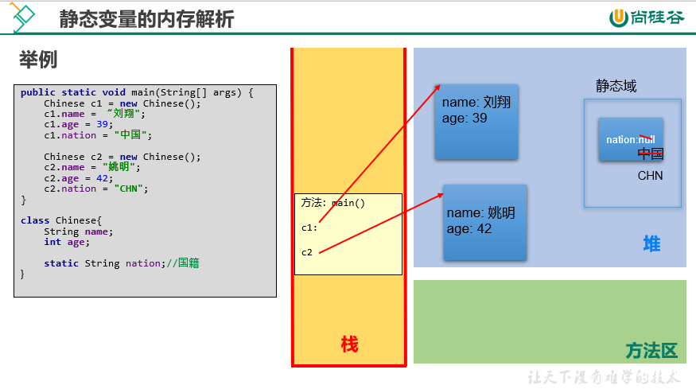

# 第08章 面向对象高级

## 105 面向对象高级 关键字static修饰属性、方法

```text
static关键字的使用

1. static: 静态的。

2. static用来修饰的结构: 属性、方法、代码块、内部类。

3. static修饰属性:
    3.1 复习： 变量的分类
    方式1: 按照数据类型: 基本数据类型、引用数据类型

    方式2: 按照类中声明的位置:
        成员变量: 按照是否使用static修饰进行分类。
            使用static修饰的成员变量: 静态变量、类变量。
            不使用static修饰的成员变量: 非静态变量、实例变量。

        局部变量: 方法内、方法形参、构造器内，构造器形参，代码块内等。

    3.2 静态变量: 类中的属性使用static进行修饰。
        对比静态变量与实例变量:
        1) 个数
        > 静态变量: 在内存空间中只有一份，被类等多个对象所共享。
        > 实例变量: 类的每一个实例(或对象)都保存着一份实例变量。
        2) 内存位置
        > 静态变量: JDB6及之前，存放在方法区; JDK7及之后，存放在堆空间。
        > 实例变量: 存放在堆空间的对象实体中。
        3) 加载时机
        > 静态变量: 随着类的加载而加载。由于类只会加载一次，所以静态变量也只有一份。
        > 实例变量: 随着对象的创建而加载。每个对象拥有一份实例变量。
        4) 调用者
        > 静态变量: 可以被类直接调用，也可以使用对象调用。
        > 实例变量: 只能使用对象进行调用。
        5) 判断是否可以调用 --> 从生命周期的角度解释
                类变量         实例变量
        类       yes           no
        对象      yes           yes

        6) 消亡时机
        > 静态变量: 随着类的卸载而消亡。
        > 实例变量: 随着对象的消亡而消亡。

4. static修饰方法: (类方法、静态方法)

> 随着类的加载而加载。
> 可以通过"类.静态方法"的方式，直接调用静态方法。
> 静态方法内可以调用静态的属性或静态的方法。(属性和方法的前缀使用的是当前类，可以省略。)
        不可以调用非静态的结构。(比如: 属性、方法)

                类方法         实例方法
        类       yes           no
        对象      yes           yes

> 补充: 在类的非静态方法中，可以调用当前类的静态结构(属性、方法)或非静态结构(属性、方法)。
> static修饰的方法内，不能使用this和super。

5. 开发中，什么时候需要将属性声明为静态的？
    > 判断当前类的多个实例是否能共享此成员变量，且此成员变量的值是相同的。
    > 开发中，常将一些常量声明是静态的，比如: Math类中的PI。

    什么时候需要将方法声明为静态的？
    > 方法内操作的变量如果都是静态变量(而非实例变量)的话，则此方法建议声明为静态方法。
    > 开发中，常常将工具类中的方法，声明为静态方法。比如: Arrays类、Math类。
```



```java
package com.atguigu01._static;

public class ChineseTest {
    public static void main(String[] args) {

        System.out.println(Chinese.nation);
        Chinese.show();

        Chinese c1 = new Chinese();
        c1.name = "姚明";
        c1.age = 40;
        c1.nation = "China";

        Chinese c2 = new Chinese();
        c2.name = "刘翔";
        c2.age = 39;

        System.out.println(c1);
        System.out.println(c2);

        System.out.println(c1.nation);
        System.out.println(c2.nation);

        c2.nation = "CHN";
        System.out.println(c1.nation);
        System.out.println(c2.nation);

        c1.show();

        test();
    }

    public static void test() {
        System.out.println("我是static的测试方法");
    }
}

class Chinese { // 中国人类

    // 非静态变量
    String name;
    int age;

    // 静态变量、类变量
    static String nation = "中国";

    @Override
    public String toString() {
        return "Chinese{" +
                "name='" + name + '\'' +
                ", age=" + age +
                '}';
    }

    public void eat(String food) {
        System.out.println("我喜欢吃" + food);
    }

    public static void show() {
        System.out.println("我是一个中国人");

        // 调用静态的结构
        System.out.println("nation = " + nation);
        method1();

        // 调用非静态的结构
        // System.out.println("name = " + name);
        // this.eat("饺子");
    }

    public static void method1() {
        System.out.println("我是静态的测试方法");
    }

    public void method2() {
        System.out.println("我是非静态的测试方法");
        // 调用非静态的结构
        System.out.println("name = " + name);
        this.eat("饺子");

        // 调用静态的结构
        System.out.println("nation = " + Chinese.nation);
        Chinese.method1();
    }

    public static String getNation() {
        return nation;
    }

    public static void setNation(String nation) {
        Chinese.nation = nation;
    }
}
```

## 106 面向对象高级 static的应用举例及练习1 2

```java
package com.atguigu01._static.apply;

public class CircleTest {
    public static void main(String[] args) {
        Circle c1 = new Circle();
        System.out.println(c1);

        Circle c2 = new Circle();
        System.out.println(c2);

        Circle c3 = new Circle();
        System.out.println(c3);

        Circle c4 = new Circle(2.3);
        System.out.println(c4);

        System.out.println(Circle.total);
    }
}

class Circle {
    double radius;

    int id; // 编号

    static int total; // 创建的Circle实例的个数

    public Circle() {
        this.id = init;
        init++;
        total++;
    }

    public Circle(double radius) {
        this();
        this.radius = radius;
    }

    private static int init = 1001; // 自动给id赋值的基数

    @Override
    public String toString() {
        return "Circle{" +
                "id=" + id +
                ", radius=" + radius +
                '}';
    }
}
```

```text
编写一个类实现银行账户的概念，包含的属性有"账号"、"密码"、"存款余额"、"最小余额"，
定义封装这些属性的方法。账号要自动生成。

编写主类，使用银行账户类，输入、输出3个储户的上述信息。

考虑: 哪些属性可以设计成static属性。
```

```java
package com.atguigu01._static.exer1;

public class Account {

    private int id; // 账号
    private String password; // 密码
    private double balance; // 余额
    private static double interestRate; // 利率
    private static double minBalance = 1.0; // 最小余额

    private static int init = 1001; // 用于自动生成id的基数

    public Account() {
        this.id = init;
        init++;
        password = "000000";
    }

    public Account(String password, double balance) {
        this.password = password;
        this.balance = balance;
        this.id = init;
        init++;
    }

    public String getPassword() {
        return password;
    }

    public void setPassword(String password) {
        this.password = password;
    }

    public double getBalance() {
        return balance;
    }

    public void setBalance(double balance) {
        this.balance = balance;
    }

    public static double getInterestRate() {
        return interestRate;
    }

    public static void setInterestRate(double interestRate) {
        Account.interestRate = interestRate;
    }

    public static double getMinBalance() {
        return minBalance;
    }

    public static void setMinBalance(double minBalance) {
        Account.minBalance = minBalance;
    }

    @Override
    public String toString() {
        return "Account{" +
                "id=" + id +
                ", password='" + password + '\'' +
                ", balance=" + balance +
                '}';
    }
}
```

```java
package com.atguigu01._static.exer1;

public class AccountTest {
    public static void main(String[] args) {

        Account acct1 = new Account();
        System.out.println(acct1);

        Account acct2 = new Account("123456", 2000);
        System.out.println(acct2);

        Account.setInterestRate(0.0123);
        Account.setMinBalance(10);

        System.out.println("银行存款的利率为: " + Account.getInterestRate());
        System.out.println("银行最下存款额度为: " + Account.getMinBalance());
    }
}
```

```text
自定义一个数组的工具类，封装常用的数组算法。
```

```java
package com.atguigu01._static.exer2;

public class MyArrays {

    /**
     * 获取int[]数组的最大值
     *
     * @param arr 要获取最大值的数组
     * @return 数组的最大值
     */
    public static int getMax(int[] arr) {
        int max = arr[0];

        for (int i = 1; i < arr.length; i++) {
            if (arr[i] > max) {
                max = arr[i];
            }
        }
        return max;
    }

    /**
     * 获取int[]数组的最小值
     *
     * @param arr 要获取最小值的数组
     * @return 数组的最小值
     */
    public static int getMin(int[] arr) {
        int min = arr[0];
        for (int i = 1; i < arr.length; i++) {
            if (arr[i] < min) {
                min = arr[i];
            }
        }
        return min;
    }

    public static int getSum(int[] arr) {
        int sum = 0;

        for (int i : arr) {
            sum += i;
        }
        return sum;
    }

    public static int getAvg(int[] arr) {
        return getSum(arr) / arr.length;
    }

    public static void print(int[] arr) { // [12, 234, 45]
        System.out.print("[");
        for (int i = 0; i < arr.length; i++) {
            if (i != arr.length - 1) {
                System.out.print(arr[i] + ", ");
            } else {
                System.out.print(arr[i]);
            }
        }
        System.out.println("]");
    }

    public static int[] copy(int[] arr) {

        int[] newArr = new int[arr.length];

        for (int i = 0; i < arr.length; i++) {
            newArr[i] = arr[i];
        }
        return newArr;
    }

    public static void reverse(int[] arr) {
        for (int i = 0, j = arr.length - 1; i < j; i++, j--) {
            int temp = arr[i];
            arr[i] = arr[j];
            arr[j] = temp;
        }
    }

    public static void sort(int[] arr) {
        for (int i = 0; i < arr.length - 1; i++) {
            for (int j = 0; j < arr.length - 1 - i; j++) {
                if (arr[j] > arr[j + 1]) {
                    int temp = arr[j];
                    arr[j] = arr[j + 1];
                    arr[j + 1] = temp;
                }
            }
        }
    }

    /**
     * 使用线性查找的算法，查找指定的元素。
     *
     * @param arr    待查找的数组
     * @param target 要查找的元素
     * @return target元素在arr数组中的索引位置。若未找到，则返回-1。
     */
    public static int linearSearch(int[] arr, int target) {

        for (int i = 0; i < arr.length; i++) {
            if (target == arr[i]) {
                return i;
            }
        }
        // 只要代码执行到此位置，一定是没找到。
        return -1;
    }
}
```

```java
package com.atguigu01._static.exer2;

public class MyArraysTest {
    public static void main(String[] args) {

        int[] arr = new int[]{34, 56, 223, 2, 56, 24, 56, 67, 778, 45};

        // 求最大值
        System.out.println("最大值为:" + MyArrays.getMax(arr)); // 最大值为:778
        // 求平均值
        System.out.println("平均值为: " + MyArrays.getAvg(arr)); // 平均值为: 134
        // 遍历
        MyArrays.print(arr); // [34, 56, 223, 2, 56, 24, 56, 67, 778, 45]

        // 查找
        int index = MyArrays.linearSearch(arr, 24);
        if (index >= 0) {
            System.out.println("找到了，位置为: " + index); // 找到了，位置为: 5
        } else {
            System.out.println("未找到");
        }

        // 排序
        MyArrays.sort(arr);
        // 遍历
        MyArrays.print(arr); // [2, 24, 34, 45, 56, 56, 56, 67, 223, 778]
    }
}
```

- 面试题

```java
package com.atguigu01._static.interview;

/**
 * 判断如下程序运行时是否会报错？
 *
 * @author 尚硅谷-宋红康
 * @create 19:16
 */
public class StaticTest {
    public static void main(String[] args) {
        Order order = null;
        order.hello(); // hello!
        System.out.println(order.count); // 1
    }
}

class Order {
    public static int count = 1;

    public static void hello() {
        System.out.println("hello!");
    }
}
```
