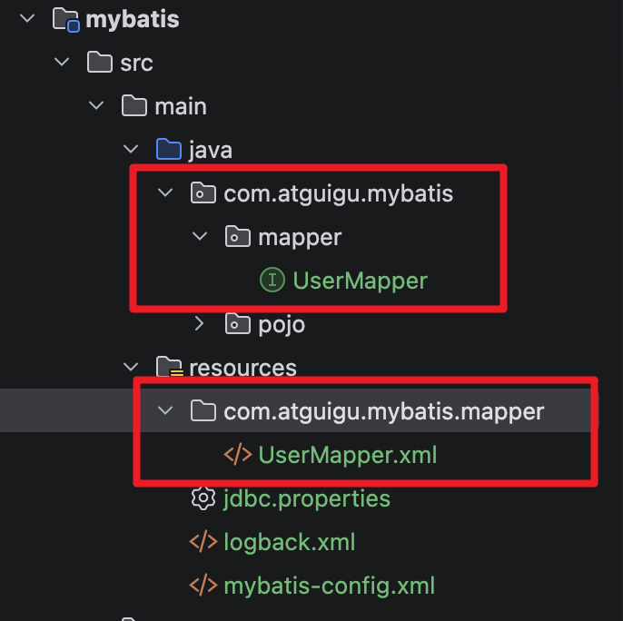
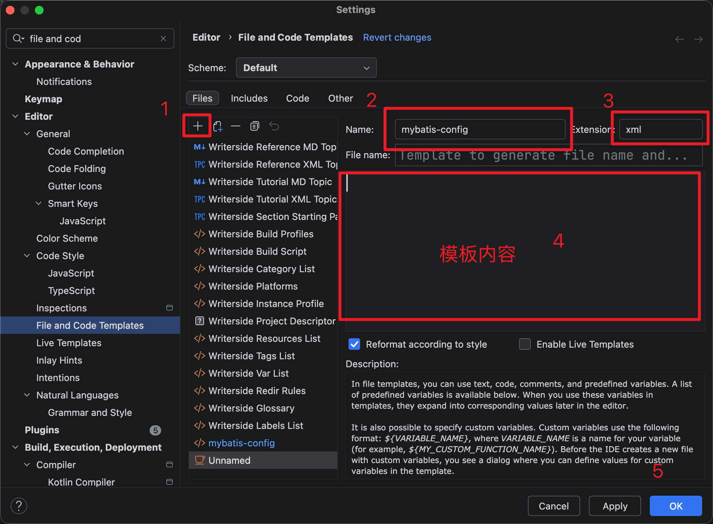
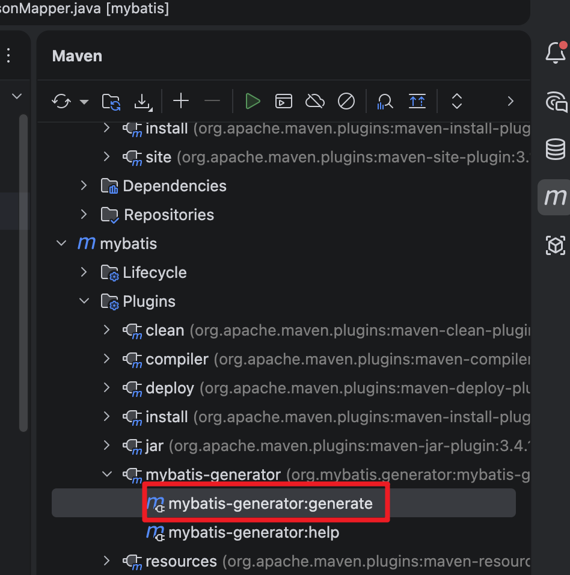
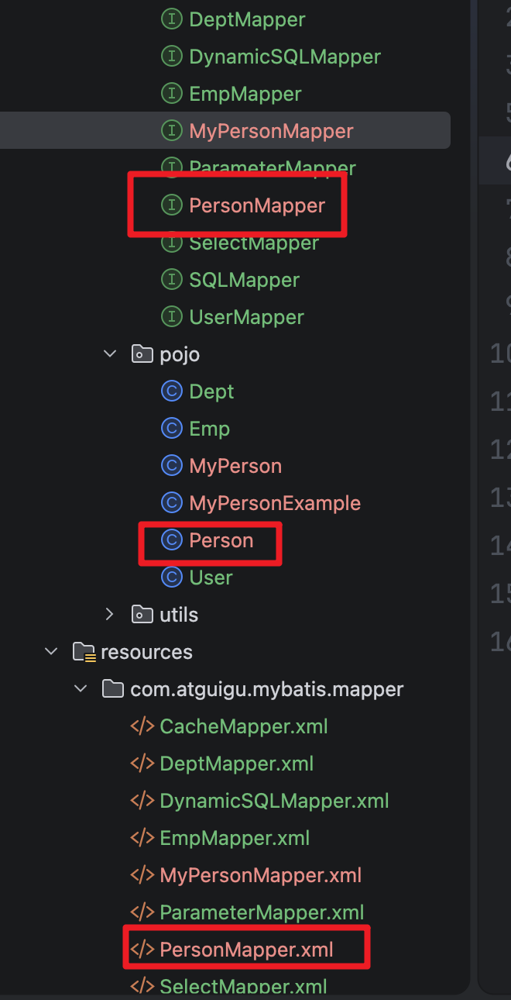
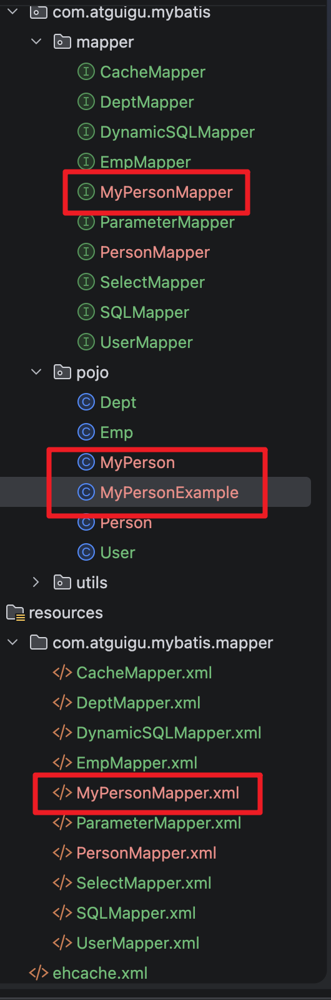

# MyBatis

## 环境搭建

- 创建一个`Maven`的父工程，在`pom.xml`中配置一些公用的依赖。

```xml
<project xmlns="http://maven.apache.org/POM/4.0.0" xmlns:xsi="http://www.w3.org/2001/XMLSchema-instance"
         xsi:schemaLocation="http://maven.apache.org/POM/4.0.0 http://maven.apache.org/maven-v4_0_0.xsd">
    <modelVersion>4.0.0</modelVersion>
    <groupId>com.kodeco</groupId>
    <artifactId>atguigu_mybatis_ybc</artifactId>
    <packaging>pom</packaging>
    <modules>
        <module>mybatis</module>
    </modules>
    <version>1.0-SNAPSHOT</version>
    <name>atguigu_mybatis_ybc</name>
    <dependencies>
        <!-- JUnit-->
        <dependency>
            <groupId>junit</groupId>
            <artifactId>junit</artifactId>
            <version>4.13.1</version>
            <scope>test</scope>
        </dependency>
        <!-- logback -->
        <dependency>
            <groupId>ch.qos.logback</groupId>
            <artifactId>logback-classic</artifactId>
            <version>1.5.13</version>
        </dependency>
    </dependencies>
</project>
```

- 创建一个`Maven`的子模块，在`pom.xml`中配置模块需要的依赖。

```xml
<project xmlns="http://maven.apache.org/POM/4.0.0" xmlns:xsi="http://www.w3.org/2001/XMLSchema-instance"
         xsi:schemaLocation="http://maven.apache.org/POM/4.0.0 http://maven.apache.org/xsd/maven-4.0.0.xsd">
    <modelVersion>4.0.0</modelVersion>
    <parent>
        <groupId>com.kodeco</groupId>
        <artifactId>atguigu_mybatis_ybc</artifactId>
        <version>1.0-SNAPSHOT</version>
    </parent>

    <artifactId>mybatis</artifactId>
    <packaging>jar</packaging>

    <name>mybatis</name>
    <url>http://maven.apache.org</url>

    <properties>
        <project.build.sourceEncoding>UTF-8</project.build.sourceEncoding>
    </properties>

    <dependencies>
        <!-- MyBatis核心 -->
        <dependency>
            <groupId>org.mybatis</groupId>
            <artifactId>mybatis</artifactId>
            <version>3.5.19</version>
        </dependency>

        <!-- MySQL驱动 -->
        <dependency>
            <groupId>com.mysql</groupId>
            <artifactId>mysql-connector-j</artifactId>
            <version>9.3.0</version>
        </dependency>
    </dependencies>
</project>
```

- 在模块中加入日志到配置文件: `src/main/resources/logback.xml`

```xml
<?xml version="1.0" encoding="UTF-8"?>
<configuration>
    <!-- 콘솔 출력 설정 -->
    <appender name="STDOUT" class="ch.qos.logback.core.ConsoleAppender">
        <encoder>
            <pattern>[%thread] %-5level %logger{36} - %msg%n</pattern>
        </encoder>
    </appender>

    <!-- MyBatis SQL 로그 설정 -->
    <logger name="com.atguigu.mybatis.mapper" level="DEBUG"/>

    <root level="INFO">
        <appender-ref ref="STDOUT"/>
    </root>
</configuration>
```

- 创建`MyBatis`的核心配置文件: `src/main/resources/mybatis-config.xml`
- 习惯上命名为`mybatis-config.xml`，并非强制要求。
- 将来与 Spring 整合后，这个配置文件可以省略。

```xml
<?xml version="1.0" encoding="UTF-8" ?>
<!DOCTYPE configuration
        PUBLIC "-//mybatis.org//DTD Config 3.0//EN"
        "http://mybatis.org/dtd/mybatis-3-config.dtd">
<!--
    environments: 配置多个连接数据库的环境
-->
<configuration>
    <environments default="development">
        <environment id="development">
            <transactionManager type="JDBC"/>
            <dataSource type="POOLED">
                <property name="driver" value="com.mysql.cj.jdbc.Driver"/>
                <property name="url" value="jdbc:mysql://localhost:3310/atguigu_mybatis"/>
                <property name="username" value="root"/>
                <property name="password" value="123456"/>
            </dataSource>
        </environment>
    </environments>
    <!-- 引入映射文件 -->
    <mappers>
        <mapper resource="mappers/UserMapper.xml"/>
    </mappers>
</configuration>
```

- 在数据库中创建测试用的表

```sql
DROP DATABASE IF EXISTS `atguigu_mybatis`;
CREATE DATABASE IF NOT EXISTS `atguigu_mybatis` /*!40100 DEFAULT CHARACTER SET utf8mb4 COLLATE utf8mb4_0900_ai_ci */ /*!80016 DEFAULT ENCRYPTION = 'N' */;
USE `atguigu_mybatis`;

DROP TABLE IF EXISTS t_user;
CREATE TABLE IF NOT EXISTS t_user
(
    id       INT AUTO_INCREMENT
        PRIMARY KEY,
    username VARCHAR(20) NULL,
    password VARCHAR(20) NULL,
    age      INT         NULL,
    sex      CHAR        NULL,
    email    VARCHAR(20) NULL
);

DROP TABLE IF EXISTS t_emp;
CREATE TABLE IF NOT EXISTS t_emp
(
    eid      INT AUTO_INCREMENT
        PRIMARY KEY,
    emp_name VARCHAR(20) NULL,
    age      INT         NULL,
    sex      CHAR        NULL,
    email    VARCHAR(20) NULL,
    did      INT         NULL
);

DROP TABLE IF EXISTS t_dept;
CREATE TABLE IF NOT EXISTS t_dept
(
    did       INT AUTO_INCREMENT
        PRIMARY KEY,
    dept_name VARCHAR(20) NULL
);
```

- 创建实体类: `com.atguigu.mybatis.pojo.User`

```java
public class User {
    private Integer id;
    private String username;
    private String password;
    private Integer age;
    private String sex;
    private String email;

    // 无参构造器
    // 有参构造器
    // getters and setters
    // toString()
}
```

- 创建 Mapper 接口: `com.atguigu.mybatis.mapper.UserMapper`

```java
public interface UserMapper {
    /**
     * 添加用户信息
     */
    int insertUser();
}
```

- 创建 MyBatis 的映射文件: `src/main/resources/mappers/UserMapper.xml`

```xml
<?xml version="1.0" encoding="UTF-8" ?>
<!DOCTYPE mapper
        PUBLIC "-//mybatis.org//DTD Mapper 3.0//EN"
        "http://mybatis.org/dtd/mybatis-3-mapper.dtd">

<mapper namespace="com.atguigu.mybatis.mapper.UserMapper">

    <!-- int insertUser(); -->
    <insert id="insertUser">
        insert into t_user
        values (null, 'admin', '123456', 23, '男', 'admin@qq.com')
    </insert>
</mapper>
```

- MyBatis 面向接口编程的两个一致:

  1. 映射文件的 namespace 要和 mapper 接口的全类名保持一致。
  2. 映射文件中 SQL 语句的 id 要和 mapper 接口中的方法名一致。

- 表 -- 实体类 -- mapper 接口 -- 映射文件

- 测试

```java
public class MyBatisTest {

    @Test
    public void testMyBatis() throws IOException {
        // 加载核心配置文件
        InputStream is = Resources.getResourceAsStream("mybatis-config.xml");
        // 获取SqlSessionFactoryBuilder
        SqlSessionFactoryBuilder sqlSessionFactoryBuilder = new SqlSessionFactoryBuilder();
        // 获取SqlSessionFactory
        SqlSessionFactory sqlSessionFactory = sqlSessionFactoryBuilder.build(is);
        // 获取SqlSession
        SqlSession sqlSession = sqlSessionFactory.openSession();
        // 设置自动提交: sqlSessionFactory.openSession(true);
        // 获取mapper接口对象
        UserMapper mapper = sqlSession.getMapper(UserMapper.class);
        // 测试功能
        int result = mapper.insertUser();
        // 提交事务
        sqlSession.commit();
        System.out.println("result: " + result);
    }
}
```

- 注意: 上面的测试方法中必须有提交事务的代码，否则数据无法插入到数据表中。
- 要想设置为`自动提交`，在创建`SqlSession`时，参数传入`true`。

---

> 13 测试修改和删除功能

`src/main/resources/mappers/UserMapper.xml`

```java
/**
 * 修改用户信息
 */
void updateUser();

/**
 * 删除用户信息
 */
void deleteUser();
```

`src/main/resources/mappers/UserMapper.xml`

```xml
<!-- void updateUser(); -->
<update id="updateUser">
    update t_user
    set username = '张三'
    where id = 4
</update>

<!-- void deleteUser(); -->
<delete id="deleteUser">
    delete
    from t_user
    where id = 1
</delete>
```

`src/test/java/com/atguigu/mybatis/test/MyBatisTest.java`

```java
@Test
public void testCRUD() throws IOException {
    InputStream is = Resources.getResourceAsStream("mybatis-config.xml");
    SqlSessionFactory sqlSessionFactory = new SqlSessionFactoryBuilder().build(is);
    SqlSession sqlSession = sqlSessionFactory.openSession(true);
    UserMapper mapper = sqlSession.getMapper(UserMapper.class);
    // mapper.updateUser();
    mapper.deleteUser();
}
```

---

> 14 测试查询功能

`src/main/resources/mappers/UserMapper.xml`

```java
/**
 * 根据id查询用户信息
 */
User getUserById();

/**
 * 查询所有的用户信息
 */
List<User> getAllUsers();
```

`src/main/resources/mappers/UserMapper.xml`

```xml
<!-- 在视频里，仅仅这么写是会报错的...，但目前使用的版本不会报错，会自动匹配能匹配的字段 -->
<!-- <select id="getUserById"> -->
<!--
    查询功能的标签需要设置resultType或resultMap。
    resultType: 设置默认的映射关系
    resultMap: 设置的自定义映射关系
-->
<!-- User getUserById(); -->
<select id="getUserById" resultType="com.atguigu.mybatis.pojo.User">
    select *
    from t_user
    where id = 3
</select>

<!-- List<User> getAllUsers(); -->
<select id="getAllUsers" resultType="com.atguigu.mybatis.pojo.User">
    select *
    from t_user
</select>
```

`src/test/java/com/atguigu/mybatis/test/MyBatisTest.java`

```java
@Test
public void testCRUD() throws IOException {
    InputStream is = Resources.getResourceAsStream("mybatis-config.xml");
    SqlSessionFactory sqlSessionFactory = new SqlSessionFactoryBuilder().build(is);
    SqlSession sqlSession = sqlSessionFactory.openSession(true);
    UserMapper mapper = sqlSession.getMapper(UserMapper.class);
    // User user = mapper.getUserById();
    // System.out.println(user);
    List<User> list = mapper.getAllUsers();
    list.forEach(System.out::println);
}
```

---

> 15 核心配置文件之 environments

```xml
<!--
    environments: 配置多个连接数据库的环境
    属性:
        default: 设置默认使用的环境的id
-->
<environments default="development">
    <!--
        environment: 配置某个具体的环境
        属性:
        id: 表示连接数据库的环境的唯一标识，不能重复
    -->
    <environment id="development">
        <!--
            transactionManager: 设置事务管理方式
            属性:
                type="JDBC|MANAGED"
                JDBC: 表示当前环境中，执行SQL时，使用的是JDBC中原生的事务管理方式，事务的提交或回滚需要手动处理。
                MANAGED: 被管理，例如Spring
        -->
        <transactionManager type="JDBC"/>
        <!--
            dataSource: 配置数据源
            属性:
                type: 设置数据源的类型
                type="POOLED|UNPOOLED|JNDI"
                POOLED: 表示使用数据库连接池缓存数据库连接。
                UNPOOLED: 表示不使用数据库连接池。
                JNDI: 表示使用上下文中的数据源。
        -->
        <dataSource type="POOLED">
            <!-- 设置连接数据库的驱动 -->
            <property name="driver" value="com.mysql.cj.jdbc.Driver"/>
            <!-- 设置连接数据库的连接地址 -->
            <property name="url" value="jdbc:mysql://localhost:3310/atguigu_mybatis"/>
            <!-- 设置连接数据库的用户名 -->
            <property name="username" value="root"/>
            <!-- 设置连接数据库的密码 -->
            <property name="password" value="123456"/>
        </dataSource>
    </environment>
</environments>
```

- 上面这些配置内容以后都会在`Spring`中进行配置。

---

> 16 核心配置文件之 properties

- 上面数据库的连接信息都是写死的，可以将这些信息放到`properties`文件中来管理。
- 在`IDEA`工程中的`resources`目录中创建`Resource Bundle`文件，默认就是`properties`文件。

`src/main/resources/jdbc.properties`

```properties
jdbc.driver=com.mysql.cj.jdbc.Driver
jdbc.url=jdbc:mysql://localhost:3310/atguigu_mybatis
jdbc.username=root
jdbc.password=123456
```

- 在核心配置文件中引用上面配置的数据库连接信息。

```xml
<configuration>
    <!-- 引入properties文件 -->
    <properties resource="jdbc.properties"/>

    <!-- ... -->

    <dataSource type="POOLED">
        <!-- 设置连接数据库的驱动 -->
        <property name="driver" value="${jdbc.driver}"/>
        <!-- 设置连接数据库的连接地址 -->
        <property name="url" value="${jdbc.url}"/>
        <!-- 设置连接数据库的用户名 -->
        <property name="username" value="${jdbc.username}"/>
        <!-- 设置连接数据库的密码 -->
        <property name="password" value="${jdbc.password}"/>
    </dataSource>

    <!-- ... -->
</configuration>
```

---

> 17 核心配置文件之 typeAliases

- 核心配置文件中的标签之间是有顺序的。

```text
    The content of element type "configuration" must match
    "(properties?,settings?,typeAliases?,typeHandlers?,objectFactory?,objectWrapperFactory?,
    reflectorFactory?,plugins?,environments?,databaseIdProvider?,mappers?)".
```

```xml
<!-- 设置类型别名 -->
<typeAliases>
    <!--
        typeAlias: 设置某个类型的别名。
        属性:
            type: 设置需要设置别名的类型的全类名。
            alias: 设置别名。如果不设置alias的值，那么其默认值是类的简单名称。
                    别名是不区分大小写的，即在配置中设置了alias="User"后，在映射文件中写resultType="user"也是没问题的。
    -->
    <!-- 这种方式用的很少，因为只能一次设置一个类的别名。而是会使用下面的package标签来批量地设置别名。
    <typeAlias type="com.atguigu.mybatis.pojo.User"/>
    -->
    <!-- 以包为单位，将包下所有的类型设置默认的类型别名，即类的简单名称，且不区分大小写。 -->
    <package name="com.atguigu.mybatis.pojo"/>
</typeAliases>
```

- 设置别名后，在映射文件中就可以使用类的`别名`来指定`resultType`了。

```xml
<!-- User getUserById(); -->
<select id="getUserById" resultType="user">
    select *
    from t_user
    where id = 3
</select>

<!-- List<User> getAllUsers(); -->
<select id="getAllUsers" resultType="User">
    select *
    from t_user
</select>
```

---

> 18 核心配置文件之 mappers

- 映射文件也可以以包为单位进行引入，但是需要满足一些要求。

```xml
<!-- 引入映射文件 -->
<mappers>
    <!-- <mapper resource="mappers/UserMapper.xml"/> -->
    <!--
        以包为单位引入映射文件
        要求:
            1. mapper接口所在的包要和映射文件所在的包一致。
            2. mapper接口要和映射文件的名字一致。
    -->
    <package name="com.atguigu.mybatis.mapper"/>
</mappers>
```



---

> 19 思考: 映射文件中的 SQL 该如何拼接

- 到目前为止，写到 SQL 语句都是写死到，以后需要学习如何动态获得从客户端传来到参数，并动态地拼接到 SQL 映射文件中。

---

> 20 在`IDEA`中配置核心配置文件到模板

- 首先准备核心配置文件的内容

```xml
<?xml version="1.0" encoding="UTF-8" ?>
<!DOCTYPE configuration
        PUBLIC "-//mybatis.org//DTD Config 3.0//EN"
        "http://mybatis.org/dtd/mybatis-3-config.dtd">
<configuration>
    <properties resource="jdbc.properties"/>

    <typeAliases>
        <package name=""/>
    </typeAliases>

    <environments default="development">
        <environment id="development">
            <transactionManager type="JDBC"/>
            <dataSource type="POOLED">
                <property name="driver" value="${jdbc.driver}"/>
                <property name="url" value="${jdbc.url}"/>
                <property name="username" value="${jdbc.username}"/>
                <property name="password" value="${jdbc.password}"/>
            </dataSource>
        </environment>
    </environments>

    <mappers>
        <package name=""/>
    </mappers>
</configuration>
```

- 在`IDEA`中按下 2 次`Shift`后，搜索`File and Code Templates`



---

> 21 在`IDEA`中配置映射文件到模板

- 首先准备映射文件的内容

```xml
<?xml version="1.0" encoding="UTF-8" ?>
<!DOCTYPE mapper
        PUBLIC "-//mybatis.org//DTD Mapper 3.0//EN"
        "http://mybatis.org/dtd/mybatis-3-mapper.dtd">

<mapper namespace="">

</mapper>
```

- 在`IDEA`中按下 2 次`Shift`后，搜索`File and Code Templates`


---

> 22 封装`SqlSessionUtils`工具类并测试功能

`src/main/java/com/atguigu/mybatis/utils/SqlSessionUtils.java`

```java
public class SqlSessionUtils {
    public static SqlSession getSqlSession() {
        SqlSession sqlSession = null;
        try {
            InputStream is = Resources.getResourceAsStream("mybatis-config.xml");
            SqlSessionFactory sqlSessionFactory = new SqlSessionFactoryBuilder().build(is);
            sqlSession = sqlSessionFactory.openSession(true);
        } catch (IOException e) {
            e.printStackTrace();
        }
        return sqlSession;
    }
}
```

为学习获取参数值做一些准备:

`src/main/java/com/atguigu/mybatis/mapper/ParameterMapper.java`

```java
public interface ParameterMapper {

    /**
     * 查询所有的员工信息
     */
    List<User> getAllUsers();
}
```

`src/main/resources/com/atguigu/mybatis/mapper/ParameterMapper.xml`

```java
<mapper namespace="com.atguigu.mybatis.mapper.ParameterMapper">

    <!-- List<User> getAllUsers(); -->
    <select id="getAllUsers" resultType="User">
        select *
        from t_user
    </select>
</mapper>
```

---

> 23 MyBatis 获取参数值的两种方式`#{}`和`${}`

- MyBatis 获取参数值的两种方式: ${}和#{}

  - ${}的本质是字符串拼接
  - #{}的本质是占位符赋值

- JDBC 中相应的使用方式

```java
public void testJDBC() throws Exception {
    String username = "Tom";
    Class.forName("");
    Connection conn = DriverManager.getConnection("", "", "");
    // 字符串拼接的方式
    // Statement stmt = conn.createStatement();
    // stmt.execute("select * from t_user where username = '" + username + "'");
    // 使用占位符的方式
    PreparedStatement ps = conn.prepareStatement("select * from t_user where username = ?");
    ps.setString(1, "Tom");
}
```

---

> 24 MyBatis 获取参数值的各种情况(1)

- Mapper 接口方法的参数为单个的字面量类型
- 可以通过`${}`和`#{}`以`任意的名称`获取参数值，但是为了见名知意，建议使用和参数名一致的名称。

`src/main/java/com/atguigu/mybatis/mapper/ParameterMapper.java`

```java
/*
根据用户名查询用户信息
*/
User getUserByUsername(String username);
```

`src/main/resources/com/atguigu/mybatis/mapper/ParameterMapper.xml`

```xml
<!-- User getUserByUsername(String username); -->
<select id="getUserByUsername" resultType="User">
    select *
    from t_user
    where username = #{username}
</select>
```

`src/test/java/com/atguigu/mybatis/test/B_ParameterMapperTest.java`

```java
@Test
public void testGetUserByUsername() {
    SqlSession sqlSession = SqlSessionUtils.getSqlSession();
    ParameterMapper mapper = sqlSession.getMapper(ParameterMapper.class);
    User admin = mapper.getUserByUsername("admin");
    System.out.println(admin);
}
```

---

> 25 MyBatis 获取参数值的各种情况(2)

- Mapper 接口方法的参数为多个时
- 此时 MyBatis 会将这些参数放在一个`map`集合中，以两种方式进行存储

  - 以`arg0`, `arg1`...为键，以参数值为值
  - 以`param1`, `param2`...为键，以参数值为值

- 如果没有按照 MyBatis 提供的键在映射文件中进行参数的获取，则会报一下的异常:

```text
Error querying database.  Cause: org.apache.ibatis.binding.BindingException: Parameter 'username' not found. Available parameters are [arg1, arg0, param1, param2]
```

```java
 /*
验证登录
*/
User checkLogin(String username, String password);
```

```xml
<!-- User checkLogin(String username, String password); -->
<select id="checkLogin" resultType="User">
    select *
    from t_user
    where username = #{param1}
        and password = #{param2}
</select>
```

```java
@Test
public void testCheckLogin() {
    SqlSession sqlSession = SqlSessionUtils.getSqlSession();
    ParameterMapper mapper = sqlSession.getMapper(ParameterMapper.class);
    User user = mapper.checkLogin("admin", "123456");
    System.out.println(user);
}
```

---

> 26 MyBatis 获取参数值的各种情况(3)

- 若 Mapper 接口方法的参数有多个时，可以手动将这些参数放在一个`Map`集合中
- 然后在 SQL 映射文件中就可以使用在`Map`集合中设置的`Key`来获取参数的值

```java
/*
验证登录(参数为Map)
*/
User checkLoginByMap(Map<String, Object> map);
```

```xml
<!-- User checkLoginByMap(Map<String, Object> map); -->
<select id="checkLoginByMap" resultType="User">
    select *
    from t_user
    where username = #{username}
        and password = #{password}
</select>
```

```java
@Test
public void testCheckLoginByMap() {
    SqlSession sqlSession = SqlSessionUtils.getSqlSession();
    ParameterMapper mapper = sqlSession.getMapper(ParameterMapper.class);
    Map<String, Object> map = new HashMap<>();
    map.put("username", "admin");
    map.put("password", "123456");
    User user = mapper.checkLoginByMap(map);
    System.out.println(user);
}
```

---

> 27 MyBatis 获取参数值的各种情况(4)

- Mapper 接口方法的参数为实体类类型时
- 然后在 SQL 映射文件中通过实体类的`属性`来获取参数值

```java
/*
添加用户信息
*/
int insertUser(User user);
```

```xml
<!-- int insertUser(User user); -->
<insert id="insertUser">
    insert into t_user
    values (null, #{username}, #{password}, #{age}, #{sex}, #{email})
</insert>
```

```java
@Test
public void testInsertUser() {
    SqlSession sqlSession = SqlSessionUtils.getSqlSession();
    ParameterMapper mapper = sqlSession.getMapper(ParameterMapper.class);
    User user = new User(null, "Tom", "111222", 18, "女", "tom@gmail.com");
    int result = mapper.insertUser(user);
    System.out.println("result: " + result);
}
```

---

> 28 MyBatis 获取参数值的各种情况(5)

- 使用命名参数`@Param("在映射文件中使用的Key")`
- 此时 MyBatis 会将值参数放在一个 Map 集合中，以两种方式进行存储
  - 以@Param 注解的值为键，以参数为值
  - 以 param1, param2..为键，以参数为值(此时 arg0, arg1...不可用)

```java
/*
验证登录(使用@Param)
*/
User checkLoginByParam(@Param("username") String username, @Param("password") String password);
```

```xml
<!-- User checkLoginByParam(@Param("username") String username, @Param("password") String password); -->
<select id="checkLoginByParam" resultType="User">
    select *
    from t_user
    where username = #{param1}
        and password = #{param2}
</select>
```

```java
@Test
public void testCheckLoginByParam() {
    SqlSession sqlSession = SqlSessionUtils.getSqlSession();
    ParameterMapper mapper = sqlSession.getMapper(ParameterMapper.class);
    User user = mapper.checkLoginByParam("admin", "123456");
    System.out.println(user);
}
```

---

> 29 `@Param`源码分析

```java
public ParamNameResolver(Configuration config, Method method) {
    this.useActualParamName = config.isUseActualParamName();
    final Class<?>[] paramTypes = method.getParameterTypes();
    final Annotation[][] paramAnnotations = method.getParameterAnnotations();
    final SortedMap<Integer, String> map = new TreeMap<>();
    int paramCount = paramAnnotations.length;
    // get names from @Param annotations
    for (int paramIndex = 0; paramIndex < paramCount; paramIndex++) {
      if (isSpecialParameter(paramTypes[paramIndex])) {
        // skip special parameters
        continue;
      }
      String name = null;
      for (Annotation annotation : paramAnnotations[paramIndex]) {
        if (annotation instanceof Param) {
          hasParamAnnotation = true;
          name = ((Param) annotation).value();
          break;
        }
      }
      if (name == null) {
        // @Param was not specified.
        if (useActualParamName) {
          name = getActualParamName(method, paramIndex);
        }
        if (name == null) {
          // use the parameter index as the name ("0", "1", ...)
          // gcode issue #71
          name = String.valueOf(map.size());
        }
      }
      map.put(paramIndex, name);
    }
    names = Collections.unmodifiableSortedMap(map);
  }

public Object getNamedParams(Object[] args) {
    final int paramCount = names.size();
    if (args == null || paramCount == 0) {
      return null;
    }
    if (!hasParamAnnotation && paramCount == 1) {
      Object value = args[names.firstKey()];
      return wrapToMapIfCollection(value, useActualParamName ? names.get(names.firstKey()) : null);
    } else {
      final Map<String, Object> param = new ParamMap<>();
      int i = 0;
      for (Map.Entry<Integer, String> entry : names.entrySet()) {
        param.put(entry.getValue(), args[entry.getKey()]);
        // add generic param names (param1, param2, ...)
        final String genericParamName = i < 10 ? GENERIC_NAME_CACHE[i] : GENERIC_NAME_PREFIX + (i + 1);
        // ensure not to overwrite parameter named with @Param
        if (!names.containsValue(genericParamName)) {
          param.put(genericParamName, args[entry.getKey()]);
        }
        i++;
      }
      return param;
    }
  }
```

---

> 30 MyBatis 的各种查询功能(1)

- MyBatis 的各种查询功能
  1. 若查询的数据只有一条  
     a> 可以通过实体类对象接收  
     b> 可以通过 List 集合接收
  2. 若查询的数据多条  
     a> 可以通过 List 集合接收  
     b>  
     注意: 一定不能通过实体类对象接收，否则会报如下异常:  
     `org.apache.ibatis.exceptions.TooManyResultsException: Expected one result (or null) to be returned by selectOne(), but found: 5`

`src/main/java/com/atguigu/mybatis/mapper/SelectMapper.java`

```java
public interface SelectMapper {
    /**
     * 根据id查询用户信息
     */
    User getUserById(@Param("id") Integer id);
    // 这种情况也可以用List集合接收
    // List<User> getUserById(@Param("id") Integer id);

    /**
     * 查询所有的用户信息
     */
    List<User> getAllUsers();
}
```

`src/main/resources/com/atguigu/mybatis/mapper/SelectMapper.xml`

```xml
<mapper namespace="com.atguigu.mybatis.mapper.SelectMapper">
    <!-- User getUserById(@Param("id") Integer id); -->
    <select id="getUserById" resultType="User">
        select *
        from t_user
        where id = #{id}
    </select>

    <!-- List<User> getAllUsers(); -->
    <select id="getAllUsers" resultType="User">
        select *
        from t_user
    </select>
</mapper>
```

`src/test/java/com/atguigu/mybatis/test/C_SelectMapperTest.java`

```java
public class C_SelectMapperTest {

    @Test
    public void testGetUserById() {
        SqlSession sqlSession = SqlSessionUtils.getSqlSession();
        SelectMapper mapper = sqlSession.getMapper(SelectMapper.class);
        System.out.println(mapper.getUserById(3));
        // 结果: User{id=3, username='admin1', password='123456', age=23, sex='男', email='admin@qq.com'}
    }

    @Test
    public void testGetAllUsers() {
        SqlSession sqlSession = SqlSessionUtils.getSqlSession();
        SelectMapper mapper = sqlSession.getMapper(SelectMapper.class);
        List<User> list = mapper.getAllUsers();
        list.forEach(System.out::println);
        // 结果:
        /*
        User{id=2, username='admin', password='123456', age=23, sex='男', email='admin@qq.com'}
        User{id=3, username='admin1', password='123456', age=23, sex='男', email='admin@qq.com'}
        User{id=4, username='张三', password='123456', age=23, sex='男', email='admin@qq.com'}
        ...
         */
    }
}
```

---

> 31 MyBatis 的各种查询功能(2)

- MyBatis 中设置了默认的类型`别名`

  - `java.lang.Integer` -> `int`, `integer`
  - `int` -> `_int`, `-integer`
  - `Map` -> `map`
  - `String` -> `string`

- 查询`单行单列`的值

`src/main/java/com/atguigu/mybatis/mapper/SelectMapper.java`

```java
/**
 * 查询用户信息的总记录数
 */
Integer getUserCount();
```

`src/main/resources/com/atguigu/mybatis/mapper/SelectMapper.xml`

```xml
<!-- Integer getUserCount(); -->
<select id="getUserCount" resultType="_int">
    select count(*)
    from t_user
</select>
```

`src/test/java/com/atguigu/mybatis/test/C_SelectMapperTest.java`

```java
@Test
public void testGetUserCount() {
    SqlSession sqlSession = SqlSessionUtils.getSqlSession();
    SelectMapper mapper = sqlSession.getMapper(SelectMapper.class);
    Integer userCount = mapper.getUserCount();
    System.out.println("userCount: " + userCount);
    // 结果: userCount: 5
}
```

---

> 32 MyBatis 的各种查询功能(3)

- 将查询出的一条记录使用`Map`集合来接收

  1. 若查询的数据只有一条  
     a> 可以通过实体类对象接收  
     b> 可以通过 List 集合接收
     c> 可以通过 Map 集合接收
  2. 若查询的数据多条  
     a> 可以通过 List 集合接收  
     b>

`src/main/java/com/atguigu/mybatis/mapper/SelectMapper.java`

```java
/**
 * 根据id查询用户信息为一个Map集合
 */
Map<String, Object> getUserByIdToMap(@Param("id") Integer id);
```

`src/main/resources/com/atguigu/mybatis/mapper/SelectMapper.xml`

```xml
<!-- Map<String, Object> getUserByIdToMap(@Param("id") Integer id); -->
<select id="getUserByIdToMap" resultType="map">
    select *
    from t_user
    where id = #{id}
</select>
```

`src/test/java/com/atguigu/mybatis/test/C_SelectMapperTest.java`

```java
@Test
public void testGetUserByIdToMap() {
    SqlSession sqlSession = SqlSessionUtils.getSqlSession();
    SelectMapper mapper = sqlSession.getMapper(SelectMapper.class);
    System.out.println(mapper.getUserByIdToMap(3));
    // 结果: {password=123456, sex=男, id=3, age=23, email=admin@qq.com, username=admin1}
}
```

---

> 33 MyBatis 的各种查询功能(4)

- 将查询出的多条记录使用`Map`集合来接收

  1. 若查询的数据只有一条  
     a> 可以通过实体类对象接收  
     b> 可以通过 List 集合接收  
     c> 可以通过 Map 集合接收
  2. 若查询的数据多条  
     a> 可以通过 List 集合接收  
     b> 可以通过 Map 类型的 List 集合接收  
     c> 可以在 Mapper 接口的方法上添加`@MapKey`注解，此时就以注解中指定的字段作为键，以查询出的每条记录作为值，放在同一个`Map`集合中

`src/main/java/com/atguigu/mybatis/mapper/SelectMapper.java`

```java
/**
 * 查询所有的用户信息为Map集合
 */
@MapKey("id")
Map<String, Object> getAllUsersToMap();
```

`src/main/resources/com/atguigu/mybatis/mapper/SelectMapper.xml`

```xml
<!-- Map<String, Object> getAllUsersToMap(); -->
<select id="getAllUsersToMap" resultType="map">
    select *
    from t_user
</select>
```

`src/test/java/com/atguigu/mybatis/test/C_SelectMapperTest.java`

```java
@Test
public void testGetAllUsersToMap() {
    SqlSession sqlSession = SqlSessionUtils.getSqlSession();
    SelectMapper mapper = sqlSession.getMapper(SelectMapper.class);
    System.out.println(mapper.getAllUsersToMap());
    // 结果: {2={password=123456, sex=男, id=2, age=23, email=admin@qq.com, username=admin},
    // 3={password=123456, sex=男, id=3, age=23, email=admin@qq.com, username=admin1},
    // 4={password=123456, sex=男, id=4, age=23, email=admin@qq.com, username=张三},
    // 5={password=123456, sex=男, id=5, age=23, email=admin@qq.com, username=2},
    // 6={password=111222, sex=女, id=6, age=18, email=tom@gmail.com, username=Tom}}
}
```

---

> 34 MyBatis 处理模糊查询

- 根据用户名模糊查询用户信息
- 可以尝试下面几种写法:

1. 使用`#{username}`，直接这么写会报下面的异常:

```text
Caused by: org.apache.ibatis.type.TypeException: Could not set parameters for mapping:
ParameterMapping{property='username', mode=IN, javaType=class java.lang.Object, jdbcType=null, numericScale=null,
resultMapId='null', jdbcTypeName='null', expression='null'}.
Cause: org.apache.ibatis.type.TypeException: Error setting non null for parameter #1 with JdbcType null .
Try setting a different JdbcType for this parameter or a different configuration property.
Cause: java.sql.SQLException: Parameter index out of range (1 > number of parameters, which is 0).
```

2. 使用`${username}`，这种方式看似可以用，但是会有`SQL注入`的问题。
3. 使用`concat()`函数。
4. 使用`"%" #{username} "%"`。

`src/main/java/com/atguigu/mybatis/mapper/SQLMapper.java`

```java
public interface SQLMapper {

    /**
     * 根据用户名模糊查询用户信息
     */
    List<User> getUserByNameLike(@Param("username") String username);
}
```

`src/main/resources/com/atguigu/mybatis/mapper/SQLMapper.xml`

```xml
<mapper namespace="com.atguigu.mybatis.mapper.SQLMapper">

    <!-- List<User> getUserByNameLike(@Param("username") String username); -->
    <select id="getUserByNameLike" resultType="User">
        select *
        from t_user
        where username like "%" #{username} "%"
    </select>
    <!--
        where username like '%#{username}%'
        where username like '%${username}%'
        where username like concat('%', #{username}, '%')
    -->
</mapper>
```

`src/test/java/com/atguigu/mybatis/test/D_SQLMapperTest.java`

```java
public class D_SQLMapperTest {
    @Test
    public void testGetUserByLike() {
        SqlSession sqlSession = SqlSessionUtils.getSqlSession();
        SQLMapper mapper = sqlSession.getMapper(SQLMapper.class);
        // 下面是可以导致SQL注入的写法
        // List<User> list = mapper.getUserByNameLike("' or true or '");
        List<User> list = mapper.getUserByNameLike("a");
        list.forEach(System.out::println);
    }
}
```

---

> 35 MyBatis 处理批量删除

- 本示例想要使用`delete from t_user where id in (1,2,3)`的方式批量删除，使用`#{}`的方式会直接报错。
- 因为对于 MySQL 数据库，此 SQL 语句为`delete from t_user where id in ('1,2,3')`，执行时是会报错的。`ERROR 1292 (22007): Truncated incorrect DOUBLE value: '1, 2, 3'`
- 这是 MySQL 数据库出于安全考虑，不让这个 SQL 语句执行，如果想要让它能执行，虽然不推荐，但是可以通过配置修改`sql_mode`的值，让其执行。
- 但是即使执行，也是会抛出警告。

```bash
# 查看sql_mode
SELECT @@SESSION.sql_mode;
SELECT @@GLOBAL.sql_mode;

# ONLY_FULL_GROUP_BY,STRICT_TRANS_TABLES,NO_ZERO_IN_DATE,NO_ZERO_DATE,ERROR_FOR_DIVISION_BY_ZERO,NO_ENGINE_SUBSTITUTION

# 只对当前连接生效
SET SESSION sql_mode =
REPLACE(@@SESSION.sql_mode, 'STRICT_TRANS_TABLES', '');

# 对所有新的连接生效
SET GLOBAL sql_mode =
REPLACE(@@GLOBAL.sql_mode, 'STRICT_TRANS_TABLES', '');

# 永久修改: my.cnf
[mysqld]
sql_mode=ONLY_FULL_GROUP_BY,NO_ENGINE_SUBSTITUTION
```

- 修改了`sql_mode`的值后，现退出当前连接，再次连接后，就会看到下面的效果:

```text
mysql> delete from t_user where id in ('1, 2, 3');
Query OK, 0 rows affected, 1 warning (0.00 sec)

mysql> show warnings;
+---------+------+---------------------------------------------+
| Level   | Code | Message                                     |
+---------+------+---------------------------------------------+
| Warning | 1292 | Truncated incorrect DOUBLE value: '1, 2, 3' |
+---------+------+---------------------------------------------+
1 row in set (0.00 sec)
```

- 但是上面的命令仅仅是在 MySQL 内部的命令行是可以执行的，在其他的客户端，如`DataGrip`和`IDEA`，因为安全级别的设定，还是会报错。

- 所以在 MyBatis 中实现批量删除时:
  1. 可以使用`${}`来实现，但是不推荐，因为有`SQL注入`的问题
  2. 使用`<foreach>`循环结构，搭配`#{}`，这才是比较靠谱的方式

```java
/**
 * 批量删除
 */
// int deleteBatch(@Param("ids") String ids);
int deleteBatch(@Param("ids") String[] ids);
```

```xml
<!-- int deleteBatch(@Param("ids") String ids); -->
<delete id="deleteBatch">
    delete
    from t_user
    where id in
    <foreach collection="ids" item="id" separator="," open="(" close=")">
        #{id}
    </foreach>
</delete>
<!-- where id in (${ids}) -->
```

```java
@Test
public void testDeleteBatch() {
    SqlSession sqlSession = SqlSessionUtils.getSqlSession();
    SQLMapper mapper = sqlSession.getMapper(SQLMapper.class);
    String ids = "1,2,3,4,5,6";
    // int i = mapper.deleteBatch(ids);
    String[] idArr = ids.split(",");
    int i = mapper.deleteBatch(idArr);

    System.out.println("i: " + i);
}
```

---

> 36 MyBatis 处理动态设置表明

- 对于一些特殊的情况，只能用`${}`来动态地设置表明，因为查询中的表名是不能用引号引起来的，所以不能使用`#{}`。

```java
/**
 * 查询指定表中的数据
 */
List<User> selectUserByTableName(@Param("tableName") String tableName);
```

```xml
<!-- List<User> selectUserByTableName(@Param("tableName") String tableName); -->
<select id="selectUserByTableName" resultType="User">
    select *
    from ${tableName}
</select>
```

```java
@Test
public void testGetUserByTableName() {
    SqlSession sqlSession = SqlSessionUtils.getSqlSession();
    SQLMapper mapper = sqlSession.getMapper(SQLMapper.class);
    List<User> list = mapper.selectUserByTableName("t_user");
    list.forEach(System.out::println);
}
```

---

> 37 获取添加功能自增的主键

- 在原始的`JDBC`中，获取自增 ID 的方法如下:

```java
public class AutoGeneratedTest {
    @Test
    public void testJDBCGetAutoGeneratedKey() throws Exception {
        Connection conn = JDBCUtils.getConnection();
        String sql = "insert into customers (name, email, birth) values (?, ?, ?)";
        // 想要获取自动递增的id必须指定第2个参数为PreparedStatement.RETURN_GENERATED_KEYS
        // 否则会报下面的异常
        // java.sql.SQLException: Generated keys not requested.
        // You need to specify Statement.RETURN_GENERATED_KEYS to Statement.executeUpdate(),
        // Statement.executeLargeUpdate() or Connection.prepareStatement().
        PreparedStatement ps = conn.prepareStatement(sql, Statement.RETURN_GENERATED_KEYS);
        ps.setObject(1, "xixi");
        ps.setObject(2, "xixi@126.com");
        ps.setObject(3, new Date(432213982123L));

        int i = ps.executeUpdate();
        System.out.println(i);

        ResultSet rs = ps.getGeneratedKeys();
        if (rs.next()) {
            Object id = rs.getObject(1);
            System.out.println("id: " + id);
        }
        JDBCUtils.closeResources(conn, ps);
    }
}
```

- 在 MyBatis 中获取自增的方式如下:

```java
/**
 * 添加用户信息
 */
void insertUser(User user);
```

```xml
<!-- void insertUser(User user); -->
<insert id="insertUser" useGeneratedKeys="true" keyProperty="id">
    insert into t_user
    values (null, #{username}, #{password}, #{age}, #{sex}, #{email})
</insert>
```

```java
@Test
public void testInsertUser() {
    SqlSession sqlSession = SqlSessionUtils.getSqlSession();
    SQLMapper mapper = sqlSession.getMapper(SQLMapper.class);
    User user = new User(null, "Longbottom", "123456", 18, "男", "long@123.com");
    mapper.insertUser(user);
    System.out.println(user);
    // 结果: User{id=6, username='Longbottom', password='123456', age=18, sex='男', email='long@123.com'}
}
```

- `useGeneratedKeys`: 设置当前标签中的 SQL 使用了自增的主键
- `keyProperty`: 将自增主键的值赋给传输到映射文件中参数到某个属性

---

> 38 搭建 MyBatis 框架

- 为演示`resultMap`的用法做准备

- 向`t_emp`和`t_dept`表中插入测试数据

```sql
SELECT *
FROM t_emp;

SELECT *
FROM t_dept;

INSERT INTO t_emp
VALUES (NULL, 'tom', 12, 'M', 'tom@126.com', 1);
INSERT INTO t_emp
VALUES (NULL, 'rose', 15, 'F', 'rose@126.com', 2);
INSERT INTO t_emp
VALUES (NULL, 'ron', 18, 'F', 'ron@126.com', 3);
INSERT INTO t_emp
VALUES (NULL, 'jerry', 21, 'M', 'jerry@126.com', 1);
INSERT INTO t_emp
VALUES (NULL, 'kate', 17, 'F', 'kate@126.com', 2);


INSERT INTO t_dept
VALUES (1, 'A');
INSERT INTO t_dept
VALUES (2, 'B');
INSERT INTO t_dept
VALUES (3, 'C');
```

`src/main/java/com/atguigu/mybatis/pojo/Emp.java`

```java
public class Emp {

    private Integer eid;
    private String empName;
    private Integer age;
    private String sex;
    private String email;

    // ...
}
```

`src/main/java/com/atguigu/mybatis/pojo/Dept.java`

```java
public class Dept {
    private Integer did;
    private String deptName;

    // ...
}
```

`src/main/java/com/atguigu/mybatis/mapper/EmpMapper.java`

```java
public interface EmpMapper {
}
```

`src/main/java/com/atguigu/mybatis/mapper/DeptMapper.java`

```java
public interface DeptMapper {
}
```

`src/main/resources/com/atguigu/mybatis/mapper/EmpMapper.xml`

```java
<?xml version="1.0" encoding="UTF-8" ?>
<!DOCTYPE mapper
        PUBLIC "-//mybatis.org//DTD Mapper 3.0//EN"
        "http://mybatis.org/dtd/mybatis-3-mapper.dtd">

<mapper namespace="com.atguigu.mybatis.mapper.EmpMapper">

</mapper>
```

`src/main/resources/com/atguigu/mybatis/mapper/DeptMapper.xml`

```java
<?xml version="1.0" encoding="UTF-8" ?>
<!DOCTYPE mapper
        PUBLIC "-//mybatis.org//DTD Mapper 3.0//EN"
        "http://mybatis.org/dtd/mybatis-3-mapper.dtd">

<mapper namespace="com.atguigu.mybatis.mapper.DeptMapper">

</mapper>
```

---

> 39 通过字段别名解决字段名和属性名的映射关系

- 对于字段名和属性名不同的情况，有 3 种解决方案
  1. 给字段起别名，让其跟属性名一致

`src/main/java/com/atguigu/mybatis/mapper/EmpMapper.java`

```java
/**
 * 查询所有的员工信息
 */
List<Emp> getAllEmps();
```

`src/main/resources/com/atguigu/mybatis/mapper/EmpMapper.xml`

```xml
<!-- List<Emp> getAllEmp(); -->
<select id="getAllEmps" resultType="Emp">
    select eid, emp_name empName, age, sex, email
    from t_emp
</select>
<!--
在之前的案例中，由于字段名和属性名一致，可以使用 select * from t_emp 的方式。
但是现在对于empName属性，数据库中的字段名是emp_name。
此时可以使用数据库字段的别名。
-->
```

`src/test/java/com/atguigu/mybatis/test/E_ResultMapTest.java`

```java
public class E_ResultMapTest {
    @Test
    public void testGetAllEmps() {
        SqlSession sqlSession = SqlSessionUtils.getSqlSession();
        EmpMapper mapper = sqlSession.getMapper(EmpMapper.class);
        List<Emp> emps = mapper.getAllEmps();
        emps.forEach(System.out::println);
        /* 结果:
        Emp{eid=1, empName='tom', age=12, sex='M', email='tom@126.com'}
        Emp{eid=2, empName='rose', age=15, sex='F', email='rose@126.com'}
        Emp{eid=3, empName='ron', age=18, sex='F', email='ron@126.com'}
         */
    }
}
```

---

> 40 通过全局配置 mapUnderscoreToCamelCase 解决字段名和属性名的映射关系

- 对于字段名和属性名不同的情况，有 3 种解决方案
  1. 给字段起别名，让其跟属性名一致
  2. 在全局配置文件`mybatis-config.xml`中，添加`settings`的配置，用于将下划线自动转换为驼峰。

`src/main/resources/mybatis-config.xml`

```xml
<!-- 设置MyBatis的全局配置 -->
<settings>
    <!-- 将下划线自动映射为驼峰，emp_name: empName -->
    <setting name="mapUnderscoreToCamelCase" value="true"/>
</settings>
```

- 在写`settings`标签时，没有必要纠结该写在什么位置，先在任意位置写上后，让`IDEA`提示该写在什么位置。
- 配置了自动转换后，此时在`Mapper`映射文件中就可以写`select * from t_emp`了。

---

> 41 通过 resultMap 解决字段名和属性名的映射关系

- 对于字段名和属性名不同的情况，有 3 种解决方案

  1. 给字段起别名，让其跟属性名一致。
  2. 在全局配置文件`mybatis-config.xml`中，添加`settings`的配置，用于将下划线自动转换为驼峰。
  3. 使用`resultMap`来自定义映射关系。

- 注意: 在做`resultMap`的实验时，记得把上一个例子的全局配置(mapUnderscoreToCamelCase)注释掉，否则看不到真正的效果。

```xml
<!--
    resultMap: 设置自定义映射关系
    id: 唯一标识，不能重复
    type: 设置映射关系中的实体类类型
    子标签:
        id: 设置主键的映射关系
        result: 设置普通字段的映射关系
        属性:
            property: 设置映射关系中的属性名，必须是type属性所设置的实体类类型中的属性名
            column: 设置映射关系中的字段名，必须是SQL语句查询出的字段名
-->
<resultMap id="empResultMap" type="Emp">
    <id property="eid" column="eid"/>
    <result property="empName" column="emp_name"/>
    <result property="age" column="age"/>
    <result property="sex" column="sex"/>
    <result property="email" column="email"/>
</resultMap>

<!-- List<Emp> getAllEmps(); -->
<select id="getAllEmps" resultMap="empResultMap">
    select *
    from t_emp
</select>
```

- 如果仅仅是为了解决属性名和字段名不一致的问题，使用`resultMap`显得有些浪费，`resultMap`真正发挥作用的地方在于映射实体间的关系。

---

> 42 通过级联属性赋值解决多对一得映射关系

- 处理多对一映射关系得 3 种方式:
  1. 级联属性赋值
- 在`Emp`类中添加`Dept dept`属性

`src/main/java/com/atguigu/mybatis/pojo/Emp.java`

```java
public class Emp {

    private Integer eid;
    private String empName;
    private Integer age;
    private String sex;
    private String email;

    private Dept dept;
    // ...
}
```

`src/main/java/com/atguigu/mybatis/mapper/EmpMapper.java`

```java
/**
 * 查询员工以及员工所对应的部门信息
 */
Emp getEmpAndDept(@Param("eid") Integer eid);
```

`src/main/resources/com/atguigu/mybatis/mapper/EmpMapper.xml`

```xml
<!-- 处理多对一映射关系方式一: 级联属性赋值 -->
<resultMap id="empAndDeptResultMapOgnl" type="Emp">
    <id property="eid" column="eid"/>
    <result property="empName" column="emp_name"/>
    <result property="age" column="age"/>
    <result property="sex" column="sex"/>
    <result property="email" column="email"/>
    <result property="dept.did" column="did"/>
    <result property="dept.deptName" column="dept_name"/>
</resultMap>

<!-- Emp getEmpAndDept(@Param("eid") Integer eid); -->
<select id="getEmpAndDept" resultMap="empAndDeptResultMapOgnl">
    select *
    from t_emp e
                left join t_dept d
                        on e.did = d.did
    where e.eid = #{eid}
</select>
```

`src/test/java/com/atguigu/mybatis/test/E_ResultMapTest.java`

```java
@Test
public void testGetEmpAndDept() {
    SqlSession sqlSession = SqlSessionUtils.getSqlSession();
    EmpMapper mapper = sqlSession.getMapper(EmpMapper.class);
    Emp emp = mapper.getEmpAndDept(1);
    System.out.println(emp);
    // 结果: Emp{eid=1, empName='tom', age=12, sex='M', email='tom@126.com', dept=Dept{did=1, deptName='A'}}
}
```

---

> 43 通过 association 解决多对一得映射关系

- 处理多对一映射关系得 3 种方式:
  1. 级联属性赋值
  2. association

`src/main/resources/com/atguigu/mybatis/mapper/EmpMapper.xml`

```xml
<resultMap id="empAndDeptResultMapAssociation" type="Emp">
    <id property="eid" column="eid"/>
    <result property="empName" column="emp_name"/>
    <result property="age" column="age"/>
    <result property="sex" column="sex"/>
    <result property="email" column="email"/>
    <!--
        association: 处理多对一的映射关系
            property: 需要处理多对一的映射关系的属性名
            javaType: 该属性的类型
    -->
    <association property="dept" javaType="Dept">
        <id property="did" column="did"/>
        <result property="deptName" column="dept_name"/>
    </association>
</resultMap>

<!-- Emp getEmpAndDept(@Param("eid") Integer eid); -->
<select id="getEmpAndDept" resultMap="empAndDeptResultMapAssociation">
    select *
    from t_emp e
                left join t_dept d
                        on e.did = d.did
    where e.eid = #{eid}
</select>
```

---

> 44 通过分步查询解决多对一得映射关系

- 处理多对一映射关系得 3 种方式:

  1. 级联属性赋值
  2. association
  3. 分步查询

- 为了便于测试，在这个例子中需要开启`mapUnderscoreToCamelCase`的配置。

`src/main/java/com/atguigu/mybatis/mapper/EmpMapper.java`

```java
/**
 * 分步查询员工以及员工所对应的部门信息
 * 第一步: 查询员工信息
 */
Emp getEmpAndDeptByStepOne(@Param("eid") Integer eid);
```

`src/main/resources/com/atguigu/mybatis/mapper/EmpMapper.xml`

```xml
<resultMap id="empAndDeptResultMapByStep" type="Emp">
    <id property="eid" column="eid"/>
    <result property="empName" column="emp_name"/>
    <result property="age" column="age"/>
    <result property="sex" column="sex"/>
    <result property="email" column="email"/>
    <!--
        select: 设置分步查询的SQL的唯一标识(namespace.sqlID或Mapper接口的全类名.方法名)
        column: 设置分步查询的条件字段
    -->
    <association property="dept" select="com.atguigu.mybatis.mapper.DeptMapper.getEmpAndDeptByStepTwo"
                    column="did"/>
</resultMap>

<!-- Emp getEmpAndDeptByStepOne(@Param("eid") Integer eid); -->
<select id="getEmpAndDeptByStepOne" resultMap="empAndDeptResultMapByStep">
    select *
    from t_emp
    where eid = #{eid}
</select>
```

`src/main/java/com/atguigu/mybatis/mapper/DeptMapper.java`

```java
/**
 * 分步查询员工以及员工所对应的部门信息
 * 第二步: 通过did查询员工所在的部门信息
 */
Dept getEmpAndDeptByStepTwo(@Param("did") Integer did);
```

`src/main/resources/com/atguigu/mybatis/mapper/DeptMapper.xml`

```xml
<mapper namespace="com.atguigu.mybatis.mapper.DeptMapper">
    <!-- Dept getEmpAndDeptByStepTwo(@Param("did") Integer did); -->
    <select id="getEmpAndDeptByStepTwo" resultType="Dept">
        select *
        from t_dept
        where did = #{did}
    </select>
</mapper>
```

```java
@Test
public void testGetEmpAndDeptByStep() {
    SqlSession sqlSession = SqlSessionUtils.getSqlSession();
    EmpMapper mapper = sqlSession.getMapper(EmpMapper.class);
    Emp emp = mapper.getEmpAndDeptByStepOne(3);
    System.out.println(emp);
    // 结果: Emp{eid=1, empName='tom', age=12, sex='M', email='tom@126.com', dept=Dept{did=1, deptName='A'}}
}
```

- 分步查询可以看到控制台中会执行两次查询:

```text
[main] DEBUG c.a.m.m.E.getEmpAndDeptByStepOne - ==>  Preparing: select * from t_emp where eid = ?
[main] DEBUG c.a.m.m.E.getEmpAndDeptByStepOne - ==> Parameters: 3(Integer)
[main] DEBUG c.a.m.m.D.getEmpAndDeptByStepTwo - ====>  Preparing: select * from t_dept where did = ?
[main] DEBUG c.a.m.m.D.getEmpAndDeptByStepTwo - ====> Parameters: 3(Integer)
[main] DEBUG c.a.m.m.D.getEmpAndDeptByStepTwo - <====      Total: 1
[main] DEBUG c.a.m.m.E.getEmpAndDeptByStepOne - <==      Total: 1
Emp{eid=3, empName='ron', age=18, sex='F', email='ron@126.com', dept=Dept{did=3, deptName='C'}}
```

---

> 45 延迟加载

- 分步查询的另一个好处就是可以实现延迟加载。如果查询到一个实体后，没有访问其关联到实体到属性，那么第二个查询不会执行。
- 在全局配置文件中配置延迟加载:

`src/main/resources/mybatis-config.xml`

```xml
<!-- 设置MyBatis的全局配置 -->
<settings>
    <!-- 将下划线自动映射为驼峰，emp_name: empName -->
    <setting name="mapUnderscoreToCamelCase" value="true"/>
    <!-- 开启延迟加载 -->
    <setting name="lazyLoadingEnabled" value="true"/>
</settings>
```

`src/test/java/com/atguigu/mybatis/test/E_ResultMapTest.java`

```java
@Test
public void testGetEmpAndDeptByStep() {
    SqlSession sqlSession = SqlSessionUtils.getSqlSession();
    EmpMapper mapper = sqlSession.getMapper(EmpMapper.class);
    Emp emp = mapper.getEmpAndDeptByStepOne(3);

    // 只访问Emp里的属性，可以看到延迟加载的效果
    System.out.println(emp.getEmpName());

    System.out.println("++++++++++++++++++++++++++");

    System.out.println(emp.getDept());
}
```

```text
[main] DEBUG c.a.m.m.E.getEmpAndDeptByStepOne - ==>  Preparing: select * from t_emp where eid = ?
[main] DEBUG c.a.m.m.E.getEmpAndDeptByStepOne - ==> Parameters: 3(Integer)
[main] DEBUG c.a.m.m.E.getEmpAndDeptByStepOne - <==      Total: 1
ron
++++++++++++++++++++++++++
[main] DEBUG c.a.m.m.D.getEmpAndDeptByStepTwo - ==>  Preparing: select * from t_dept where did = ?
[main] DEBUG c.a.m.m.D.getEmpAndDeptByStepTwo - ==> Parameters: 3(Integer)
[main] DEBUG c.a.m.m.D.getEmpAndDeptByStepTwo - <==      Total: 1
Dept{did=3, deptName='C'}
```

- 在配置了全局到`延迟加载`后，如果想针对某个查询配置为`立即加载`，使用`fetchType`属性:

`src/main/resources/com/atguigu/mybatis/mapper/EmpMapper.xml`

```xml
<resultMap id="empAndDeptResultMapByStep" type="Emp">
    <id property="eid" column="eid"/>
    <result property="empName" column="emp_name"/>
    <result property="age" column="age"/>
    <result property="sex" column="sex"/>
    <result property="email" column="email"/>
    <!--
        select: 设置分步查询的SQL的唯一标识(namespace.sqlID或Mapper接口的全类名.方法名)
        column: 设置分步查询的条件字段
    -->
    <association property="dept" select="com.atguigu.mybatis.mapper.DeptMapper.getEmpAndDeptByStepTwo"
                    column="did" fetchType="eager"/>
</resultMap>
```

- 配置成立即加载后，结果如下:

```text
[main] DEBUG c.a.m.m.E.getEmpAndDeptByStepOne - ==>  Preparing: select * from t_emp where eid = ?
[main] DEBUG c.a.m.m.E.getEmpAndDeptByStepOne - ==> Parameters: 3(Integer)
[main] DEBUG c.a.m.m.D.getEmpAndDeptByStepTwo - ====>  Preparing: select * from t_dept where did = ?
[main] DEBUG c.a.m.m.D.getEmpAndDeptByStepTwo - ====> Parameters: 3(Integer)
[main] DEBUG c.a.m.m.D.getEmpAndDeptByStepTwo - <====      Total: 1
[main] DEBUG c.a.m.m.E.getEmpAndDeptByStepOne - <==      Total: 1
ron
++++++++++++++++++++++++++
Dept{did=3, deptName='C'}
```

---

> 46 通过 collection 解决一对多的映射关系

- 处理多对一映射关系得 2 种方式:

  1. collection

- 在`Dept`类中加入`List<Emp> emps`属性:

`src/main/java/com/atguigu/mybatis/pojo/Dept.java`

```java
public class Dept {
    private Integer did;
    private String deptName;

    private List<Emp> emps;

    // ...
}
```

`src/main/java/com/atguigu/mybatis/mapper/DeptMapper.java`

```java
/**
 * 获取部门以及部门中所有的员工信息
 */
Dept getDeptAndEmps(@Param("did") Integer did);
```

`src/main/resources/com/atguigu/mybatis/mapper/DeptMapper.xml`

```xml
<resultMap id="deptAndEmpsResultMapAssociation" type="Dept">
    <id property="did" column="did"/>
    <result property="deptName" column="dept_name"/>
    <!--
        collection: 处理一对多的映射关系
            ofType: 表示该属性所对应的集合中存储的数据类型
    -->
    <collection property="emps" ofType="Emp">
        <id property="eid" column="eid"/>
        <result property="empName" column="emp_name"/>
        <result property="age" column="age"/>
        <result property="sex" column="sex"/>
        <result property="email" column="email"/>
    </collection>
</resultMap>

<!-- Dept getDeptAndEmps(@Param("did") Integer did); -->
<select id="getDeptAndEmps" resultMap="deptAndEmpsResultMapAssociation">
    select *
    from t_dept d
                left join t_emp e on d.did = e.did
    where d.did = #{did}
</select>
```

`src/test/java/com/atguigu/mybatis/test/E_ResultMapTest.java`

```java
@Test
public void testGetDeptAndEmps() {
    SqlSession sqlSession = SqlSessionUtils.getSqlSession();
    DeptMapper mapper = sqlSession.getMapper(DeptMapper.class);
    Dept dept = mapper.getDeptAndEmps(1);
    System.out.println(dept);
    // 结果: Dept{did=1, deptName='A',
    // emps=[Emp{eid=1, empName='tom', age=12, sex='M', email='tom@126.com', dept=null},
    // Emp{eid=4, empName='jerry', age=21, sex='M', email='jerry@126.com', dept=null}]}
}
```

---

> 47 通过分步查询解决一对多的映射关系

- 处理多对一映射关系得 2 种方式:
  1. collection
  2. 分步查询

`src/main/java/com/atguigu/mybatis/mapper/DeptMapper.java`

```java
/**
 * 通过分步查询获取部门以及部门中所有的员工信息
 * 分步查询的第一步: 查询部门信息
 */
Dept getDeptAndEmpsByStepOne(@Param("did") Integer did);
```

`src/main/resources/com/atguigu/mybatis/mapper/DeptMapper.xml`

```xml
<resultMap id="deptAndEmpsResultMapByStep" type="Dept">
    <id property="did" column="did"/>
    <result property="deptName" column="dept_name"/>
    <collection property="emps" select="com.atguigu.mybatis.mapper.EmpMapper.getEmpsByDid" column="did"
                fetchType="lazy"/>
</resultMap>

<!-- Dept getDeptAndEmpsByStepOne(@Param("did") Integer did); -->
<select id="getDeptAndEmpsByStepOne" resultMap="deptAndEmpsResultMapByStep">
    select *
    from t_dept
    where did = #{did}
</select>
```

`src/main/java/com/atguigu/mybatis/mapper/EmpMapper.java`

```java
/**
 * 通过分步查询获取部门以及部门中所有的员工信息
 * 分步查询的第一步: 查询部门信息
 */
Dept getDeptAndEmpsByStepOne(@Param("did") Integer did);
```

```xml
<!-- List<Emp> getEmpsByDidByStepTwo(@Param("did") Integer did); -->
<select id="getEmpsByDidByStepTwo" resultType="Emp">
    select *
    from t_emp
    where did = #{did}
</select>
```

```java
@Test
public void testGetDeptAndEmpsByStep() {
    SqlSession sqlSession = SqlSessionUtils.getSqlSession();
    DeptMapper mapper = sqlSession.getMapper(DeptMapper.class);
    Dept dept = mapper.getDeptAndEmpsByStepOne(1);
    // System.out.println(dept);
    System.out.println(dept.getDeptName());
    System.out.println("++++++++++++++++++++++++++++++++");
    System.out.println(dept.getEmps());
}
```

```text
[main] DEBUG c.a.m.m.D.getDeptAndEmpsByStepOne - ==>  Preparing: select * from t_dept where did = ?
[main] DEBUG c.a.m.m.D.getDeptAndEmpsByStepOne - ==> Parameters: 1(Integer)
[main] DEBUG c.a.m.m.D.getDeptAndEmpsByStepOne - <==      Total: 1
A
++++++++++++++++++++++++++++++++
[main] DEBUG c.a.m.m.E.getEmpsByDidByStepTwo - ==>  Preparing: select * from t_emp where did = ?
[main] DEBUG c.a.m.m.E.getEmpsByDidByStepTwo - ==> Parameters: 1(Integer)
[main] DEBUG c.a.m.m.E.getEmpsByDidByStepTwo - <==      Total: 2
[Emp{eid=1, empName='tom', age=12, sex='M', email='tom@126.com', dept=null}, Emp{eid=4, empName='jerry', age=21, sex='M', email='jerry@126.com', dept=null}]
```

---

> 48 动态 SQL 简介

---

> 49 动态 SQL 之 if 标签

- 根据`<if>`标签中`test`属性中的表达式的真假来决定标签中的内容是否需要拼接到 SQL 中。

`src/main/java/com/atguigu/mybatis/mapper/DynamicSQLMapper.java`

```java
public interface DynamicSQLMapper {

    /**
     * 多条件查询
     */
    List<Emp> getEmpsByCondition(Emp emp);
}
```

`src/main/resources/com/atguigu/mybatis/mapper/DynamicSQLMapper.xml`

```xml
<mapper namespace="com.atguigu.mybatis.mapper.DynamicSQLMapper">
    <!-- List<Emp> getEmpsByCondition(Emp emp); -->
    <select id="getEmpsByCondition" resultType="Emp">
        select *
        from t_emp
        where 1 = 1
            <if test="empName != null and empName != ''">
                and emp_name = #{empName}
            </if>
            <if test="age != null and age != ''">
                and age = #{age}
            </if>
            <if test="sex != null and sex != ''">
                and sex = #{sex}
            </if>
            <if test="email != null and email != ''">
                and email = #{email}
            </if>
    </select>
</mapper>
```

`src/test/java/com/atguigu/mybatis/test/F_DynamicSQLMapperTest.java`

```java
public class F_DynamicSQLMapperTest {
    @Test
    public void testGetEmpsByCondition() {
        SqlSession sqlSession = SqlSessionUtils.getSqlSession();
        DynamicSQLMapper mapper = sqlSession.getMapper(DynamicSQLMapper.class);
        Emp emp = new Emp(null, "tom", null, "", "");
        List<Emp> list = mapper.getEmpsByCondition(emp);
        System.out.println(list);
    }
}
```

---

> 50 动态 SQL 之 where 标签

- 当`<where>`标签中有内容时，会自动生产`where`关键字，并且将内容前多余到`and`或`or`去掉。
- 当`<where>`标签中没有内容时，此时该标签没有任何效果。

```xml
<!-- List<Emp> getEmpsByCondition(Emp emp); -->
<select id="getEmpsByCondition" resultType="Emp">
    select *
    from t_emp
    <where>
        <if test="empName != null and empName != ''">
            and emp_name = #{empName}
        </if>
        <if test="age != null and age != ''">
            and age = #{age}
        </if>
        <if test="sex != null and sex != ''">
            and sex = #{sex}
        </if>
        <if test="email != null and email != ''">
            and email = #{email}
        </if>
    </where>
</select>
```

---

> 51 动态 SQL 之 trim 标签

- 若标签中有内容时:

  - `prefix|suffix`: 给`trim`标签中内容前面或后面添加指定内容。
  - `prefixOverrides|suffixOverrides`: 将`trim`标签中内容前面或后面到内容去掉。

- 若标签中没有内容，`trim`标签也没有任何效果。

```xml
<!-- List<Emp> getEmpsByCondition(Emp emp); -->
<select id="getEmpsByCondition" resultType="Emp">
    select *
    from t_emp
    <trim prefix="where" suffixOverrides="and|or">
        <if test="empName != null and empName != ''">
            emp_name = #{empName} and
        </if>
        <if test="age != null and age != ''">
            age = #{age} or
        </if>
        <if test="sex != null and sex != ''">
            sex = #{sex} and
        </if>
        <if test="email != null and email != ''">
            email = #{email}
        </if>
    </trim>
</select>
```

---

> 52 动态 SQL 之 choose, when, otherwise 标签

- 相当于 Java 中的`if...else if...else`。
- `<when>`至少要有一个，`<otherwise>`最多有一个。

```java
/**
 * 测试choose, when, otherwise
 */
List<Emp> getEmpsByChoose(Emp emp);
```

```xml
<!-- List<Emp> getEmpsByChoose(Emp emp); -->
<select id="getEmpsByChoose" resultType="Emp">
    select *
    from t_emp
    <where>
        <choose>
            <when test="empName != null and empName != ''">
                emp_name = #{empName}
            </when>
            <when test="age != null and age != ''">
                age = #{age}
            </when>
            <when test="sex != null and sex != ''">
                sex = #{sex}
            </when>
            <when test="email != null and email != ''">
                email = #{email}
            </when>
            <otherwise>
                did = 2
            </otherwise>
        </choose>
    </where>
</select>
```

```java
@Test
public void testGetEmpsByChoose() {
    SqlSession sqlSession = SqlSessionUtils.getSqlSession();
    DynamicSQLMapper mapper = sqlSession.getMapper(DynamicSQLMapper.class);
    Emp emp = new Emp(null, "", null, "", "");
    List<Emp> list = mapper.getEmpsByChoose(emp);
    System.out.println(list);
}
```

---

> 53 动态 SQL 之 foreach 标签(1)

```java
/**
 * 通过数组实现批量删除
 */
int deleteBatchByArray(@Param("eids") Integer[] eids);
```

```xml
<!-- int deleteBatchByArray(@Param("eids") Integer[] eids); -->
<!-- 第二种方式: where id = 1 or i d = 2 or id = 3 -->
<delete id="deleteBatchByArray">
    delete
    from t_emp
    where
    <foreach collection="eids" item="eid" separator="or">
        eid = #{eid}
    </foreach>
</delete>
<!-- 第一种方式: where id in (1, 2, 3) -->
<!--
delete
from t_emp
where eid in
<foreach collection="eids" item="eid" separator="," open="(" close=")">
    #{eid}
</foreach>
-->
```

```java
@Test
public void testDeleteBatchByArray() {
    SqlSession sqlSession = SqlSessionUtils.getSqlSession();
    DynamicSQLMapper mapper = sqlSession.getMapper(DynamicSQLMapper.class);
    int result = mapper.deleteBatchByArray(new Integer[]{9, 10, 11});
    System.out.println("result: " + result);
}
```

---

> 54 动态 SQL 之 foreach 标签(2)

- `collection`: 设置需要循环的数组或集合
- `item`: 表示数组或集合中的每一个数据
- `separator`: 循环体之间的分隔符
- `open`: `foreach`标签所循环的所有内容的开始符
- `close`: `foreach`标签所循环的所有内容的结束符

```java
/**
 * 通过List集合实现批量添加
 */
int insertBatchByList(@Param("emps") List<Emp> emps);
```

```xml
<!-- int insertBatchByList(@Param("emps") List<Emp> emps); -->
<insert id="insertBatchByList">
    insert into t_emp
    values
    <foreach collection="emps" item="emp" separator=",">
        (null, #{emp.empName}, #{emp.age}, #{emp.sex}, #{emp.email}, null)
    </foreach>
</insert>
```

```java
@Test
public void testInsertBatchByList() {
    SqlSession sqlSession = SqlSessionUtils.getSqlSession();
    DynamicSQLMapper mapper = sqlSession.getMapper(DynamicSQLMapper.class);
    Emp emp1 = new Emp(null, "java", 23, "F", "java@gmail.com");
    Emp emp2 = new Emp(null, "python", 26, "M", "python@gmail.com");
    Emp emp3 = new Emp(null, "php", 27, "F", "php@gmail.com");
    Emp emp4 = new Emp(null, "javascript", 24, "M", "js@gmail.com");
    List<Emp> emps = Arrays.asList(emp1, emp2, emp3, emp4);
    int result = mapper.insertBatchByList(emps);
    System.out.println("result: " + result);
}
```

---

> 55 动态 SQL 之 sql 标签

- 对于公用的`sql`片段可以将其放在`<sql>`标签中，在需要的地方进行引用。

```xml
<sql id="empColumns">
    eid
    , emp_name, age, sex, email
</sql>

<!-- List<Emp> getEmpsByCondition(Emp emp); -->
<select id="getEmpsByCondition" resultType="Emp">
    select
    <include refid="empColumns"/>
    from t_emp
</select>
```

---

> 56 MyBatis 的`一级缓存`

- MyBatis 中的`一级缓存`的范围是`SqlSession`，是默认开启的。

`src/main/java/com/atguigu/mybatis/mapper/CacheMapper.java`

```java
public interface CacheMapper {

    Emp getEmpByEid(@Param("eid") Integer eid);
}
```

`src/main/resources/com/atguigu/mybatis/mapper/CacheMapper.xml`

```xml
<mapper namespace="com.atguigu.mybatis.mapper.CacheMapper">
    <!-- Emp getEmpByEid(@Param("eid") Integer eid); -->
    <select id="getEmpByEid" resultType="Emp">
        select *
        from t_emp
        where eid = #{eid}
    </select>
</mapper>
```

`src/test/java/com/atguigu/mybatis/test/G_CacheMapperTest.java`

```java
public class G_CacheMapperTest {
    @Test
    public void testCache() {
        SqlSession sqlSession1 = SqlSessionUtils.getSqlSession();
        CacheMapper mapper1 = sqlSession1.getMapper(CacheMapper.class);
        Emp emp1 = mapper1.getEmpByEid(1);
        System.out.println(emp1);
        Emp emp2 = mapper1.getEmpByEid(1);
        System.out.println(emp2);
        /*
        可以看到查询条件不变的时候，查询只执行一次
        [main] DEBUG c.a.m.mapper.CacheMapper.getEmpByEid - ==>  Preparing: select * from t_emp where eid = ?
        [main] DEBUG c.a.m.mapper.CacheMapper.getEmpByEid - ==> Parameters: 1(Integer)
        [main] DEBUG c.a.m.mapper.CacheMapper.getEmpByEid - <==      Total: 1
        Emp{eid=1, empName='tom', age=12, sex='M', email='tom@126.com', dept=null}
        Emp{eid=1, empName='tom', age=12, sex='M', email='tom@126.com', dept=null}
         */

        SqlSession sqlSession2 = SqlSessionUtils.getSqlSession();
        CacheMapper mapper2 = sqlSession2.getMapper(CacheMapper.class);
        Emp emp3 = mapper2.getEmpByEid(1);
        System.out.println(emp3);
        /*
        可以看到重新获取一个SqlSession以后，查询语句会执行，说明一级缓存的范围是SqlSession。
        [main] DEBUG c.a.m.mapper.CacheMapper.getEmpByEid - ==>  Preparing: select * from t_emp where eid = ?
        [main] DEBUG c.a.m.mapper.CacheMapper.getEmpByEid - ==> Parameters: 1(Integer)
        [main] DEBUG c.a.m.mapper.CacheMapper.getEmpByEid - <==      Total: 1
        Emp{eid=1, empName='tom', age=12, sex='M', email='tom@126.com', dept=null}
         */
    }
}
```

---

> 57 使`一级缓存`失效的四种情况

- 四种情况:

  1. 不同的`SqlSession`对应不同的一级缓存
  2. 同一个`SqlSession`但是查询条件不同
  3. 同一个`SqlSession`两次查询期间执行了任意一次`增删改`操作
  4. 同一个`SqlSession`两次查询期间手动清空了缓存

- 不同的`SqlSession`对应不同的一级缓存

  - 看上例

- 同一个`SqlSession`但是查询条件不同

```java
@Test
public void testCache() {
    SqlSession sqlSession1 = SqlSessionUtils.getSqlSession();
    CacheMapper mapper1 = sqlSession1.getMapper(CacheMapper.class);
    Emp emp1 = mapper1.getEmpByEid(1);
    System.out.println(emp1);

    Emp emp2 = mapper1.getEmpByEid(2);
    System.out.println(emp2);
    /*
    [main] DEBUG c.a.m.mapper.CacheMapper.getEmpByEid - ==>  Preparing: select * from t_emp where eid = ?
    [main] DEBUG c.a.m.mapper.CacheMapper.getEmpByEid - ==> Parameters: 1(Integer)
    [main] DEBUG c.a.m.mapper.CacheMapper.getEmpByEid - <==      Total: 1
    Emp{eid=1, empName='tom', age=12, sex='M', email='tom@126.com', dept=null}
    [main] DEBUG c.a.m.mapper.CacheMapper.getEmpByEid - ==>  Preparing: select * from t_emp where eid = ?
    [main] DEBUG c.a.m.mapper.CacheMapper.getEmpByEid - ==> Parameters: 2(Integer)
    [main] DEBUG c.a.m.mapper.CacheMapper.getEmpByEid - <==      Total: 1
    Emp{eid=2, empName='rose', age=15, sex='F', email='rose@126.com', dept=null}
    */
}
```

- 同一个`SqlSession`两次查询期间执行了任意一次`增删改`操作

```java
@Test
public void testCache() {
    SqlSession sqlSession1 = SqlSessionUtils.getSqlSession();
    CacheMapper mapper1 = sqlSession1.getMapper(CacheMapper.class);
    Emp emp1 = mapper1.getEmpByEid(1);
    System.out.println(emp1);
    // mapper1.insertEmp(new Emp(null, "K.Will", 34, "男", "kwill@gmail.com"));
    // 测试修改操作是否会使一级缓存失效，该修改操作与查询中使用的实体不是同一个，来看看是否也会使一级缓存失效
    // mapper1.updateDept(new Dept(3, "D"));
    Emp emp2 = mapper1.getEmpByEid(2);
    System.out.println(emp2);
    /*
    可以看到两次相同查询之间，有增删改操作的话，一级缓存就会失效
    [main] DEBUG c.a.m.mapper.CacheMapper.getEmpByEid - ==>  Preparing: select * from t_emp where eid = ?
    [main] DEBUG c.a.m.mapper.CacheMapper.getEmpByEid - ==> Parameters: 1(Integer)
    [main] DEBUG c.a.m.mapper.CacheMapper.getEmpByEid - <==      Total: 1
    Emp{eid=1, empName='tom', age=12, sex='M', email='tom@126.com', dept=null}
    [main] DEBUG c.a.m.mapper.CacheMapper.insertEmp - ==>  Preparing: insert into t_emp values (null, ?, ?, ?, ?, null)
    [main] DEBUG c.a.m.mapper.CacheMapper.insertEmp - ==> Parameters: K.Will(String), 34(Integer), 男(String), kwill@gmail.com(String)
    [main] DEBUG c.a.m.mapper.CacheMapper.insertEmp - <==    Updates: 1
    [main] DEBUG c.a.m.mapper.CacheMapper.getEmpByEid - ==>  Preparing: select * from t_emp where eid = ?
    [main] DEBUG c.a.m.mapper.CacheMapper.getEmpByEid - ==> Parameters: 1(Integer)
    [main] DEBUG c.a.m.mapper.CacheMapper.getEmpByEid - <==      Total: 1
    Emp{eid=1, empName='tom', age=12, sex='M', email='tom@126.com', dept=null}
        */
    /*
    事实证明任何一次增删改操作都会使一级缓存失效
    [main] DEBUG c.a.m.mapper.CacheMapper.getEmpByEid - ==>  Preparing: select * from t_emp where eid = ?
    [main] DEBUG c.a.m.mapper.CacheMapper.getEmpByEid - ==> Parameters: 1(Integer)
    [main] DEBUG c.a.m.mapper.CacheMapper.getEmpByEid - <==      Total: 1
    Emp{eid=1, empName='tom', age=12, sex='M', email='tom@126.com', dept=null}
    [main] DEBUG c.a.m.mapper.CacheMapper.updateDept - ==>  Preparing: update t_dept set dept_name = ? where did = ?
    [main] DEBUG c.a.m.mapper.CacheMapper.updateDept - ==> Parameters: D(String), 3(Integer)
    [main] DEBUG c.a.m.mapper.CacheMapper.updateDept - <==    Updates: 1
    [main] DEBUG c.a.m.mapper.CacheMapper.getEmpByEid - ==>  Preparing: select * from t_emp where eid = ?
    [main] DEBUG c.a.m.mapper.CacheMapper.getEmpByEid - ==> Parameters: 1(Integer)
    [main] DEBUG c.a.m.mapper.CacheMapper.getEmpByEid - <==      Total: 1
    Emp{eid=1, empName='tom', age=12, sex='M', email='tom@126.com', dept=null}
        */
}
```

- 同一个`SqlSession`两次查询期间手动清空了缓存

```java
@Test
public void testCache() {
    SqlSession sqlSession1 = SqlSessionUtils.getSqlSession();
    CacheMapper mapper1 = sqlSession1.getMapper(CacheMapper.class);
    Emp emp1 = mapper1.getEmpByEid(1);
    System.out.println(emp1);
    // 清空缓存
    sqlSession1.clearCache();
    Emp emp2 = mapper1.getEmpByEid(1);
    System.out.println(emp2);
}
/*
[main] DEBUG c.a.m.mapper.CacheMapper.getEmpByEid - ==>  Preparing: select * from t_emp where eid = ?
[main] DEBUG c.a.m.mapper.CacheMapper.getEmpByEid - ==> Parameters: 1(Integer)
[main] DEBUG c.a.m.mapper.CacheMapper.getEmpByEid - <==      Total: 1
Emp{eid=1, empName='tom', age=12, sex='M', email='tom@126.com', dept=null}
[main] DEBUG c.a.m.mapper.CacheMapper.getEmpByEid - ==>  Preparing: select * from t_emp where eid = ?
[main] DEBUG c.a.m.mapper.CacheMapper.getEmpByEid - ==> Parameters: 1(Integer)
[main] DEBUG c.a.m.mapper.CacheMapper.getEmpByEid - <==      Total: 1
Emp{eid=1, empName='tom', age=12, sex='M', email='tom@126.com', dept=null}
*/
```

---

> 58 MyBatis 的`二级缓存`

- 二级缓存是`SelSessionFactory`级别的，而且需要`手动`开启。

- 二级缓存开启的条件:

  1. 在核心配置文件中，设置全局配置属性`cacheEnabled="true"`，默认为`true`，不需要设置。
  2. 在映射文件中设置标签`<cache />`。
  3. 二级缓存必须在`SqlSession`关闭或提交之后有效。
  4. 查询的数据所转换的实体类类型必须实现序列化的接口。

- 在映射文件中设置标签`<cache />`

```xml
<mapper namespace="com.atguigu.mybatis.mapper.CacheMapper">

    <cache/>

    ...
</mapper>
```

- 查询的数据所转换的实体类类型必须实现`序列化的接口`

```java
public class Emp implements Serializable {

    ...
}
```

- 二级缓存必须在`SqlSession`关闭或提交之后有效

```java
@Test
public void testCacheTwo() {
    // 测试二级缓存时，不能再用之前写好的SqlSessionUtils类了，因为每次都会new一个新的SqlSessionFactory。
    try {
        InputStream is = Resources.getResourceAsStream("mybatis-config.xml");
        SqlSessionFactory sqlSessionFactory = new SqlSessionFactoryBuilder().build(is);
        SqlSession sqlSession1 = sqlSessionFactory.openSession(true);
        CacheMapper mapper1 = sqlSession1.getMapper(CacheMapper.class);
        System.out.println(mapper1.getEmpByEid(1));
        sqlSession1.close();

        SqlSession sqlSession2 = sqlSessionFactory.openSession(true);
        CacheMapper mapper2 = sqlSession2.getMapper(CacheMapper.class);
        System.out.println(mapper2.getEmpByEid(1));
        sqlSession2.close();
    } catch (IOException e) {
        e.printStackTrace();
    }
}
/*
[main] DEBUG c.atguigu.mybatis.mapper.CacheMapper - Cache Hit Ratio [com.atguigu.mybatis.mapper.CacheMapper]: 0.0
[main] DEBUG c.a.m.mapper.CacheMapper.getEmpByEid - ==>  Preparing: select * from t_emp where eid = ?
[main] DEBUG c.a.m.mapper.CacheMapper.getEmpByEid - ==> Parameters: 1(Integer)
[main] DEBUG c.a.m.mapper.CacheMapper.getEmpByEid - <==      Total: 1
Emp{eid=1, empName='tom', age=12, sex='M', email='tom@126.com', dept=null}
[main] WARN  o.a.ibatis.io.SerialFilterChecker - As you are using functionality that deserializes object streams, it is recommended to define the JEP-290 serial filter. Please refer to https://docs.oracle.com/pls/topic/lookup?ctx=javase15&id=GUID-8296D8E8-2B93-4B9A-856E-0A65AF9B8C66
[main] DEBUG c.atguigu.mybatis.mapper.CacheMapper - Cache Hit Ratio [com.atguigu.mybatis.mapper.CacheMapper]: 0.5
Emp{eid=1, empName='tom', age=12, sex='M', email='tom@126.com', dept=null}
*/
```

- 两次查询之间执行了任意的`增删改`，会使一级和二级缓存同时失效

```java
@Test
public void testCacheTwo() {
    try {
        InputStream is = Resources.getResourceAsStream("mybatis-config.xml");
        SqlSessionFactory sqlSessionFactory = new SqlSessionFactoryBuilder().build(is);
        SqlSession sqlSession1 = sqlSessionFactory.openSession(true);
        CacheMapper mapper1 = sqlSession1.getMapper(CacheMapper.class);
        System.out.println(mapper1.getEmpByEid(1));
        // 更新操作
        mapper1.updateDept(new Dept(2, "E"));
        sqlSession1.close();

        SqlSession sqlSession2 = sqlSessionFactory.openSession(true);
        CacheMapper mapper2 = sqlSession2.getMapper(CacheMapper.class);
        System.out.println(mapper2.getEmpByEid(1));
        sqlSession2.close();
    } catch (IOException e) {
        e.printStackTrace();
    }
}
/*
[main] DEBUG c.atguigu.mybatis.mapper.CacheMapper - Cache Hit Ratio [com.atguigu.mybatis.mapper.CacheMapper]: 0.0
[main] DEBUG c.a.m.mapper.CacheMapper.getEmpByEid - ==>  Preparing: select * from t_emp where eid = ?
[main] DEBUG c.a.m.mapper.CacheMapper.getEmpByEid - ==> Parameters: 1(Integer)
[main] DEBUG c.a.m.mapper.CacheMapper.getEmpByEid - <==      Total: 1
Emp{eid=1, empName='tom', age=12, sex='M', email='tom@126.com', dept=null}
[main] DEBUG c.a.m.mapper.CacheMapper.updateDept - ==>  Preparing: update t_dept set dept_name = ? where did = ?
[main] DEBUG c.a.m.mapper.CacheMapper.updateDept - ==> Parameters: E(String), 2(Integer)
[main] DEBUG c.a.m.mapper.CacheMapper.updateDept - <==    Updates: 1
[main] WARN  o.a.ibatis.io.SerialFilterChecker - As you are using functionality that deserializes object streams, it is recommended to define the JEP-290 serial filter. Please refer to https://docs.oracle.com/pls/topic/lookup?ctx=javase15&id=GUID-8296D8E8-2B93-4B9A-856E-0A65AF9B8C66
[main] DEBUG c.atguigu.mybatis.mapper.CacheMapper - Cache Hit Ratio [com.atguigu.mybatis.mapper.CacheMapper]: 0.0
[main] DEBUG c.a.m.mapper.CacheMapper.getEmpByEid - ==>  Preparing: select * from t_emp where eid = ?
[main] DEBUG c.a.m.mapper.CacheMapper.getEmpByEid - ==> Parameters: 1(Integer)
[main] DEBUG c.a.m.mapper.CacheMapper.getEmpByEid - <==      Total: 1
Emp{eid=1, empName='tom', age=12, sex='M', email='tom@126.com', dept=null}
*/
```

---

> 59 MyBatis`二级缓存`相关配置


---

> 60 MyBatis 缓存查询的顺序

- 先查询`二级缓存`，因为`二级缓存`中可能会有其他程序已经查询出来的数据，可以拿来直接使用。
- 如果`二级缓存`没有命中，再查询`一级缓存`。
- 如果`一级缓存`也没有命中，则查询`数据库`。
- `SqlSession`关闭之后，`一级缓存`中的数据库会写入`二级缓存`。

---

> 61 MyBatis 整合第三方缓存`EHCache`

- 在`pom.xml`中加入依赖:

```xml
<!-- https://mvnrepository.com/artifact/org.mybatis.caches/mybatis-ehcache -->
<dependency>
    <groupId>org.mybatis.caches</groupId>
    <artifactId>mybatis-ehcache</artifactId>
    <version>1.3.1</version>
</dependency>
```

- 加入`ehcache`的配置文件:

`src/main/resources/ehcache.xml`

```xml
<?xml version="1.0" encoding="UTF-8"?>
<ehcache
        xmlns:xsi="http://www.w3.org/2001/XMLSchema-instance"
        xsi:noNamespaceSchemaLocation="http://ehcache.org/ehcache.xsd"
        updateCheck="false">

    <!-- 磁盘缓存路径 -->
    <diskStore path="~/Desktop/Playground/cache"/>

    <!-- 默认缓存策略 -->
    <defaultCache
            maxElementsInMemory="1000"
            maxElementsOnDisk="10000000"
            eternal="false"
            overflowToDisk="true"
            timeToIdleSeconds="120"
            timeToLiveSeconds="120"
            diskPersistent="false"
            diskExpiryThreadIntervalSeconds="120"
            memoryStoreEvictionPolicy="LRU" />
</ehcache>
```

- 测试

```java
@Test
public void testCacheTwo() {
    try {
        InputStream is = Resources.getResourceAsStream("mybatis-config.xml");
        SqlSessionFactory sqlSessionFactory = new SqlSessionFactoryBuilder().build(is);
        SqlSession sqlSession1 = sqlSessionFactory.openSession(true);
        CacheMapper mapper1 = sqlSession1.getMapper(CacheMapper.class);
        System.out.println(mapper1.getEmpByEid(1));
        sqlSession1.close();

        SqlSession sqlSession2 = sqlSessionFactory.openSession(true);
        CacheMapper mapper2 = sqlSession2.getMapper(CacheMapper.class);
        System.out.println(mapper2.getEmpByEid(1));
        sqlSession2.close();
    } catch (IOException e) {
        e.printStackTrace();
    }
}
/*
[main] DEBUG c.atguigu.mybatis.mapper.CacheMapper - Cache Hit Ratio [com.atguigu.mybatis.mapper.CacheMapper]: 0.0
[main] DEBUG c.a.m.mapper.CacheMapper.getEmpByEid - ==>  Preparing: select * from t_emp where eid = ?
[main] DEBUG c.a.m.mapper.CacheMapper.getEmpByEid - ==> Parameters: 1(Integer)
[main] DEBUG c.a.m.mapper.CacheMapper.getEmpByEid - <==      Total: 1
Emp{eid=1, empName='tom', age=12, sex='M', email='tom@126.com', dept=null}
[main] DEBUG c.atguigu.mybatis.mapper.CacheMapper - Cache Hit Ratio [com.atguigu.mybatis.mapper.CacheMapper]: 0.5
Emp{eid=1, empName='tom', age=12, sex='M', email='tom@126.com', dept=null}
*/
```

---

> 62 MyBatis 逆向工程之`清晰简洁`版

- 在`pom.xml`中加入插件的配置

```xml
<build>
    <plugins>
        <plugin>
            <groupId>org.mybatis.generator</groupId>
            <artifactId>mybatis-generator-maven-plugin</artifactId>
            <version>1.4.2</version>
            <configuration>
                <!-- MBG 配置文件路径 -->
                <configurationFile>
                    ${project.basedir}/src/main/resources/generatorConfig.xml
                </configurationFile>
                <!-- 覆盖已生成文件 -->
                <overwrite>true</overwrite>
                <!-- 控制台输出详细日志 -->
                <verbose>true</verbose>
            </configuration>
            <!-- 运行插件需要的依赖 -->
            <dependencies>
                <!-- MyBatis Generator Core -->
                <dependency>
                    <groupId>org.mybatis.generator</groupId>
                    <artifactId>mybatis-generator-core</artifactId>
                    <version>1.4.2</version>
                </dependency>

                <!-- MySQL驱动 -->
                <dependency>
                    <groupId>com.mysql</groupId>
                    <artifactId>mysql-connector-j</artifactId>
                    <version>9.3.0</version>
                </dependency>
            </dependencies>
        </plugin>
    </plugins>
</build>
```

- 加入生成器的配置文件

`src/main/resources/generatorConfig.xml`

```xml
<?xml version="1.0" encoding="UTF-8"?>
<!DOCTYPE generatorConfiguration
        PUBLIC "-//mybatis.org//DTD MyBatis Generator Configuration 1.0//EN"
        "http://mybatis.org/dtd/mybatis-generator-config_1_0.dtd">

<generatorConfiguration>
    <!--
        targetRuntime: 执行生成的逆向工程的版本
            MyBatis3Simple: 生成基本的CRUD(清新简洁版)
            MyBatis3: 生成带条件的CRUD(奢华尊享版)
    -->
    <!-- 数据库连接 -->
    <context id="MySQLContext" targetRuntime="MyBatis3Simple">

        <!-- 去掉生成的注释时间（可选） -->
        <commentGenerator>
            <property name="suppressDate" value="true"/>
            <property name="suppressAllComments" value="true"/>
        </commentGenerator>

        <!-- 数据库连接信息 -->
        <jdbcConnection
                driverClass="com.mysql.cj.jdbc.Driver"
                connectionURL="jdbc:mysql://localhost:3310/atguigu_mybatis?useSSL=false&amp;serverTimezone=Asia/Seoul"
                userId="root"
                password="123456"/>

        <!-- Java 类型解析 -->
        <javaTypeResolver>
            <property name="forceBigDecimals" value="false"/>
        </javaTypeResolver>

        <!-- 实体类生成位置 -->
        <javaModelGenerator
                targetPackage="com.atguigu.mybatis.pojo"
                targetProject="src/main/java">
            <property name="enableSubPackages" value="true"/>
            <property name="trimStrings" value="true"/>
        </javaModelGenerator>

        <!-- Mapper XML 生成位置 -->
        <sqlMapGenerator
                targetPackage="com.atguigu.mybatis.mapper"
                targetProject="src/main/resources">
            <property name="enableSubPackages" value="true"/>
        </sqlMapGenerator>

        <!-- Mapper 接口生成位置 -->
        <javaClientGenerator
                type="XMLMAPPER"
                targetPackage="com.atguigu.mybatis.mapper"
                targetProject="src/main/java">
            <property name="enableSubPackages" value="true"/>
        </javaClientGenerator>

        <!-- 表配置（重点） -->
        <!--
        <table tableName="t_emp" domainObjectName="Emp"/>
        <table tableName="t_dept" domainObjectName="Dept"/>
        -->
        <table tableName="tbl_person" domainObjectName="MyPerson"/>
    </context>
</generatorConfiguration>
```



- 运行插件后，看以看到生成的`POJO实体类`，`Mapper接口`，和`映射文件`。



`src/main/java/com/atguigu/mybatis/pojo/Person.java`

```java
public class Person {
    private Integer id;
    private String fullName;
    private String gender;
    private Integer age;
    private String email;

    // Getters and Setters

    // 下面的无参，有参构造器和toString()方法是自己生成的
    public Person() {
    }

    public Person(Integer id, String fullName, String gender, Integer age, String email) {
        this.id = id;
        this.fullName = fullName;
        this.gender = gender;
        this.age = age;
        this.email = email;
    }

    @Override
    public String toString() {
        return "Person{" +
                "id=" + id +
                ", fullName='" + fullName + '\'' +
                ", gender='" + gender + '\'' +
                ", age=" + age +
                ", email='" + email + '\'' +
                '}';
    }
}
```

`src/main/java/com/atguigu/mybatis/mapper/PersonMapper.java`

```java
public interface PersonMapper {
    int deleteByPrimaryKey(Integer id);

    int insert(Person row);

    Person selectByPrimaryKey(Integer id);

    List<Person> selectAll();

    int updateByPrimaryKey(Person row);
}
```

`src/main/resources/com/atguigu/mybatis/mapper/PersonMapper.xml`

```xml
<?xml version="1.0" encoding="UTF-8"?>
<!DOCTYPE mapper PUBLIC "-//mybatis.org//DTD Mapper 3.0//EN" "http://mybatis.org/dtd/mybatis-3-mapper.dtd">
<mapper namespace="com.atguigu.mybatis.mapper.PersonMapper">
  <resultMap id="BaseResultMap" type="com.atguigu.mybatis.pojo.Person">
    <id column="id" jdbcType="INTEGER" property="id" />
    <result column="full_name" jdbcType="VARCHAR" property="fullName" />
    <result column="gender" jdbcType="CHAR" property="gender" />
    <result column="age" jdbcType="INTEGER" property="age" />
    <result column="email" jdbcType="VARCHAR" property="email" />
  </resultMap>
  <delete id="deleteByPrimaryKey" parameterType="java.lang.Integer">
    delete from tbl_person
    where id = #{id,jdbcType=INTEGER}
  </delete>
  <insert id="insert" parameterType="com.atguigu.mybatis.pojo.Person">
    insert into tbl_person (id, full_name, gender,
      age, email)
    values (#{id,jdbcType=INTEGER}, #{fullName,jdbcType=VARCHAR}, #{gender,jdbcType=CHAR},
      #{age,jdbcType=INTEGER}, #{email,jdbcType=VARCHAR})
  </insert>
  <update id="updateByPrimaryKey" parameterType="com.atguigu.mybatis.pojo.Person">
    update tbl_person
    set full_name = #{fullName,jdbcType=VARCHAR},
      gender = #{gender,jdbcType=CHAR},
      age = #{age,jdbcType=INTEGER},
      email = #{email,jdbcType=VARCHAR}
    where id = #{id,jdbcType=INTEGER}
  </update>
  <select id="selectByPrimaryKey" parameterType="java.lang.Integer" resultMap="BaseResultMap">
    select id, full_name, gender, age, email
    from tbl_person
    where id = #{id,jdbcType=INTEGER}
  </select>
  <select id="selectAll" resultMap="BaseResultMap">
    select id, full_name, gender, age, email
    from tbl_person
  </select>
</mapper>
```

- 测试

`src/test/java/com/atguigu/mybatis/test/H_SimpleGeneratorTest.java`

```java
public class H_SimpleGeneratorTest {
    @Test
    public void testSimpleGenerator() {
        SqlSession sqlSession = SqlSessionUtils.getSqlSession();
        PersonMapper mapper = sqlSession.getMapper(PersonMapper.class);
        // int insertResult = mapper.insert(new Person(null, "Hermione", "F", 21, "hermione@126.com"));
        // System.out.println("insertResult: " + insertResult);
        // int updateResult = mapper.updateByPrimaryKey(new Person(1, "Lily", "F", 18, "lily@gmail.com"));
        // System.out.println("updateResult: " + updateResult);
        // int deleteResult = mapper.deleteByPrimaryKey(1);
        // System.out.println("deleteResult: " + deleteResult);
        Person person = mapper.selectByPrimaryKey(2);
        System.out.println(person);

        List<Person> list = mapper.selectAll();
        list.forEach(System.out::println);
    }
}
```

---

> 63 MyBatis 逆向工程之`奢华尊享`版 (1)

- 在`generatorConfig.xml`配置文件中的`targetRuntime`的值改为`MyBatis3`即可使用`奢华尊享`版。

```xml
<context id="MySQLContext" targetRuntime="MyBatis3">
...

<!-- 测试`清新简洁版` -->
<!--
<table tableName="tbl_person" domainObjectName="Person"/>
-->
<!-- 测试`奢华尊享版` -->
<table tableName="tbl_person" domainObjectName="MyPerson"/>
```

- 执行逆向工程插件后可以看到生成了一个`Mapper接口`，一个`映射文件`，一个`POJO实体类`和一个帮助查询的类`XXXExample`。



`src/main/java/com/atguigu/mybatis/pojo/MyPerson.java`

```java
public class MyPerson {
    private Integer id;
    private String fullName;
    private String gender;
    private Integer age;
    private String email;

    // Getters and Setters

    // 下面的无参，有参构造器和toString()方法是自己生成的
    public MyPerson() {
    }

    public MyPerson(Integer id, String fullName, String gender, Integer age, String email) {
        this.id = id;
        this.fullName = fullName;
        this.gender = gender;
        this.age = age;
        this.email = email;
    }

    @Override
    public String toString() {
        return "MyPerson{" +
                "id=" + id +
                ", fullName='" + fullName + '\'' +
                ", gender='" + gender + '\'' +
                ", age=" + age +
                ", email='" + email + '\'' +
                '}';
    }
}
```

`src/main/java/com/atguigu/mybatis/pojo/MyPersonExample.java`

```java
public class MyPersonExample {
    protected String orderByClause;

    protected boolean distinct;

    protected List<Criteria> oredCriteria;

    public MyPersonExample() {
        oredCriteria = new ArrayList<>();
    }

    public void setOrderByClause(String orderByClause) {
        this.orderByClause = orderByClause;
    }

    public String getOrderByClause() {
        return orderByClause;
    }

    public void setDistinct(boolean distinct) {
        this.distinct = distinct;
    }

    public boolean isDistinct() {
        return distinct;
    }

    public List<Criteria> getOredCriteria() {
        return oredCriteria;
    }

    // ... 530行左右
}
```

`src/main/resources/com/atguigu/mybatis/mapper/MyPersonMapper.xml`

```xml
<?xml version="1.0" encoding="UTF-8"?>
<!DOCTYPE mapper PUBLIC "-//mybatis.org//DTD Mapper 3.0//EN" "http://mybatis.org/dtd/mybatis-3-mapper.dtd">
<mapper namespace="com.atguigu.mybatis.mapper.MyPersonMapper">
  <resultMap id="BaseResultMap" type="com.atguigu.mybatis.pojo.MyPerson">
    <id column="id" jdbcType="INTEGER" property="id" />
    <result column="full_name" jdbcType="VARCHAR" property="fullName" />
    <result column="gender" jdbcType="CHAR" property="gender" />
    <result column="age" jdbcType="INTEGER" property="age" />
    <result column="email" jdbcType="VARCHAR" property="email" />
  </resultMap>
  <sql id="Example_Where_Clause">
    <where>
      <foreach collection="oredCriteria" item="criteria" separator="or">
        <if test="criteria.valid">
          <trim prefix="(" prefixOverrides="and" suffix=")">
            <foreach collection="criteria.criteria" item="criterion">
              <choose>
                <when test="criterion.noValue">
                  and ${criterion.condition}
                </when>
                <when test="criterion.singleValue">
                  and ${criterion.condition} #{criterion.value}
                </when>
                <when test="criterion.betweenValue">
                  and ${criterion.condition} #{criterion.value} and #{criterion.secondValue}
                </when>
                <when test="criterion.listValue">
                  and ${criterion.condition}
                  <foreach close=")" collection="criterion.value" item="listItem" open="(" separator=",">
                    #{listItem}
                  </foreach>
                </when>
              </choose>
            </foreach>
          </trim>
        </if>
      </foreach>
    </where>
  </sql>
  <sql id="Update_By_Example_Where_Clause">
    <where>
      <foreach collection="example.oredCriteria" item="criteria" separator="or">
        <if test="criteria.valid">
          <trim prefix="(" prefixOverrides="and" suffix=")">
            <foreach collection="criteria.criteria" item="criterion">
              <choose>
                <when test="criterion.noValue">
                  and ${criterion.condition}
                </when>
                <when test="criterion.singleValue">
                  and ${criterion.condition} #{criterion.value}
                </when>
                <when test="criterion.betweenValue">
                  and ${criterion.condition} #{criterion.value} and #{criterion.secondValue}
                </when>
                <when test="criterion.listValue">
                  and ${criterion.condition}
                  <foreach close=")" collection="criterion.value" item="listItem" open="(" separator=",">
                    #{listItem}
                  </foreach>
                </when>
              </choose>
            </foreach>
          </trim>
        </if>
      </foreach>
    </where>
  </sql>
  <sql id="Base_Column_List">
    id, full_name, gender, age, email
  </sql>
  <select id="selectByExample" parameterType="com.atguigu.mybatis.pojo.MyPersonExample" resultMap="BaseResultMap">
    select
    <if test="distinct">
      distinct
    </if>
    <include refid="Base_Column_List" />
    from tbl_person
    <if test="_parameter != null">
      <include refid="Example_Where_Clause" />
    </if>
    <if test="orderByClause != null">
      order by ${orderByClause}
    </if>
  </select>
  <select id="selectByPrimaryKey" parameterType="java.lang.Integer" resultMap="BaseResultMap">
    select
    <include refid="Base_Column_List" />
    from tbl_person
    where id = #{id,jdbcType=INTEGER}
  </select>
  <delete id="deleteByPrimaryKey" parameterType="java.lang.Integer">
    delete from tbl_person
    where id = #{id,jdbcType=INTEGER}
  </delete>
  <delete id="deleteByExample" parameterType="com.atguigu.mybatis.pojo.MyPersonExample">
    delete from tbl_person
    <if test="_parameter != null">
      <include refid="Example_Where_Clause" />
    </if>
  </delete>
  <insert id="insert" parameterType="com.atguigu.mybatis.pojo.MyPerson">
    insert into tbl_person (id, full_name, gender,
      age, email)
    values (#{id,jdbcType=INTEGER}, #{fullName,jdbcType=VARCHAR}, #{gender,jdbcType=CHAR},
      #{age,jdbcType=INTEGER}, #{email,jdbcType=VARCHAR})
  </insert>
  <insert id="insertSelective" parameterType="com.atguigu.mybatis.pojo.MyPerson">
    insert into tbl_person
    <trim prefix="(" suffix=")" suffixOverrides=",">
      <if test="id != null">
        id,
      </if>
      <if test="fullName != null">
        full_name,
      </if>
      <if test="gender != null">
        gender,
      </if>
      <if test="age != null">
        age,
      </if>
      <if test="email != null">
        email,
      </if>
    </trim>
    <trim prefix="values (" suffix=")" suffixOverrides=",">
      <if test="id != null">
        #{id,jdbcType=INTEGER},
      </if>
      <if test="fullName != null">
        #{fullName,jdbcType=VARCHAR},
      </if>
      <if test="gender != null">
        #{gender,jdbcType=CHAR},
      </if>
      <if test="age != null">
        #{age,jdbcType=INTEGER},
      </if>
      <if test="email != null">
        #{email,jdbcType=VARCHAR},
      </if>
    </trim>
  </insert>
  <select id="countByExample" parameterType="com.atguigu.mybatis.pojo.MyPersonExample" resultType="java.lang.Long">
    select count(*) from tbl_person
    <if test="_parameter != null">
      <include refid="Example_Where_Clause" />
    </if>
  </select>
  <update id="updateByExampleSelective" parameterType="map">
    update tbl_person
    <set>
      <if test="row.id != null">
        id = #{row.id,jdbcType=INTEGER},
      </if>
      <if test="row.fullName != null">
        full_name = #{row.fullName,jdbcType=VARCHAR},
      </if>
      <if test="row.gender != null">
        gender = #{row.gender,jdbcType=CHAR},
      </if>
      <if test="row.age != null">
        age = #{row.age,jdbcType=INTEGER},
      </if>
      <if test="row.email != null">
        email = #{row.email,jdbcType=VARCHAR},
      </if>
    </set>
    <if test="example != null">
      <include refid="Update_By_Example_Where_Clause" />
    </if>
  </update>
  <update id="updateByExample" parameterType="map">
    update tbl_person
    set id = #{row.id,jdbcType=INTEGER},
      full_name = #{row.fullName,jdbcType=VARCHAR},
      gender = #{row.gender,jdbcType=CHAR},
      age = #{row.age,jdbcType=INTEGER},
      email = #{row.email,jdbcType=VARCHAR}
    <if test="example != null">
      <include refid="Update_By_Example_Where_Clause" />
    </if>
  </update>
  <update id="updateByPrimaryKeySelective" parameterType="com.atguigu.mybatis.pojo.MyPerson">
    update tbl_person
    <set>
      <if test="fullName != null">
        full_name = #{fullName,jdbcType=VARCHAR},
      </if>
      <if test="gender != null">
        gender = #{gender,jdbcType=CHAR},
      </if>
      <if test="age != null">
        age = #{age,jdbcType=INTEGER},
      </if>
      <if test="email != null">
        email = #{email,jdbcType=VARCHAR},
      </if>
    </set>
    where id = #{id,jdbcType=INTEGER}
  </update>
  <update id="updateByPrimaryKey" parameterType="com.atguigu.mybatis.pojo.MyPerson">
    update tbl_person
    set full_name = #{fullName,jdbcType=VARCHAR},
      gender = #{gender,jdbcType=CHAR},
      age = #{age,jdbcType=INTEGER},
      email = #{email,jdbcType=VARCHAR}
    where id = #{id,jdbcType=INTEGER}
  </update>
</mapper>
```

- 测试

`src/test/java/com/atguigu/mybatis/test/I_LuxuryGeneratorTest.java`

```java
public class I_LuxuryGeneratorTest {
    @Test
    public void testLuxuryGenerator() {
        SqlSession sqlSession = SqlSessionUtils.getSqlSession();
        MyPersonMapper mapper = sqlSession.getMapper(MyPersonMapper.class);

        // 查询所有数据，参数传入null就是指没有查询条件
        List<MyPerson> list = mapper.selectByExample(null);
        list.forEach(System.out::println);
        // 根据条件查询，QBC风格
        MyPersonExample example = new MyPersonExample();
        example.createCriteria().andFullNameLike("%on%").andAgeBetween(20, 25);
        example.or().andEmailEqualTo("jerry@126.com");
        List<MyPerson> list2 = mapper.selectByExample(example);
        list2.forEach(System.out::println);
    }
}
```

---

> 64 MyBatis 逆向工程之`奢华尊享`版 (2)

- 测试修改的方法

```java
@Test
public void testLuxuryGenerator() {
    SqlSession sqlSession = SqlSessionUtils.getSqlSession();
    MyPersonMapper mapper = sqlSession.getMapper(MyPersonMapper.class);

    // 一般修改，如果某个属性的值为null，那么它的值会被修改为null
    // mapper.updateByPrimaryKey(new MyPerson(2, "Java", null, 36, "java@oracle.com"));
    // 选择性修改，如果某个属性的值为null，那么它的值不会被修改
    mapper.updateByPrimaryKeySelective(new MyPerson(2, "Python", null, 34, "python@oracle.com"));
}
```

---

> 65 MyBatis 的`分页插件`简介

- 添加分页插件的依赖

```xml
<dependency>
    <groupId>com.github.pagehelper</groupId>
    <artifactId>pagehelper</artifactId>
    <version>6.1.0</version>
</dependency>
```

- 在核心配置文件中配置插件

```xml
<typeAliases/>

<plugins>
    <plugin interceptor="com.github.pagehelper.PageInterceptor"/>
</plugins>

<environments />
```

- 分页相关信息

```text
limit index, pageSize
    index: 当前页的起始索引
    pageSize: 每页显示的条数
    pageNum: 当前页的页码
    index = (pageNum - 1) * pageSize
```

---

> 66 MyBatis 的`分页插件`的使用

- 使用 MyBatis 的分页插件实现分页功能:
  1. 需要在查询功能之前开启分页 `PageHelper.startPage(int pageNum, int pageSize);`

`src/test/java/com/atguigu/mybatis/test/J_PageHelperTest.java`

```java
public class J_PageHelperTest {
    /*
    limit index, pageSize
        index: 当前页的起始索引
        pageSize: 每页显示的条数
        pageNum: 当前页的页码
        index = (pageNum - 1) * pageSize
     */
    @Test
    public void testPageHelper() {
        SqlSession sqlSession = SqlSessionUtils.getSqlSession();
        MyPersonMapper mapper = sqlSession.getMapper(MyPersonMapper.class);
        // 使用Page
        Page<Object> page = PageHelper.startPage(1, 4);
        List<MyPerson> list = mapper.selectByExample(null);
        list.forEach(System.out::println);
        System.out.println("========================================");
        System.out.println(page);

        System.out.println("****************************************");

        // 使用PageInfo，提供更多的关于分页的功能
        PageHelper.startPage(1, 4);
        MyPersonExample example = new MyPersonExample();
        example.createCriteria().andGenderEqualTo("M");
        List<MyPerson> list2 = mapper.selectByExample(example);
        PageInfo<MyPerson> pageInfo = new PageInfo<>(list2, 7);
        list2.forEach(System.out::println);
        System.out.println("========================================");
        System.out.println(pageInfo);
    }
}
```

```text
[main] DEBUG c.a.m.m.M.selectByExample_COUNT - ==>  Preparing: SELECT count(0) FROM tbl_person
[main] DEBUG c.a.m.m.M.selectByExample_COUNT - ==> Parameters:
[main] DEBUG c.a.m.m.M.selectByExample_COUNT - <==      Total: 1
[main] DEBUG c.a.m.m.M.selectByExample - ==>  Preparing: select id, full_name, gender, age, email from tbl_person LIMIT ?
[main] DEBUG c.a.m.m.M.selectByExample - ==> Parameters: 4(Integer)
[main] DEBUG c.a.m.m.M.selectByExample - <==      Total: 4
MyPerson{id=2, fullName='Python', gender='M', age=34, email='python@oracle.com'}
MyPerson{id=3, fullName='Harry', gender='M', age=28, email='harry@126.com'}
MyPerson{id=4, fullName='Ron', gender='M', age=32, email='ron@126.com'}
MyPerson{id=5, fullName='Hermione', gender='F', age=21, email='hermione@126.com'}
========================================
Page{count=true, pageNum=1, pageSize=4, startRow=0, endRow=4, total=14, pages=4, reasonable=false, pageSizeZero=false}[MyPerson{id=2, fullName='Python', gender='M', age=34, email='python@oracle.com'}, MyPerson{id=3, fullName='Harry', gender='M', age=28, email='harry@126.com'}, MyPerson{id=4, fullName='Ron', gender='M', age=32, email='ron@126.com'}, MyPerson{id=5, fullName='Hermione', gender='F', age=21, email='hermione@126.com'}]
****************************************
[main] DEBUG c.a.m.m.M.selectByExample_COUNT - ==>  Preparing: SELECT count(0) FROM tbl_person WHERE (gender = ?)
[main] DEBUG c.a.m.m.M.selectByExample_COUNT - ==> Parameters: M(String)
[main] DEBUG c.a.m.m.M.selectByExample_COUNT - <==      Total: 1
[main] DEBUG c.a.m.m.M.selectByExample - ==>  Preparing: select id, full_name, gender, age, email from tbl_person WHERE ( gender = ? ) LIMIT ?
[main] DEBUG c.a.m.m.M.selectByExample - ==> Parameters: M(String), 4(Integer)
[main] DEBUG c.a.m.m.M.selectByExample - <==      Total: 4
MyPerson{id=2, fullName='Python', gender='M', age=34, email='python@oracle.com'}
MyPerson{id=3, fullName='Harry', gender='M', age=28, email='harry@126.com'}
MyPerson{id=4, fullName='Ron', gender='M', age=32, email='ron@126.com'}
MyPerson{id=6, fullName='tom0', gender='M', age=23, email='tom@sun.com'}
========================================
PageInfo{pageNum=1, pageSize=4, size=4, startRow=1, endRow=4, total=13, pages=4, list=Page{count=true, pageNum=1, pageSize=4, startRow=0, endRow=4, total=13, pages=4, reasonable=false, pageSizeZero=false}[MyPerson{id=2, fullName='Python', gender='M', age=34, email='python@oracle.com'}, MyPerson{id=3, fullName='Harry', gender='M', age=28, email='harry@126.com'}, MyPerson{id=4, fullName='Ron', gender='M', age=32, email='ron@126.com'}, MyPerson{id=6, fullName='tom0', gender='M', age=23, email='tom@sun.com'}], prePage=0, nextPage=2, isFirstPage=true, isLastPage=false, hasPreviousPage=false, hasNextPage=true, navigatePages=7, navigateFirstPage=1, navigateLastPage=4, navigatepageNums=[1, 2, 3, 4]}
```
