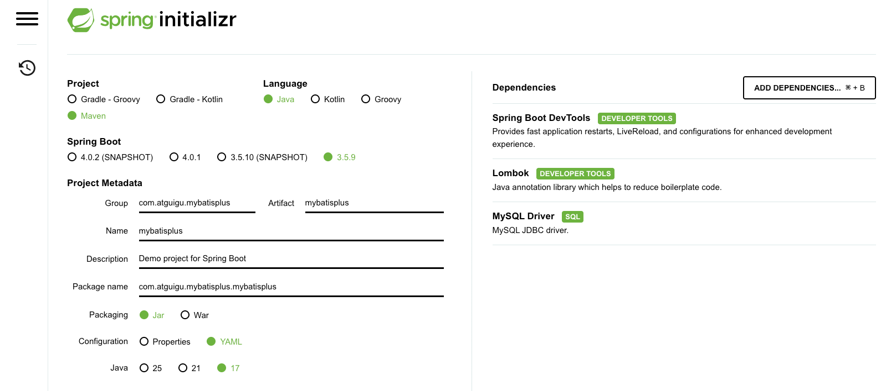
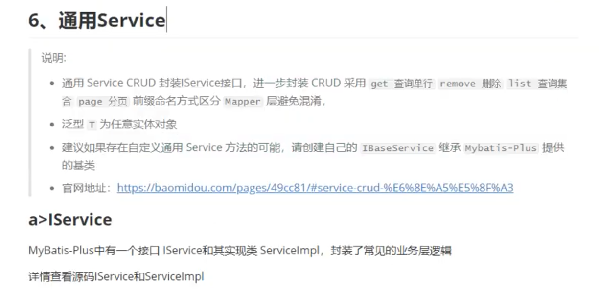

# MyBatis Plus

## 搭建开发环境

- 准备测试数据

```sql
CREATE DATABASE mybatis_plus;
USE mybatis_plus;
CREATE TABLE user
(
    id    BIGINT(20) NOT NULL COMMENT '主键ID',
    NAME  VARCHAR(30) DEFAULT NULL COMMENT '姓名',
    age   INT(11)     DEFAULT NULL COMMENT '年龄',
    email VARCHAR(50) DEFAULT NULL COMMENT '邮箱',
    PRIMARY KEY (id)
)
    ENGINE = InnoDB
    DEFAULT CHARSET = utf8;

INSERT INTO user (id, name, age, email)
VALUES (1, 'Jone', 18, 'test1@baomidou.com'),
       (2, 'Jack', 20, 'test2@baomidou.com'),
       (3, 'Tom', 28, 'test3@baomidou.com'),
       (4, 'Sandy', 21, 'test4@baomidou.com'),
       (5, 'Billie', 24, 'test5@baomidou.com');

SELECT *
FROM user;
```

- 创建`SpringBoot`工程



`pom.xml`

```xml
<?xml version="1.0" encoding="UTF-8"?>
<project xmlns="http://maven.apache.org/POM/4.0.0" xmlns:xsi="http://www.w3.org/2001/XMLSchema-instance"
         xsi:schemaLocation="http://maven.apache.org/POM/4.0.0 https://maven.apache.org/xsd/maven-4.0.0.xsd">
    <modelVersion>4.0.0</modelVersion>
    <parent>
        <groupId>org.springframework.boot</groupId>
        <artifactId>spring-boot-starter-parent</artifactId>
        <version>3.5.9</version>
        <relativePath/> <!-- lookup parent from repository -->
    </parent>
    <groupId>com.atguigu.mybatisplus</groupId>
    <artifactId>mybatisplus</artifactId>
    <version>0.0.1-SNAPSHOT</version>
    <name>mybatisplus</name>
    <description>Demo project for Spring Boot</description>
    <url/>
    <licenses>
        <license/>
    </licenses>
    <developers>
        <developer/>
    </developers>
    <scm>
        <connection/>
        <developerConnection/>
        <tag/>
        <url/>
    </scm>
    <properties>
        <java.version>17</java.version>
    </properties>
    <dependencies>
        <dependency>
            <groupId>org.springframework.boot</groupId>
            <artifactId>spring-boot-starter</artifactId>
        </dependency>

        <dependency>
            <groupId>org.springframework.boot</groupId>
            <artifactId>spring-boot-devtools</artifactId>
            <scope>runtime</scope>
            <optional>true</optional>
        </dependency>
        <dependency>
            <groupId>com.mysql</groupId>
            <artifactId>mysql-connector-j</artifactId>
            <scope>runtime</scope>
        </dependency>
        <dependency>
            <groupId>org.projectlombok</groupId>
            <artifactId>lombok</artifactId>
            <optional>true</optional>
        </dependency>
        <dependency>
            <groupId>org.springframework.boot</groupId>
            <artifactId>spring-boot-starter-test</artifactId>
            <scope>test</scope>
        </dependency>
        <dependency>
            <groupId>com.baomidou</groupId>
            <artifactId>mybatis-plus-spring-boot3-starter</artifactId>
            <version>3.5.15</version>
        </dependency>
    </dependencies>

    <build>
        <plugins>
            <plugin>
                <groupId>org.apache.maven.plugins</groupId>
                <artifactId>maven-compiler-plugin</artifactId>
                <configuration>
                    <annotationProcessorPaths>
                        <path>
                            <groupId>org.projectlombok</groupId>
                            <artifactId>lombok</artifactId>
                        </path>
                    </annotationProcessorPaths>
                </configuration>
            </plugin>
            <plugin>
                <groupId>org.springframework.boot</groupId>
                <artifactId>spring-boot-maven-plugin</artifactId>
                <configuration>
                    <excludes>
                        <exclude>
                            <groupId>org.projectlombok</groupId>
                            <artifactId>lombok</artifactId>
                        </exclude>
                    </excludes>
                </configuration>
            </plugin>
        </plugins>
    </build>
</project>
```

`src/main/resources/application.yaml`

```yaml
spring:
  # 配置数据源信息
  datasource:
    # 配置数据源类型
    type: com.zaxxer.hikari.HikariDataSource
    # 配置连接数据库的各个信息
    driver-class-name: com.mysql.cj.jdbc.Driver
    url: jdbc:mysql://localhost:3310/mybatis_plus
    hikari:
      username: root
      password: 123456

mybatis-plus:
  configuration:
    log-impl: org.apache.ibatis.logging.stdout.StdOutImpl
```

- 创建 pojo 类

`src/main/java/com/atguigu/mybatisplus/mybatisplus/pojo/User.java`

```java
@Data
public class User {
    private Long id;
    private String name;
    private Integer age;
    private String email;
}
```

- 关于`Lombok`的小插曲

  - 想要看到各种`Lombok`提供的注解的功能，可以在实体类上添加注解后，执行`Maven`的`compile`命令，然后就可以在`target`中查看生成的类的源代码，来确认各种注解的作用。

- 创建`Mapper`接口

`src/main/java/com/atguigu/mybatisplus/mybatisplus/mapper/UserMapper.java`

```java
@Repository
public interface UserMapper extends BaseMapper<User> {

}
```

- 在主程序上配置`Mapper`接口所在的包

`src/main/java/com/atguigu/mybatisplus/mybatisplus/MybatisplusApplication.java`

```java
@SpringBootApplication
// 扫描指定包下的mapper接口
@MapperScan("com.atguigu.mybatisplus.mybatisplus.mapper")
public class MybatisplusApplication {
    public static void main(String[] args) {
        SpringApplication.run(MybatisplusApplication.class, args);
    }
}
```

- 测试

`src/test/java/com/atguigu/mybatisplus/mybatisplus/A_MyBatisPlusTest.java`

```java
@SpringBootTest
public class A_MyBatisPlusTest {

    @Autowired
    private UserMapper userMapper;

    @Test
    public void testSelectList() {
        // 通过条件构造器查询一个List集合，若没有条件，则可以设置参数为null
        List<User> users = userMapper.selectList(null);
        users.forEach(System.out::println);
    }
}
```

- 控制台输出内容

```text
==>  Preparing: SELECT id,name,age,email FROM user
==> Parameters:
<==    Columns: id, name, age, email
<==        Row: 1, Jone, 18, test1@baomidou.com
<==        Row: 2, Jack, 20, test2@baomidou.com
<==        Row: 3, Tom, 28, test3@baomidou.com
<==        Row: 4, Sandy, 21, test4@baomidou.com
<==        Row: 5, Billie, 24, test5@baomidou.com
<==      Total: 5
Closing non transactional SqlSession [org.apache.ibatis.session.defaults.DefaultSqlSession@6bf570c]
User(id=1, name=Jone, age=18, email=test1@baomidou.com)
User(id=2, name=Jack, age=20, email=test2@baomidou.com)
User(id=3, name=Tom, age=28, email=test3@baomidou.com)
User(id=4, name=Sandy, age=21, email=test4@baomidou.com)
User(id=5, name=Billie, age=24, email=test5@baomidou.com)
```

> 测试`BaseMapper`提供的各种`CRUD`方法

- `IDEA`中查看类中成员的快捷键: `Command + F12`

- 测试`添加`功能

```java
@Test
public void testInsert() {
    User user = new User(null, "Tom", 33, "tom@126.com");
    int insertResult = userMapper.insert(user);
    System.out.println("insertResult: " + insertResult);
    System.out.println("user: " + user);
/*
==>  Preparing: INSERT INTO user ( id, name, age, email ) VALUES ( ?, ?, ?, ? )
==> Parameters: 2009800769263542273(Long), Tom(String), 33(Integer), tom@126.com(String)
<==    Updates: 1
Closing non transactional SqlSession [org.apache.ibatis.session.defaults.DefaultSqlSession@54489296]
insertResult: 1
user: User(id=2009800769263542273, name=Tom, age=33, email=tom@126.com)
*/
}
```

- 测试`删除`功能

```java
@Test
public void testDelete() {
    // 通过ID删除用户信息
    int deleteResult1 = userMapper.deleteById(2009800769263542273L);
    System.out.println("deleteResult1: " + deleteResult1);
    /*
    ==>  Preparing: DELETE FROM user WHERE id=?
    ==> Parameters: 2009800769263542273(Long)
    <==    Updates: 1
    Closing non transactional SqlSession [org.apache.ibatis.session.defaults.DefaultSqlSession@3751acd7]
    deleteResult: 1
        */

    /*
    根据Map集合中所设置的条件删除用户信息
        */
        Map<String, Object> map = new HashMap<>();
        map.put("name", "Tom");
        map.put("age", 23);
        int deleteResult2 = userMapper.deleteByMap(map);
        System.out.println("deleteResult2: " + deleteResult2);
    /*
    ==>  Preparing: DELETE FROM user WHERE (name = ? AND age = ?)
    ==> Parameters: Tom(String), 23(Integer)
    <==    Updates: 0
    Closing non transactional SqlSession [org.apache.ibatis.session.defaults.DefaultSqlSession@71bb8b34]
    deleteResult: 0
        */

    // 通过多个ID实现批量删除
    int deleteResult3 = userMapper.deleteByIds(Arrays.asList(1, 2, 3));
    System.out.println("deleteResult3: " + deleteResult3);
    /*
    ==>  Preparing: DELETE FROM user WHERE id IN ( ? , ? , ? )
    ==> Parameters: 1(Integer), 2(Integer), 3(Integer)
    <==    Updates: 3
    Closing non transactional SqlSession [org.apache.ibatis.session.defaults.DefaultSqlSession@274fdea6]
    deleteResult: 3
        */
}
```

- 测试`修改`功能

```java
    @Test
    public void testUpdate() {
        // 修改用户信息
        User user = new User(4L, "Java", null, "java@oracle.com");
        int updateResult = userMapper.updateById(user);
        System.out.println("updateResult: " + updateResult);
/*
==>  Preparing: UPDATE user SET name=?, email=? WHERE id=?
==> Parameters: Java(String), java@oracle.com(String), 4(Long)
<==    Updates: 1
Closing non transactional SqlSession [org.apache.ibatis.session.defaults.DefaultSqlSession@410fc508]
updateResult: 1
    */
    }
```

- 测试`查询`功能

```java
@Test
public void testSelect() {
    // 根据ID查询
    User user = userMapper.selectById(4L);
    System.out.println(user);
    /*
    ==>  Preparing: SELECT id,name,age,email FROM user WHERE id=?
    ==> Parameters: 4(Long)
    <==    Columns: id, name, age, email
    <==        Row: 4, Java, 34, java@oracle.com
    <==      Total: 1
    Closing non transactional SqlSession [org.apache.ibatis.session.defaults.DefaultSqlSession@410fc508]
    User(id=4, name=Java, age=34, email=java@oracle.com)
        */

    // 根据多个ID查询多个用户信息
    List<Long> list = Arrays.asList(1L, 2L, 3L, 4L, 5L);
    List<User> users = userMapper.selectByIds(list);
    users.forEach(System.out::println);
    /*
    ==>  Preparing: SELECT id,name,age,email FROM user WHERE id IN ( ? , ? , ? , ? , ? )
    ==> Parameters: 1(Long), 2(Long), 3(Long), 4(Long), 5(Long)
    <==    Columns: id, name, age, email
    <==        Row: 4, Java, 34, java@oracle.com
    <==        Row: 5, Billie, 24, test5@baomidou.com
    <==      Total: 2
    Closing non transactional SqlSession [org.apache.ibatis.session.defaults.DefaultSqlSession@419f0ea]
    User(id=4, name=Java, age=34, email=java@oracle.com)
    User(id=5, name=Billie, age=24, email=test5@baomidou.com)
        */

    // 根据Map集合中的条件查询
    Map<String, Object> map = new HashMap<>();
    map.put("name", "Java");
    List<User> users1 = userMapper.selectByMap(map);
    users1.forEach(System.out::println);
    /*
    ==>  Preparing: SELECT id,name,age,email FROM user WHERE (name = ?)
    ==> Parameters: Java(String)
    <==    Columns: id, name, age, email
    <==        Row: 4, Java, 34, java@oracle.com
    <==      Total: 1
    Closing non transactional SqlSession [org.apache.ibatis.session.defaults.DefaultSqlSession@7573c7b5]
    User(id=4, name=Java, age=34, email=java@oracle.com)
        */

    // 查询全部
    List<User> users2 = userMapper.selectList(null);
    users2.forEach(System.out::println);
    /*
    ==>  Preparing: SELECT id,name,age,email FROM user
    ==> Parameters:
    <==    Columns: id, name, age, email
    <==        Row: 4, Java, 34, java@oracle.com
    <==        Row: 5, Billie, 24, test5@baomidou.com
    <==      Total: 2
    Closing non transactional SqlSession [org.apache.ibatis.session.defaults.DefaultSqlSession@4e2824b1]
    User(id=4, name=Java, age=34, email=java@oracle.com)
    User(id=5, name=Billie, age=24, email=test5@baomidou.com)
        */
}
```

> 测试`自定义`查询功能

- 当`MyBatis Plus`提供的功能无法满足需求时，可以写自定义的查询功能。
- 目前`SpingBoot`中默认配置的`Mapper映射文件`的位置是`classpath*:/mapper/**/*.xml`，因此只要在`resources`目录下创建`mapper`目录后，在这里写映射文件即可。

`src/main/java/com/atguigu/mybatisplus/mapper/UserMapper.java`

```java
public interface UserMapper extends BaseMapper<User> {
    /**
     * 根据ID查询用户信息为Map集合
     *
     * @param id
     * @return
     */
    Map<String, Object> selectMapById(Long id);
}
```

`src/main/resources/mapper/UserMapper.xml`

```xml
<mapper namespace="com.atguigu.mybatisplus.mapper.UserMapper">
    <!-- Map<String, Object> selectMapById(Long id); -->
    <select id="selectMapById" resultType="map">
        select *
        from user
        where id =#{id}
    </select>
</mapper>
```

- 测试

```java
Map<String, Object> userMap = userMapper.selectMapById(4L);
System.out.println("userMap: " + userMap);
/*
==>  Preparing: select * from user where id =?
==> Parameters: 4(Long)
<==    Columns: id, NAME, age, email
<==        Row: 4, Java, 34, java@oracle.com
<==      Total: 1
Closing non transactional SqlSession [org.apache.ibatis.session.defaults.DefaultSqlSession@636fccb0]
userMap: {id=4, age=34, email=java@oracle.com, NAME=Java}
    */
```

---

- 通用的`Service`

> 18 通用 Service 接口



- 创建 Service 接口和实现类

`src/main/java/com/atguigu/mybatisplus/service/UserService.java`

```java
public interface UserService extends IService<User> {
}
```

`src/main/java/com/atguigu/mybatisplus/service/impl/UserServiceImpl.java`

```java
@Service
public class UserServiceImpl extends ServiceImpl<UserMapper, User> implements UserService {
}
```

> 19 测试通用 Service 之查询总记录数

`src/test/java/com/atguigu/mybatisplus/B_MyBatisPlusServiceTest.java`

```java
@SpringBootTest
public class B_MyBatisPlusServiceTest {

    @Autowired
    private UserService userService;

    @Test
    public void testGetCount() {
        // 查询总记录数
        long count = userService.count();
        System.out.println("总记录数: " + count);
/*
==>  Preparing: SELECT COUNT( * ) AS total FROM user
==> Parameters:
<==    Columns: total
<==        Row: 2
<==      Total: 1
Closing non transactional SqlSession [org.apache.ibatis.session.defaults.DefaultSqlSession@6987a133]
总记录数: 2
*/
    }
}
```

> 20 测试通用 Service 之批量添加

```java
@Test
public void testBatchInsert() {
    // 批量添加
    List<User> list = new ArrayList<>();
    for (int i = 0; i < 10; i++) {
        User user = new User(null, "周华健" + i, 40 + i, "zhj" + i + "@126.com");
        list.add(user);
    }
    boolean b = userService.saveBatch(list);
    System.out.println(b);
/*
==>  Preparing: INSERT INTO user ( id, name, age, email ) VALUES ( ?, ?, ?, ? )
==> Parameters: 2010720684266917890(Long), 周华健0(String), 40(Integer), zhj0@126.com(String)
==> Parameters: 2010720684468244481(Long), 周华健1(String), 41(Integer), zhj1@126.com(String)
==> Parameters: 2010720684472438786(Long), 周华健2(String), 42(Integer), zhj2@126.com(String)
==> Parameters: 2010720684476633090(Long), 周华健3(String), 43(Integer), zhj3@126.com(String)
==> Parameters: 2010720684476633091(Long), 周华健4(String), 44(Integer), zhj4@126.com(String)
==> Parameters: 2010720684480827394(Long), 周华健5(String), 45(Integer), zhj5@126.com(String)
==> Parameters: 2010720684485021697(Long), 周华健6(String), 46(Integer), zhj6@126.com(String)
==> Parameters: 2010720684485021698(Long), 周华健7(String), 47(Integer), zhj7@126.com(String)
==> Parameters: 2010720684489216002(Long), 周华健8(String), 48(Integer), zhj8@126.com(String)
==> Parameters: 2010720684489216003(Long), 周华健9(String), 49(Integer), zhj9@126.com(String)
true
*/
}
```

> 21 MyBatis Plus 的常用注解`@TableName`

- 目前在没有设置任何`表名`或`字段名`的情况下，MyBatis Plus 可以自动地生成`CRUD`语句，说明它是根据内部的规则生成的`SQL`语句。
- 现在如果把表名从`user`改成`t_user`，就会报下面的异常:

```text
==>  Preparing: INSERT INTO user ( id, name, age, email ) VALUES ( ?, ?, ?, ? )
==> Parameters: 2012856363675422722(Long), Tom(String), 33(Integer), tom@126.com(String)
Closing non transactional SqlSession [org.apache.ibatis.session.defaults.DefaultSqlSession@334540a0]

org.springframework.jdbc.BadSqlGrammarException:
### Error updating database.  Cause: java.sql.SQLSyntaxErrorException: Table 'mybatis_plus.user' doesn't exist
```

- MyBatis Plus 在生成查询语句中使用的表名是根据`Mapper`接口中`BaseMapper<User>`中的`泛型`来决定的。

- 在实际生产情况中，实体类名和表名大多是不一样的。要想解决这种不一致的问题，可以在实体类名上添加`@TableName("tableName")`。

`src/main/java/com/atguigu/mybatisplus/pojo/User.java`

```java
@Data
@AllArgsConstructor
// 设置实体类所对应的表名
@TableName("t_user")
public class User {
    private Long id;
    private String name;
    private Integer age;
    private String email;
}
```

- 此时再次执行测试，可以看到如下语句的生成:

```text
==>  Preparing: INSERT INTO t_user ( id, name, age, email ) VALUES ( ?, ?, ?, ? )
==> Parameters: 2012858419446538242(Long), Tom(String), 33(Integer), tom@126.com(String)
<==    Updates: 1
Closing non transactional SqlSession [org.apache.ibatis.session.defaults.DefaultSqlSession@7ef8e623]
insertResult: 1
user: User(id=2012858419446538242, name=Tom, age=33, email=tom@126.com)
```

- 也可以不用在每个实体类上加`@TableName`注解，而是在全局配置文件中添加配置:

`src/main/resources/application.yaml`

```yml
mybatis-plus:
  configuration:
    log-impl: org.apache.ibatis.logging.stdout.StdOutImpl
  # 设置MyBatis-Plus的全局配置
  global-config:
    db-config:
      # 设置实体类所对应的表的统一前缀
      table-prefix: t_
```

> 22 MyBatis Plus 的常用注解`@TableId`

- 将目前`User`实体类中的`id`属性，以及数据库表中的`id`字段改成`uid`后，执行测试可以看到如下的异常:

```text
==>  Preparing: INSERT INTO t_user ( name, age, email ) VALUES ( ?, ?, ? )
==> Parameters: Tom(String), 34(Integer), tom@126.com(String)
Closing non transactional SqlSession [org.apache.ibatis.session.defaults.DefaultSqlSession@510da778]

org.springframework.dao.DataIntegrityViolationException:
### Error updating database.  Cause: java.sql.SQLException: Field 'uid' doesn't have a default value
```

- 此异常说明: MyBatis Plus 内部有一个默认的表的主键的名称`id`。

- 如果表的名称不是`id`，那么就需要在实体类的 id 属性上添加`@TableId`注解。

`src/main/java/com/atguigu/mybatisplus/pojo/User.java`

```java
@Data
@AllArgsConstructor
public class User {
    // 将属性所对应的字段指定为主键
    @TableId
    private Long uid;
    private String name;
    private Integer age;
    private String email;
}
```

```text
==>  Preparing: INSERT INTO t_user ( uid, name, age, email ) VALUES ( ?, ?, ?, ? )
==> Parameters: 2012885207505608706(Long), Cat(String), 35(Integer), cat@qq.com(String)
<==    Updates: 1
Closing non transactional SqlSession [org.apache.ibatis.session.defaults.DefaultSqlSession@6164e137]
insertResult: 1
user: User(uid=2012885207505608706, name=Cat, age=35, email=cat@qq.com)
```

> 23 `@TableId`的`value`属性

- 在目前代码的基础上，如果实体类中的`id`属性名和数据表中的`id`字段的名称不一样，那么 MyBatis Plus 就无法找到数据库中的`id`字段。
- 将`User`类中的`uid`改成`id`后，执行测试会抛出如下的异常:

```text
==>  Preparing: INSERT INTO t_user ( id, name, age, email ) VALUES ( ?, ?, ?, ? )
==> Parameters: 2012886826423042049(Long), Cat(String), 35(Integer), cat@qq.com(String)
Closing non transactional SqlSession [org.apache.ibatis.session.defaults.DefaultSqlSession@42aa1324]

org.springframework.jdbc.BadSqlGrammarException:
### Error updating database.  Cause: java.sql.SQLSyntaxErrorException: Unknown column 'id' in 'field list'
```

- 要解决这个问题，就需要给`@TableId`注解加上`value`属性:

`src/main/java/com/atguigu/mybatisplus/pojo/User.java`

```java
@Data
@AllArgsConstructor
// 设置实体类所对应的表名
// @TableName("t_user")
public class User {
    // 将属性所对应的字段指定为主键
    // @TableId注解的value属性用于指定主键的字段
    @TableId("uid")
    private Long id;
    private String name;
    private Integer age;
    private String email;
}
```

```text
==>  Preparing: INSERT INTO t_user ( uid, name, age, email ) VALUES ( ?, ?, ?, ? )
==> Parameters: 2012888146735456257(Long), Cat(String), 36(Integer), cat1@qq.com(String)
<==    Updates: 1
Closing non transactional SqlSession [org.apache.ibatis.session.defaults.DefaultSqlSession@6164e137]
insertResult: 1
user: User(id=2012888146735456257, name=Cat, age=36, email=cat1@qq.com)
```

> 24 `@TableId`的`type`属性

- 从之前的测试可以看到数据库表中的`id`的生成策略使用的是`雪花算法`。
- 如果想要使用`自动递增id`的策略，那么需要先将数据库表中的`id`字段添加`auto_increment`属性。
- 此时进行测试，可以看到 MyBatis Plus 还是会使用`雪花算法`生成的`id`。
- 要解决这个问题，就需要在`@TableId`注解上添加`type`属性，指定其主键的生成策略。

`src/main/java/com/atguigu/mybatisplus/pojo/User.java`

```java
package com.atguigu.mybatisplus.pojo;

import com.baomidou.mybatisplus.annotation.IdType;
import com.baomidou.mybatisplus.annotation.TableId;
import lombok.AllArgsConstructor;
import lombok.Data;

/**
 * ClassName: User
 * Package: com.atguigu.mybatisplus.mybatisplus.pojo
 * Description:
 *
 * @Author ljy
 * @Create 2026. 1. 9. 오후 10:38
 * @Version 1.0
 */
@Data
@AllArgsConstructor
// 设置实体类所对应的表名
// @TableName("t_user")
public class User {
    // 将属性所对应的字段指定为主键
    // @TableId注解的value属性用于指定主键的字段
    // @TableId注解的type属性用于指定主键的生成策略
    @TableId(value = "uid", type = IdType.AUTO)
    private Long id;
    private String name;
    private Integer age;
    private String email;
}
```

```text
==>  Preparing: INSERT INTO t_user ( name, age, email ) VALUES ( ?, ?, ? )
==> Parameters: Cat(String), 36(Integer), cat1@qq.com(String)
<==    Updates: 1
Closing non transactional SqlSession [org.apache.ibatis.session.defaults.DefaultSqlSession@c758a2d]
insertResult: 1
user: User(id=6, name=Cat, age=36, email=cat1@qq.com)
```

- 此时可以看到由于使用了自增的`id`生成策略, MyBatis Plus 没有为`id`赋值。

| 值                      | 描述                                                                       |
| ----------------------- | -------------------------------------------------------------------------- |
| IdType.ASSIGN_ID (默认) | 基于雪花算法的策略生成数据表`id`，与数据库`id`是否设置自增无关。           |
| IdType.AUTO             | 使用数据库的自增策略，注意: 该类型需要确保数据库设置了`id`自增，否则无效。 |

- 注意: 如果只是在实体类上的`@TableId`注解上加了`type = IdType.AUTO`属性，而数据库中的`id`字段没有设置为自动递增，那么执行添加操作时，就会报错。
- 原因是: 添加了`type = IdType.AUTO`属性后，生成`SQL语句`时，将不再有`id`字段，但此时数据库也不会为`id`自动生成主键，因此此时会报错。

> 25 通过全局配置配置主键生成策略

- 可以使用全局配置来配置主键的生成策略

`src/main/resources/application.yaml`

```yaml
mybatis-plus:
  configuration:
    log-impl: org.apache.ibatis.logging.stdout.StdOutImpl
  # 设置MyBatis-Plus的全局配置
  global-config:
    db-config:
      # 设置实体类所对应的表的统一前缀
      table-prefix: t_
      # 设置统一的主键生成策略
      id-type: auto
```
